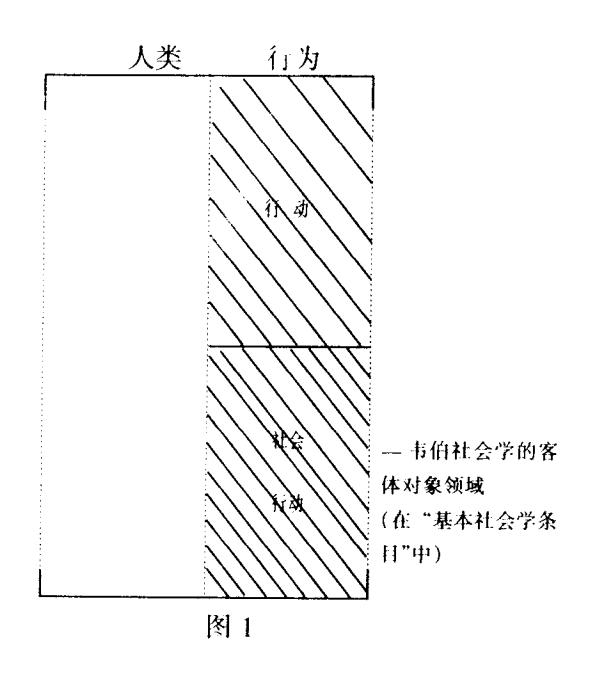
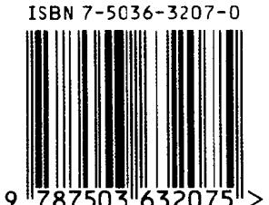

Repräsentativer Deutscher Rechtsliteratur der Gegenwart Reihe Des Rechtskulturellen-Hintergrunds

当代德国法学名著·背景系列

# 马克斯・韦伯的生平、著述及影响

[德] 迪尔克·克斯勒/著 郭 锋/译

法 律 出 版 社

### 当代德国法学名著·背景系列

Repräsentativer Deutscher Rechtsliteratur der Gegenwart Reihe Des Rechtskulturellen Hintergrunds

# 马克斯·韦伯的生平、著述及影响

Max Weber Eine Einführung in Leben, Werk und Wirkung

> [德] 迪尔克·克斯勒/著 Dírk Käsler 郭 锋/译

### Max Weber Eine Einführung in Leben, Werk und Wirkung Dirk Käsler

本书根据坎普斯出版社(Campus Verlag)1998 年版译出 经出版社授权, 法律出版社享有本图书中文简体本专有使用权 著作权合同登记

图字:01-2000-2645

### 图书在版编目(CIP)数据

马克斯·韦伯的牛平、著述及影响 [德]克斯勒著:郭锋译.一北京:法律出版社,2000.8 (当代德国法学名著:背景系列) ISBN 7 - 5036 - 3207 - 6

Ⅰ.马... Ⅱ.①克...②郭... Ⅲ.韦伯(1864~1920) - 生平事迹 IV, K835, 165, 1

中国版本图书馆 CIP 数据核字(2000)第 69429 号

出版·发行/法律出版社 责任印制 /张字东

印刷/宏伟胶印厂

开本/850×1168 毫米 1/32 印张/12 字数/292 千

经销/新华书店 责任校对 /何萍

版本 / 2000 年 9 月第 1 版 2000 年 9 月第 1 次印刷 印数 /0,001 -5,000

社址/北京市西三环北路甲 105 号科原大厦 A座 4层(100037) 电子信箱/pholaw@public.bta.net.cn 电话 /88414899 88414900(发行部) 88414121(总编室) 出版声明/版权所有,侵权必究。

书号: ISBN 7-5036-3207-6/1)•2926 定价:26.00 元

(如有缺页或倒装,本社负责退换)

### 【当代德国法学名著】

### 编译委员会主任

米 健

### 编译委员会委员

冯 军 刘兆兴

米 健 范 健

邵建东 郑永流

舒国滢

### 本书责任编委

郑永流

### 编辑部成员

王 娜 王洪亮

田士永 许 兰

高家伟 薄燕娜

### 选题推荐人、顾问

何意志/科隆大学教授

Robert Heuser Universität Köln

海因·克茨/汉堡大学教授

Hein Kötz, Universität Hamburg

阿图尔·考夫曼/慕尼黑大学教授

Arthur Kaufmann, Universität München

鲁尔夫·克努特尔/波恩大学教授

Rolf Knütel Universität Bonn

孟文理/帕骚大学教授

Urlich Manthe Universität Passau

胜雅律/弗莱堡大学教授

Harro von Senger Universität Freiburg

## 本翻译计划得到德意志学术交流中心的支持

Das Übersetzungsprojekt wurde mit Mitteln von dem Deutschen Akademischen Austauschdienst(DAAD) gefördert.

### 当代德国法学名著总序

当代德国法学名著译事之缘起,在乎"取法 人际,天道归一"之理念。

天地渺渺, 众生芸芸: 然天地何以长存不 灭,众生何以繁衍不息? 此中必有亘古于今之 一般法则。天地者,自然之谓;众生者,乃自然 所赋生灵之长,人也。而人所以居万物之首而 为生灵之长,概因其不仅是生于自然,而日还能 领悟于自然,进而以理性和智慧的劳动创造受 益于自然。由此而论,天地间至真至善至美,莫 过于人与自然之和谐融合。正如庄子所说:"知 天之所为,知人之所为者,至也。"而中国哲人所 言"天人合一",实际表明着人类的最高智慧和 境界。但是,最高的智慧未必是功利的智慧:最 高的境界往往不是现实的境界,此乃人类虽为 万物灵长,但又归于万物的本性使然。尽管不 无缺憾,但却理所当然。纵观古往今来,可知人 类始终是在理想与现实、理性与物性的矛盾状 杰中存在发展。不过,人出于其自然本性但又 以其理性确认的社会秩序,又使之在这种永远 不会解消的矛盾状态中生存发展成为可能。

自古以来,食色之性、交往之需、名利之求、

## <u> 马克斯·韦伯的生平、著述及影响</u>

功德之义,无论国人洋人、权贵庶民,众生莫不有之;惟每人认取之 价值,或此或彼因人因地因时而异。但基于人之本性所产生的社 会,无论东方西方,必然有其共性。于是有老子的古训:"人法地, 地法天.天法道,道法自然。"而希腊的斯多噶哲人也说:"按照自然 而生活"。由此可知,同属自然之人类,本有其共同的理念与法则。 以法律而言,中国、西方法律虽文化传统各异,然毕竟都是人类社 会的法律;必然有其共同的人性内涵。所以,考察法律,应着眼超 越地域、国度和民族,甚至超越时空的人际层面,努力发现本来属 干整个人类的理念和规范,并在此基础上寻求并促进人与人、民族 与民族、国家与国家之间越来越普遍深入的交往。吾人之规可为 他人所取,他人之法可为吾人所用,概其皆出乎人之本性。所以 "取法人际. 天道归一", 当为人类社会法律进步之最高思想境界。 以迄今历史度之,人类生存发展的必然趋势是越来越普遍深入地 相互结合和依赖,经济的全球化和文化的世界化正在相辅相成地 迅速演进。在人类发展进程中,产生于人类本性的共性愈多愈充 分地为人所认识,则人与人之间、国家与国家之间的交往就愈可能 有效和平地进行。作为人类社会的行为规范,任何国家的法律都 是人与人之间实现交往、确定关系及秩序的最重要涂径。就此而 论,可断言未来人类的发展与和平,很大程度上将取决于全人类在 法律法则上的沟通与趋同。

本着取法人际或取法自然的理念,当代德国法学名著译事拟系统全面地翻译当代德国法学具有代表性的学术成果。因为德国法不仅为可取之一方法律,而且还与当代中国法制有着特殊的关联。事实上,当代中国大陆、台湾的法制是基于清末民初之际的法律改制发展而来。当时采纳了欧洲大陆法系法制模式,而其中又以汲取德国法律,特别是民法、刑法居多。不仅如此,20世纪以来中国法制和法学的发展还颇受德国法制和法学的影响,现今中国法律和法学的不少思路实际都与后者有关联。因而,中国法制建

### 当代德国法学名著总序 3

设和法学进步自然更容易从德国法制与法学中获得启发。此外,由于近代德国历史法学派和学说汇纂学派对罗马法和罗马普通法的系统研究与整理,近现代德国法学形成并获得了其本身独有的特色,其丰富成熟的法律理论与教条,恰恰是目前乃至 21 世纪我国法学与法制建设所迫切需要的。

当代德国法学名著的选题范围包括法哲学和法的基本理论、国家法、法律史、民法和商法、经济法、刑法、国际私法等内容。选题标准是:德国乃至欧洲法律界已经普遍公认为经典的名著,或在德国普遍使用的有代表性的教科书。与此同时,亦根据我国的实际需要翻译介绍一些有关法律文化背景方面的工具书和著名法学家的传记。初步选题首先由德国学者提出,然后由编委会综合各方面意见,最后根据我国实际需要确定翻译选题。为保证翻译质量,翻译工作严格采取译、校和三审程序。每部译著由一责任编委审阅或校对。译稿一审通过后,编委会和编辑部就一审提出的问题召开由德国教授和有关译者参加的翻译工作会议;在此基础上,译者还专程前往德国与作者或有关学者探讨翻译的疑难和细节问题。在此方面,德意志学术交流中心(DAAD)提供了有力的支持。在赴德改稿基础上提出的第二稿通过二审后,由译者进一步修改、润色定稿,复经审阅后交付出版社。

系统翻译德国法学名著的想法由来已久,但正式酝酿于 1997年秋,经过近一年的准备筹划,于 1998年秋开始实施,拟于 2005年完成全部选定书目的翻译。应该说,德国文化交流中心的霍恩贝格尔先生(U. Hornberger)和法律出版社总编辑贾京平先生对促成此项翻译计划起了重要作用。而此项翻译计划能够顺利实施;亦诚有赖编委会和编辑部各位同仁的共同志趣和辛勤工作。五位德国著名学者:考夫曼(A. Kaufmann)、克茨(H. Kötz)、克努特尔(R. Knütel)、何意志(R. Heuser)、孟文理(U. Manthe)和胜雅律(H. von Senger)教授在计划拟定、选题推荐和具体翻译工作中均

给了我们以宝贵帮助。德意志学术交流中心驻京办事处主任史翰功(H. Schmidt)先生和他的同事们亦为此计划付出了劳动。德国跨国基金会(Inter Nationes)对部分书目的出版提供了支持。特别要提及的是,江平、谢怀栻、潘汉典等法学界前辈对于此项工作始终给予着关注和支持,中国政法大学有关部门亦对我们的工作提供了帮助。在此,谨对上述所有法律界同仁和有关机构表示由衷的谢意。我之所愿,所有参与此项计划和给予该计划关注和支持的人,都能从此处呈献的工作成果中得到虽非物质的,但却真实诚恳并有长久价值的酬劳。因为,倘若这些成果能够在21世纪和中华崛起之际被赋予些微历史和现实意义的话,那么它将胜于所有致谢和嘉言。

**米 健** 2000 年初夏于京城蓟门

### 作者中译本序

当 1998 年 12 月我的同行米健教授问我,是 否同意将我这本关于韦伯的书译成中文时,我既 感荣幸又非常高兴。这本书出版 20 年来已经有 了几种语言的译本,出一个中文译本,意味着它 也可以为与德国相距遥远的中国大陆上的读者 所阅读了。这个中文译本适宜于以前对韦伯——20 世纪最有影响的思想家之———的著 作了解有限的大学生和学者们阅读。这一点,已 足以使旨在为读者了解韦伯的生活、著述和撞击 影响提供帮助的本书作者感到满意和欣慰。

这个中文译本的底本是我《马克斯·韦伯的生平、著述及影响》一书最新德文修订本的第二版(法兰克福/纽约:Compus 出版社,1998)。其较早的版本以《韦伯研究导论》为名,出版于1979年(慕尼黑:C.H.贝克出版社),这个版本已经有了一个日文译本(《马克斯·韦伯:思想与生平》,森冈弘通译,东京,三一书房,1981)、一个西班牙文译本(传记部分,《韦伯略传》,弗朗西斯科·盖尔维安·迪亚兹译,墨西哥,D.F.:市立阿兹卡波查尔克大学,1984)和一个英文译本(《马克斯·韦伯:生平与著述介绍》,非利普

娅·胡尔德译, 剑桥: Polity 出版社/芝加哥: 芝加哥大学出版社, 1988)。1995年出了一个德语修订本(《马克斯·韦伯的生平、著述及影响》, 法兰克福/纽约: Compus 出版社, 1995), 在此修订本基础上, 又有了一个法文译本(《马克斯·韦伯的生平、著述及影响》, 菲利普·弗里兹译, 巴黎, A. 法亚德出版社, 1996)。

20 世纪初,韦伯坐在海德堡大学的图书馆里看材料、撰写关于中国历史和社会组织的文章时,他可能做梦也没有想到,有那么一天,在这个他从未去过的文化国度里,会有人对他的著作、对他关于中国历史和社会的阐释感兴趣。郭锋教授来马堡大学与我讨论他的译稿这3个月里,多次的讨论清楚表明了这项翻译任务的困难所在。主要的问题,不在于语言方面,而在于在韦伯生活、著述的时代里,他所处的历史环境与中国的环境有着极大的不同,而我们今天时代的这种不同,还没包括在内。

这本小书或许会有助于理解上述不同。我们这项关于韦伯的 工作或许会有助于较好地相互接受这种不同,以致终将有一天我 们能达到一个真正的人类共同体,而不管这些人是生活在中国, 还是生活在德国。

向我的中文"新生儿"和它的读者致以良好的祝愿。

迪尔克·克斯勒 马堡大学,2000年7月

### 作者序\*

马克斯·韦伯(1864—1920)是近代社会科学发展史上世界公认最有影响的人物之一。他的思想理论和研究方法论,影响了从历史学到法学众多学科的学者们。社会学学界视他为"社会学学科的主要奠基人之一"。韦伯著作的覆盖面非常广,涉及到各个学术领域。他通晓西方历史和文化,也对这个世界的其他地区文明作过广泛的考察研究。

韦伯是一位多产作家,他的兴趣和观念在他的学术生涯中有着不同程度的变化。正因为如此,对韦伯的著作进行评价就显得非常困难。韦伯与涂尔干\*\*(Durkheim)分属不同类型的学者。涂尔干在他的早期著作中业已确立起了自己的理论体系,之后只是不断坚持、进一步详细地阐述这一体系,韦伯则不同。本书试图勾勒出一幅清晰的图画,将韦伯一生著作的

• 克斯勒教授的这篇序写于 1988 年,是出版本书英译本时专为英语国家读者而写的。此次作为作者序收入中译本,业经译者征求作者意见并取得同意。——译者

\*\* 涂尔干(Durkheim, Émile, 1858—1917), 法国社会学家, 近代社会学理论和方法论的奠基人之一。

不同学术特征展现出来。目前的不少韦伯评价著作有一共同倾向,即总是想把韦伯思想纳入到一个框架、一个体系中去,本书试图避免这种错误。对于研究介绍一位作者的原创著作来说,任何一部评价性著作都难免要为方便读者了解而对其内容作一些简化处理。在本书中,笔者尝试把韦伯不同时期的与方法论问题有关的论述从各部著作中提炼出来,单独加以评述,这一处理与韦伯原著中有关方法论问题出现的时间在顺序上不尽一致。

第一章稍加详细地介绍了韦伯的生平。与大多数别的学者不同的是,我们认为只有首先了解不同时期各种生活经历对韦伯的影响,才能更为确切地理解韦伯著作的不同内容特点及他学术发展的脉络。第二章第一至第五节分别介绍韦伯的各部著作。读这几章,读者脑海里应该相应地想着韦伯撰述该著作时的生活经历。在一些地方,为理出韦伯尝试解决的某些特别重要的问题,本书的评述离开了各部著作的时间顺序。

第三章讨论韦伯的方法论理论。韦伯去世后,遗孀玛丽安妮·韦伯收集整理了他关于方法论方面的论述,单独结集出版。[1] 但重要的是我们要掌握住一点,即韦伯生前并未有意识地要在方法论方面做出系统的归纳总结从而构成一个整体的理论框架。韦伯的大多数方法论论述都是作为旁支从他的历史与社会学研究主要关注点中引发出来的,而且在很大程度上还是些片断的暂且如此的计划之作。

这种特点是导致研究者们分析韦伯思想时观点歧异的主要原因。直至今日,人们仍感到困惑不已。有些评论家追随玛丽安妮·韦伯,争辩说韦伯的方法论理论具有一致性和连贯性。另一些人则相反,强调其多变性和未完成性。在本书里,我们将展现给读者的是,没有必要为了使讨论有说服力而硬将韦伯作品归纳成具有

〔1〕 玛丽安妮编:《韦伯科学方法论文集》。

### <u>作者序</u> 3

整体性和完善性的模样,韦伯的方法论研究与他进行有关研究时

韦伯著作中有一个重要部分本书未作直接的讨论,即韦伯介 入当时政治论战的言论。关于韦伯的政治理论,学界讨论甚多,读 者如有兴趣,可自去参看。[2]

> **迪尔克·克斯勒** 1988 年 3 月

[2] 参见沃尔夫冈·J·莫姆森(Wolfgang J. Mommsen):(马克斯·韦伯与德国政治,1890—1920),芝加哥大学出版社,1974年版;达维德·毕塔姆(David Beetham):(马克斯·韦伯与现代政治理论),到桥,Polity出版社 1985年版。

### 译者前言

马克斯·韦伯是这样一位思想家、学者,他 出生在德国这块欧洲文化底蕴深厚、世界级思 想大师辈出的土地上,生活干欧洲近代资本主 义发展、世界范围的工业化进程步调加快氛围 下德国"经济起飞"、农业国家向工业国家转型 的时代,他热爱自己的民族、国家,希望民族强 感、国家繁荣,同时,也对人类社会的共同命运 有着深切的关怀。他为求真而探索这个世界 "是什么",更为求善而思考这个世界"应当是什 么",什么样的社会是人类共同的话官生活干其 中的"好"社会。他是一个民族主义者,民族和 民族文化自豪感及对德国经济、政治发展一度 处于落后地位的焦虑铸就了他的灵魂。他也是 一个人类文明进步主义者,从研究资本主义的 物质文化和精神文化起源、法的和伦理的力量 对经济的、政治的和社会的秩序形成的影响人 手,比较西方文化和非西方文化,为历史的、现 实的各种文明社会把脉、诊断,探询适宜干整个 人类社会文明进步的社会、经济、政治和文化生 活方式,寻找解决人类社会现实发展问题的答 案.构成了他毕生学术追求的主题。也就是说,

民族魂和人类命运关怀是韦伯的思想和学术性格所在,并成就了他知识渊博、眼界开阔、思想深刻、富于灵感、创见迭出、跋涉于法学、经济学、社会学、政治学、历史、哲学、宗教诸多人文社会科学领域而皆能多所建树、予人启迪的一生。民族的和人类命运的双重关怀,双重关怀下的学术研究与思想成果,使韦伯这位德国思想家、学者不仅属于德国,也属于世界。

韦伯不仅仅是一位社会学家,他是法学博士,早年从历史发展 角度研究法与经济生活秩序的关系:他是大学里的政治经济学教 授,盛年出入于法学、历史学、经济学、宗教、伦理和社会学之间,从 经济的社会的角度探讨个人、团体的社会行动与法的、伦理的社会 秩序的互动影响和作用关系。他的思想贡献和学术成就因而是多 方面的、跨学科的,其影响涉及于现代社会科学的各个领域。例 如,新教伦理产生资本主义精神、儒家伦理决定了中国社会秩序、 物质和精神生活的特质、工业化和理性化是人类社会不可避免的 命运、形式理性的科层制是社会组织——企业、团体、国家——的 最佳行政形式、代议制民主是最具效益的民主政治形式、历史进程 由物质的精神的等多元因果关系决定,以及社会行动结构、形式理 性一法理型的社会秩序、实质理性一伦理型的社会秩序、价值无 涉、理想类型、价值相关,等等,这些韦伯式论断、韦伯式方法论概 念,经韦伯论证、使用后,几乎都已经成了现代社会科学研究的基 本命题、基本概念和基本的方法论意义的分析语言之一。正是因 为如此,当今国内外的社会科学工作者,不论国别如何、学科如何、 观点如何,才逐渐形成了这样的共识:韦伯是我们的同时代人,韦 伯学术、韦伯思想的涉猎广泛和切中时代发展的主题决定了,在现 实和未来的时代里,德国也好,各国也好,社会科学任何一个领域 的学者,都能够从韦伯那里汲取营养、获得灵感、寻求思想和方法 论资源,找到研究的出发点。面对韦伯,中外学者们爱说的一句话 是:你可以有你的看法,不赞成韦伯的观点,你也可以反对他,但

是,你决不可以绕过他,包括他的思想理论和方法论。

本书作者克斯勒教授是德国社会学界研究韦伯的专家之一,70年代初至今,从事韦伯研究已有20余年。1974年,"帕森斯化"韦伯仍在国际社会科学思潮中占主流地位,但德国学者已开始探讨"脱美国化"、重新诠释韦伯、还其超越社会学家的社会科学思想家地位的形势下,克斯勒教授写出了《韦伯著述编年考证》一文,第一次使学界对韦伯一生写了多少著作以及诸著作的年代次第有了清楚的了解认识,从而使从著述史角度,结合时代、学术研究和著述经历认识思想家韦伯成为韦伯研究的一个热点问题。1976年,以克斯勒教授的韦伯著述编年考证为依据,德国学术界开始发起按德国学术界观点编撰《韦伯全集》。

本书是克斯勒教授的韦伯研究成名作,初名《韦伯研究导论》,1995年在日文译本、西班牙文译本和英文译本基础上出德文新修订版时改为现名。在本书中,克斯勒教授站在结合韦伯的时代生活经历历史地看问题、注重思想家韦伯著述史显示的韦伯思想形成发展脉络的立场上,平实、客观地对韦伯的生平、著述和国内外影响作了全面的介绍和评价。因集中反映、代表了德国学术界因应于美国化韦伯的刺激而来的还原韦伯的认识取向,本书1979年初版一出版即引起了德国国内外的注意。1981年日本学者森冈弘通把它译成了日文,1988年的英译本译者评价它为"已成为标准的德语学界介绍评价韦伯的一本书"。而自初版以来,直到1998年新修订版,20年时间里本书不断地再版,时间的考验也显示了它在国际韦伯研究中的重要地位和价值。

克斯勒教授博士毕业于慕尼黑大学,先后在慕尼黑大学、汉堡大学、科隆大学、马堡大学和洪堡大学任教、讲学,并曾赴美国南弗罗里达大学和印地安那大学开韦伯主题讲座。著、编有社会学和韦伯研究著作17部,现为马堡大学社会学系教授。

本书中译本以 1998 年德语新修订本为底本,主要参考 1988

年的英译本译出。翻译过程中,译者在中国政法大学"当代德国法学名著"编辑委员会主任米健教授接洽安排下,受德国学术交流中心(DAAD)资助,曾赴马堡大学3个月,就翻译疑难问题、技术问题请教于克斯勒教授。期间进行了多次有益的讨论,中译本的一些章节结构调整和内容补充,以及对适合于中译本的原书各版序的选用,即是讨论中征求克斯勒教授意见并取得调整和增补同意的结果。

当今中国正处在现代化、工业化的进程中。解决社会现实问题,建设有中国特色的社会主义,实现现代化,实现民族振兴,经济繁荣,文明昌盛,国家富强,需要坚持马克思主义的指导,也需要吸取和借鉴古今中外一切优秀的人类文明成果。20世纪初的德国,国情和社会发展进程与今天的中国相似,韦伯遇到的、为之焦虑、思考的问题也与我们今天遇到的、为之焦虑、思考的问题相似。了解韦伯所处的时代,理解韦伯的思想,有助于我们认清中国国情,思考研究和解决好我们今天所面临的问题。

希望勉力译出的克斯勒教授这部介绍韦伯的书,能够对于我国学术界和各界读者认识韦伯的时代、韦伯的思想,从而更好地汲取借鉴韦伯思想,研究解决我们的现实问题有所帮助。

感谢米健教授和克斯勒教授,感谢"当代德国法学名著"编辑委员会、法律出版社和德国学术交流中心,给了我这样一个为德中思想学术交流和文化沟通尽力的机会。

**郭锋** 2000年8月

### 翻译凡例

《当代德国法学名著》丛书的翻译工作依下 述规范进行:

### 一、结构

以原著标题编码为基础,采取国内学术著作与译著通常采用的标题编码顺序,如:

编、章、节、一、(一)、1、(1)、a、(a)。

- 二、译名
- 1. 人名

外国人人名以音译为原则,依次参照商务印书馆的《德语姓名译名手册》、大百科全书出版社的《简明大不列颠百科全书》中文版、上海译文出版社的《德汉词典》所附的人名译名表和《外国人名词典》确定;上述工具书中没有的,参照商务印书馆的《德语姓名译名手册》所列人名音译附表确定译名。但上述工具书所确定的人名译名与学界通行的译法不一致时,以后者为准,如:T. Mommsen——蒙森;Kierkegaarde——克尔凯戈尔;Schopenhauer——叔本华;Justinianus——优士丁尼;……。按照上述方法仍然难以确定的人名译名,由"当代德国法学名著"编译委员会和编辑部讨论确定。

### 2. 地名

外国地名以音译为原则:一律根据中国地名委员会编,商务印书馆出版的《联邦德国地名译名手册》和中国大百科全书出版社出版的《世界地名录》确定译名。

### 3. 其他译名

书名、学派名、机构和团体名称一律以意译为原则,并且参照《简明不列颠百科全书》中文版和有关工具书确定译名。依照工具书未能确定者,依照通行译名确定。如:Digesten——学说汇纂、usus modernus pandectarum——学说汇纂现代实用、Historische Rechtsschule——历史法学派、Pandenktenwissenschaft——学说汇纂法学……。

所有人名、地名、书名、专用术语及机构名称第一次出现时,均在圆括号内注明原文,重复出现时不再标明原文;人名重复出现时,仅取其姓氏中译或附加其名字中译的首字,如:迪·克斯勒(Dirk Käsler)。

### 三、相关规范

### 1. 重要概念或原文提示词句

原文正文中采用斜体或其他特殊字体的重要概念或提示文字,译文一律使用楷体,并用圆括号注明原文。原文中说明性文字或阐释性文字一律用小一号宋体排出。

### 2. 注释

- (1)原文注释一律采用脚注,按原著注释顺序编码。一般采用 连续编码或以章为单位连续编码的方法。
- (2)译者注亦采用脚注,以"\*"号标出,如:\*、\*\*、……。 凡译者注均列于原文脚注之后。

### 3. 补充性或说明性文字

原文中使用不同字体,具有注释、补充或说明性的字句或段落依据原文体例,或采用楷体,或提行采用小一号字体,以示区别。

- 4. 争议名词和箴言或谚语
- (1) 有争议的名词在译文后用圆括号注明原文;
- (2) 箴言或谚语亦在译文后用圆括号注明原文;
- (3) 对争议名词、箴言和谚语附加必要的译者注并注明依据 或来源。
  - 5. 原文有边码者,译文按照原著标明边码。

### 四、标点符号

1. 书名号

著作、论文和期刊的名称均冠以书名号。

法律、法规名称使用全称的,使用书名号;使用简称的,不加书名号。

2. 引号

引号(包括单引号和双引号)的使用与原著一致。

3. 方括号

标明作者国籍,一般采用该国译名的第一个汉字,加方括号。 有必要重复使用括号时,方括号内使用圆括号。

4. 星号

仅在译者说明文字场合使用。

### 五、缩略语表

原著缩略语表均依原著体例译出以双语列于篇首。

### 六、索引和附录

- 1. 原著索引以双语形式保留, 先外文后中文, 并采用原著使用的顺序; 索引文字所在页码以原著为线索, 原则上按译文页码注明。
  - 2. 原著的附录一般均作相应的译文附录。

### 译者简介

郭锋,男,1956年8月出生,河北省 人,历史学博士。现为国家高级教育行 政学院副教授。长期从事中国社会史、 政治史、文化史和中古社会变迁研究, 先后任教于兰州大学、厦门大学、曾赴 英国伦敦大学亚非学院、美国匹兹堡大 学教育学院和德国马堡大学社会学系研 修访问。主要著作有:《斯坦因第三次 中亚探险所获甘肃新疆出土汉文文书》、 《唐代士族个案研究——以吴郡范阳清 河敦煌张氏为中心》、《五——士世纪 敦煌的家庭与家族关系》(合撰)、《中 外著名敦煌学家评传》(合撰)、《华 夏传播论——中国传统文化中的传播》 (合撰)等,发表《中国古代五行符应 说物象传媒体系的建构》、《试论唐代 的太子监国制度》、《关于我国普通高 等教育规模和发展速度的思考》、《调 整布局结构,发展农村高等教育》、《学 区制与美国基础教育管理的特点》、《澳 门教育发展的回顾与展望》等论文40余 篇。

## 且 录

当代德国法学名著总序 作者中译本序 作者序 译者前言 翻译凡例

| 第一 | 章   | 生平      |      | ••••• |       | •••••           |                                         | •••••                                   | • (1) |
|----|-----|---------|------|-------|-------|-----------------|-----------------------------------------|-----------------------------------------|-------|
| 第二 | 章   | 著述      |      |       |       |                 |                                         |                                         | (31)  |
|    | -,  | 古代和     | 中世纪农 | 业、经济和 | 0社会史研 | 究 …             |                                         |                                         | (31)  |
|    |     | ()      | 现代资本 | 主义的   | 起源与影  | 响 …             | • • • • • • • • • • • • • • • • • • • • |                                         | (31)  |
|    |     | ()      | 罗马帝国 | 的衰亡   |       |                 |                                         |                                         | (42)  |
|    |     | ( : : ) | 东方、西 | 方与现代  | 代资本主义 | <b>ረ ·····</b>  | •••••                                   |                                         | (46)  |
|    |     | (四):    | 城市社会 | 学     |       | • • • • • • • • | •••••                                   | • • • • • • • • • • • • • • • • • • • • | (54)  |
|    |     | (Hi)    | 市民身份 | 大竞争与  | 资本主义  | <b>ረ ·····</b>  |                                         |                                         | (60)  |
|    | \   | 威廉德     | 国时期社 | 会与经济  | 状况研究・ |                 |                                         |                                         | (63)  |
|    |     |         |      |       | 查     |                 |                                         |                                         | (63)  |
|    |     |         |      |       |       |                 |                                         |                                         | (77)  |
|    |     | (E).    | エ业エ人 | 、状况调  | 查     |                 |                                         |                                         | (79)  |
|    | = \ | 宗教社会    |      |       |       |                 |                                         |                                         | (88)  |
|    |     | ()      | 新教教派 | 运动之   | 文化意义  | 研究·             |                                         |                                         | (88)  |

|    |      | (=)           | 世界宗               | 教的组           | 经济化             | ₹…            |                                         |                 |                                         |       | (113) |
|----|------|---------------|-------------------|---------------|-----------------|---------------|-----------------------------------------|-----------------|-----------------------------------------|-------|-------|
|    | 四、诸  |               | 、社会的和             |               |                 |               |                                         |                 |                                         |       | (170) |
|    |      | (-)           | 法社会               | 学…            | • • • • • •     | •••••         | • • • • • • •                           |                 | • • • • • • • •                         | • • • | (173) |
|    |      | (=)           | 普通社               | 会学·           | • • • • • • •   | • • • • • • • |                                         | • • • • • • •   |                                         | • • • | (179) |
|    |      | (三)           | 经济社               | 会学·           | • • • • • • •   | • • • • • • • | • • • • • • • •                         | • • • • • • •   |                                         | • • • | (188) |
|    |      | (四):          | 统治社会              | 会学·           | • • • • • • •   | • • • • • •   |                                         | • • • • • • •   | •••••                                   |       | (193) |
|    |      | (五)           | 音乐社会              | 会学・           | • • • • • •     | • • • • • • • | • • • • • • •                           | • • • • • • • • |                                         |       | (202) |
|    |      |               |                   |               |                 |               |                                         |                 |                                         |       |       |
| 第三 | 章    | 方法i           | 论                 | •••••         | • • • • • •     |               |                                         |                 | • • • • • • • • • • • • • • • • • • • • | ••    | (209) |
|    | 一、解  | 释或"           | 理解"的              | 概念            |                 | •••••         |                                         | • • • • • • •   | • • • • • • • • • •                     | ••    | (211) |
|    | 、理   | 想类型           | 型概念・              | • • • • • •   |                 | •••••         | •••••                                   | • • • • • • • • | • • • • • • • • • • • • • • • • • • • • | ••    | (216) |
|    | Ξ."Ξ | 无涉个           | 人意念的              | 协价值           | 判断"             | 段设 ·          | •••••                                   | • • • • • • • • | • • • • • • • • • • • • • • • • • • • • |       | (222) |
|    |      |               |                   |               |                 |               |                                         |                 |                                         |       |       |
| 第四 | 章    | 韦伯莉           | <b>善</b> 作的田      | 付代景           | ∮响…             | •••••         | •••••                                   |                 | • • • • • • • • • • • • • • • • • • • • | ••    | (239) |
|    |      |               |                   |               |                 |               |                                         |                 |                                         |       |       |
| 第五 | 莗    | 韦伯邓           | 付当代和              | <b>末</b> 未成   | ₹社会             | 学的重           | 重要意                                     | 义               |                                         | ••    | (267) |
|    |      |               |                   |               |                 |               |                                         |                 |                                         |       |       |
| 参考 | 文献   | • • • • • • • | • • • • • • • • • | · · · · · · · | • • • • • • •   |               | • • • • • • • • • • • • • • • • • • • • | •••••           |                                         |       | (280) |
|    | 一、德  | 文韦伯           | 著述编辑              | ¥             | •••••           | • • • • • • • | • • • • • • • • • • • • • • • • • • • • | • • • • • • • • | • • • • • • • • •                       |       | (280) |
|    | 二、研  | 究参考           | ぎ文献 ・・            | • • • • • •   | • • • • • • • • | • • • • • • • | • • • • • • • • • • • • • • • • • • • • | •••••           | • • • • • • • •                         |       | (332) |
|    | 三、英  | 译韦伯           | 著作目               | 录             | • • • • • • •   | • • • • • • • |                                         | • • • • • • •   | •••••                                   |       |       |

### 第一章 生 平印

卡尔·埃米尔·马克斯米利安·韦伯(Karl Emil Maximilian Weber),1864 年 4 月 21 日生于图林根的埃尔福特市,是法学博士老马克斯·韦伯和海伦妮·法伦施泰因夫妇的长子,弟弟阿尔弗雷德·韦伯(1868—1958),后来也成为社会学家。[2] 老马克斯·韦伯(1836—1897)出身于西法里亚一个纺织业为主的工商业家族,早年做过律师,1863 年与海伦妮·法伦施泰因结婚。韦伯的祖父卡尔·奥古斯特·韦伯,在西法里亚的贝莱菲尔德经营一家德意志—英格兰式纺织厂,是贝莱菲尔德商会会员。多年来,祖父在孙子马克斯眼里,一直是一个早期资本主义企业

[1] 马克斯·韦伯的一生尚有许多需要研究明了之处。参见笔者《一个被修正了的经典作家,以当前的韦伯传记考察为例》一文,载J. 魏斯(J. Weiss)主编《今日韦伯研究,成果与问题》,法兰克福,1989,29—54页。本章仅可视为一个有关的韦伯生平研究的纲要性介绍。只有全面地编辑出版一个有关的韦伯生平及学术生涯的详尽材料,才能助益于对某些模糊不明问题的认识解决。本章的写作得到了已故爱德华·鲍姆加滕教授(Eduard Baumgarten)及赖纳·莱普修斯教授(M. Rainer Lepsius)的批评指正,特此鸣谢。

[2] 老马克斯·韦伯夫妇多子,先后生了八个孩子。马克斯·韦伯以下的七个弟妹为:安娜,1866年未足岁即死去;阿尔弗雷德,1868年生;卡尔,1870年生;海伦妮,1873年生;克拉拉,1875年生;埃尔文·汉斯·阿图尔,1877年生,莉莉,1880年生。

家的榜样。韦伯的叔叔达维德·卡尔·韦伯,后来继承了家族的工 厂,并引进了现代经营管理方式。达维德在马克斯心目中则是现 代资本主义企业家的楷模。韦伯出生时,父亲是埃尔福特市的地 方法官,此前任职于柏林市政府。

韦伯的母亲海伦妮(1844—1919)出身于有着霍格纳特血统的 法伦施泰因家族,这个家族一连几代人孜孜不倦,以教育为职业,可谓是教育世家。海伦妮最初的智识教育就来自家里,从她父亲 那里获得。海伦妮的父亲格奥尔格·弗雷德里希·法伦施泰因 (1790 年生于克勒韦),先后在柏林财政部做过政府顾问和私人顾问,1813 年反抗拿破仑的普鲁士解放战争发生时,他曾在吕岑的志愿兵军团服役。海伦妮的母亲埃米莉·索赫娅(1805 年出生),也是霍格纳特血统,她那一支曾生活在美茵河畔的法兰克福地区。历史学家格维努斯与埃米莉有过交往,是海伦妮的教师之一。海伦妮是一位受过高等教育的妇女,关注并研究宗教和社会问题。1904 年起任职于夏洛滕堡市贫困法管理局。[3]

1866年,小韦伯得了脑膜炎。虽然康复很快,但这次患病对他的健康似乎产生了长期的影响。1869年,因父亲成为柏林市的支薪顾问,韦伯全家搬到了柏林附近的夏洛滕堡。老韦伯曾两度进入普鲁士国民议会任议员(1868—1882;1884—1897),是议会里民族自由党的代表之一。1872—1884年,他还成功地在德意志帝国议院里获得了一个有影响的职位。老韦伯在政治上不赞成民主,早在19世纪60年代初即倾向于立宪派。该派属于民族自由党,是这个党的一个分支,领导人是鲁道夫·冯·本宁森(Rudolf von Benningsen)——1859年德意志民族联盟的创建者之一,立宪派主张建立一个尊重人民权利的君主国家。在那个年代里,老韦伯关

[3] 韦伯家族的亲属关系详情请参见《乌克斯·韦伯全集》第2卷第5册,764—767页,"亲属关系一览表"部分(MWG.H/5)。

心政治,逐渐成为一个典型的德国资产阶级政治家。他忙碌、热衷于当代政治问题,沉溺于"上流社会的美食、自我满足式的自由放任主义"(沃尔夫冈·莫姆森语),亦曾像当时大多数民族自由党人一样,与俾斯麦和好相处过很长一段时间。他是新教徒,但是具有享乐主义倾向,这样一种精神境界使得他们夫妻之间经常发生冲突。他不赞同妻子宗教式的人文信仰,在他看来,宗教是虚伪的同义语,二者几乎没有什么两样。母亲曾试图让儿子小韦伯接受孝敬观念和社会责任思想,但似乎并不很成功。作为家庭主妇,丈夫、七个孩子、家务、以及一个交往广泛的朋友圈子已使她耗尽了精力。

1870年,马克斯·韦伯进入柏林一家私立学校德贝林学校学习,两年后转读皇家女王一奥古斯特一大学预科学校。这期间韦伯读书很多,主要是史学著作(特奥多尔·蒙森 Theodor Mommsen、恩斯特·库尔提乌斯 Ernst Curtius)、古典作品(荷马、希罗多德、西塞罗、扎卢斯特 Sallust 和维吉尔)和哲学著作(斯宾诺莎、叔本华和康德)。1877年圣诞节期间,他写出了两篇论文:"皇帝和教皇统治时期的德意志历史进程"和"从康斯坦丁到民族大迁徙时期的罗马帝国时代"。早在14岁时,韦伯就开始与表兄、正在伯林读书的弗里茨·鲍姆加滕通信,交换对荷马、希罗多德、维吉尔和西塞罗等人的看法,通过这种通信,韦伯获益匪浅。学校的教师们不太喜欢韦伯这个学生,他本该能取得更好的成绩,他对老师的态度有失尊敬。韦伯发现学校生活令人厌烦,于是设法在学校里一本一本地阅读起 40 卷本的库塔出版社版《歌德全集》。

韦伯父母家中经常高朋满座,与老韦伯夫妇有交往的大多是当时上流社会的著名人物。其中如政治家本宁森、米奎尔(Miquel)、卡普(Kapp)、霍布雷希特(Hobrecht)以及学者狄尔泰(Dilthey)、戈尔德施密特(Goldschmidt)、特奥多尔·蒙森、西贝尔(Sybel)和特赖奇克(Treitschke)等人,都是家中的常客。老韦伯与

他们主要谈论政治和学术。这种交往与讨论,对青年韦伯的成长起了重要作用,它创造出一种智识性刺激的氛围。可以说,在青年时代,家庭背景和优秀的德国中等教育对韦伯的影响甚大,它们为韦伯以后广泛的学术研究奠定了基础。父亲对子女的态度较为专制、家长式,尽管如此,在那段日子里,韦伯与父亲还算合得来。他对韦伯后来的学术生活产生了深远的影响。

1876年4岁的小女儿死后,韦伯父母之间的关系变得越来越疏远,老韦伯最初与妻子一样感到很悲伤,但很快就恢复了镇定。他缓过劲来,又开始享受生活。先前潜藏在老夫妻之间的紧张感初次公开化了。他们一个是享乐型柏林政治家,一个则是有着深厚社会和宗教情感的内省者,两人之间有着根本的歧异。当时韦伯是如何应付父母之间的分歧的,至今仍是一个谜。但当后来韦伯于柏林做初级候补文官和高级候补文官(两种政府公职)、与父母住在一起时(1886—1893),他完全意识到了父母之间的这种冲突。

1879年圣诞节,韦伯写成另一篇论文,"关于印欧系日耳曼民族的民族特征、历史发展之考察"。他在证书班里拼命学习希伯来文,以便能够阅读原版《旧约全书》。1882年春天,韦伯通过了完全中学毕业考试。同年,韦伯来到母亲年轻时住过的地方——海德堡,开始了他的大学学习。这段时间他主要钻研法学,也学习国民经济学、历史学、哲学和神学方面的一些东西。特别感兴趣的专业是古代晚期史、近代商法和现代宪法理论。韦伯后来在博士论文前言中曾写道,在海德堡学习的这段时间里,他最爱听的课是伊曼纽尔·贝克尔(Immanuel Bekker)、卡洛娃(Karlowa)、海因策(Heinze)和 H·舒尔策(Schulze)讲的法理学,库诺·菲舍尔(Kuno Fischer)讲的哲学,卡尔·克尼斯(Karl Knies)讲的政治经济学和埃德曼斯德费尔(Erdmannsdorfer)讲的历史学。在父亲的建议下,韦伯参加了"阿勒曼尼亚"学生联谊会。他很活跃,经常出现在同学之间的闹饮竞酒和决斗等活动中。他还和表兄奥托·鲍姆加滕

成了好朋友。鲍姆加滕当时在海德堡完成他的神学研究。

离开柏林时,韦伯还是一个孱弱单薄的、害羞的学生。在海德堡的三个学期,使韦伯的体质和个性都有了极大变化。他曾在一封信里这样叙述和表兄鲍姆加滕一起度过的那段学习时光:

"早上7点开始的逻辑课迫使我不得不早起。起床后先做例行早操,绕着辩论厅大厅跑一个小时。然后去教室,坐下来认真听完讲课。12点半去隔壁小店,吃一个马克的午饭,有时喝一夸脱的葡萄酒或啤酒。午饭后,我常和奥托还有小店的主人伊科拉特先生一起溜硬地旱冰,直到两点钟(奥托不玩过溜旱冰是不会走的),我们才返回我们那租来的温馨小屋。我翻检一下笔记,读斯特劳斯的《旧信仰与新信仰》。下午我们有时去爬爬山。晚上又一起到伊科拉特小店去,花80芬尼,吃一顿相当丰盛的晚饭。晚餐后,我们照常读洛兹的《微观宇宙》,并很起劲地就书中的观点展开辩论。"[4]

在海德堡上学时,韦伯曾去斯特拉斯堡看望过他的姑夫赫尔曼·鲍姆加滕。以后两人过从甚密。海德堡斑斓的学生生活渐渐拉开了韦伯与内向的母亲之间的距离。1883年,韦伯去斯特拉斯堡服了一年的兵役。服役期间勤务很重,韦伯颇不习惯,所以一拿到下士军衔,他就离开了。但以后的日子里,韦伯则常为曾经拿到过皇家军队的官衔而感到骄傲。韦伯常常设法逃避无效的营房执勤,回到斯特拉斯堡大学学习。当时课程仍在同时进行。除了听佐姆(Sohm)和布雷默(Bremer)的课以外,韦伯还抽时间去听姑夫讲历史学。

韦伯母亲海伦妮有两个妹妹嫁给了斯特拉斯堡的教授,妹妹 埃米莉嫁给地理学和古生物学家恩斯特·威廉·贝内克(Ernst Wil-

〔4〕 玛丽安妮·韦伯:《马克斯·韦伯传记》,德文本第72页,图宾根1984年版;英 译本第68页。哈瑞·佐恩(Harry Zohn)译,纽约,Wiley出版公司,1975版。

helm Benecke),但韦伯在那段时间里则是与赫尔曼·鲍姆加滕的妻子——姑姑埃达一家建立了深厚的友谊。姑夫鲍姆加滕是韦伯政治上、知识上的知音和良师益友。鲍姆加滕与老韦伯不同,他反对向俾斯麦妥协或让步,属于德意志自由党少数派。这个小团体还保持着 1848 年的精神(是年有过一次不成功的民主革命),对恢复大臣式政治不抱幻想。但鲍姆加滕对他那个年代的政治组织化了的自由主义持严厉的批评态度。[5]

与叔叔卡尔·达维德·韦伯一样(他的创造性企业家气质给韦伯留下深刻印象), 姑夫鲍姆加滕也为韦伯树立了一个不同于父亲那样的强有力的榜样。埃达则富有和姐姐一样的宗教情感和社会同情心。

受鲍姆加滕夫妇的影响,渐渐地,韦伯开始把父亲看作是一个不道德的享乐型人物,同时对母亲的宗教价值观有了更好的理解。 在鲍姆加滕家,韦伯遇到了以后成为他第一个爱侣的姑娘,鲍姆加 滕的女儿埃玛。

1884年,韦伯重返柏林就学。毫无疑问,这出于他父母的要求。父母想把他从鲍姆加滕一家的控制和影响中夺回来。在柏林,韦伯再也不能继续海德堡那样的无拘无束的、淋漓畅快的学生生活了,他惟一的"年青时代"从此成为过去。发生这一变化,或许主要是他母亲的缘故。以后的8年,除了去哥廷根大学完成学业及几次到外地参加军事性质的训练外,韦伯一直住在柏林家里,依靠不为他所爱的父亲养活。在柏林大学,韦伯去听贝泽勒(Beseler)的民法课,埃吉迪(Aegidy)的国际法课,格奈斯特(Gneist)的德国国家法和普鲁士行政法,布伦纳(Brunner)和吉尔克(Gierke)的德国法律史等课程。他还去听蒙森和特雷奇克的历

〔5〕 参见赫尔曼·鲍姆加滕:《德国的自由主义,一个自我批评》,《普鲁士年鉴》, 1866,第18卷,455页,575页。

史课,但发现他们夸张的爱国主义没有什么吸引力。韦伯坚定地站在姑父赫尔曼·鲍姆加滕的立场上,反对那时全力支持赞许霍亨索伦政权的父亲。富有煽动力的特雷奇克,则在韦伯眼里成了职业鼓动家的榜样,韦伯认为,特雷奇克属于那种选择取舍上"不受价值判断约束的"具有广博历史知识的学者。

1885年4月, 韦伯完成了斯特拉斯堡的第一次军事训练, 同 柏林大学注册,进入第五学期——夏季学期的课程,准备参加将干 1885-1886 学年冬季学期在哥廷根大学举行的初级候补文官国 家考试(第一年)初试。以后到哥廷根大学应试,韦伯听讨多弗 (Dove)、冯·巴尔(von Bar)、弗伦斯多夫(Frensdorff)、雷格斯伯格 (Rgelsberger)和施罗德(Schroder)的课。哥廷根短暂的学习生活 有点像海德堡,比较惬意。在这里,韦伯培养了一工作起来就很投 人、专心致志的态度,在以后的学术生涯中,他一直以这样的态度 去从事研究,做学问。5月考试结束后,韦伯回到夏洛滕堡他父母 家中,以后一直住到1893年,直到结婚时才离开。为了提高,韦伯 继续去柏林学习,然而在那时,在他那个专业领域里,要取得成功 殊为不易。韦伯主要跟莱温·戈尔德施密特(Levin Goldschmidt) 和奥古斯特·迈岑(August Meitzen)学习国家学说,也听德恩堡 (Dernburg)、佩尔尼西(Pernice)和瓦格纳(Wagner)的课。1886 年,韦伯进了柏林大学的国家法和土地法史学院,在那里找到一份 工作。1887年,韦伯又去了一次斯特拉斯堡,参加第二次军训,这 次他的身份已是一位官员了。在斯特拉斯堡,韦伯与埃玛·鲍姆加 滕已持续很久的亲密关系时或中断了,原因是埃玛患了精神病,有 很长一段时间不得不住在一所精神病院里。

1888年,韦伯在戈尔德施密特的指导下开始读博士学位。一年级法律博士生的生活,对韦伯来说显得有点枯燥乏味,这期间,他去波兹南完成了第三次军训。波兹南的区行政官员诺劳(Nollau),给韦伯提供了一次机会,使他对奥斯特马克条约制定以来的

普鲁士殖民化政策有了初步了解(该条约为关于波兹南和西普鲁士两省份的殖民化法,1886年德意志帝国议会通过)。韦伯认识到,波兹南和西普鲁士两省份的德意志-斯拉夫边界不仅仅是一个地理界限,同时也是一个文化的和民族的界限,在那里,占优势的土地经营形式是小地产,随着波兰季节工的不断移入,当地土地的瓜分占有、以及农业工人成分的变动,东德意志的外来渗透危险隐显可见。韦伯加入了"社会政策协会",这时他的主要学术兴趣点是在经济和法律史的交叉领域。

1889年韦伯以"优秀"的成绩通过了在戈尔德施密特和格奈斯特指导下完成的博士论文"意大利城市家庭和商业团体公共贸易公司中共责和资金独立原则的发展"。在论文中,韦伯使用了大量的意大利文和西班牙文材料。这篇提交给研究院的正式学位论文,后来构成了该院于1889年写成的大部头著作《中世纪贸易公司发展史——以南欧资料为中心》的第三章。韦伯以三篇神采飞扬的论文通过了答辩。在答辩会上,他与已显老态的特奥多尔·蒙森有过一番激烈的辩论。蒙森从来没当过韦伯的老师,与其说是韦伯的教授,不如说是韦伯一家的老朋友。但在那次答辩会上,最后总结与韦伯的论辩时,蒙森说了这样一段话:"但是,当某一天我不得不走人坟墓时,尚无一人我愿对他说:孩子,拿着,这是我的矛,它越来越沉了,我拿不动了!除了可敬的韦伯"。[6]

博士毕业,韦伯开始准备大学教师资格答辩(Habilitation,具有博士学衔的人须向一个大学的学院提出申请,申请被接受、通过资格论文答辩后才能在德国的大学任教)。在夏洛滕堡皇家区法院的初级候补文官工作结束后,韦伯参加并通过了第二次国家考

〔6〕 玛丽安妮·韦伯:《马克斯·韦伯传记》英译本,114页。又参见阿尔弗雷德· 福伊斯:《马克斯·韦伯对古希腊罗马史研究的重要价值意义》,《历史论文集》,1965年 12月,201卷,第3期,536页,注5。

试,结束了法学的学习,取得了柏林的律师资格。在1890年的帝 国议会大选中,韦伯站在保守党一边。他经常出入于大法官斯托 克(Stocker)创立的第一个基督教福音派——社会大会党,与该组 织的骨干保罗·格雷(Paul Gohre)和弗里德里希·瑙曼(Friedrich Naumann)保持着朋友般接触,并参加了由马丁·拉德(Martin Rade)主办的该党刊物《基督教世界》的办刊工作。同一时期,韦伯 还接受"社会政策协会"(以下简称"协会",韦伯干 1888 年加入该 组织)的委派,参加了"协会"发起的东易北河地区农业工人状况调 查工作。在做这次调查工作时,韦伯与表兄奥托·鲍姆加滕有讨合 作。奥托当时是一本小册子《当代社会福利问题》的主编。这期 间,韦伯一度曾为获得不来梅市法律顾问的职位做过努力,在他之 前,不来梅的法律顾问是维尔纳·桑巴特(Werner Sombart)。但这 次努力失败了。[7] 这次欲入仕途而未遂,可能是最终导致韦伯冼 择以学术为业的重要因素。1891年,在迈岑指导下,韦伯以论文 "罗马农业史及其对国家法和私法的意义"获得了大学教师的任教 资格。从1892年夏季学期开始,因戈尔德施密特生病,韦伯就一 边做柏林高级法院的律师,一边去柏林大学代替戈尔德施密特讲 授商业法和罗马法史两门课。

这年春天,老韦伯的大外甥女,时年 21 岁的玛丽安妮·施尼特格尔到柏林来了。她是俄林豪森和利珀地区一个医生兼卫生顾问的女儿,来柏林参加职业培训。以前来访时,玛丽安妮曾对年轻的韦伯显露过倾慕之心,但被韦伯拒绝了。这一次,经过一段时间几次误解之后,他们订婚了。埃玛·鲍姆加滕这时已康复,韦伯及时把他与埃玛的关系变成了同志般的纯友谊关系。

[7] 参见坦斯泰德, 弗罗里安 (Tennstedt, Florian)/莱布弗雷德, 斯特凡 (Leibfried, Stephan):《韦伯与不来梅》, 载《不来梅经济、不来梅商贸》, 第2册, 1987, 2月, 13—16页。

这期间,韦伯以"德国东易北河地区农业工人状况调查"为题写了一个调查总结报告。报告长达近900页,其分析建立在对东、西普鲁土、波莫瑞、波兹南、西里西亚、勃兰登堡、梅克伦堡的公爵领地及劳恩堡公爵领地的农业工作状况所作的广泛的实验调查基础上。通过分析调查收集到的材料,韦伯得出了有政治意义的结论。他认为,只有废除东易北河地区大庄园主产业经济,才有可能改善该地区的农业工人状况并成功抵御来自邻居斯拉夫国家尤其是波兰季节农工的对德意志民族的外来影响。这次调查使韦伯得到学界广泛的认可。正如德国农业史学术带头人之一 G.F. 克纳普(Knapp)在一次应邀为农业工人所作的演讲中评论的那样:"专家的时代已经过去,我们必须一切从头学起", [8] 韦伯的调查,尤其是得自这些调查的一些挑战性观点,无论如何,竟成了引燃一场激烈政治论战的火花。

1892 年春天,取得大学教师资格后,韦伯成为罗马法和商法专业的大学讲师。次年,普鲁士文化部教育司司长阿尔特霍夫(Althoff)授予韦伯以极难得的柏林大学商法和德意志法教授资格。1893 年 7月 6日,弗莱堡大学来函,聘韦伯为政治经济学教授。柏林大学考虑的是商法教授,而弗莱堡大学的聘任,则大半是冲着韦伯的经济史和政治著作来的。韦伯的学术研究工作第一次出现了方向性变化,很匆迫地,就从法学转到了政治经济学。为"协会"讲完农业工人调查课以后,韦伯又与保罗·格雷一起,接受了基督教福音派——社会大会党委托的编制一个第二次调查德国农业工人的状况的计划,此次采用的是发放问卷、分别访问全国范围内约 15000个福音派牧师的形式。问卷访问牧师是韦伯的主意,他对第一次调查并不满意,当时主要的调查对象是庄园地主。这一次,韦伯想用新的调查材料对第一次调查做进一步的详细说明。

[8] 见《"社会政策协会"文献汇编目录索引》, 莱比锡, 1893年, 第7页。

## 第一章 生平

韦伯与弗里德里希·瑙曼关系密切。瑙曼是德国基督教福音派——社会大会党运动领导人之一,当时强大的德国新教主义社会改革运动的发起人。瑙曼的那种清醒而严肃的"进化"态度,无疑受到韦伯的影响。

出于民族的目的,韦伯加入了波兰一德国泛日耳曼联盟,他希望能从中找到解决波兰季节农工问题的办法。他在联盟就这一主题给大家讲课。但是联盟的代表人物是那些大庄园主,他们态度顽固,不愿在没有廉价波兰劳工补充的情况下组织农活。由于这一原因,韦伯很快就于1899年4月22日退出了该联盟。

在家庭方面,1893年是韦伯生活的一个转折点。一方面,姑 夫赫尔曼·鲍姆加滕在这一年去世了,另一方面,就在这一年,韦伯 与玛丽安妮·施尼特格尔结婚。韦伯与玛丽安妮的结合主要是建 立在知识和精神志同道合的基础上的,他们的婚后性生活并不成 功,韦伯直到第一次世界大战前夕才发觉这一点。这是一个极端 的婚姻关系,他们婚后一直没有孩子。次年,韦伯再次去参加在波 兹南进行的军训。1894年秋天,韦伯把家搬到了弗莱堡,做大学 的政治经济学教授、接替著名学者欧根·冯·菲利普奥维希(Eugen von Philippovich),讲授国民经济学和财政学课程。在弗莱堡,除 了胡戈·明斯特贝格(Hugo Munsterberg)等著名学者之外,韦伯还 结识了新康德主义的西南德国学派代表人物海因里希・李凯尔特 (Heinrich Rickert)。韦伯此前曾支持过李凯尔特的人文科学应与 自然科学两分的观点。这种两分法,是对当时由所谓"精确"的自 然科学造成的流行主张的一种反击。然而,无论是"自然主义"还 是"历史主义",都使韦伯烦恼。韦伯认为两者都属于学术领域里 思想狭隘的爱国主义。

在基督教福音派——社会大会党法兰克福会议上,韦伯就农业工人调查问题作了一个演讲。这次调查得出的结论——反对大规模土地所有制,导致基督教社会党内部发生了左翼成员(舒尔

策·盖维尼兹(Schulze-Gaevernitz、瑙曼、格雷和韦伯等人)和斯托克领导的保守派之间的分裂。

1895年5月,在弗莱保任教的第二个学期,韦伯以"民族国家 与经济政策"为题做了就职学术演讲,这次演讲立刻在整个学术界 引起了轩然大波。韦伯以激进和扰人的态度宣布了他的学术和政 治信条。在演讲中,韦伯通过分析东易北河地区的土地关系,对当 时不同的政治经济学说进行了直接抨击。他攻击幼稚乐观学究气 的讲坛社会主义学派以及施莫勒学派政治经济学的种族主义和文 化主义倾向, 指责他们都是未加考虑地将事实的陈述与价值的判 断混为一谈了。与此相对应地,他要求学术界应有一个清楚的指 向德意志民族国家的价值取向:"德意志国家的国民经济与我们给 予德国国民经济理论家们的价值标准并无不同,即这种经济只能 是德意志民族的经济。"韦伯的演讲使用了具有民族主义色彩的语 辞,充满了"社会达尔文主义概念"(沃·莫姆森语)。韦伯明确有力 地宣称他赞成现实政治和德国帝国主义,认为德国可以考虑不列 颠帝国的政治模式。在这里,韦伯在证实工人和资产阶级双方在 所面对的国家任务方面的特殊失败时,第一次使用了社会学上的 范畴类型概念去描述发展的政治性程序。演讲所表露的那种注重 发展实际及其政治效果的说法,在韦伯对股票交易调查委员会的 一次批评建议中也有基本表述。那一次,韦伯曾指责该委员会以 道德精神取代政治观点并在土地利益代表者的压力下采取行动。 韦伯的综合学术工作项目——每周十二学时的讲授课和两小时的 研讨课——还伴随有一个从 1895 年 8 月到 10 月穿越英格兰和苏 格兰的旅行。

1896年,韦伯转到海德堡大学,接替政治经济学历史学派领导人之一克尼斯(Knies)的教席,在该校讲授政治经济学。从当代政治中抽身,是韦伯为保证学术之路畅通而一再尝试的一个策略,但只获得部分成功。原因是,他还在以临时股票交易委员会联邦

理事会的通讯员身份从事活动。同时,他还是谷物贸易委员会的成员。他曾在这期间严厉地批评新股票交易法,还参加了在埃尔福特举行的"民族社会主义者"讨论会并成为创立于当地的"民族社会主义者"团体的成员之一。就土地问题讲了几次课之后,韦伯参加了"基督教福音派——社会大会党"第七届代表大会。在海德堡,韦伯恢复了与以前的导师贝克尔、埃德曼斯德费尔和库诺·菲舍尔等人的接触,同时重新与宪法律师耶利内克(Jellinek)、神学家特勒尔奇(Troeltsch)及哲学家温德尔班德(Windelband)建立了联系。韦伯在海德堡的家,成了当时海德堡知识界聚会的场所。在"基督教——社会"运动多种多样的政治活动中,1897年的两件事对韦伯的政治发展有决定意义:未能人选股票交易委员会和谢绝出任萨尔布吕肯的帝国议会议员候选人。

这一年对韦伯的个人生活发展也是极为重要的一年。7月, 与父亲大吵了一场, 当时他父母曾在海德堡住过一段时间。争吵的原因是父亲对母亲的独裁的、家长式的态度。韦伯的批评很尖锐, 他认为母亲的人身自由受到了危害。老韦伯不让妻子接受她母亲的一小笔遗产(她母亲死于 1881 年), 还赶走了一个学神学的学生——他们夫妇为儿子卡尔请的家庭教师。韦伯母亲发现这个神学生是一个很有意思的谈话伙伴。8月10日, 老韦伯于外出旅行途中在里加去世, 他到死也没能与妻子和儿子和解。韦伯后来一直感到内疚, 为他对父亲充满敌意态度的爆发, 也为他再也没有可能弥补自己的错误了。这一年秋天, 韦伯开始第一次出现因身心过度疲劳而引发的神经痛症状。症状是多方面的: 身体虚弱, 失眠, 内心紧张, 良心责备的痛苦, 精疲力竭, 阵歇性焦虑和持续的无法休息。"他任何事都不能做。不能看书, 不能写东西, 不能谈话, 不能散步, 也不能好好地没有痛苦地睡觉"。[9] 一直到进人 1898

〔9〕 玛丽安妮·韦伯:《马克斯·韦伯传记》,英译本 242 页。

年,病情才稍有好转。韦伯义投入到各种各样的政治活动中去了。 他发现教书对自己来说好像有点困难。春季学期结束时,韦伯又 遭受到一次严重的精神崩溃痛苦。他去了日内瓦湖,在那儿一直 住到夏季学期开学,期间还在康斯坦茨湖一所疗养院里度过了一 段时间,这次旅行使他的身心状况有所恢复。接下来的冬季学期 教课生活,对韦伯来说又渐渐变成了痛苦。圣诞节时,他再一次感 到,如何打发这个学期已是一个很大的难题。

有几个引起韦伯神经痛的原因应该提一下,虽然我们还不能确切地说哪一个是最重要的。[10]早年所患脑膜炎是一个生理因素,其影响程度相当于因劳累过度引起衰竭。此外,一些心理症状也很重要:深度精神沮丧,自责的压抑的负罪感,部分是与父亲争吵导致的结果——毫无疑问这是一个俄底浦斯情结——像山一样沉重地压住了韦伯。韦伯还承受着母亲和姑姑为一方,父亲和姑夫为另一方的不同价值观的冲突,这种冲突可能给他带来认知上的问题,这是一个精神疾病的理想孕床。

这两种认知榜样早在韦伯学生时代快结束时就建立起来了。在感情上,韦伯向着母亲,他努力赞同母亲的内省、孝敬和道德观,在母亲对作为长子的他实施教育的全过程中,他们之间在这种观念上的思想交流是非常显著的。但在父亲看来,韦伯往往又表现出像父亲所想看到的男子汉的那种样子:一个粗鲁的,喝啤酒、爱决斗并且吸雪茄的学生。1882年的一个假期里,当韦伯带着决斗留下的满脸疤痕、醉熏熏地回到母亲面前时,他的这一形象深深激怒了母亲,母亲照着他的脸打了一个响亮的耳光。

与玛丽安妮的婚姻生活,与父亲外甥女的交往,以及与此同时

[10] 参见弗罗默,约尔格(Frommer, Jorg)/弗罗默,扎比内(Frommer, Sabine),《马克斯·韦伯的疾病——社会学观点的精神抑郁症》,载《神经病学/精神病学的进步》,第5册,61年度(1993年5月),161—171页。

与表妹埃玛·鲍姆加滕的分手,对韦伯同样也有着长时间的影响。 夫妻之间没有性生活,当然对韦伯的精神稳定没有好处。

刻板的、苦行僧生活式的工作习惯,也是应予考虑的一个因素。在 19 世纪 80 年代那个对本文这一段记述来说很有意义的年代里,韦伯非常渴望事业成功,他拼命地工作,一面当律师,一面谋取大学教职。对于自己这种狂热的工作劲头,韦伯的解释是,他模模糊糊地对一种"惬意的"生活方式感到害怕。这种自我满足式的惬意生活每天都在上演——韦伯 29 岁以前一直生活在家里——表演者就是他父亲。没有什么比下面这一解释更合理了,只要父亲活着,韦伯就得被迫处于与父亲的榜样相抗的压力之下,就得走向另一个极端,狂热工作,苦行禁欲主义。父亲一死,对抗消失,全部工作机器崩坍了,最终使韦伯无法去做任何事。韦伯的一些信件可以证明,他太想把全部精力投入工作了,以至于显示出一种病态气质。

总之,韦伯的病不是那种真正的"精神病疾病"。复杂的原因和多样的环境因素导致了神经打击的出现。一个自我分析的作品——这部作品现在已不存在——或许会对这些背景原因提供一个有意义的剖析。由于神经症状对韦伯的思考思维有无直接影响无迹可循,其疾病方面的影响渐被忽视了。[11] 一个事实是,自1889年到1920年(除 1901年),韦伯每年都有东西出版。

1899年夏季学期,由于健康原因,韦伯没有上课。到秋天,恢复教学活动时,韦伯又一次发病了,这是迄那时为止最厉害的一次。韦伯认识到,他需要摆脱教学活动一段时间。圣诞节,韦伯提交了一个申请,要求辞掉教席职务。但学校的答复不是允准辞退,而是给他放长假。1900年7月,韦伯去了一家诊所,看他的神经性病症,

〔11〕 见 J. 霍布斯教授(J. Hoops)1917 年 6 月 21 日写给慕尼黑大学董事会推荐委员会的信。信中提供了有关韦伯健康状况的证明材料:慕尼黑大学档案,346 号。

这时他已消沉到了极点。不能工作、读书、写信,甚至不能讲话,神经痛苦搞得他精疲力竭。秋天,韦伯在一个心理病态的晚辈亲戚(该人后来自杀了)陪同下去科西嘉岛旅行,身体状况稍显好转。

次年3月,韦伯去罗马和南意大利旅行,并去瑞士度夏。在瑞士曾旧病复发。秋天回到罗马,并在那里度过了冬天。身体状况逐渐好转了,以至于韦伯宣称,1902年夏季学期他就能为海德堡大学授课。身体恢复的表现是他现在能看书了,尤其是能到意大利历史学院图书馆看书了。在意大利历史学院图书馆,韦伯与舍尔哈斯(Schellhass)和哈勒(Haller)见过面。他在那里埋头大读德希欧·冯·贝茨奥德(Dehio - von Betzold)的艺术史,卢梭、伏尔泰、泰纳和孟德斯鸠的哲学书以及齐美尔(Simmel)的《货币哲学》(1900年)等社会学著作。通过深入阅读经院的历史、法规及经济方面的著作,韦伯初次发现了"理性"、尤其是经济生活中的"理性"这个主题。1902年感恩节,韦伯去罗马和佛罗伦萨旅行。4月,他回到了海德堡,但是担心精神的持续性不稳定,韦伯再次递交了辞教申请。

在这段时间里,韦伯开始了方法论方面著作的写作。韦伯相信,用新康德主义的认识论和理论方法开头,他已经发现了一个使非自然主义倾向的、根基于方法论基础上的社会科学合乎理性化的途径。这一发现最初见于他的两篇论文:《罗舍尔、克尼斯与历史政治经济学中的逻辑问题》和《社会科学与社会政治中的"客观性"》。当然,韦伯的工作精力不能说完全恢复了。在这次工作中,他得坚持与脑力思考的困难和间歇的旧病复发作斗争。

害怕教书,害怕限期性工作,以及当教授的巨大压力,对韦伯来说,已变成了思想上的一种重迫。1903年10月,39岁时,韦伯最终辞去了海德堡大学的教职。他成为应邀才讲课的荣誉教授,但在学院里不享有提升和选举权。1903年9月,韦伯以观察员身份参加了在汉堡举行的"协会"大会。同年,他以《新教伦理与资本

主义精神》一书为起点,开始了社会学著作系列(狭义上)的创作。在这部宗教社会学著作里,激发韦伯思想的是这样一些问题:现代资本主义精神的起源,资本主义发展的革命动力。后者他在做农业工人研究时已有所认识。

次年,韦伯应弗莱堡时期大学同事、当时在哈佛教书的胡戈·明斯特贝格的邀请,去美国参加一个世界科学大会。该会在当时正在举办世界博览会的圣路易市举行。8月到10月,韦伯夫妇和朋友恩斯特·特勒尔奇一道周游了美国。在圣路易,韦伯以"德国农业问题的过去和现在"为题作了一次演讲。这是6年半时间以来他首次向学术界听众讲话。这次美国之行,韦伯获得的有益于他以后研究工作的经验主要有:新教的宗派派别,政治机器的组织方式,美国的官僚科层化,总统府以及总体上的美国式政治结构。美国在韦伯眼里成为一个新的或者至少是一个与当代欧陆社会许多应抛弃的落后特征相比有着不同社会特点的典型。在纽约哥伦比亚大学图书馆,韦伯进一步研究了有关"新教伦理"历史作用的有关材料,并撰写了有关著作。

与埃德加·雅费(Edgar Jaffe)和韦纳尔·桑巴特一起,韦伯参与了主编《社会科学和社会政治文献》杂志的工作(杂志的前身是《社会调查和统计档案》, H·布劳恩(H. Braun)主编,共编了 18期)。由于他们的经营,这本杂志以后成了德国社会科学的领头杂志。同年,1904年,韦伯在该杂志发表了反映他的科学观的《关于社会科学和社会政治的"客观性"》一文。这是一篇理论性的、科学批判的或阐释式的作品。韦伯在文中对那些认为是属于自然实证主义的或形而上学的理论持怀疑态度,并首次明确而清楚地提出了"价值无涉"、"价值相关"和"理想类型"等概念。对于韦伯来说,这本《文献》杂志将成为新的高校以外的通向科学之门。

韦伯最初对发生于 1905 年的俄国革命持欢迎态度,它增加了 韦伯对自由化进程的希望。韦伯将俄国的沙皇政权同柏林的德皇

"个人政权"作了比较。他花了3个月的时间赶学俄语,以便更好地了解事件的发展态势。然而,他后来所作的判断、对形势的预测却是相当悲观的,即他认为,俄国革命的发展结局,将不是走向民主化,而是走向官僚化。次年,仍深深关心着俄国事态发展的韦伯在《文献》杂志上刊出他的《新教伦理》一书最后一部分,从而结束了这项工作。同年,韦伯还成为协会内部与保守、独裁领导层相抗衡的左翼派的领导人。

这一时期,韦伯常常就大学政策问题发表评论。他为乔治·齐美尔进入高校作过争取努力。此前齐美尔的海德堡大学正教授资格任命遭到了狄尔泰、李凯尔特和温德尔班德等人的反对拒绝,主要是出于反犹太人情绪。韦伯还同样为罗伯特·米歇尔斯(Robert Michels)进入高校做过努力,罗伯特最终因为属于社会民主党也未能被高校接受。1906年韦伯参加了德国社会民主党党员大会。他批评了该党的小资产阶级情调和政治上缺乏连贯性。

很多韦伯的同事都注意到了他这时政治观点的多样性和表达方式的爱争论、难解其意的特点。他们怀疑韦伯是一个机会主义的相对论者。甚至在韦伯死后,在讨论他的"全民公决式民主"概念及其与以后法西斯独裁的新占优势之间是否有渊源关系时,人们也有这样的看法。韦伯的观念认识中的矛盾成分,与他的政治伦理层次的真诚相比,似乎显得更为外露易见,不过其缘由都是完全能让人认识理解的。

韦伯继续就俄国的发展问题和北美教派问题发表文章。在"协会"大会上,韦伯再次同时对德皇和社会民主党做了抨击。1907年春天,韦伯工作精力又告不支。3月,韦伯去可蒙湖旅行。一笔祖父去世留下来的遗产解决了他的经济问题。在此期间,韦伯的弟弟阿尔费雷德、布拉格大学教授,一个与其兄马克斯一样的社会学家,获得一个职务,也到海德堡大学来了。1908年春天,韦伯没要妻子陪伴到普罗旺斯和佛罗伦萨去度过了一段时间。同年

还再度旅行去了趟荷兰。韦伯开始对工业的专门工种工作感兴趣,并于这段时间的后期,到祖父所开的纺织工厂去进行了专题调查。他非常重视这次调查所得材料,通过对所得材料做统计分析,写出并出版了两本书。与此同时,韦伯还进行了一项历史一社会学主题的研究工作——为《社会科学袖珍词典》撰写"古代文明的农业社会学"条文。韦伯从出版商保罗·西贝克(Paul Siebeck)那里接过了继续完成四卷本《政治经济学手册》的任务,同时为出版《社会经济学基础》一书做编辑顾问。后面这本书计划出五个分册,共分九卷。其中的第三卷,总题目是"经济与社会",又分两个部分来写:一、"经济、社会秩序和权力",由韦伯撰写,二、"经济的和社会的政治体系及其理念的发展",由欧根·冯·菲利普奥维希撰写。1922年,玛丽安妮·韦伯将韦伯死后留下的此书手稿主要部分接了过来,并根据自己的判断对手稿草稿做了加工整理。

1908 年在海德堡举行的国际哲学会议是当时一件大事。新组成的海德堡人学会吸收韦伯为会员(该会不吸收年轻的知名度不高的学者),但是韦伯拒绝加入,原因是他反对他们那种吸收会员的标准。由于对"协会"的科学一政治联盟性感到不满意,韦伯开始筹备建立一个本着严格的科学实验态度从事研究工作的学术组织。韦伯此前在农业工人调查中感到的失望和获得的经验教训也应该作为促使他试图成立这样一个组织的相关因素加以考虑。亦即,韦伯此时已认识到了有必要建立一个独立的社会科学研究机构,这个机构的发展方向应是指向实验式的社会研究方法的。机构的设置形式上,自然科学取向的皇家威廉学院——今日马克斯·普兰克学院的前身机构,在韦伯眼里是可取的模式。1909 年 1月 3日,经韦伯等人的共同合作,"德国社会学学会"在柏林成立。学会第一届理事会由理事费迪南德·滕尼斯(Ferdinand Tonnies)、委员格奥尔格·齐美尔、海因里希·赫克纳(Heinrich Herkner)(不久由维尔纳·桑巴特取代)和财务负责人韦伯等人组成。也就是在

这一时期,韦伯第一次称自己为一个社会学家了。

当时,在海德堡圈子里,奥托·格罗斯(Otto Gross)的观点受到过广泛的讨论。格罗斯是一个弗洛伊德派学者,他发动了一次对维多利亚式婚姻与忠诚概念的攻击。韦伯不同意他的这样一种见解:应以心理健康状况来作为衡量所有婚姻表现形式的主要尺度。韦伯在这一问题上坚持的基本价值观是禁欲主义的和"英雄伦理"的价值观,也就是说,在韦伯看来,即使是现有的婚姻关系并不令人满意,也不能有不忠之想。

在这一段时间里,在自己与妻子的婚姻生活问题上,韦伯的品性和心理方面的问题是有所显露的。至少到 1910 年,韦伯可以说是既惊讶于自己的性冲动,又公开地争辩反对性愉悦伦理。对他来说,在与妻子关系问题上只有一个选择——清教徒式的禁欲和英雄主义的、自我感觉正当的享乐主义伦理观。他也支持妇女运动,但支持的仅仅是妇女的反对婚姻中的独裁和大男子主义的运动。他从来也没有对自己或自己的性配偶产生过疑问。还有,他仅仅只是在局限于有意义的社会行为层次以下现象的场合,才倾向于承认弗洛伊德的理论有其道理。不过,不管怎样说,韦伯的那种可称之为禁欲式伦理道德意义的严苛,在那些岁月里又的确是有了某种程度的松动。

大约是 1893 年以后,还在弗莱堡任教时,韦伯与埃尔婕·冯·里希特霍芬,后来叫雅费(Else von Richthofen, Jaffe)——玛丽安妮最亲密的朋友之一,逐渐有了一种亲昵关系。雅费是韦伯的学生之一,1901 年在韦伯的指导下毕业。大约从 1908 年开始,韦伯与埃尔婕·雅费之间的师生关系性质变了:从这时起,他们之间的关系可以说是变成了亲密朋友的关系,这种关系一直保持到韦伯去世。进而,约在 1911 年至 1912 年间变得重要起来的韦伯与米娜·托布勒(Mina Tobler)的关系又在韦伯生活中扮演了一个有意义的角色。正是米娜,唤起了韦伯对艺术尤其是音乐的强烈兴趣,

### 第一章 生平 21

并使韦伯严肃苛求的为人处世态度有所松弛。这一关系也一直持续到韦伯去世。[12]

韦伯参加了协会的维也纳大会。他在辩论中发言,反对施莫勒为资本家对工人力量的社会恩惠态度作宣传。1909年春天到夏天,韦伯受到又一次时间较长的神经痛打击。1910年,第一届德国社会学大会在法兰克福举行,韦伯在大会上向这个他负有很大责任的学会组织递交了一个工作报告,这是一个涉及德国社会学学会未来工作的报告。韦伯不得不去处理他与大学同事和新闻报界之间的大量的无休无止的人事冲突。在这次会议期间,韦伯抨击得最为严厉的是种族主义的意识观念。

韦伯还参加了 1911 年举行的第四届德国高校教师大会,并在会上攻击了已故普鲁士文化部部长弗里德里希·阿尔特霍夫的教育政策和人事政策。这次攻击以及韦伯几乎与此同时所作的对所有商业学校组织的尖锐批评在公众舆论界引起了广泛的争论。科隆和柏林的商校校长们发表了公开信,韦伯以书面形式做了回答。10月,韦伯向《法兰克福报》(一家自由观点报纸)投发了一篇文章,在文章里批评一位有好战倾向的弗莱堡大学生的纵酒狂欢。此前,这位学生的副校长曾经在与人辩论中冷嘲热讽反战主义者,说他们是"蠢货"、他们的想法不过是些"虚无飘渺的和平梦幻",在讥讽一位将军时,这位副校长还使用了更为热辣的言辞。弗莱堡的教授们发表了一个集体声明,反对韦伯。韦伯则再次用致同事的一封公开信的形式做了回答。

另一个显示韦伯有争论爱好的例子涉及到一桩荣誉事件(和 决斗的威胁)。这桩事件起因于一些记者对韦伯的妻子玛丽安妮

[12] 已出版的韦伯的一些信件, 其中约 80 封写给玛丽安妮, 约 100 封给埃尔婕·雅费, 约 120 封给米娜·托布勒, 将有助于我们研究韦伯的生平及学术发展脉络并搞清楚一些问题。

(她参加了妇女权益活动)和他本人的人身攻击。韦伯卷进了一场持久的诉讼辩论。最初,韦伯的矛头是指向报界的,他向有关报纸的编辑提出了诽谤罪起诉(举出了两点例证),但最后,在一次诽谤案审理中,韦伯的矛头却对准了海德堡大学的一位教授,阿道夫·科赫(Adolf Koch)。这段公案轰动了整个海德堡,韦伯胜诉,他的这位同事丢了饭碗。但是韦伯成功后,总的来说不是很宽宏大气,他没有原谅科赫。正是韦伯的这样一种性格,而不仅仅是经常给他带来法律难题和荣誉麻烦的"预备役军官"式自我形象,赋予他了一种颇为堂·吉诃德式的特征。

1911年起,韦伯把主要精力放在了深入研究与中国、日本、印度、犹太及伊斯兰有关的宗教社会学上。纽纶堡的"协会"大会,韦伯以"工人的心理学问题"为题做了发言。这一段时间(1911—1913),韦伯写出了为《社会经济学基础》撰写的《经济与社会》一书第二部分的手稿初稿。1912年的韦伯有许多政治社会活动。他向在柏林举行的德国社会学大会提交了一篇批评性评论文章,对"民族"的概念提出了自己看法。也就在这年年底,因为在能否"自由地进行价值判断"问题上观点不同,韦伯退出了"德国社会学学会"理事会。他自己评论他的这一退出步骤说:

"这些先生们,他们谁也不能用他的主观评价来抑制那搅扰着我的激情冲动(因为就是这么回事!),他们无休止地让我感到乏味,他们还可以好好地呆在他们那个圈子里,可我已经感到厌倦了。我在当中一再表现得像难以实现目标的传说中的堂·吉诃德一样,窘迫难堪的感觉总是出现"。[13]

1913年是韦伯取得成就的顶峰年,他为《社会经济学基础》撰 写的书稿手稿主体部分、主要是商业和法社会学部分摆在了书桌 上;音乐社会学草稿也暂时结尾。自学生时代就开始为之努力的

[13] 见注9引书,425 页。

## 第一章 生平

比较的历史的研究目标,在他不懈的学术努力过程中,越来越朝着系统的社会学序列的方向移进了。这一点,只要看一看《经济与社会》的创作经过就可以比较出来。本书的第二部分、韦伯在他学术生涯最后的年月里创补进去的实验取向的部分,一个有系统性指向的"概念阐述",比重上几乎与第一部分相等了。这一年他还以《解释社会学的几个范畴》为题发表了一篇分析社会学基本概念的文章。

1909年至1914年,"协会"发生了后来以"价值判断之争"著称于世的旷日持久的论战,韦伯在这场论战中占有重要位置。韦伯的基本观点和中心思想是:不可能通过所谓"科学的"论证去证明(或证伪)一种政治观点。这种论战大部分是关起门来在内部进行的。

1913 年春天和秋天的意大利之行把韦伯带进了一个由"无政府主义者、自然之子、素食主义者和其它时髦派别中人组成的小团体"的生活圈。这个团体在阿斯科拿的真理峰安营扎寨,受奥托·格罗斯和埃里希·穆萨姆(Erich Muhsam)思想的影响,过着自立的生活。小团体给韦伯留下了印象,其成员的所作所为,与韦伯此前所具有的生活概念截然不同。

第一次世界大战爆发后,韦伯以预备役军官身份去海德堡的 预备役战地医院委员会服役,在那里做纪律训练官员工作。在这 当中,韦伯一连组建了九个军事医院,并且一直管理着它们,直到 1915年年底。这项活动深深吸引了韦伯,使他感到获益匪浅。一 方面,他获得了一个"洞悉"官僚科层制度的机会(而这正是他做学 术研究的中心课题之一),另一方面,他证明了自己是一个有用的、 有实干能力的人。韦伯对这场战争的态度视情形而定,前后有些 变化。战争刚开始的时候,韦伯曾陷人极大的忧虑中,认为整个局 势与德意志帝国的地位不相称,但为时不久,他的这种大众性民族 狂热情绪就退潮了。韦伯曾用这样的话语来表达他的英雄式战争

论断:"不管结果如何,这次战争都是伟大的、美妙的。"申请成为一个志愿兵的举动,也完全与他早期那种民族主义信念相符。

1915年, 韦伯请求解除了医院服务的职务, 原因是组织机构 出现变动,人们都不知道该如何用他才好。埃德加·雅费的介入本 来可以使韦伯有一个代表德国军事机构去布鲁塞尔做经济政策调 查的机会,但是没能成行。有一段时间,韦伯曾想搞出一个政治方 案来,做过努力,但没过多久即热情渐消。在解决波兰问题上发表 见解、试图施加自己影响的努力同样未获成功。韦伯的注意力重 新转到了学术研究上,并主要放在了宗教社会学的研究上。韦伯 的兄弟、考古学教授卡尔・韦伯战争期间被杀而死。韦伯出版了 《世界宗教的经济伦理》一书的第一部分。也就是在这一段时间 里,韦伯对德国政府战争政策的态度发生了基本性的转变。他在 "德尔布吕克意见书"[14] 上签了名。这份意见书对表达社会公众 广泛的战争目标要求的"溪贝格声明"持反对态度。征服波兰的行 动和入侵比利时事件,更使韦伯站在了反对德国吞并政策的立场 上。他越来越对德国的战争政策有所省悟并感到失望了。他花费 大量时间写信、写报告,极力主张在战争目标上持行缓和政策。他 批评主战派那种态度说,他们就像是受了军火商人、工业制造者和 土地资本家的操纵,在那儿玩着一场投机游戏。在批评中,韦伯还 反复重申了早期所做的关于德国社会政策结构的评论。

1916年,经弗里德里希·瑙曼介绍,韦伯加入了中欧委员会——这个组织负责为中欧一些国家的关税和经济共同体组织审查有关要求——以非官方身份为委员会工作。他去维也纳旅行,去布达佩斯旅行,从事采访活动。韦伯的范围广泛的采访活动——尤其是为《法兰克福报》所做的采访活动,明显具有关注民

[14] 德尔布吕克意见书由韦伯、布伦塔诺和特勒尔奇等人签署发表,反对极右派 别的要求延长战争的言论。

族问题和批评战争目标不明确的特征。他讨论和平主义问题,首先反对强化使用潜艇武器,特别反对拥护大臣贝特曼·霍尔韦格(Bethmann Hollweg)做的那些事。3月,与费利克斯·佐莫瑞(Felix Somary)一起,韦伯起草了一个反对加强潜艇战争的声明并公之于众。在声明里,他抗议已经在广泛无限制地进行中的潜艇战,认为这种举动无疑将导致美国参战并加速德国的战败。

接下来的一年,韦伯继续为法兰克福报做采访活动,期间时常 与报纸的军方检审官员发生冲突。韦伯参加了由耶拿图书出版发 行人欧根·迪德里希斯(Eugen Diederichs)组织的 1917 年秋天劳恩 斯坦大会,这一大会提出并推动了关于德国未来问题的讨论。韦 伯的堂·吉诃德性格在这里又有所展现。他根据自己对战争进程 的印象,告诉大会的一个与会成员特奥多尔·霍伊斯(Theodor Heuss)说,"等战争一结束,我就去责斥德皇,直到他向我告饶。然 后,那些对战争负责的官员们——比洛(Bulow)、蒂尔皮茨(Tirpitz)和贝特曼 - 霍尔韦格们——须要起誓,给一个说法"。[15] 韦 伯试着再次回到教学学术生活中去;他去维也纳旅行,协商联系夫 那里主持一个经济学讲席的事。同一时期、他的关于印度教、佛教 (1916)和古代犹太教(1917)的宗教社会学著作先后问世。在做威 廉时期外交政策的研究时,韦伯逐渐卷进了关于第二德意志帝国 内部政策关系问题的论战。现领导体制的政治失败和政府与人民 之间关系的疏远,使韦伯感到德国非得有一个新的内部秩序不行, 德国国家之历史延续能否成为可能,端赖于有无这样一个新秩序. 这是先决条件。这个新秩序应当能够使德国摆脱独裁主义,建立 起一个人民的国家。他写了一篇关于普鲁士三个等级公民权的批 评文章,在法兰克福时代报上发表,当时正是帝国的大臣政治危机 四伏之时。

[15] 见注9引书,598页。

在此期间,德国的内外形势把修订宪法条文的问题提上了议事日程,韦伯认为,修宪的目标是指向建立一种议会制度。他因此开始着手研究与修宪有关的框架性问题,并形成了一些想法。韦伯的这些想法,先是以系列文章的形式在法兰克福时代报上刊载,后来用"全新构造的新议会与政府"这个标题,出版了单行本。这些文章给韦伯带来了被划分到其他的"左派"和和平主义者等所谓"动摇祖国人心分子"圈子中去的麻烦和危险,普鲁士政府甚至考虑过以"叛逆罪"对韦伯提出指控。但是韦伯肯定在德皇那个著名的复活节法令(Easter Decree)里看到了某种赞许他的说法的成分。该法令的实质内容是允诺取消公民权中的等级划分。

1917年美国宣布进入战争状态后,韦伯退出了外交政策讨论。在他看来,宣战等于是为美国成为一大世界力量铺平了道路。韦伯的反对德国吞并政策的立场更为坚定了。他确信,德国的境况,尤其是作为一种世界力量的境况,如想得到改善,起作用的将不是实行占领政策,而是实行自由联盟政策。韦伯开始期待德国战败。

1918 年韦伯接受了维也纳大学政治经济学讲席的试聘。这一年的夏季学期,韦伯在维也纳大学讲授"经济与社会"专题课程,该课程的副标题是"唯物史观的实证批评"。他继续进行记者撰文活动,完成了关于德国能否实行联邦共和制问题的论纲文稿。作为对来自阿尔弗雷德·韦伯、弗里德里希·瑙曼和埃里希·科赫-韦泽尔(Erich Koch-Weser)的压力的回应,韦伯宣布他将加入德国民主党。德国战败后,韦伯曾敦促瑙曼去劝说德皇暂时退位,以拯救第二帝国的荣誉。这时的韦伯仍然认为,德国可能适合于成为一个君主立宪制的国家。

在 1919 年 1 月举行的国民议会选举中, 韦伯成了一个活跃人物。法兰克福选区提名他为民主党候选人; 他提出申请, 要做国会议员候选人, 不过党内主事人员没有同意; 他还为获得黑森-拿骚

选区的候选人提名做过努力,虽然希望也是不大。在众议院委员会会议上,有人考虑过让韦伯当内政部国务秘书。康拉德·豪斯曼(konrad Haussmann)则提议让他做驻维也纳大使,或者民主党委员会委员。尽管如此,在新的政治体系中,韦伯最终却没有被给予任何职位。韦伯只是作为十三位成员之一,参加了一个非官方机构,这个机构就制定宪法草案问题,向内政部提供咨询建议。

1918 年秋天韦伯在慕尼黑。他怀着义愤关注着巴伐利亚日益增长的分离主义和激进的和平主义倾向的活动。1918 年 12 月 4 日,基尔的革命起义已经发生、艾斯纳(Eisner)掌握权力的前三天,韦伯在人民进步党举行的一次集会上发言,反对巴伐利亚人的脱离要求,他说:"脱离普鲁士"的叫嚷简直是愚蠢,是在犯罪,而和平主义者号召"不惜一切代价的和平",则是政治上的不负责任。关于左翼政治,韦伯说,"打着革命的名义玩游戏,意味着一个人是在以牺牲无产阶级的利益为代价,避而不谈需求。革命的结果是什么?将是敌人来到大门口,是我们要对从未曾经历过的某些事情做出反应。无产阶级将为此付出代价"。[16]

无论是韦伯与恩斯特·托勒(Ernst Toller)[17]以及众多其他有革命思想的社会主义者的个人关系,还是他的个人干预,都不能阻止这场他已看出些苗头端由的革命的爆发。他认为这场革命是被威廉二世的个人统治、他的对资本家的背弃以及他的军事政变把戏煽动挑拨起来的。

是所有这一切,而不仅仅是韦伯自己的君主政治思想和反分 离主义观点,使得韦伯对当前这场革命持反对态度。而革命恰恰 发生在德国经济行将取得巨大成就的时刻,尤使韦伯感到气愤、恼

₹16〕 沃尔夫冈·莫姆森:《马克斯·韦伯与德国政治,1890—1920》,图宾根,1959年,284页。

[17] 恩斯特·泰勒是 20 年代德国表现运动中的一位剧作家。

怒。在韦伯看来,这场革命最主要的错误是它最终使德国失去了武力的掌握,使威尔逊(Wilson)的作为"世界和平仲裁者"的角色成为不可能,并且,如此一来,就等于是把德国的命运拱手交给了外国支配者,任由其摆布了。

沃·莫姆森指出,在这类有关争论中,韦伯的上述论点颇使人 疑心他是近乎在背后给了他的国家一刀,还有,韦伯是错误地判断 了纯军事战败的程度。[18]而韦伯之所以怒不可遏地反对这场他认 为"不配冠以革命名号的流血狂欢",[19] 并不是仅仅出于民族情 绪的动机和外国政策的考虑,更主要的,恐怕还是焦虑于这场革 命将对德国产生的政治影响,他是害怕这种影响的。

韦伯极不赞成由工农兵的苏维埃组织来掌握政权。他料想并断言那将是大规模的混乱无序和现有经济潜力的无谓浪费。尽管他本人在海德堡的工人和士兵苏维埃中是有工作和选举权的,韦伯还是常常公开地谴责在他看来是糟透了的革命组织的错误经济管理,他认为这种形式的组织不具备管理能力。沃·莫姆森猜测,正是韦伯的所作所为,他这种对待革命的明确态度和立场,最终阻止了弗里德里希·埃伯特(Friedrich Ebert),使他未能把让韦伯做内政部秘书或至少做维也纳使节的计划付诸实现。[20] 与许多同时代人一样,韦伯承认他对共和国没有热情。他与弗里德里希·迈内克(Friedrich Meinecke)有同样的看法,即认为当时的知识界,很多共和派人物其实都是由原来的君主立宪派核心人物摇身一变而来的。1919 年韦伯继续为民主党搞竞选活动。他的新闻议论主要集中在使战争罪行问题为公众所知上。

应慕尼黑的自由学生联合会邀请,韦伯做了两次著名的演讲。

[18] 见注 16 引书,295 页。

[19] 见注9引书,630页。

[20] 见注 16 引书, 297 页。

## 第一章 生平 29

一次是在 1917 年 12 月,题目是"科学作为职业",一次是在 1919 年 1 月,题目是"政治作为职业"。韦伯的妻子玛丽安妮——她曾与丈夫一起参加竞选活动并当选为巴登 - 兰特格区的代表——在这一年(1919)当选为德国妇女联合会的领导人,这是一个资产阶级妇女运动的团体组织。

春天,韦伯被任命为和平代表团的成员,这个代表团由第二德意志帝国外交部大臣布罗克多夫-兰朝(Brockdorf Rantzau)领导。韦伯与蒙特格拉斯伯爵(Count Montgelas)、汉斯·德尔布吕克(Hans Delbruck)和 A·门德尔松-巴托尔迪(A.Mendelssohn-Bartholdy)等人一起去凡尔赛,在仅有的三天时间里,起草了一份德国对协约国的战争罪行备忘录文件的答复书。1919年3月,主要出于个人原因,谋一份必要的教授薪金和住的与埃尔婕·雅费近一些,韦伯把家搬到了慕尼黑。6月中旬,他接替路·布伦塔诺(Lujo Brentano)在慕尼黑大学的讲座教席,在这所大学里主讲"社会科学的一般范畴"课程(1919年夏季学期)。这一年,柏林商业学校、法兰克福公益学院和波恩大学也先后提供教职聘请韦伯,但他一一辞谢了。在慕尼黑,韦伯目睹了苏维埃共和国体制的结束。他曾再次尝试,想参加到第二帝国的宪法制定工作里面去,但未能如愿。他访问鲁登道夫,力劝他自愿向协约国投降,并客观地承认战争罪行指控,也是徒劳而归。

10月,韦伯的母亲海伦妮·法伦施泰因·韦伯去世了。这时的韦伯主要从事《社会经济学基础》和《宗教社会学论集》的研究写作。此外,他把大部分时间用在了大学讲课上,1919—1920 学年开出《普通社会经济史概论》,1920 年夏季学期开出《一般政治科学与政策》。韦伯对阿尔科-瓦莱伊(Arco-Valley)案件、即杀害

库特·埃斯纳的凶手审理案颇有微词。[21] 由于这个原因,在他的课堂上,左翼学生联合会的学生向他提出了抗议。民主党希望韦伯去第一届民族化委员会任职,韦伯谢绝了民主党的请求。1920年6月,韦伯的妹妹莉莉·舍费尔自杀而死。韦伯夫妇计划收养她的四个成为孤儿的孩子。以后韦伯的妻子玛丽安妮于1927年4月办理了这件事。也是在1920年6月,当时正流行一场世界性的西班牙流感,韦伯不幸染上肺炎,由于治疗不及时,虽有玛丽安妮和埃尔婕在旁看护、亲切照顾,他还是于这一年的6月14日流然逝去。

[21] 库特·埃斯讷任巴伐利亚总理后于 1919年1月21日遭安东·格拉夫·冯·阿 考夫·韦莱伊(Anton. Graf. von. Arcsauf. Valley)谋刺而死。韦莱伊这位年轻伯爵最初被判死刑,后改为终身监禁,1924年因病获释。韦伯对此宽大处理持批评态度。见注9引书,672页。

### 第二章 著 述

## 一、古代和中世纪 农业、经济和 社会更研究

有关著作:

《中世纪商贸公司史》(1889)

《罗马农业史》(1891)

《古代文明衰落的社会原因》(1896)

《古代农业社会状况》(1897、1898、

1909)

《普通经济史》(1919-1920)

《城市》(1920--1921)

### (一)现代资本主义的起源与影响

不论是选择《中世纪商业贸易公司 史》这样的题材来做研究,还是做这一题 材研究时所使用的方法,都显示出律师 韦伯不打算沿用传统的方法来做学问。

韦伯是在这样的情形下走上他的法学研究之路的:博上毕业的时候,他既精通日耳曼法,也精通罗马法。这种兼综两派的学术路子,不仅遭到了韦伯的老师也是博士论文导师莱文·戈尔德施密特的反对,还从一开始起就把他自己推到了当时"日耳曼文化派"和"罗马文化派"两大学者阵营交锋的浪尖之上。《中世纪商贸公司史》是韦伯公开发表的第一篇论文,在这篇论文里,韦伯已经关注触及到了决定他以后全部作品旨趣的主题:现代资本主义的起源和影响。韦伯在论文中从两个方面探讨了资本主义这一特定经济形式的历史起源问题。首先从内容实质方面,描述中世纪晚期的由资本所有者创办的商贸公司的兴起,特别关注的是其中企业与家庭共同体的分离。其次是从法律形式方面,探求对这样一个矛盾问题的解释:究竟是日耳曼式的还是罗马法式的法律契约要素,在中世纪商贸公司的发展史上影响成分更大一些。他的核心观点是,"个人本位"的罗马法这时已经被现代资本主义的某些假定取代,这些假定源于日耳曼法律。

韦伯主要依据他整理研究的 11 至 16 世纪南欧法律文件汇编材料,和从中得到的综合认识,叙述了商贸公司发展的历史。他的目标,是想揭示出现代商贸公司和责任有限公司的资产产权的历史形成过程。通过将罗马法的"合伙公司"("societas")与现代商法体系的公司加以对比,韦伯发现,缺乏一笔分离的可独立支配的资金,是前者对后者的最基本的不同。在罗马法范围中,一笔公司基金——像与法人相联系的财产一样与"合伙公司"相联系的财产——是闻所未闻的。罗马法体系限制向"社会的"(socios)方向的运作。韦伯认为,这样一笔分离的可独立支配的资金,与责任关系有"最密切的联系"。因为,例如就破产者而言,这种分离的可独立支配的资金必须承担起主要的财政负担。韦伯指出,股份责任和一笔分离的可独立支配的资金这两个因素,可以看作是能够引致中世纪商贸公司向现代公司之发生发展的基本指标要素。他把

这两种指标要素的出现形成过程看作是一种法律系统的发展过程。它们是以独立主体的形式显现并以这样的形式与一个第三者 团体以及它们自己的拥有者成员发生关联的。这种关联形式,已不止于仅仅是由与生意人、生产者二者为生意利益及比例所决定 而形成的联合这样一种形式。"商行(公司)"(firm),遂由此成为资本家商品经济中的核心运作承担者。

韦伯借助于对以下两种海商法的团伙交易形式的分析探讨了 这一法律系统的发展过程。"委托"——"一种商业交易处理形式、 在这种交易形式中.一些人风险自负地采用接受另一些人的商品 和定价,为的是与之分享利润"(2,p.17)[1]——和"海事会社" ("societas maris"),由早期托售代销人(他们自承风险)的利润分 享而发展起来的真正的公司。"海事会社"形式显示了一种与匿名 合伙人打交道做生意的商业发展趋势;但是尽管这些交易形式已 接近于对团伙交易团体的资金做分离处理,"合作责任"在上面这 样的基础上还是不能发展起来的。同样地,韦伯从"陆地会社" (societas terrae)——一种陆内贸易公司——这种形式里,看到了 类似后来的责任有限公司的某些"要素"(合伙人需任完全自免,合 股者仅仅对他们自己的那份股份负责,以及一笔分离的可独立支 配的资金萌芽):虽然如此、"所有"合伙人的个人的合作责任、却仍 然还看不到迹象。为探寻起源,韦伯回过头去考察了中世纪的家 庭作业团体。他视这种家庭作业团体为最为古老的关系组织形式 之一,"一种表现为出于增强团体盈利能力的目标而领导和合理组 织本团体之财富创造的组织形式"(2,p.44)。

韦伯从这样的范围角度来看待建立在商货生意和盈利共同体

[1] 本书标在引书或引文后面括号中的数字为引用书目代号和页码,请参看本书附录《参考文献》第一和第三部分。数字/数字并附小写字母(如 215/215f)代表的书目在第一部分;数字后附大写字母 E(例如 10E),指英译本书目,在第三部分。

基础上的家庭作业团体:家中全体成员,与父亲一起,同样对家中的货物物品拥有权利,包括拥有货物物品所带来的收益的权利。家庭作业团体——在这种场合下其成员不仅包括血亲,还包括家庭的雇工——共有产权和全部成果:这不是亲属关系规则在起作用,而是谋生盈利规则占了优势的结果。韦伯认为,财产权的发展引发出对财产拥有团体的约束限制,来自资金方面的收入与支出由此有了并保持会计核算。个体的参与成分所表达的含义很像是"股份",如同在一个社会里的一笔投资一样。此外,在城市手工业工匠艺人中,作坊团体组织出现了,当工匠艺人们应用家庭作业团体的谋生盈利规则时,他们就会沿着家庭作业团体的关系规则这条线来建立自己的组织。

从这些团体关系中,通过关于成员过错的家庭权责,产生出了契约合同违约责任,这种契约合同违约责任由两种不同的责任形式构成:其一来自团体财富,其二来自合伙人个人的合作责任义务。维护责任关系基础的需要,最终导致一种公平的家庭基础上的社会团体之间的和睦相处局面。作为惯常的法律基础的家庭团体开始衰落,类似分离的可独立支配的资金和合作责任这样的独立规则出现了,"商行(公司)"成为占优势的类型。

这样,在中世纪,在罗马法仅承认个体财富的地方,是盈利团体,而不是家庭团体,构成了"合作责任"的基础。这种"合作责任",无论如何,仅仅是在"因为社会团体的缘故"——亦即,商行公司作为社会团体成员已被各个分别地加以考虑——而处理事物的场合下才产生。这时,财产关系是一种重叠关系;私人债权人,除了商人的私人财富外,没有对一个社会团体的财富提出要求的权利。

韦伯在两个个案研究中,详细地讨论了关于一笔分离的可独立支配资金的产生过程的问题。一个是"海商贸易占绝对优势"的比萨城个案,一个是"出海口被封闭的内省城市"(2,p.128)的佛罗伦萨个案。在比萨城的场合,韦伯认为,海贸商人的特定合作似乎

是基本要素。至于佛罗伦萨,则是家庭的营生事业,其基础是家业 的世代相承。

在考察的结尾,韦伯对两种法律形式作了区别:一种是,一个若干人组成的社会团体,以一笔分离的可独立支配的资金、一种不含债权人在内的团体的合作所形成的合作责任,在一个共同的名字下从事商贸活动,亦即一家开放式贸易公司;另一种是,一个有一定数量人群的社会团体,其中的一个人在其他合伙人以资本投资的方式加入进来——除他们的投资外没有别的个人责任——的情况下,以他们大家的名字的名义从事商业贸易活动,亦即一家责任有限公司。

这本著作的主题是考察几种同时扩张发展着的团体活动形式:海商贸易,内地贸易,以及城市手工业的生产活动。这些团体活动形式在根据风险和利润分担分享,根据各自的承诺和责任合同来组织自己的活动当中产生出了一套法律规则。

关于这篇法律专业论文的广义的社会学范围方面的意义,以 下三点很重要:

- 1. 在把罗马法概念的"合伙公司"和开放贸易公司放在一起比较时,韦伯的这种比较方法的使用用意是明显可见的,不是在任何情况下都这么明显,但是在这个个例场合里,很显然他是在直接反对他经常批评的学术领域里的"狭隘爱国主义",尤其是反对使罗马文化学派和日耳曼文化学派完全分离开来。
- 2. 在研究过程中,韦伯对纯法律方式的和纯经济方式的考虑社会的发展,二者之间的区别作了一个清楚的区分。他还强调了法律规则和经济事实二者不协调不和谐发展的可能性。另一方面,他试图根据一种经济关系可以引致一种相应的法律关系、以及法律规则可以影响经济结果这一点,弄明白这两个领域之间的辩证关系是在什么地方。当时指向罗马法方面的法理学发展不充分,韦伯认为是十分明显的事,这从当时的法理学没有能力以历史的正确的态度理

解他的研究所涉及的法律规则上就可以看得出来:

"律师处理和讨论事情时所持的全部态度显示出,在他们的事物思考方法后面,没有某种经济意义上的或者社会意义上的思想理论。没有这样的思想理论,曾经被他们想出过和最终实践履行过。相反,倒是显示出,他们孤立的法律评判仅仅是一种抽象解释的结果。"(2,p.151)

3. 韦伯认为,经济的发展和法律的发展是各自不同的,这种不同的主因,可以从它们社会学意义上的区别来理解:

"如果事实真是那样,我们就可以再次以令人感兴趣的观察证明,委托人关系以及与他们有关的任何事情,都以不背离这样的合作出发点为基础,即,这是经济人类型的人们之间的合作,在他们中间,单个人甚至可以说确有着社会地位上的不平等,但同时"合作责任",却要从由个体平等组成的团体中生长出来。最重要的是,这是一种个体在事情的处置上有平等权力的关系,正是这一点,给他们带来了财富。"(2,p.123—124)

这样,在韦伯的写成论文形式的第一项学术研究中,我们已能看到,涉及资本主义社会演进问题的、从经济的和社会的角度来探索观察的研究方法,已经初见端倪。

韦伯的大学教师资格论文"罗马农业史及其对国家法和私法的意义",以考察罗马国家法和私法在罗马时代农业土地关系发展实践中的不同表现形式及其意义为宗旨(5,p.1)。[2] 这篇论文,

[2] 韦伯这部分研究"极大地和起始地"受到卡尔·罗德贝图斯(Karl Rodbertus) 著作(48,p. 18)的启发影响。参见卡尔·罗德贝图斯:《古典国民经济学领域的探讨研究》,1. "帝国或归属、寄居、殖民地时期的罗马农业发展史",《国家经济与统计年鉴》,第二卷,布鲁诺·哈尔德布兰德(Bruno Haldebrand)编(耶拿:弗里德里希·毛克 Freidrich Mauke 出版社,1864),第206—268页;以及同书11.《奥古斯都以来罗马统治史》,《年鉴》卷四(1865),第339—427页;卷五(1865),135—171页,241—315页;卷八(1867),81—126页,385—475页;以及同书《古代货币价值问题》,《年鉴》卷十四,341—420页。

可使我们对害伯搞研究做学问时设问立意的角度和学术关注点, 有一个清楚的了解。在这篇论文里,韦伯是以一种同时关注经济、 政治和社会等方面问题的综合的学术视角,来探索考察罗马农业 史及相关问题的。罗马帝国历史建立在"为罗马占领和资源开拓 所左右的领土持续扩张"(5,p,6)的基础之上。国内政策所关注的 实际对象是公共土地,即"共有土地"(ager publicus),以及具有广 阔社会、经济和政治重要意义的对公共土地("共有土地")的分配 配置。由此,在提出"是何种社会阶层和经济利益组合构成政治驱 动力"问题的同时,韦伯进一步问道:在农业社会,与今天所论谓 "财富"概念相符合的经济观念是什么?今天意义上的财富概念, 至今仍在左右主导着我们的法律思想,一些人为它具有符合逻辑 的因果而赞美它,另一些人却攻击它,视它为现今土地所有法的万 恶之源。(5,p.7)为回答这些问题,实际上亦即为考溯从原始共有 财产到私有财产的发展线索、过程踪迹、韦伯创造性地转向了对罗 马法当中有关测量规定的不同形式的考察。考察从假定罗马式的 土地勘定调查方法与罗马公共和私法关系相适相符出发。韦伯描 述了三种不同的土地测算分配配置形式:

- (1)限田,按每百人分配和配置(The ager limitatus, per centurias divisus et assignatus):这种土地分配配置形式特别关系到的是这样一类土地,它们是分配给新的拓殖居民的。这种形式适用于纯罗马公民的场合。向这种土地所有者征收的是所有者财产税。
- (2)按沃田和瘠田分配和配置(The ager per scamna et strigas divisus et assignatus):在这里,被配授的是征缴收益税或土地税的国有土地。土地边界及相应的税种有具体协议。与这种土地分配配置类型相联系的是土地收益会计(ager quaestories),这种土地收益会计限制了以土地作为资本进行交换,即限定了土地使用权的转移。在这种场合里,国家保留着重新回收土地的权利,因此此方式是一种粗暴的方式,借此方式,国家可以提高债贷额。

(3)按最终的测量综合分配配置土地(The ager per extramitation mensura comprehensus): 此类型涉及的场合是:土地既不是完全私有,也不是完全处于罗马行政的控制之下。个体不直接与国家税收相关联,更确切地说是整个社区(自治城市 municipium)对税收行政担保税收总量,并独立自主地从农民那里收取租税。

从以上三种类型出发,韦伯探讨了涉及到管理法、特别是人口调查效力和"置买"使用权利亦即私法中的免税土地买卖形式的土地分配配置的结果。同时对两种有争议的土地配置形式——"按地块地点配置"(de loco)和"按土地固含质量配置"(de modo)也做了讨论。与此相联系,韦伯分析了"使罗马真正进入了世界性地产交换"的法律的和经济的条件。韦伯论述说,相当于使"按土地固含质量配置"的形式逐渐消失的占有和获得机制,其总的趋势可以如此归纳:"如我们所看到的,罗马的'私有土地'(ager privatus)是土地政策的有意识倾向的产物。它力求以颇为人为的方式达到土地财产的经济和法律意义处置上的无条件自由以及最大化流动,它做到了这一点,在忍受大量的社会和经济损失的情况下"(5,p.114)。

通过这种革命性的从土地共同体的"公共土地"向私人占有的 "私有土地"亦即私有土地财产自由的转变,大土地所有制的形成 路向也就清楚了。韦伯说:

"我们似乎不得不接受这样的认识,甚至经济解放也带有一种分离和组合同在的特征:个体经济摆脱世袭制和共同体-经济负担的胜利,以及共同体土地被分割为私有财产的分离瓦解。这是当时当事人们活动的目的和结果。这些当事人创造了私有财产的概念,或更确切地说是使得土地财富变得有用处了。私有财产的概念,尽管是反映着利益群体的政策的人为产物,却支配了法理学的观念,并且,只要这样一种概念的事物存在,它就仍然支配法理学的观念,凭借其逻辑程序的精确性。(5,pp.117—118)

在"提出了一种罗马农业经济史观"(5,p.3)的这部著作的最后部分,韦伯转到了罗马帝国时代,他视这个时代为罗马史上因倾覆公共所有土地的斗争而导致最为严重的内部冲突的时代。考察公共所有土地的历史起源和分化演变之后,韦伯阐释了由占有和管理引起的对公共土地的分配,这种分配实质上相当于"一种对资本的史无前例的鼓励"。

"需要常常强调的是,这种自由竞争并不是有利于小土地所有者,而仅仅是对大资本所有者、罗马贵族以及平民有利。它事实上是置最不受拘束的资本主义于农业领域之中了,这种资本主义在历史上已总是被到处听说过,并即将为我们已经将之作为一种类似情形做过描述的中世纪晚期的地主们的侵占和瓜分所成就"(5,p.129)。

这个时代的租佃关系趋于大份额的租佃在分租人之间分化简化。这种状况不仅引起"共同体群体的法律意义上的毁溃",而且还导致了大企业在数量上的增长(5,p.139)。租佃关系可以部分地继承,承租人交纳的租税名目逐渐转为土地税性质,私有土地财产也更为发展了。在"土地授与大业主"的发展中形成的相应法律形式,导致了下面这样的情形:"以农民为一方,地产所有者和地产租用人为另一方,出现了一条相当于法律意义的鸿沟,任何中介调解作用在其间都无济于事的鸿沟"(5,p.178)。

在结论部分,韦伯转而讨论了罗马大土地所有制逐渐取得支配优势地位的情形。主要是有利可图的葡萄酒与油料种植制造业或养牛等牲畜养殖业的资本投资需要,为罗马大土地所有制的发展提供了条件。罗马的土地贵族,在这样的过程中,逐渐转变为城市的类似资本家似的消费土地租税的等级群体。小土地所有者的数量急剧下降(5, p. 230),"社会中任何具有重要意义的农民等级群体"都不存在了(5, p. 232)。农民似曾抗争过那种在他们看来并不公平的租佃关系。韦伯以对地主的依赖关系为标准对农民地

位下降作了分类区分:从小所有者的身份,通过成为依靠体力和牲畜工具做活的佃农、成为雇佣短工,其身份下降到了近似奴隶的地位。韦伯还特别把罗马帝国的衰落与奴隶的地位身份的改变分化状况联系到了一起:由于奴隶使用的终结,土地主开始对奴隶身份的工头领班、侍者等加以日益细致的不同于以往的利用,租给他们土地、部分地把他们从狭隘的房产室内家务劳动中释放出来。"奴隶实际上转变成了侨垦农民,亦即在农村做活的农工转变为自由居住者,是罗马帝国时代最重要的也是毋庸置疑的事实之一"(5,p.276)。

大地产发展成为私有财产的过程,在韦伯看来,是对共同体法则和共同体财富的逐渐僭夺的过程,它导致了以下局面的出现:

"事实上,一个地主地产网络覆盖了整个帝国。在其中,各个自治城市,没有致力于生产性生活或创造资本的需求。而且,还由于不是必不可少的市场所在地,各个自治城市除了是国家税收管理利益上的'收税玻璃杯'以外,基本上什么也不是"(5,p.267)。

如果从今天社会学的角度来看这部著作,我们可以从中分辨出一组有关方法论方面的东西,它们的路向,既是指向纯法律分析式方法的,又是指向纯农业史分析式方法的,二者兼而有之。阿尔弗雷德·霍伊斯(Alfred Heus),少数几个了解韦伯早期著作的人之一,从韦伯的罗马农业史研究中抓住了这样的事实:他说,"韦伯的能力,在于为理解把握一种法律制度,首先去考虑作为这些法律制度构造基础的经济范畴,继而从法律的形式走到它们的社会结果那里去。"[3这种能力所结出的果实,是韦伯的罗马农业史研究"含有大量的洞见,而这对于以后的社会学学者韦伯来说,思想意

〔3〕 阿尔弗雷德·霍伊斯:《马克斯·韦伯对古希腊罗马史研究的价值意义》,《历史论文集》,第201卷,1965年12月第3期,第534页。霍伊斯本人的评论见他的《罗马史》,第四版(不伦瑞克,1976)。

## 第二章 著述

义是十分重大的"。[4] 如我们在上面已阐释的那样,私有土地财产的法律的和经济的演进过程,是一个由一系列的线索——经济的、政治的和社会的假定和结果等条件串连到一起的过程。而韦伯对这些问题的探讨,则使他的研究超出了纯农业史和法律专门研究的范围。这正是他的研究相对来说在当时的前中世纪研究和中世纪研究领域里不太被认可接纳的原因。[5]

甚至在做博士论文时,韦伯如我们在这里所看到的那样已经 在向一定的方向、即探索资本主义经济运作演进过程的方向走了。 在现在这篇大学教师资格论文里,这一主题是以探索罗马农业资 本主义的演进这一特殊问题来体现的。本论文还有两个附加部分 也值得一提。

一是这篇著作明确表达了韦伯的可识别的社会和政治方面的 兴趣。韦伯密切关注小农地位的下降,他们已处于越来越依附于 大土地所有者贵族的境地。韦伯提供了一种对古代社会进行阶级 分析的方法,用于对奴隶地位的分类考察。与马克思主义学说不 同,韦伯不认为奴隶在一个"奴隶制社会"里是惟一的剥削对象。 他关注行会及其"工作气质"基础上的导致一种组织的倾向,在韦 伯看来,这种组织化倾向无论如何不是那种他们为之奋斗的自由 目标的本意和结果。

另一方面,从这部早期著作里,我们还能看到韦伯已活跃起来的虽然还不太系统的方法论方面的兴趣。他的非同寻常的在土地调查技术与私有财产法律制度之间建构一种联系的意图,呈现出的当然是一种值得重视的方法论问题。韦伯写道,"存在于两种历史现象之间的联系,不能仅片面地用一种抽象的观点去审视,而应以综合的观点去加以理解。在综合因素作用中,联系应已经具体

[4] 同注3引书,第539页。

[5] 同注3引书,第531页。

构成了"(5,p.2)。综合兼顾地强调经验史学研究和逻辑推定研究两种形式,使韦伯注意到了建构一个历史"法则"规律的问题。根据能经验观察到的矛盾,他写道:"人们可以建构起一个作为总则的有关发展的法则,在这样一种意义上,即这类'法则'所表达的'倾向'能够与那些带有一种更强地方效用的法则相交贯通"(5,p.4)。

值得进一步阐明的一点是:就在大学教师资格论文里,韦伯已经初步扼要地提出了以后成为他的重要方法论贡献之一的概念——理想类型概念。在解释共同体财产与私人财产的关系时,韦伯分别从各自的角度出发,对它们的不同之处做了颇值得重视的论证说明("在论证说明中没有提到它们各自不同的发展进程和发展的程度"),并解释道:"当一个人想以一种理想的画面[原文如此!]建构并显示发展的趋势时,如果他总是能够以它们仅仅是一种倾向、而且它们的履行程度是局部不同的,它们或有可能从来未以完整纯正的形式显现出来过为条件,那么,我相信,他讲什么问题时就能够做到不那么鲁莽"(5, p. 266)。这当然不是完整全面的阐述,但从写于1891年的这篇文章中,我们已依稀可以看出他的"理想类型"概念的大概轮廓了。

虽然有关社会学方面的内容,这篇以农业史法律关系讨论为 主题的资格论文讨论不多,仅限于论文主题所涉及的商业法方面, 但这篇论文仍以其探讨问题的方式、以其独到的方法论角度,与韦 们以后专门的社会学著作连结到一起。

### (二)罗马帝国的衰亡

很明显,阿尔弗雷德·霍伊斯关于韦伯的认识是正确的(在"学者"韦伯的学问构成中,"古代"研究是一个甚为重要的方面), 韦伯写于 1896 年的论文"古代文明衰落的社会原因"可用来作参证。在博士论文和大学教师资格论文中,韦伯探讨的是与社会学

## 第二章 著述

相关的问题和方法;而读 1896 年这部作品我们已置身于纯社会学的考察之中,纵使在其中社会史的和经济史的(更多是客观的而非意念的)界限似乎还不能清晰确定。值得再简要回顾一下那些韦伯生活的时代里出现的种种论战,韦伯这位社会学家一生所创立的命题,很多都形成于论战期间。

本节题目可使我们立即联想到前节介绍的内容。不是外部的 原因导致了罗马帝国的灭亡,决定性的因素是从"内部"发展起来 的。运用自己的方法,特别是运用那些他那个时代的社会学方法, 韦伯探究了导致罗马衰亡、引起一个文明"内部自毁"的主要原 因。为能回答这个问题,韦伯给自己安排了一项任务,阐明"古代 社会的社会结构特征"(43.p.59)。他在阐述里举出了构成古代社 会结构特征的三种要素成份:(1)城市文明;(2)沿海文明;(3)奴隶 文明。第三种韦伯认为尤其重要,是决定性的,因为它对经济的发 展有最重要的意义,这种经济的发展反过来决定着全体的发展。 一个由农业公民的殖民征服、特别是海外征服组成的国家,变成了 一个帝国,这个帝国需要略掠人口,需要持续不断的奴隶人手来支 持其总是扩展着的农业大庄园大地产(latifundia)体系。土地贵族 的崛起,导致了韦伯所描绘的这样一种发展状况:"奴隶主因此变 成了古代文明的经济发展形式的缔造者,奴隶劳动的组织形式构 成了罗马社会的必不可少的基础结构……罗马的大土地占有类 型,不是由一个农场主自己来经营产业,而是由一个住在城市里的 人,从城市进行控制经营,是一种政治性活动,大土地占有者想要 得到的不是其它任何东西,仅仅是租税"(43,p.53—54)。

继上述分析之后,韦伯转而讨论罗马奴隶制的"社会品质"。他提出了一种"理想图式"(原文如此)(43, p.65)用以描述这种奴隶制的社会品质,即称其为一种没有财产占有或家庭成份在其中的"兵营式存在结构"。这种奴隶一兵营,根据韦伯的解释,是罗马帝国的政治、经济和社会系统赖以存在的前提条件。而对这种兵

营来说,要存在下去则须"依赖于奴隶市场的经常性人力供给。奴隶市场供应人力这种方式一旦失败将会发生什么事情?将是奴隶一兵营结构的存在受到影响,就像煤矿业的煤层竭尽,最终会影响到鼓风高炉的发展一样。这样,历史性的时刻到来了,我们来到了古代文明发展的转折点上"(43,p.66)。

这一转折点及与之俱来导致古代罗马文明衰落的决定性因 素,在罗马征服战争的中断和战争后果这里等待着韦伯。在这样 一种内部和外部的"古代文明圈的和平"中,奴隶市场的经常性供 给枯竭了,其结果是"建立在奴隶一兵营式基础上的生产之进步成 为不可能"(43, p. 67)。这种发展进一步引起两种互相增强的发 展变化,一种变化是,它导致有利于大地产的对城市共同体的日益 增长的抵制,大地产的发展趋势是试图避免为这种共同体所包含。 另一个结果是,它导致生活在大土地所有制地产上的人们根据他 们所拥有的地产而逐渐阶级等级化:"以地产为根据的阶级等级化 开始取代旧的、简单的自由与不自由的对立。这是一种其每一个 阶段都能察觉到是因了经济关系的迫压而不得不那样做的发展。 换言之,在罗马帝国的晚期,封建社会的发展已经能察觉得到了。" (43,p.70)。这两种发展导致一个越来越方向一致的运动,在其中 大地产的个体需求被劳动的分离所遮盖,并由此进一步导致大地 产与城市之间的经济贸易逐渐削弱,以及以货易货经济的逐渐增 强。通过国家的财政政策来维护和支持市政服务及专职军队变得 越来越困难,这种财政政策只能更加加剧这样的发展。

"帝国的衰败是商业贸易削弱和实物交易增长必然的政治结果,它实质上意味着国家行政机器以及与之相应的一个货币经济基础上的政治上层建筑的废除,它们已经不能适应以货易货经济的基础结构了"(43, p.75)。

在结论部分,韦伯作了一个占代历史发展的简表,同时确证了决定着古代体制之特征的诸决定性因素的消失:标准化军队、薪俸

行政服务、地区之间的商货交换、城市。韦伯总结道:"文明变成了农村"(43,p.76)。

在韦伯眼里,这样一种发展意味着古代文明和它的"精神产品"的衰落。

"这种景象真让人伤感不已。一种发展在即将达到顶点时却 丧失了物质的基础,为其发展自身所毁灭。这一剧烈进程的扣人 心弦之处何在? 在社会深层,正在发生着不得不发生的组织结构 性的变化,一种无疑也在很大程度上预示着一个剧烈恢复过程的 变化。个体家庭和私有者反而变成了不自由的群众;这些群众处 于缓慢地摆脱"说话的牲口"的地位、恢复到人的王国中去的境地 中,他们的家庭存在为来自新生教会势力的坚硬道德保护所包 围。……当然,自由人口中的一部分人也迅即沉沦到被奴役的地 位中去了,而受过较高文化教育的古代贵族则衰落到野蛮人状态。 以货易货交易,曾为古代文明发展时期的非自由劳动的增长所潜 在地驱动,历史上第一次日益繁荣起来,奴隶制与大地产的差异分 化越来越大了;政治重点从沿海岛屿转移、以及人口供给枯竭后, 以货易货贸易就将其向封建主义运作的结构强加在了最初是指向 贸易经济的上层建筑之上。这样,古代文明枯萎的外壳消亡了,西 方的人文生活精神沉入漫漫长夜之中。这种衰落,无论如何,是使 人想起了古希腊神话中的巨人,他靠在母亲大地的胸膛上休息,从 母亲大地那里得到新生的力量。直到中世纪城市在劳动和贸易的 自由分离基础上复兴,政治经济的转变到为资产阶级自由铺平道 路、并打破封建时代的外部内部权威压制的时候,这位年老的巨人 才以更新的力量再度站立起来,并把古代的精神遗产提高到现代 的、照亮资产阶级文明之光的高度"(43,p.76—77)。

这部 1896 年作品的社会学关联, 简要归纳一下有关论点即可看得很清楚。韦伯是在文中尝试从古代社会的社会结构变化来解释非常复杂的历史转变过程(罗马帝国及其文明的衰落)。在这

里,经济发展("经济基础结构")的重要性得到突出的强调。韦伯详细讨论了经济的结构及发展对社会结构的影响,即以地产为依据的社会等级分化演进过程,职业行政服务与职业军队的结构性崩溃,城市文明的崩溃,等等。韦伯关于观念的和宗教的价值体系对社会结构改变有着重要保护作用的结论性意见,也显示出了他的社会学方面的兴趣。

方法论方面,这部作品加强了我们考察韦伯以前的著作时所获得的印象。在本文中,韦伯已把类似"理想类型"的概念运用到对奴隶制、大土地所有制和经济构造等问题的阐释上。他继续在文中保持着要素比较式的研究方式(古代与中世纪比较)。此外,"韦伯式分析方法"——进行问题分析时(例如对"衰落"、"恢复过程"等问题的分析)含有大量的规范标准评价的方法——在文中表现得也很突出。虽然,他后来的"价值-判断"说法这时还没有形成。还有,无论如何,我们必须强调的是,与在资格论文那里看到的情形颇为相似,韦伯的价值评价明显地是站在社会最薄弱的环节一边的——本篇论文是站在奴隶制一边。

### (三)东方、西方与现代资本主义

对古代社会之经济关系的专深理解把握,如我们在已讨论过的他的著作中所看到的那样,使得韦伯得以在这一领域中享有专家的声望。以此声望,韦伯被建议主持《国家理论辞典》中的"古代农业社会状况"的条文撰写。[6]这一条文有三种版本,即 1897、

[6] 显然韦伯最初打算接受以"Kolonat"(殖民)为关键词的条文,这从该词在现在这个条文中有大量交叉涉及使用可知(参见《古代农业社会状况》,第330页)。然而,米夏埃尔·罗斯托维泽(Michael Rostowzew)接承了这一主题条文,以后又就这一主题做了一个综合考察,以"罗马殖民史研究"为题发表,其文载乌尔利希·维尔肯(Ulrich Wilcken)主编:《古代纸草文献及性质类似文献研究初录》,(莱比锡/柏林;Teubner 出版公司,1910年)。

### 第二章 著述 47

1898 和 1909 年三个版本,每一版本韦伯都对条文内容作了重要的改写和扩充。[7] 阿尔弗雷德·霍伊斯认为,这篇文章"最富创见、胆识和洞察力的是阐述古代社会的经济和社会发展过程的部分。过去的那种'农业史'概念在这里被大大地超越了,已有更多的内容涵盖进去。讲的是土地、农业,实际上几乎相当于一部完整的古代社会的经济和社会发展史纲要"。[8]

看 1897 年版本条文,我们所碰到的大部分是已讨论过的论点。然而在条文的"引言"部分却有一个引人人胜的新阐释出现,这就是对西方文明和"东方亚洲文明"的比较研究(48,p.1)。在"引言"中,有关西方与东方亚洲文明的比较,总是与有关古代与中世纪的比较(这种比较方式至今还一再在用)同时并存、一起进行的。特别是在韦伯以后的著作中,我们会经常地越来越多地遇到这种比较研究问题的方式。韦伯认为,西方与东方"亚洲"之间最大的区别点在于亚洲的"土地"为共同体财产,西方则是"牲畜"为私人所拥有("这是所有封建制度最初之源头")。而西方封建主义的演进发展,在韦伯看来至少应该是区别两大地域文明之不同的有决定性意义的指标器。

关于古代希腊,韦伯再次论述了农业生产方法、家庭结构和殖民方式等问题。最引人注目的是他对政治一军事发展和城市发展所做的强调论述。古代罗马部分,到共和制的结束这一段,我们再次遇到了曾经在博士论文和资格论文里提出过的一些论点,其中特别重要的是对"完全可流动的私有土地所有制"的发展及其所致结果的强调。韦伯指出,这种私有土地所有制发展的结果,是"一种前所未有的资本主义土地所有制"的产生(48, p. 10)。韦伯再次探讨了城市资本之间、亦即奴隶主与农民之间的"利益截然对

17〕 同注3引书,第538页。

[8] 同注3 引书,第540 页。

立"问题。韦伯称此对立所形成的斗争是一种"自由劳动与非自由 劳动的斗争"(48, p.11)。城市资本的胜利,以及在城市资本作用 下大规模奴隶拥有企业(enteprises)的发展,在韦伯看来,是创造出 了一种"凯撒主义的政治基础"(48, p.12)。在"帝国时代的发展" 部分,韦伯复述了他对古代文明衰落之原因的分析,如奴隶市场的 短缺化、以地产为依据的等级分化、职业行政服务机构和职业军队 体系的崩溃,以及城市的瓦解,等等。在阐释以地产为依据的等级 分化的发展演进时,韦伯对两组情形:属于直接税制的"所有人" ("possessors")和属于间接税制的"侨垦民"("coloni")做了区分辨 析。关于"所有人",韦伯认为:他们是帝国末期国家中"以戴克里 先(Diocletian)时代仍为人们所知晓的、资产阶级自由财富的独占 承担者身份出现"的一群人(48, p.17)。第二版(1898年)与第一 版相比,内容已有不少改动。其中较大的改动是在对近东(埃及、 巴比伦和亚述)所作的结论部分。

韦伯的问题架构框架和总的倾向的扩大,在现在已很著名的1909年辞典第三版里看得最为清楚。在这个版本里,我们遇到了"客观性"论文(62,p.10E)和"新教伦理"(65,74,2E)中的韦伯,我们应从内容和方法论两个方面入手,弄清楚在韦伯一生著述中溢显于作品里的连贯性问题。辞典第一版和第三版中的韦伯之不同,可以从对"问题架构的定义"和"更为彻底的方法论反应"的考察中看出来。

在第三版中,韦伯再次以"欧洲一西方"和包括近东在内的"亚洲一东方"这样的比较方式组织了他的问题框架结构。以此方式,他得出了一些值得重视的,较比以前的考察所得看法有些不同的观点认识。这种问题架构方式的特点在于它已不再是"这是封建主义,那不是封建主义"式的简单线式是非对比,而已是一种精细的、同时对不同形态、相同形态、类似形态和相差悬殊形态进行提问的方式了:

"东亚和亚美尼亚文明所具有的法的规则、这些法的规则所体现出的功能,我们认为其特征基本上是封建式的。至于说为什么'封建主义'这个概念不适宜于概括这样一些社会系统,这些社会系统的存在基础是统治阶级致力于战争或为王室服务,这些统治阶级在土地占有、赋税及依赖性非武装人口的劳力支配等方面享有各种特权,这一点在原因理由上还没有答案。在古埃及、巴比伦和斯巴达式社会结构的场合,人们或许可以称封建制为薪俸授予制"(IE,p.38)。

韦伯从各种综合混杂情形中举出了两种特殊的西方形式 "个 人主义形式的封建制"和特别政治形式的"城市封建制"。方法论 上非常重要的是,韦伯的比较研究方法是怀疑论的和区别对待分 别评价式的。这种方法论,我们在他那些已讨论过的作品中作为 讨论线索已经遇见过:"无论如何,用研究中世纪和现代社会时所 使用的方法来做古代社会的比较研究,虽然像是颇有道理,但对于 古代研究的大多数场合来说,这类方法其实很不可靠。它们甚至 在一些问题的阐明理解上常常是一种障碍。因为相似性是非常容 易使人受到欺骗的。古代文明有其特殊的性质,这种特殊性质线 条鲜明地使古代文明与中世纪和现代文明区分开来" (IE, pp. 39-40)。作为一个有特殊意义的论证,我们可以举出韦 伯关于古罗马的最下层阶级也是一种无产者阶级,但与现代无产 阶级 ——工人阶级之间不具有可比性的观点认识(1E, p. 42),来 理解这段话。关于韦伯对"形式结构的区别"之重要性的强调,以 及研究关注点要放在搞清楚各种形式各自的性质特征上的论试, 必须与"理想类型"这种方法论概念放在一起来理解认识。韦伯在 辞典条文里对此概念有细致表述,我们将在后面进一步考察这个 问题。

这种非常不同的立场观点,使韦伯改正了他以前的关于奴隶制问题的一些评价认识,他承认以前"低估了自由劳动的量的重要

性"(1E, p. 47)。即,古代自由手工业者和自由的、非技术的雇佣工资劳动者的重要性。

韦伯开始越来越集中的关注思考这样一个问题:"现在应该考虑的问题因此是:古代是否也曾经存在过资本主义的经济形式? 其存在是否达到了具有文化史意义的程度?"(1E,p. 48)。回答自然要取决于如何定义"资本主义"这个概念。对于韦伯来说,"资本总是意味着用来获取商业利润的财富",亦即在商品货物贸易中用于产生利润的货物。"因此我们应认定资本主义经济是以商业为基础的"(1E,p. 48)。韦伯举古代和中世纪早期农业的主要形式土地经济作为"相称的间介体",来阐明他的观点:"到了货物产品是为市场而生产和土地成为交易对象的程度,就有了资本主义;作为生产工具的劳动力不能在公开市场上买卖或租用时,没有资本主义"(1E,p. 49)。

从这一资本主义定义出发,韦伯远离了在他那个时代普遍流行的关于资本主义性质的说法。这种说法,把全部注意力集中在靠自由(=雇佣)工资劳动运作的大资本家公司企业的形式上,"因为正是这种形式造成了现代资本主义的特征性社会问题"(1E,p.50)。就是因为这个原因,当代对古代的研究否定了古代也有过"资本主义经济形式的存在并在人们生活中具有重要性"的看法。而如果换个角度,从韦伯方法的角度看,则"资本主义经济"与单一的资本之价格的形式并无关联,除非这种形式被应用于"我们发现在那里财产是一种交易对象,可以被个体用来为在市场经济中创造利润的企业服务的地方,在那种地方我们就有了资本主义。如果这一点可以接受,那么事情就变得非常清楚了,资本主义曾经发生成长于整个古代时期,确切地说正是我们称之为'黄金时代'的时期"(1E,p.59)。

韦伯试图进一步详尽地证明他的假说,通过考察贵金属贮备 在市场关系发展中的重要性、分析经济意义的奴隶劳动问题、以及 强调各个体国家的不同官僚化发展过程的政治命运和特征的重要性。韦伯有一段介绍他关于君主独裁政府体制看法的文字,可以用来作为一个例证:

"这种君主独裁制度,尽管对大多数臣民群体有利,但事实上却意味着资本主义发展的终结和一切事情都得依赖于它。作为资本主义企业基础的奴隶制度退化了。新的资本的形成由于利润差额下降到古代资本所需要的最低必要限度以下而终止了。而且,不管在哪里,只要君主政体扮演一个神权政治的角色,在那里我们就总能发现宗教和法律规定对'保护弱者'的赞许。……这种情形颇为精确地划分出了人类社会中的资本主义扩展的界限"(1E,p.65)。

也是在这段文字中,韦伯提请进一步注意这样一点:

"商人们,另一方面,得不到任何对其利益动机做肯定评价的支持。仅仅是在犬儒主义追随者中间,以及在古希腊近东地区的下层中等阶级那里,我们才能发现这样一种评价态度的萌芽。在现代早期,生活理性化和经济化由'工作是天职使命'这样一种实质是宗教式的思想以及来源于其中的精神伦理所推动,但是在古代,没有相似的事情发生"(1E,p.67)。

在结语里,韦伯强调古代农业史与古代城市史的"突变" (peripetian)之间有密切的关联。他通过阐释城市发展的"各组织阶段"的不同类型的发展演变来说明这一点。韦伯对城市发展史和类型学的兴趣,在《城市》(202;8E)一书里有广泛体现和陈述,我们将在讨论到这部著作时再作介绍。

以上部分地对韦伯有着强烈方法论倾向的辞典条文"引言"作了评介。辞典条文的正文部分以"古代文明各主要地区的农业史"为题,连续地非常详细地阐述了美索不达米亚(1E,p.83104)、埃及(1E,p.105—133)、以色列(1E,p.134—146)、希腊(1E,p.147—219)和罗马(1E,p.260—335)的农业史。

在"帝国时代的发展基础"这一结论部分(1E, p. 336-366),

韦伯再次论述了所有这些因素,他认为这些因素是现代西方资本主义发展起来的主要原因。其中之一是"城邦国家在西方世界的"胜利扩张"。这种扩张是经济、社会、政治和宗教条件下的有效的扩张。伴随着这条发展线索,特殊的"法律区别"出现了:"现代资本义发展的特征性产物——工业资本主义,是建立在以工业城市为背景的法律系统基础上的,这套法律系统不存在于古代城邦国家中。"(1E,p. 340)。比较了古代城邦国家与中世纪城市的市民之后,韦伯认为,中世纪的市民很大程度上像是一种"经济人"(homo economicus);

"对中世纪的城镇居民来说,……政治的主要目的是保持和平发展……是为了使他们的产品出售有保证"(1E, p. 347—348)。

中世纪的大笔财富之广为积累(如美第奇家族和弗吉尔家族那样)与古代的汉谟拉比和克拉喜斯相比较,不论怎样说都没有特殊的新意。"不是在这里,不是在收集积累了第一批大量货币财富的庄园这种地方,我们能够找到这类基本问题的答案:中世纪和现代经济系统的起源是什么?换言之,即,现代资本主义的起源是什么?"(IE, p. 348)。韦伯设置了这样两个在他看来是很重要的问题:

- (1)"中世纪的消费者对后来由资本主义生产线组成的工业有 怎样的发展要求?"(市场需求)。
- (2)"扩张资本的努力怎样引发出那种古代从未存在过的自由 劳动组织的创生?"(生产组织)。

韦伯从资产阶级的发展上看到了主要的答案。他认为这种发展,特别是在西方和中世纪,相对于古代来说,其起因为两方面的因素所决定。一是地理上的活动场所的变化——乡村到城市,二是古代两个大的军事技术革命——马与铁兵器的引入。在韦伯看来,只有在中世纪,骑士军队才发展了,骑士军队的发展导致社会中封建组织的形成,他们从王室侍卫队中分离出来,形成为现代意义的军队。对韦伯来说,所有这些进程的结果,是"现代的国家组

织形式"的胜利扩张。

而对于古代来说,这一点很明确,即国家组织曾扼制着资本主义"缓慢但是真实的"发展(IE,p. 363)。除了已提到的原因以外,作为进一步的原因,韦伯举出了"帝国式城市一国家的政治征服和对私人利益的剥削"这样一种政治形式的建立。这种形式导致了国家生活的广泛官僚化,其职能作用是瓦解瘫痪私有经济的创造形成。很明显,正是后面这一种观察,使韦伯以他自己的方式得出了一个类似结论的看法:"在古代,是城邦国家政治为'资本主义'的样式定调子,在今天,则是资本主义自身,为经济的官僚化定调子。……这样,很可能有一天,德国社会的官僚化也将包围支配资本主义,就像古代的人们曾经做过的那样"(IE, p. 182)。

韦伯为辞典所撰的条文中有关社会学的内容不需要进一步特別强调:我们在文中所遇到的问题,像现代资本主义的历史起源、它的经济、政治、和社会的标准理念之设定,以及它的影响后果,等等,无疑地都对社会学有极其重要的意义。韦伯的论述,如我们在前述有关考察中所见,是一种精巧的类型分析式论述——具有他本人学术研究和科学研究方法特点的产物,正是这种方法特点,才使得他与当时的社会学学者的主体流派有了区别。韦伯上述著述的主要结论,如我们已看到的,是在他看来,完全否定古代曾经有过资本主义式经济发展过程的存在是无知的,因为这样做,其实是简单地把"古代资本主义"与"现代资本主义"等同看待、等量齐观了。韦伯认为:古代当然有过一种资本主义式的经济形式。如果下定义,这种形式可以定义为"政治资本主义",即一种受着政治、伦理和理念观念条件广泛限制的经济形式。

方法论方面的重要意义可以从 1909 年版本里最为清楚地看出来。我们在这一版的有关论述里看到了值得重视的比较方法的不同应用,在这里追问结构形态的问题少了,而紧抓住"转变"的问题多了。关注"转变"问题,为的是在考察研究中发现每一现象各

自的特殊性质。进而言之,我们遇到了"理想类型"的概念,这一概 念在这时已有了广泛的发挥应用。我们下面会进一步谈到它。

### (四)城市社会学

"城市"一文的主题与我们已经讨论过的韦伯著作有关联。这 部作品是韦伯以自 1889 年以来收集的材料为基础写成的,大约写 于 1911 年至 1913 年之间。在现在的学者看来, 这是一篇未完成 的作品,因它未能在事伯有牛之年出版。玛丽安妮·韦伯干 1921 年在《文献》杂志上发表了这部作品,并在经她过目编辑的 1922 年 版韦伯遗著《经济与社会》里,以相同的标题"城市"为题(8E,p. 1212-1372) 作了简要摘收。在约翰内斯·温克尔曼(Johannes Winckelmann) 编辑的《经济与社会》第四版里,仍可见到这篇作品 的本文,但题目改成为"不合正统的统治(城市的类型学研究)"。

在这部作品里,韦伯系统地考察了西方城市的历史发展过程 及其重要意义。作品特点之一是特别利用了古代和中世纪的原始 文献材料。做这样一个主题研究,主要困难之一是确定考察目标 和研究对象。韦伯在这里使多维度分析的和理想类型的研究方法 派上了用场。通过一个非常概括的描述性说法——城市是一种相 对密闭的大"定居点"——韦伯设置了历史真实与社会真实一对不 同的范围,这种设置出的范围仅只在分析语言中才能区分开来,

- ——社会学意义的观察 "城市是一种住所空间密集的定居 点.这种定居点人际环境阔泛,以致于居民个人之间相互都熟识那 种其他地方的邻里关系特征,在这里是缺乏的"(8E,p. 1212)。似 乎可以说,这是一个"匿名"尺度的社会学定义。
- 一一经济学意义的观察 "从'城市'这个词的经济含义来看 城市,我们应该说,只有当地人口对当地市场的有经济意义的那部 分日常需求能得到满足时,以及只有当地市场上买到的那部分有 意义的产品,是为当地人口或邻近地区人口所要求、或由他们专门

为在市场上出卖而生产时,只有具备了这样的条件,我们才会说,这里是'城市'"(8E, p. 1213)。韦伯阐述了"市场中心"的经济标准。这种经济的定义,使韦伯创建了把城市划分为不同类型的城市类型学概念,"消费城市"与"生产城市"相对,"工业城市"与"商业城市"相对。他强调这不是"我们的意图,在这里制造这些甚有些诡辨似的概念区别和分类,做这种概念区分分类是需要有一个严格的城市经济理论的。我们其实无需强调这一事实:现实中的城市,总是多种功能类型的综合体现,因此只能以它们的各自占优势的经济成份为据,才能去作分类"(8E, p. 1217)。

一一政治的、行政的和法律意义的观察 这里韦伯的研究出发点是一个假定,任何城市——古代的和中世纪的、欧洲的和非欧洲的——都是一种类型的"堡垒"或"要塞",亦即,城堡或城墙是城市的专属物。韦伯并且把"领主城堡"和以城堡所在地为活动中心的王公,看作是一种普遍的现象(8E,p. 1221—1222)。根据韦伯的见解,在所有这样的定居点里,市民们,在城堡居民的意义上,须定时地参加例如筑城、修缮城墙,以及警戒和防戍一类军事性活动。"城堡中的居民关系,以战士、政治公民为一方,平民、经济行为人口为另一方,常常是非常复杂的。但对于城市构成史来说,种种关系问题又极其重要"(8E,p. 1224)。

为对所给定义标准中关于城市定居点及其居民的各种形式种类的介绍加以限制,韦伯引入了"城市共同体"的概念(8E,p. 1226)。以下五个条件适用于这个概念:筑堡、市场、自己的法庭和部分的自治法律、合作结构、以及城市自治,即由权力机关当局进行管理,"市民在当局任命下能以某种形式参加管理"(8E,p. 1226)。韦伯评论说:"因此,政治定义上城市的特征毋宁说与一个特定的'市民阶层集团'(特权孕育者)的出现有关"(8E.p. 1226)。这样一种城市共同体,韦伯认为就所知而言,仅仅存在于西方,至少在西方是一种大量的现象。西方以外,"没有像西方这种能代表市民共同体的合作形

式存在,类似城市市民这样的概念,以及特别是市民的特殊身份资格,是完全缺少的。无论是在中国、日本或印度,都没有发现。近东仅有发育不完全的萌芽"(8E,p.1228—1229)。

在详细描述了亚洲的城市的各自发展之后,韦伯转而讨论西方的城市,主要是中世纪时代阿尔卑斯山以北地区的城市,虽然同时还继续做与西方古代的城市的对比分析。韦伯对这些城市类型下的定义是,它们像一个"有着特殊性质的组织的、制度化了的人群联合,这个人群联合作为'市民'服从惟独适用于他们的一个特殊法律,由此而形成为一种法律意义的自治等级团体"(8E,p. 1240)。由等级分层而来的"市民权利"的存在,在韦伯看来是一个有决定性意义的因素,它显示出市民权利不是一个纯法律决定的问题,而更多的是社会影响的问题。韦伯以为,至关重要的是这样一种定居点的居民们是否感到他们是处于一个"共同体"内,有无归属感,以及是否有一个"兄弟般互助合作"形式的联合形成。

"兄弟般互助合作"对韦伯来说极其重要。他认为中世纪城市是一个"信仰崇拜的联合"(8E, p. 1247),这种联合由市民的宣誓和加人"基督最后的晚餐"领圣餐仪式构成。"西方城市,尤其是中世纪城市,……不仅仅是一个经济上的贸易和行业经济场所,政治上的一般城堡或驻戍要塞,行政上的一个自治辖区,在所有这些之外,它还是一个盟誓结义的志同道合式团体"(8E, p. 1248)。由这一点,"产生出来了城市教堂、城市牧师、市民之加入'最后的晚餐'领圣餐仪、以及城市的官方教堂仪式,等等——所有这些犹太人不能参加的事"(8E. p. 1247)。

韦伯强调有必要把法律形式的发展进程与政治、社会的发展进程各自之重要意义区分开来:城市市民的合作以及他们的权利在法律形式的意义上被"合法地"建构起来了。然而,在这类建立的最为重要的事例里,有一种是"革命夺占"(8E,p. 1250)。"在'自发'的场合,共同体是市民的政治联合的产物,是不管或不顾

'合法'权力、或者更确切的地说,不管不顾一系列这类法规条令而产生的结果。……通过一个理性的联合行为,即一个市民盟誓结认团体来实现完成的'自发的'夺占,主要是在一些较大、较古老的城市,如热那亚或科隆等城市出现的"(8E,p. 1250)。韦伯详细考察了"联合"发生发展的过程,并作了一个概括的陈述:

"盟誓团体的现实目的是团结当地的土地地主进行自我保护防卫,和平解决内部争端,代表城镇居民的利益保证正当行政的安全。但是还有更远的目标。其中之一是独占或垄断城市提供的经济机会"(8E,p.1252)。

这种纯个人行为的联合,起初常常仅是一个暂时或短期的同意,随着时间的推移,才逐渐发展为持久的政治性合作,其成员"作为城市市民,集体服从于一个特别的自治意义的法律"(8E,p. 1254)。"'市民法',毋宁说即是一种市民盟暂团体成员的等级身份权利。个人以在一个等级团体里的成员资格来服从这个法律,这个等级团体由正式居民和他们的依附客户构成"(8E,p. 1254)。在结论里,韦伯的西方城市发展之重要因素的相对简要的分析转到了古代和中世纪的"贵族式城市"上,他广泛考察了威尼斯(8E,p. 1268—1272)、英格兰(8E,p. 1276—1281)、北欧大陆(8E,pp. 1281f)、以及古希腊和罗马等地的城市(8E,p. 1282—1296)的发展。所有这些考察所及城市的共同点是都有一个"有家族魅力的贵族等级"亦即"贵族优势"、一个"贵族统治"的存在。

在文章最后两个部分,以"平民城市"和"古代、中世纪民主"为题,韦伯研究了贵族家族统治被打破以及城邦平民(demos)、庶民(the plebs),侍仆(the liveries)和工匠行会逐步胜利的过程。

韦伯首先讨论了 12 世纪末至 13 世纪初意大利的平民组织 "波普罗"(populo),这种组织由一部分城市企业作坊主和一部分 手工业者组成。第一个这类组织是在领导反对骑士家庭的斗争中 形成的。他们创立了手工业行会的盟誓团体,资助反对贵族统治

的斗争。从政治方面看,平民"波普罗"是建立了"一个有自己的工作人员、自己的资金、自己的军事组织的、分离于城市共同体的政治团体。这个词的实质含义是'国中之国'——第一个'解放的、不合当时法律的革命性的'政治联合"(8E,p.1302)。平民在反对贵族的暴力流血斗争中逐渐取得了胜利,在这一过程中,"下层"的行会把"一种至少是相关的民主因素"(8E,p.1306)带入了城市市政议会。这种斗争的起始点通常是"使过去常常难以企及的法律否决权归向大众"(8E,p.1307),它引起了"傲慢的有着等级优越感的"骑士阶层与"本能地忿恨不满的资产阶级"之间的冲突。韦伯将意大利平民的发展与古代城邦的平民和庶民的发展做了比较,指出了他们之间的甚大相似之处(8E,p.1307—1311)。

在古代的以及中世纪的城市中,韦伯看到了"城市僭主专政" 的出现,他认为这是一种各处大量存在的有着地方局限的现象。 在每一地方,它都是一种"等级团体斗争的产物"(8E,p. 1316)。 "这个发现反映的是古代世界典型的阶级差异对比:一方是作为债 权人的城市军事贵族等级,另一方是作为债务人的农民……" (8E,p.1317)。韦伯认为,僭主专政者们察觉到并在每一地方被 察觉到他们自己已成了"特殊的'不合法的'统治者"(8E.p. 1317),由于这一原因,他们的政治以及宗教的态度,已经与旧的城 市一王权统治有所不同了。不过,作为"新的情感崇拜"支持者,为 使自己"合法化",他们力求维护其共同体构成的外部形式。韦伯 在这段论述里举出的意大利"执政团"(Signoria)的例证非常重要, 因"执政团"是"西欧历史上第一个由(不断扩展)的任命官员管理 的、政权基于理性管理基础之上的政治权力机构"(8E,p. 1318)。 在以下方向的增长总的发展过程中——经济所必需的生产者的增 长、市民有产阶级中没有军事资格但受过教育的阶层的增长、以及 职业军队里军事技术合理化的增长,等等,这些"城市僭主专政"的 形式,无论如何,是越来越朝着一种世袭继承君权制的方向发展

了。"各地都利用了这样的机会,执政团也由此进入了合法权力的圈子"(8E,p.1321)。

在韦伯试图对中世纪城市的整体情况做综合论述时,一个评论使他的考察主题变得非常清楚了:"我们所了解的现代资本主义和现代'国家',都不是在古代城市的基础上发展起来的,然而,中世纪的城市——它虽然不是这些发展惟一有意义的前提发展阶段,当然其本身也不是这些发展的惟一载体——却是作为决定性因素之一与这两种现象(现代资本主义和国家)的成长发展不可分割地联系在一起的"(8E,p. 1323)。韦伯列举了城市的中世纪"成就",依其重要程度,分为以下六点:

- 1. 政治自治。某些场合下独立的外交政策,独立的军队。
- 2. 由各城市及(旧的)行会和(后来的)"手工业行会"创立的自治法律。
  - 3. 自己的司法和行政机构("自治机构")。
- 4. 向全体市民征税的权利。外部权力无权向本市市民征税 和征收其它费用。
- 5. 控制市场的权利。自治性质的贸易和手工业管理以及排外垄断力。
- 6. 对待非市民阶层的特别态度。这种态度来自于与特殊的非城市政治的和封建采邑性质的"结构"的对比。韦伯给出并讨论了为数众多各式各样的这类对比的例证。

在本考察的最后一部分,韦伯特别运用了上面第六点,作为对中世纪的和古代的城市类型做综合比较的起点,"以便为这些不同点给出一个基本原因相连贯的画面"(8E,p. 1340)。比较分为两个方面,一是古代的与中世纪的城市类型相比较,一是南欧的与北欧的城市类型相比较。每一比较都放在相关的问题框架定义关系中进行。显而易见的是,韦伯没有得出一个可概括全部考察的结论,因他没有对所得结果做系统的对照比较。尽管如此,韦伯关于

古代城市实质上是政治一军事王权的产物,以及相比之下,中世纪 城市是一种经济因素的产物的论述,仍可作为一个中心假定并由 此作为他这部著作的"最后结果"来评价。

"特殊的中世纪城市类型,手工业的内地城市,……是经济指 向的……中世纪城市居民的经济利益,依赖于通过商业和贸易来 和平获得,这一点对于城市下层阶层来说体现得尤为明显。…… 中世纪城市居民的政治地位,决定了他的谋牛路径是一种'经济 人'(homo oeconomicus)指向的路径。而在古代,城邦国家(polis) 在全盛时期保持着技术上甚为先进的军事联合的特征, 古代城镇 居民走的是一种'政治人'(homo politicus)指向的路子"  $(8E, p. 1353 - 1354)_{\circ}$ 

韦伯认为这是基本的不同点。他在有关社会分层、城市结构、 农民与城市市民关系、经济政策、军事政策以及技术等等的各种见 解里,对这种不同都有追寻。

以上所述意在解释韦伯之"城市"研究的社会学意义的重要 性。韦伯的研究显示出,他通过给予西方城市的历史发展及其发 展的重要性以系统的考察,从一个非常一般的概念出发,很快地便 来到了"城市共同体"这一社会学意义的概念前。"城市共同体"成 了韦伯考察的真正目标,城市共同体对"资产阶级"、"现代资本主 义"、"现代理性"、"官僚国家"以及"西方民主"之历史发展所具有 的重要意义,是韦伯关注和分析的要点所在。

这项研究的方法论意义在于,可以把它看成是"理想类型"方法 的最有说服力的应用范例之一。韦伯的不同寻常的历史"分类法" 和类型创建的"多维度"方法,在这项研究中也变得非常清楚了。

### (五)市民身份、竞争与资本主义

转到韦伯的"普通经济史"讲座这一部分,我们首先须辨明 其内含。在这一主题下我们发现韦伯于 1919—1920 年冬季学期 在慕尼黑大学以"普通社会经济史概要"为题做过一次讲座,1923年,西格蒙德·黑尔曼(Siegmend Hellmann)在梅尔希奥·帕伊(Melchior Palyi)和玛丽安妮·韦伯的协助下,将其作为遗著重新整理出版。在韦伯的遗留物里,没有发现这次讲座的讲稿誊抄稿,也没有发现相关联的记录说明。"只有一札纸页,上面有一些用比题头字还小的字体写的注释,字体是很难辨认的手写体,就连最熟悉韦伯字迹的人也难以读懂。"(16E,p. xvii)。后来编辑者以学生听课笔记为基础编辑了这部讲稿,他们想用"充实编排"的方式使讲稿的内容更清楚一些。1958年出第三版时,约翰内斯·温克尔曼又对这部讲稿作了修订,他的修订以新发现的学生笔记为基础。

不仅仅是由于讲稿编辑史方面的问题,我们这里对这部作品的讨论才稍显简略。这次讲座作为一个整体,特别是其中"概念的定义"介绍部分,在主题上、概念上和时效上都是与韦伯的重要著作《经济与社会》密切联系在一起的。讲座和《经济与社会》两者的资料取材相同,都有韦伯数十年来所有研究领域里所积累的材料影响在内。由于这些原因,我们倒更愿意转到《经济与社会》上,而忽略类似的编辑方面的问题。

无论如何,谈到韦伯著作的这一部分时,我们必须弄清楚在韦伯学术发展过程中,某些问题框架与关键论点之形成出现之间的连续性问题。韦伯讲座的第四章给出的题目是"现代资本主义的起源"(16E,p.207—271),其中最后三节特别反映了这样三个问题领域:第7节一市民身份;第8节一理性国家;和第9节一资本主义精神的演进。韦伯关于市民身份的观点多从我们已做过讨论的从博士论文开始的著作抽取而来。韦伯从三个方面论述了"市民身份"问题。首先,市民身份意味着是"一种特殊的经济利益"。其次,在政治意义上,这个概念对韦伯来说是指"国家成员的资格,其内涵为一定政治权利的拥有者",第三也是最后一点,表示等级团体,这一概念指向"这样一类等级阶层:他们集合在一起,与官僚

阶层或无产阶级和其他圈外人形成对比,他们是'有产者和有文化的人',包括企业主、资金收入的接受者、以及一般意义上的所有学术文化工作者,他们有一定等级的生活标准和一定的社会地位"(16E,p.233)。

在三个视点的每一点中,韦伯都把"市民"作为西方文明的独有现象看待,其中社会阶级的意义,"像'资产阶级'之类概念一样,也是一种特别的现代和西方意义上的概念"(16E,p. 233—234)。韦伯进一步提出这样的定义:"市民就其在一个阶级里的成员资格的特质而言,总是一个个别城市的市民,这种城市仅仅存在于西方世界,而在其他地方如早期美索不达米亚,仅仅处于初始出现阶段"(16E,p. 234)。与此相联系的是我们已论述过的韦伯研究城市发展史的成果(16E,p. 234—249)。韦伯又是从强调古代城市及其经济的政治特征开始的,他写道:"说到与资本主义的演进相关联的这些关系的结果问题,我们必须强调,古代的和中世纪的工业是彼此异质的,资本主义本身也有着不同的类别"(16E,p. 246)。

韦伯从实质上区分出了两种性质的资本主义,"非理性的"和"理性的"。后者(理性资本主义)在"构成上与市场机会的观念相联系,因此这个词的真实含义是指向经济的目标的。它愈是理性就愈是与大众的要求和大众需求供给密切相联系。它在中世纪结束后保留下来,在现代西方的发展中提升到成为一个体系的高度……"(16E,p. 248)。如果说,如我们已看到的那样,古代条件向中世纪条件的转变曾受到城市的瓦解的影响,它导致了"古代资本主义的发展受到遏制"(16E,p. 248),那么,对于中世纪晚期向近现代的发展来说,"城市的发展"在其中又扮演了中心的角色。军事、司法和工业权力被接连地从17、18世纪的城市那里排斥出来了。"形式上旧的权力作为一种统治权力没有变化,但在实际上现代城市的自由已被剥夺,此等情形就像在古代那里,随着罗马统治的建立曾经发生过的情形一样。……"(16E,p. 249)。尽管如

## 第二章 著述

此,有一点对于现代的发展很重要,即:现代的城市在作用上具有体现"民族国家在和平或战争条件下不断进行权力斗争的竞争力"的属性(16E,p.249)。

正是这种民族的竞争斗争,在现代西方的资本主义中制造了"最大的机会"。

"各个国家不得不为流动多变的资本而竞争。资本支配着他们,提供条件,助他们有力。从国家与资本的联合中,由需求引导,成长起了民族的市民阶层、现代意义上的资产阶级一词所指的阶层。因此,正是民族国家,为资本主义提供了发展的机会——而且,只要民族国家不让位于一个世界帝国,资本主义的发展就会持续下去"(16E,p.249)。

### 二、威廉德国时期社会与经济状况研究

可归结到本节这个题目下的韦伯著作很多,我们将从中拣出 涉及以下三个社会学意义主题领域的著作加以讨论。这三个领域 对于理解韦伯著作来说都是必不可少的:

农业工人 证券交易 工业工人

### (一)农业工人状况调查

有关著作:

为社会政策协会所做农业工人调查方面的著作:

《德国东易北河地区农业工人状况》(1892)

《社会政策协会的农业工人情况考察》(1893)

《我们怎样进行踏实可信的农业工人情况调查?》(1893)

《东易北河地区农业工人状况的发展趋势》(1894)

为基督教福音派—社会大会党所做调查方面的著作:

《农业工人状况的"个人调查"》(1892)

《基督教福音派—社会大会党的德国农业工人状况调查》(1894)

《关于德国农业工人的报告》(1894)

《编者前言》(1899)

在前面一章里,韦伯对农业史和资本主义史的兴趣清楚可见。 这两个领域及其共同作用构成了韦伯农业工人调查研究贯穿的主 题。这项研究的缘起和有关政治结论,本书在传记部分已有所谈 及了。

### 1. 为社会政策协会所做农业工人调查

1890年9月,"协会"委托其成员胡果·蒂尔(Hugo Thiel)、约翰内斯·康拉德(Johannes Conrad)和马克斯·泽林(Max Sering)着手执行"德国农业工人状况调查"计划。[9] 这项计划预定于 1892年向"协会"大会提交调查结果报告。1891年 12月,首批问卷发到 3180名农场工人那里,他们的地址由德国农业协会中心提供。有 2277名农场工人回答了问卷。1892年 2 月发出第二批问卷,这次是发给在各个农业地区工作的经挑选的报告人,共 562 人,291人回答了问卷。"协会"进行如此大范围的农业从业人员调查,主要是想为掌握和了解农业工人的处境状况收集资料。1891年 12月的问卷调查表附言说道。

"时下所有影响农场劳动者的问题中,工人问题首当其冲。而

[9] 参见弗朗兹·伯泽(Franz Boese):《社会政策协会的历史,1872—1932》,柏林,1939。以及约翰内斯·康拉德:《社会政策协会及其在行业工人问题研究领域中的作用》,耶拿,1906。玛丽·L·普勒森(Marie L. Plessen):《1872—1890 年间社会政策协会的作用》,柏林,1975。迪特尔·林登劳布(Dieter Lindenlaub):《社会政策协会的倾向性》,威斯巴登,1967。

且因为经济的社会的等种种原因,在今天的社会里,这个问题是不会很快消失的。为能纠正对全体工人的现存损害,为改善不适条件,使原没有保证的要求得到满足,以及及时地影响公共舆论和立法过程,首要的前提条件就是明白而可靠地将现实实际的境况呈现出来"。[10]

对收回问卷的整理分析由 7 位"报告人"负责。分析结果以三 卷本协会文集(53,54,55) 的形式出版,篇幅超过了200页。韦伯 相当了评价和整理收回问卷的工作。他帮助处理的是其中涉及德 国东易北河地区的部分(东西普鲁士、波梅兰尼亚 Pommerania、波 兹南 Posen、西里西亚 Silesia、勃兰登堡 Brandenburg、梅克伦堡 Mecklenburg 和劳恩贝格 Lauenberg)。他的工作对象由 77 个总报 告和 573 个特别报告组成。这些报告以省份和行政区为单位编 排,要以表格处理的方式做评价。时间是很紧张的:第二批问卷直 到 1892 年 2 月才发放、收回, 而整个报告要求在同年 9 月召开大 会时提交出印刷成品,但是28岁的韦伯按时向"协会"提交了工作 结果报告。其报告作为农场工人调查之卷三出版(8)。这一长法 891 页的考察结果报告,构成了韦伯这次工作的主导旋律,对于综 合理解韦伯著作来说,这个报告有着不可否认的重要性。无论是 韦伯 1895 年的弗莱堡就职演说(40),还是他 1904 年的圣路易世 界博览会演讲,如不了解这次这项调查的结果,就不能很好地去理 解把握。这项调查研究报告还是威廉德国时期德国社会科学在特 殊的方法论发展方面走出的有决定性意义的一步。一个事实是, 迄今为止,这项调查报告方法论方面的东西一直为人们所重

[10] 《农业工人状况:西北地区、维滕贝格、巴登、富裕地区》,社会政策协会文献,第 53 册,德国农业工人状况, 卷 1. 莱比锡, 1892. 第 8 页。

规 (11)

报告分为三个部分:简短的序言和概括(关于东部德国的工作结构构成)之后,是约700页的实验材料部分,书后附有关于这次调查的评论签定和总结。与其他两卷相比,不同的是,韦伯在他这一卷里收入了亚历山大·冯·伦格尔克(Alexander von Lengerke)[12]和特奥多尔·冯·戈尔兹(Theodor von der Goltz)两人的著作,[13]当时这两部著作已经出版,可用来作比较参证。引入这两部著作,韦伯是想超出视野仅局限在当前调查所及之领域里的限制,进行一种能体现"变化过程"的考察。"东部农业的社会结构发生变化已有数十年了,而从这次调查提交的报告中,我们得到的认识是,这种变化具有'大众现象'的特征,其变化之所以发生发展,实系人口总的社会再分化这一强大的压力所致"(8, p. 4)。韦伯的专业意图,是想对这些变化过程的发展方向做出解释。

韦伯在报告中简要概括了东部德国劳动结构主要成份的特质及其历史演变。这一时期,各种农村劳动工作类型所面临的主要的、结构性的问题,是对各种各样农业劳动力的需求。在种种不同的土地使用和土地价格体制以及不同的生产技术影响下,这种农业劳动力需求动摇不定,颇有变化。尤其是大土地所有制——韦伯将其作为德国东部地区的典型形式而加以关注——总是通过持续地雇佣现成的工人来解决其劳动力需求问题,这种工人可以根据现雇主们的需要来补充。19世纪推翻农奴制和通过农业法以后,总体上的那种土地耕作与收获依靠强制所蓄养的农民来服务的可能性消亡了,取而代之的是雇佣合同制工人的雇佣劳动。

[11] 参见本书附参考文献书目奥伯沙尔(Oberschall)和拉扎斯菲尔德(Lazarsfeld)/奥伯沙尔的著作。

〔12〕 亚历山大·冯·伦格尔克:《农村工人问题》,柏林,1849。

〔13〕 特奥多尔·冯·戈尔兹:《威廉德国的农村工人状况》,柏林,1874。

### 第二章 著述 67

对农业劳动力的各种各样需求导引出两种类型的工人:合同式工人,他们以庄园为生,不得不做到使他/她的劳动力在任何时间都可被使用。另一种是称为"自由工人"的人,他们临时受雇,不用签定有不同时间长度规定的合同。前一种类型的工人,韦伯又分为三种形式:

- (1)随时听从要求的,大多是未婚的农场工人,其状况可以与城市的侍者相比而论。
- (2) 经济办事员、地主管家、总管、年长牧羊人等"代理人阶层"。他们的固定支付使他们得到"代理人"的标称(其薪俸以实物支付)。
- (3)"自由合同劳动者"("庄园短工"),他们是东部工作力量中最引人注目的社会和经济类型(8,p.11)。

韦伯对这些"自由合同劳动者"特别感兴趣,他这样勾勒他们的情形:他们围绕庄园谋生,住在村舍小屋或所谓"家舍"即"农村套间租房"里,做合同期为1年的工作,工作往往靠全家人一起来完成。[14] 与"代理人"们相比,他们得到的不是固定酬薪,而是货币与实物支付混并的报酬,实物支付包括土地的使用(用于劳动者自家日常饮食起居)和放牧的权利。这种支付手段很有特点,不同的场合,支付方式及有关规则非常不同。自由合同劳动者提供的不仅仅是自己的、妻子的和孩子的劳动力,很多场合下还包括一至两个由他来付酬的"役作"和"日工"。因此这种自由劳动者对庄园主来说是受雇者,但对"役作"来说又是雇主。这一原因以及其他一些原因使这样一种条件成为必需:雇作者必须已经结婚并有一些自己的财产。在自由劳动者的酬付上还有一个补充的但是很重要的规则条件:全部谷物收成需按比例分享,劳动者被"允许"获得他们对之有使用权的那块土地上的收成。除日常工钱之外,其他

〔14〕 参见本书参考文献书目 8 的例证,第 737-748 页。

付酬一般在播种和收获季节进行。1年里的其他时间,直到8月, 主要是在打谷场上工作。打谷是自由合同劳动者特别要做的主要 活计。谷物产量及自由合同劳动者的收入数量,取决于年成好坏、 土地收获的结果如何。作为律师,韦伯特别感兴趣的是大土地所 有者和自由合同劳动者之间的法律关系性质。这种法律关系像是 一种由诸异质因素混合而成的混合体。一方面,它不是纯粹的合 同雇佣制,雇主与受雇者关系外还有更多其他的东西;即由于雇 主/地主同时握有法律上的权威,这是一种"自由劳动者人身受到 控制的关系"(8,p.18);另一方面,尽管如此,它也并非是纯粹的工 资一劳动关系,受雇者的报酬不仅有货币,还有实物,即受雇者与 庄园主要分享庄园土地的全部收入。

"一方面,这种关系仍在产生着附加约束,清除它们,会剥夺庄 园主至少是物质方面的许多权利。这种关系曾使得并还在使得工 人在很大程度上要依赖于他/她的个人生产能力,和主人的权威。 然而,另一方面,这种关系也在庄园主和他雇佣的自由合同劳动者 之间打下了构成一个利益密切相关的共同体的基础。这种基础近 年来愈益明显易见了"(8,p.18)。这样,尽管有着类似"严格君主 集权式经济组织主义"的特征,庄园经济却变成为由自由合同劳动 者与虽然还"条件有利"的庄园主共同组合而成的利益共同体经济 了。自由合同劳动者成了庄园主的事业伙伴,一个"小小的企业承 包者":"以这种经济关系为基础的严格的家长制领导关系得到容 忍默认。至于本考察反映的这种情况仅属于现在还是未来仍将如 此,应是下一表述的主要课题之一"(8, p. 19)。韦伯的意思是,在 自由合同劳动者的和庄园主的经济利益出现分歧时,旧关系的维 持就会"完全没有指望了"。所谓"自由"工人,之所以用这样的称 呼来命名这种群体,是因为这种人及群体并不属于庄园主的警察 和法律裁判系统,他们不受那种本人以外全家也要一起在庄园里 上活式合同的约束,他们只是在普通的个体工人劳动一工资关系

的基础上劳作。作为规则,向他们支付的工资为纯货币。对这一 群体,韦伯感兴趣的主要问题是:是什么机会使得这个圈子里的人 得以成长为独立的小个体者阶层? 韦伯认为,机会取决于几种因 素:是否以及在何种年龄时这种工人能够取得财金收入:是否每个 地区都各自地提供着小个体田产经济的买入或出租的机会。另 外,除了这些"外部形式的关系"之外,工人自己的想成为一个小的 企业承包人的"主观愿望",至少也是同等重要的因素。与自由合 同劳动者相比较,这一圈子里的人没有机会事先得到运作自己的 事业的必需经验,而且他们首先是并不"采取农业企业信用道义的 思想方法行事"(8,p.34)。支付现金"会引起比较。(这种比较) 部分是现实的,部分(从城市生活和市场价格的观点看)仅显得更 有利于对工业生产那种工资条件的向往,并使他("自由"工人)产 生通过成为工业工人的一员而创造一个地位上升机会的想法。这 种想法此前无论如何只是转悠在他脑子里而已。甚至他的与产品 价格有关而与雇主的利益背道而驰的物质利益,已先就使他易干 为仍处在增长发展过程中的现代城市和农村无产阶级的阶级意识 所俘获了。而且,首先,至少在很多个例中,他还没有做自己的事 业营生的资格"(8,p.34-35)。

"自由"工人以外,还有一些也是不签合同的工人,他们或拥有自己的一块地,或在租用土地上有自己独立的营生。他们要求于自己土地的回报通常不包括食品需求,这导致一个充满问题的结果:

"事实上,这些人物质利益方面的特殊矛盾是:一方面,他们是农场里的工人,另一方面,他们却不得不通过定期购买更多的东西来满足一部分食物需求。为他们所需的食品的价格变动,因此而以一种完全不同于对庄园主和农民的影响的方式影响着他们的利益。前者希望从高价格中获利,他们却刚好相反,希望食品价格低廉。这样一种对立的情形,部分地成了造成这类工人与庄园主之间多种表现形式的不信任的重要基础"(8,p.36)。

一个特殊群体,有优势的波兰和俄国移民工人在"自由"工人中占有特殊地位,我们以后将讨论到他们。在与地区考察相关的资料部分里,有一个关于土地条件、土地所有制发展状况和工人的类型区别的报告。与此同时还有一个编排得非常详尽的有关农业工人的总体工作状况的表述:包括工作时间、超时工作、星期日工作、对女的工作、儿童劳动、老人照顾、残疾人和病人照顾,教育条件详情,等等。尽管无疑有不足之处——尤其是从今天的方法论观点看,韦伯缺乏概率和随机抽样方面的知识——韦伯对这些材料的分析评价,在社会科学的方法论和技术的发展方面,还是显示出是推进到了一个重要的阶段。仅就是这个原因,也不能再让这部分材料仍如既往、继续默默无闻了——除了它的与理解那个时代德国社会经济现实密切相关的结果之外。

在结论部分,韦伯从三个方面对这次农业工人调查作了总结: 方法论意义的分类和评价:法律问题:他的试图理出一个迄干当时 的发展之方向以及指出可能的首先是政治上的结果的尝试。在方 法论意义的评价中,韦伯把自己限定在解答问卷调查形式提出的 基本问题和给予一些指示要求的范围内。作为一个很难解决的问 题,他认识到这样了这样的事实:问卷的设计,如设计成面对全国 的工作结构的形式,则抓不住东西部地区之间的不同点。不过,总 体上,他对这次问卷调查所获材料的评价还是较高的,"其质量颇 令人满意"。这里我们先不讨论其中有关法律的问题。只想提一 下,韦伯在文中再次汲取参考了对罗马殖民问题所做分析的成果。 在阐述总的看法时,韦伯没有讲具体的结论性意见,也没有对调查 结果做综合评价。他认为,这项研究的主要功用是对一些流行的 观点的纠正,特别是对那种农业工人状况在与工业工人比较时被 歪曲了的观点的纠正。韦伯指出,虽然对成功的和好心的庄园主 有很大依赖性,农场工人特别是自由合同劳动者,还是处于一种 "正常情况下,他们的物质条件与装备很好的工业工人相比,在保

障上已很不平等,而在好一些的条件方面,他们实际上没法相比"的状态中(8,p.775)。与提出这一警告同时,韦伯指出了农业结构劳动的发展趋势。其趋势与粮食生产和消费的形势变化有特别的关联。韦伯描述了消耗的过程,特别是农村人口的土豆消费和更多肉类需求的巨大影响。这种发展到头来对国内市场和世界市场的粮食价格波动产生了强烈影响作用,并推进了集约农场业和脱粒机作业的发展。在所有这些因素作用下,总的结果是雇主和工人之间的"利益共同体"传统基础逐渐受到侵蚀。由此,我们逐渐接近了这样的问题:

"雇主和工人之间的利益是怎样彼此拉开距离呈现出对着干 的架势的? 答案在利益的经济形态和工人群体的社会分化上。而 且当然是惟一的。如果有人想解释这一时代迹象的话。小农场工 人和小企业承包者不同程度地向无产阶级转变,从纯物质的角度 看意味着多少是一种解放。担忧与重负从自由合同劳动者肩上彻 掉了,他们的痛苦的合伙挣取收成的压力,老天在上被世界市场减 轻了。但是不能改变的事实是,一次性地农场工人变成了无产阶 级,他的利益就是消费大众的利益,他完全失去了与总是惦记着的 个人物质利益的联系,变成了大众无产者大军中的一员。"(8,p. 780)农业工人传统利益共同体的毁坏和他们的"无产阶级"化浩成 了庄园主与农业工人的经济对立。韦伯认为,这种对立可以说是 "彼此之间只有斗争的自然的经济对立,并且完全可以相信,其中 一派的经济力量加强,也对另一派的社会状况有益"(8,p. 790)。 这种发展过程的共同特性,根据韦伯的说法,是专制世袭制组织结 构转变为资本主义组织结构。这样,从此以后,再也不是单个行动 者的病态意志在引导这样的发展了,这样的人应当受到"责斥"。

"两部分人,工人和雇主共同向着已如所示的方向运作,个体的雇主仅仅是由于强力压迫下形成的当下关系的缘故而在活动。如果他想在当下这种竞争关系和工作市场成为问题的条件下生存,除

了参与进去,没有别的办法。这的确就是这种发展趋势所具效果的威胁,与之相随的是个体的行动和不行动的独立"(8,p. 794)。

韦伯对这种发展的结果——很大程度上是无心地或轻率卤莽 的——也做了广泛讨论,包括:军事纪律的作用;本地的德国劳动 力为移民所取代;以及作为君主制支柱的大土地所有者经济实力 的逐渐丧失。韦伯认为,农业工人问题,与其说主要是社会政策问 题,不如说是"从国家利益观点看举足轻重"的政治问题(8,p. 295)。这样,在韦伯眼里,这主要是一个"农村问题",亦即是一个 人们是否能够为德国工人的"向上"创造生存空间,是否能够或为 他们提供一个提高独立存在地位的机会,或阻止他们这样做的事。 "最重要的问题是能否使农村农场工人地位的提高成为可能。如 此一来. 东部的农业工人问题, 就成了'内部殖民化'的问题"(8,p. 802)。在这一部分的讨论里,韦伯觉得斯拉夫移民工人涌入人口 较少,但"生存问题"产生以前"德国文明"已在此根植了的东部地 区、对德国人来说很危险。"东部德国的未来、端赖于人们能否接 受既成事实。普鲁士王朝未被要求去统治没有祖国的农业无产 者、斯拉夫移民、以及波兰短工佃客和人口稀少的大庄园土地,在 此东部的发展已不容他们再继续对局势忽视下去的时候。要求这 个王朝的只是统治德国的农场工人和大土地所有者阶层,这些人 们有着这样的意识:他们能够通过提高自己独立存在的地位而在 自己祖国的土地上找到未来"(8,p.804)。

完成对调查材料的评价后,韦伯迫切关注的是如何使所得结果广为对社会政策和社会科学有兴趣的人们所知。对他来说,让人们了解调查结果和他的社会政策及政治方面的建议意见十分重要。为此,他在 1893—1894 年连续发表了几篇文章(12、13、21、25)。与以往多致力于对任何有损或对立于学术目标的误解做辩解不同,在这几篇文章里,韦伯的论述重点明显地愈益向政治要求的方向转移了。1895 年的弗莱堡演讲,(40)无疑是他注重点转移

### 第二章 著述 73

的一个"高潮"。在这个演讲中,韦伯广泛联系对德意志帝国当时历史一政治形势的分析,陈述了他在这次农业工人调查中形成的政治见解和要求,并把"民族国家"概念提到了政治经济政策上具有最高价值的高度。我们已经强调过,韦伯著作政治方面的内容本书不准备多谈了。[15]

甚至,在1893年3月为柏林的"协会"大会所作的报告里(18、19、20)——这次大会的讨论主题是农业工人、土地资产配置和保护小土地所有者等问题,韦伯也没打算仅就事论事地报告结果,除非谈结果能"进入讨论",并首先能表达"有一定高度的政治问题",他说这样才"多少有点刺激"。韦伯先对这次调查与德国其他地区的调查情况作了比较讨论。在这里,"波兰问题",亦即俄国一波兰移民工人问题再次成了他的东部地区讨论迫切要处理的最重要的问题。韦伯毫不含糊地解释了他聚焦于此的基本理由:"在这里,我是完全从国家原因的观点来看待'农村工人'问题的;对我来说,这不是一个农业工人的问题,也就是说,不是诸如'他们过得好不好,怎样才能帮助他们'这样的问题"(18,p.74)。由此而来,他甚至把自己的实际要求也写进了报告:"坚决驱除东部地区的俄国一波兰移民工人,鼓励国家以创建农民小农庄的方式实施内部殖民化。这些措施本身,是为'和平保卫德国的东部疆域'打算的。"(18,p.85)。

### 2. 基督教福音派——社会大会党的农业工人调查

1892 年,为"协会"作调查评价工作的同一年,韦伯在一份基督教福音派——社会大会党《通告》里建议,为对协会这项调查结果做支持性修正,应进行一次"个人调查"(7)。同年12月,韦伯与大会党秘书长保罗·格雷一起,在该会授命下,进行了关于德国农

[15] 特別请参见沃尔夫冈·莫姆森:《马克斯·韦伯与德国政治、1890~1920》,图 宾根、1959,第 23—54 页。

业工人状况的第二次调查。出于他们自己的和其他人的疑虑—— 对庄园主提供的有关所用农业工人的资料可信程度的疑虑,韦伯 和格雷希望另找一些人,"居间的人,尽可能公正的人"(9,p.536), 他们能够提供进一步的更为正确的材料。更多是技术方面的原 因,他们都拒绝了询问乡村医生的建议,而代之以找福音派牧师为 问卷对象,因牧师们的地址可以很容易地从基督教福音派—社会 大会党这里得到。韦伯和格雷设计的含有23个非常详细的问题 的问卷(36,p,1-8),分别送到了国内全部福音派牧师的手里—— 大约为 15000 人。1893 年 6 月,近 1000 份答好的问卷返了回来。 韦伯与格雷做了分工:格雷整理西部和南部德国部分,韦伯整理东 部部分。1893年,韦伯就这次调查的运作情况和有关目的作了汇 报(9)。他承认,面对收回来的这批材料,他和格雷一度都有手足 无措的感觉,"现在我们才算想清楚了怎么来分析这批材料"(9,p. 540)。1994年5月,在法兰克福第四次基督教福音派—社会大会 党大会上,格雷和韦伯报告了这次调查的初步成果(31)。部分结 果和调查材料直到 1899 年才出版(56)。格雷在报告中强调"支持 性调查"(31,p.46)是这次问卷调查的主要特征,主要的着眼点是 扩展、验证"协会"的那次调查,以及以不同的方式来支持那次调查 的已有结果。以牧师为问卷对象是相信他们非常适宜于作这样的 事,"牧师们对农业工人的关心,其出发点是与雇主们颇为不同的。 后者偏执,与工人一样,牧师则是为数不多的公正的人之一,他们 能纯粹地置身于国家事务中去"(31,p.45)。进而,韦伯和格雷还 想通过有着很强"社会一伦理精神"的问题设计来对抗"协会"那种 纯经济关系问卷的单向偏执。他们想调查的是:"在不同农业阶层 工人的地位形成过程中,哪一种因素的内在作用更占上风?一边 是经济的因素,一边是精神的、道德的、宗教的"(31,p.45)。

在韦伯的补充报告中,他强调,牧师是通过亲自访谈农业工人来撰写陈述报告的,因此,在他们有时内容甚为详细的报告中,含

### 第二章 著述 75

有"直接从工人口中道出的陈述财富"(31,p.62)。此外,这次调查还有第二个目标——牧师的社会—政治观念教育目标,即通过系统的问卷调查,可以使牧师们较为容易地"从他们自己的和教民的利益出发获得洞察本区教民的经济的社会的生存条件的可能性"(56,p.101)。

根据韦伯的陈述,这次调查的初步结果与"协会"那次调查的结果有广泛的相符合性,它们是对时下流行的关于例如工资水平与物价、与土地质量或集约化耕作技术的因果关系的推测性断言的非常有说服力的驳斥。

"通讨现代科学方法,我们已经习惯于把技术的和经济的需求 与利益看作是基本的前提,并从这一前提出发去推断一个民族的 社会分层和政治形式。很明显,这种方法也仍适用于农村地区。 但是,这一次,我们在这里甚为清楚地看到的是,这其实是一个各 种因素互动作用的问题,在其中,纯经济的因素并不适合充当领导 的角色"(31,p.66)。韦伯再次以实质是政治性的评论结束讨论。 他对传统的大土地所有者阶层的批评更加尖锐了:"土地贵族有着 天真的信念,他以为上帝已经照现在的样子安排好了一切:他自己 生来就是要支配别人的,'别人'则命定地要服从。为什么?他从 来也没有想过。缺乏思考、反省,当然是他最基本的支配德性之 一"(31,p.70)。韦伯——在这里他声称自己像一个"有阶级觉悟 的资产阶级"(31,p.77)——从大土地所有者和农业工人两个方面 来看待阶级构成的支配性趋势:"一个群体变成了同一于资本主义 者的阶级,另一个群体,变成了无产者阶级"(31,p.70-71)。在这 样的发展过程中,以前那种个人式的支配关系逐渐地为一种"非个 人的阶级支配式关系"取代了。

"只有一个阶级才能与另一个阶级进行谈判,单个的主人与单个的工人之间的责任关系消失了。个体的企业主,姑且这样说罢,变得能被取代了,他仅仅是一个阶级的类型。个人式的责任关系

消失,某种非个人式的人们称做资本支配的关系取而代之。" (31,p.71)。

通过这种发展,阶级之间的仇恨增长了。这种仇恨,韦伯拿对"传统敌人"的"民族仇恨"来作比。从仇恨中生发出来的是客观利益上的对立,是阶级斗争。关于后者,韦伯说道:"阶级斗争是存在的,并且是今天社会秩序的一种整合要素。"(31,p.73)。

这次调查的社会学意义,某种程度上看也很显著。它们是对韦 伯生活于其中的那个社会有关方面进行分析的细致实验性工作。 当然不要忘记,当时的社会,例如在1881年,德国47%的从业人口 做的还是农村地区的事。[16] 韦伯在这里首先考察的是农业生产领 域里资本主义的逐渐成长所带来的相互影响——经济、社会、政治、 心理和伦理方面的影响。为展现整个过程的原因与结果,尝试从社 会条件(包括土地制度、工作组织、社会服务设施、机构设置等)和非 社会因素(包括土地质量、气候条件等)两个方面做了综合分析。与 此同时,他把地方实际与国家实际(谷物关税、国家的农业政策等) 和国际关系实际(世界市场的谷物价格)等联系到了一起。他把这 些各有其范围限制的结果,都放置于一个因果的和功能的有着政治 和民族的发展(波兰问题)和"普遍"发展(从传统主义/专制世袭到 资本主义/理性主义)关系的关系体里去认识,同时也没忘记历史领 域的视野。我们在通读这些讨论时,注意到韦伯——与他的材料方 面的科学评价相联系——在其结果的实际荐用和政治评价方面也 取得了进步,而且后者对他来说实际上是非常重要的。我们将在 "价值判断"部分系统地讨论这个问题(11)。

同样,这些著作方法论方面的意义也很明显:它们在系统的实验的社会研究及其方法和技术等的发展史上具有成为历史关键点的意义。多种成分统计资料(土地质量、人口迁移、工作时间、工资

[16] 参见本书参考文献书目 18 的有关进程评论,第 194 页。

### 第二章 著述 77

表等)评价方法和由解释、总结来自田野观察的结果而形成并非指导性的书面问卷(大部分是开放式问题)结果的调查方法的开发、应用和试验,所据持的当然不是今天的方法论标准,但是,无论如何,今天的方法论标准,如果没有这个初始阶段,是不会发展起来的。在有关个体农业工人类型关系的讨论里,已能看出向理想类型的方向移进的趋向,虽然韦伯这时在他的计划里还没有这个条目和概念。我们还应该对已认可事涉韦伯的注重经济、社会、政治和心理等因素互动作用的考察方法予以重视,对他努力避免作出任何单一原因解释式的和直线发展阶段式的推断的做法予以重视。

### (二)证券交易调查

有关著作:

《证券交易:I,目标和结构组织》(1894)

《证券交易:II,交易事务》(1896)

韦伯对证券交易的关注探究和付诸文字表现这种探究,是与他的农业工人研究直接联系在一起的。讨论东易北河地区问题时,韦伯多次提到了国内和国际谷物价格波动对庄园主和农业工人的影响。由于谷物价格是在证券交易所形成的——以一种普通大众难以理解的规则,所以不仅在工业工人和社会民众中,而且在大土地所有者和农业工人中,都常会有这样的印象:证券交易所,一个"一伙阴谋家"在那里干着"撒谎"和欺骗诚实劳动者消费勾当的俱乐部(32,p.17)。韦伯认为,这种看法源于"不着边际的肤浅认识,其结果只能是走到不理解或利益冲突那里去"(32,p.17)。

韦伯研究证券交易的作品主要有两类。一类是他为由弗里德里希·瑙曼主编的《哥廷根工人图书馆》写的两本小册子《证券交易》(32、47),另一类是一系列文章,发表在《商法杂志》(39、44)、《国家科学辞典》(36、49)和《德意志法律报》(41)等刊物上。他对

证券交易调查委员会的调查结果与建议,以及1897年11月1日 颁布的证券交易法(184/1、184/2)采取了坚决的极端的批评态度 的立场。韦伯的两本《证券交易》小册子都很重要,在其中他从证 券交易的目的、结构组织方式,其对与证券交易活动和资本市场 "似毫不相干"的人的影响作用等方面,对证券交易活动作了"知识 初步"式的解说说明。在韦伯看来,对于劳动运动来说,再也没有 比"不切实际的目标,对实际关系的蒙蔽无视"更危害人的事了 (32, p. 17)。韦伯认为证券交易是一种现代的批发贸易制度,这种 制度正如这类贸易自身一样是"必不可少"的。他以说教的口吻, 阶进层次非常清晰地,揭示了现代的交换经济的历史起源和发展 过程,证券交易在这种交换经济中是一个现代的、非常综合能纳的 "市场",并由此是一个为现代消费品,特别是在供求关系基础上买 卖处理的现代消费品提供经常有规律的聚集、处理场所的地方。 作为补充例证,韦伯描述了日用品货物市场、股票与债券交易、以 及交易市场的特性。在票证与股票关系表述中,韦伯提出了地主 与纳税人之间的联系具有一种"非人格性质"的概念,并运用这个 概念来解释"资本支配"这一引人注目的词语(32,p.28)。他特别 想相对加以考虑的是这样一种印象:证券持有者必须属于"一个随 时备好可交割息票的稀少阶层,或者单独的'大资本所有者'"(32,  $p.32)_{0}$ 

韦伯详细阐述了股票交易的源起历史和典型的股票交易职员 (交易办事员和经纪人)。他比较了德国、英国、美国和法国的股票 交易,并指出了德国股票交易的重要意义(汉堡和柏林)。关于股 票交易职员必不可少的功能,韦伯的问题是:当代的股票交易组织 的领导者是否有能力做这件事至关重要。在这一点上,他建议进 行人事改革,并且建立一个"股票交易特别法庭"。他认为,"把股 票交易当成富有者的专利,并让没钱的人和实力弱的投机人承认 这件事,这非常愚蠢,这样做给了大资本家以脱卸他们对前者的责 任的可能性"(32, p. 27)。韦伯的第二本小册子讨论了"投机"现象。他描述了以套汇和投机获利为目的的国际市场上各种地方性和临时性价格差价的不同用途种类。在这里,韦伯认为很重要的一点是这样的经济活动要从不道德的印象中摆脱出来。在韦伯看来,任何防止这类投机行为的尝试都意味着德国在"冷酷"、"无情"的国家之间经济斗争中的衰弱。"强有力的股票交易不是'伦理文化'俱乐部,大银行资本提供的社会服务还没有枪炮提供的多。对于一个在世界上有其目标的民族的经济政策来说,它只能是一样东西:经济斗争的"有力工具"(47, p. 80)。

在我们的介绍韦伯著作的语境里,韦伯的证券交易研究所具有的社会学意义,在于它是对迄此时为止他获自东易北河地区农业工人状况研究的观点的修正,已能够分辨出来了。如果说,农业工人研究显示的是"资本主义进步"对传统的文化模式的毁坏,那么,他对证券交易关系的考察阐述则使这一点变得清楚了:即,资本主义进步还带来了"新的文化价值"。股票交易制度化,使消费品商贸交易的世界范围的扩张成为可能,也使对国际经济事务的预测成为可能。

我们必须强调,韦伯对这些积极功能的肯定评价,基本上是从"国家的政治经济实力利益"的立场出发的(47,p. 78—79),他的主要关注点是有"一个从德国的实力地位利益出发的、理性的证券交易政策。"(47,p. 79)。

### (三)工业工人状况调查

有关著作:

《德国的工业化》(1897)

《德国印刷工人状况》(1900)

《大工业建立过程中工作职业选择和应用的调查》(1908)

《工业劳动者心理物理学》(1908-1909)

《社会心理学调查方法论》(1908) 《工人的心理问题》(1912)

韦伯关于德国工业工人的著作,也直接与德国"工业化"进程中资本主义的进步发展这种结果相关联。1897年的莱比锡第八次基督教一社会大会党大会期间,对德国的发展成为工业国家的问题有过讨论(52),在这次大会上,韦伯表明了自己的基本论点和立场。韦伯认为,在德国由农业国向工业国转变的过程中——1882年德国的农业雇佣者比率为46.7%,1895年此比率降为39.9%——"世俗化倾向"是一个"痛苦的然而必得承受的命运"(52,p.108)。韦伯并不认为自己属于"资本主义的乐观派",但他对德国的资本主义发展能够阻止吗这一自问问题的回答是:"不,那是阻止不了的。资本主义对我们来说无法避免。只有为其发展所取的过程样式能受到经济因素的影响"(52,p.109)。由此,韦伯特别反对这样两种政治性发展;"资产阶级资本封建化"倾向和"国内市场理论"。这两种发展都会导致保守的国内资本主义,从而成为"成功的社会发展"和德国政治自由发展的障碍(52,p.110—113)。

在当时关于德国工业化的影响问题讨论、特别是工业化中的社会问题讨论的刺激下,在19、20世纪的世纪之交,韦伯的关注点转到了工业工人的处境问题上。他做的第一件事是收集整理瓦尔特·阿贝尔斯多夫(Walter Abelscdorf)(57)关于印刷工人的私人调查资料。阿贝尔斯多夫通过德国印刷工人协会提供的问卷表,调查了约占全德总数 1/6—1/7 的印刷和排字工人的状况(4815 份填写好的问卷),包括家庭、年龄结构、子女、婚姻年龄、宗教、职业流动、内部和代际之间的职业流动等。作为补充,他细心提供了15 份四口之家印刷工人家庭的家庭预算分析资料。韦伯在所做的初步评论里强调,有必要也对其他行业进行类似调查。他指出,阿贝尔斯多夫的研究具有"试验"和"开拓"的特别意义。

### 第二章 著述 81

"对特殊行业里的大工业工作阶层的个体状况做类似的调查会产生特点各异的结果,特别是工作条件有较大差异的情况下。另一方面,还可以做一下旧的行会手工业调查。尝试进行这样一项对劳动组织的调查,是我们的偶发的想法"(57,p. viii)。

韦伯这个想法最终促成了"协会"以"大工业不同分支中的工人职业选择与适应(择业机会与命运)调查"为题的大规模问卷调查。1907年9月"协会"委员会召开会议,决定实施调查。调查委员会成员为主席海因里希·赫克纳(Heinrich Herkner)、大学教授施莫勒、辛茨海默(Sinzheimer)、施泰因(Stein)、齐迪讷克-祖登郝斯特(Zwiedineck-Sudenhorst)、阿尔弗雷德·韦伯和韦伯本人。调查结果(调查于1908年10月进行)是一部七卷本的协会著作(133、134、1351-IV、153),1910年和1915年出版。内容包括纺织、电力、印刷、机械、汽车、制革和制陶工业等行业部门的调查结果。为推动调查工作,韦伯把他与弟弟阿尔弗雷德讨论形成的进行这种分门别类调查的"工作说明"("关于工人对职业的选择与适应的调查")整理出来,写了一份材料。作为激励,他把这份材料送了一份给主席赫克纳,赫克纳复制并分发了这份文件(90)。

韦伯对这次调查的研究目标作了如下概括:

"本调查尝试阐明两个方面的问题。一方面是已建立的大工业有什么影响作用于劳动工人的个人特征、职业命运、和职业生活方式,他们因此而发展形成了什么样的生理、心理品质,这些品质在工人的全部生活中如何体现。另一方面,大工业生活在其精神智能和指导的发展方面多大程度上是与这样一些品质相联系着的,这些品质总的来说是由种族的、社会的和文化的渊源,以及工人的传统和生活条件生发而来的。这样两个不同的问题合并在一起了,理论家们是一定要把它们分开的,但是在考察实践中,它们几乎在哪里都是你中有我、我中有你的,在这样的情形下,至少在做最后的分析时,如果离开其中的一个问题,则另一个问题也无能

回答"(90,p.5)。

这次调查的非凡价值从上引文中已可看得很清楚了。韦伯强调这次调查要探究的是一个纯社会科学意义的目标:"惟一的问题是证明证实物质的和客观的事实,和追溯基于大工业生存条件的这些事实的基础,以及大工业生存条件下的工人的特征"(90,p.6)。所有可能的"实际的"副作用,例如社会的贸易的和文化的政策计划方面的作用,等等,则不在考察目标之内。"如有这样的打算,则这次考察的科学公正性将会受损"(90,p.7)。

韦伯说明了单个的提问过程的特点,并从上述总的研究目标 给定出发详细设置了问题项目。要问的问题,不是探究它们的组 织和企业内部结构,也不是它们占显著位置的技术和经济决定因 素(亦即"形态学"问题),而是它们的"对工人的作用影响"。这意 味着,例如,新的技术的发展,有需求的企业的资本构成,都不是研 究的旨趣所在。这些问题对韦伯来说只是"经济性的前置问题", 它们仅能引起对后来问题的分类:"现在是要对有决定意义的问题 点之一进行考察,首先,它包含的是,一方面,有着哪一类品质的哪 一类工人被排除在外,另一方面,有着哪一类品质的哪一类工人被 培养发展出来;其次,这种情形在多大范围上为处于资本所要求的 范围和种类中的各工业部门的总的经济基础所决定"(90, p. 9-10)。以此为例,提问题的一般过程变得清楚了,从中我们并且看 到了韦伯对这次考察要做的工作要求之大。考察应涵有的不仅是 有关各种工业部门的技术和经济方面的透彻的知识,而且更多的 是要得到生理的和心理的研究方面的结果。为了能够讨论工人的 职业命运、社会关系、以及大工业劳动力总的个性品质等问题,韦 伯设计了这些特别领域的问题框架,并对将要做这项调查的工作 人员就相关要问的问题提出了要求。在他提出要问的问题中,生 理方面的问题,如日常工作节奏之形成所带来的生理影响,疲劳周 期中的体力条件及后果(90,p.20-21),工作场所噪音的影响(90,

## 第二章 著述

p.23),等等,与实验心理研究方面的问题,如"恢复能力"、"训练能力"、"专注能力"和"习惯养成能力"(90,p.23—25)等等,差不多一样多。韦伯还在问卷中特别吸收了有关"自然性向"——尤其是"种族差异"表现形式中的——与"习得品质"关系论战的内容。

韦伯在论战中的立场,毫无疑问,可以认为甚至在今天的社会 科学讨论里都是正当的。

"以'抛开假定'的观点来看待实际内容,自然会使这样一些事情变得明显了:(1)人们可以把(任何)人类的生活表现理解为一种一定的、有遗传来的'气质''作用'于其中的态度,这种态度为'现在'的生活条件所决定,但它们的气质部分,却是从为过去的生活条件所决定的一定的态度中'产生'出来的。(2)然而,是否一般而言遗传来的态度或遗传来的品质起初就是决定性的因素,或者就最具有支配优势,在这个问题上,现已形成的认识原则地说是错误的,不得其要领的。其错误在于,某种东西是否具有初始因素般的'重要性',取决于它对什么来说才'重要'或'不重要',这意味着,从这一颇为特别的观点看,是否重要如何重要应'个别地'具体问题具体对待"(90, p. 30)。

因此,在韦伯看来,一个社会性的、科学性的考察,不能从"遗传假设"出发来进行,而是应该有"社会的和文化的起源影响方面的检验,这种检验总是从考察教养和传统开始,并且只要有可能就随此解释规则往前进展。只有在把这些影响的种类及其蕴涵都考虑进去之后,为着它们作为一个解释还不够充分的缘故,人们才来到心理生理问题面前,并最终来到遗传品质的影响问题面前"(90,p.32—33)。

韦伯对"把所有尚未被注意的复杂的心理品质和'特性'都归因到'遗传'上去"提出了一个"有力的警告"(90,p.33)。

总的分类之后,韦伯向问卷调查工作者提出了"工作指示",他 在其中对考察的"方法"做了详细的概括。涉及点主要有:"(1)工

作时间、换休分配、不同付酬制度的重要性;(2)工厂工资帐目的内容和工人档案(工人记录簿)的用处;至于工人们自己关心的问题,韦伯考虑这种问题——像在农业工人问卷调查中那样——"大体上是有着方法论意义的困难"的问题(90,p.48),特别是由于"从工人那里收集资料会有困难,涉及这方面问题的资料,我们可以与要到企业主那里去收集的资料放在一起收集"(90,p.48)。无论如何,韦伯指出这样的调查是值得做的,特别是对"那类一定程度上数量尽可能大、数量上或品质上体现有不同特点的工人种类"的调查(90,p.48)。

韦伯概括这次调查的总意图说:

"我们一方面必须考察大工业的由它对那些其职业命运与之相系人口的内在需求而形成的'选择过程'的方式,另一方面,必须考察大工业中的'体力'和'脑力'工作者'适应'这种大工业不得不提供给他们的生活条件的方式。用这样的方法,庶几可以回答这样的问题:现代大工业在其内在特征作用下铸造出了什么样的人?它为这种人准备了什么样的职业命运(和额外的职业命运)?(90,p.370)。

为实现这一目标,韦伯把考察形式区分为两种类型:

- 1. 一种是直接向企业或者说工业发放问卷的形式,即以韦伯的"工作指示"为据做企业调查分析。韦伯强调,就这一类型的调查来说,除了"职业命运"以外,额外一职业的"生活方式"也应是调查的目标(90,p.53)。在这里,韦伯实际上说的是对大工业工人的"阶级意识"进行研究的需要(90,p.55)。
- 2. 另一种是"商贸联合会的形式",即通过劳动组织来分发问卷。 在结论里,韦伯强调,所有这些问卷所代表的,仅仅只是对现 代大工业所作社会的科学的分析的一部分(尽管是重要的)。要有 一个完整的结果,人们还必须把工业中的"技术管理人员"和"雇 主"的因素考虑进去。"待到所有这些考察资料都收集起来时,我

### 第二章 著述 85

们就能对大工业带给我们的这种发展过程的文化意义有一个勾勒 认识了。"(90,p.57)。以韦伯的这些"工作指示"为基础,形成了一 个具体的贯彻实施调查"工作计划"。问卷亦在此基础上设计。[17]

在协会这项调查付诸施行之前,韦伯先在《文献》杂志上发表 了与他的"工作指示"有关的四篇系列短文,主题为"关于工业劳动 的生理心理"。在文中,韦伯尽力对他那个时代的人种学、生理学、 实验心理学和精神病理学等方面的实验、讨论及有关成果做了评 述介绍。他的目的是为调查工作提供实验研究方面的信息,并辨 析这样的问题,为什么在这些专门科学与社会科学领域之间还没 有形成协作关系,未来的协作可能性在什么地方。在这些"显得像 是文学作品的短文"里(91,p.523),韦伯进行了一项"整理编辑"工 作,他发现了精神病学者埃米尔·克雷珀林(Emil Kraepelin)和他 的学说。[18] 韦伯对把这位学者的研究成果与工人的生理心理条 件结合起来考虑问题特别感兴趣。其中最为重要的命题和概念 有: 劳累、恢复、锻炼、习惯和工作停止期。 韦伯非常详细地写到了 关于工作能力的调查方法问题,特别是关于重大技术困难和"劳动 实验"所具有的价值的调查方法问题(91.p. 228-229)。对于同样 有疑问的测量生产活动之可能性的问题,韦伯建议对工资单作评 估分析。

除了"文学作品式报告"中的信息部分之外,韦伯在文章的后 半部分介绍了他自己所做的劳动生产活动心理生理状态考察的结果。这项研究以他的煤矿工人生产活动调查表和1908年夏天在

〔17〕参见赫克纳、施莫勒和阿尔弗雷德·韦伯为玛丽·贝尔奈斯《大工业工人的选择与调试,以勃兰登堡纺织业和慕尼黑一勃兰登堡富裕地区工作调查为例》第一卷写的"前言",载《社会政策协会文献》卷133,莱比锡,Duncker与 Humblot 出版公司,1910,7—15页。

[18] 特别参见埃米尔·克雷珀林编:《工作心理分析》,莱比锡,1895--1914,共6卷,每卷四个部分。

自家家族纺织厂所作的时、日、月生产记录表为依据。怀着研究创 造想象力的方法论兴趣,韦伯讨论了大量形式各异的问题提问框 架,并尝试对部分问题做了回答。对韦伯来说,这是一个对这样一 些能够包容、促进或限制工人的"个别的"生产活动的因素加以考 察的问题,例如工资、温度、噪音、性生活、饮食习惯、饮酒、灯光、血 统、宗教信仰和王会会员资格,等等。韦伯借助分时测量结果和反 映个体男女纺织工工作能力的工资单提供的细节资料的帮助,进 而根据特殊工种资料,例如纺机所在位置、不同纺机的不同技术性 能、以及一个或两个纺机上不同的纺织方式等等,对上面这些提出 的问题做了区分辨析。在总结中,韦伯强调,因所调查的企业并不 典型,所得到的结果无法做到概括一般。该企业已大力吸收了本 地工人,大量更换了机器设备,它只是一个不典型的工业分支。韦 伯认为下面这项观察是一个有积极方法论意义的结果、"一连串的 较多非理性表现的数字……产生出的却是'平均',一种比这组系 列数字本身理性程度要大一些的平均……"(91, p. 526)。在韦伯 看来,就其实际而言,他的调查已经搞清楚了目常("实践")因素的 重要性,并且同时还显示说明了互相渗透地关注"环境"与"能力" 之间关系的必要(91,p.531-532)。

在这个最后的问题框架的所有问题中,这些问题我们看到是在遗传的生理病理学讨论中阐述的,含有一个对弗罗伊德(Freud)立场的特别关注和考虑(91,p.532—538)。韦伯确切地说是为"成打的"正在进行的这类研究得出了这样的结论,"在进行这类研究时,对所谓遗传'理论'的讨论想必是完全置于视线之外了"(91,p.539)。

1911 年 10 月"协会"召开的以"工人心理问题"为主题的纽伦堡大会期间,海因里希·赫克纳为这次"协会"调查做了初步结果报告。主要是柏林统计学家拉迪斯劳斯·冯·博特基维茨(Ladislaus von Bortkiewicz),就这次调查的方法论问题做了论难发言,特别是

其中玛丽·贝尔奈斯(Marie Bernays)负责做的部分。韦伯在针锋相对的回应里指明,"协会"的这项工作才刚刚开始,所得仅为初步"结果",其价值是有限的,"而就最终结果而言,眼下的结果还'什么都不是',除了一组数字以外没有别的什么。不过,这组数字可用来支持一些假设,形成新的假设,纠正现有问题框架,以及……检验已得到的材料。并且,可在仍在收集中的类似材料帮助下,在一定时间内——当然是一个相当长的时间——用于对将获得的有价值的结果作尽可能彻底的检验"(115, p. 90)。

似乎是 1911 年以后,韦伯在很大程度上失去了做工业工人状 况实验研究的兴趣。他仍就这个问题写东西,但仅有一次发表,即 在《社会心理学调查方法与运用》(94)中对私人研究者阿道夫·莱 文施泰因(Adolf Levenstein)三部作品的讨论。1907-1911年间, 列文施泰因以个人名义发寄了约8000份问卷,每份26个问题。 收回率为63%(5040份)。[19] 韦伯在《文献》上讨论了列文施泰因 的初期作品,想使列文施泰因的"对分析'阶层'心理极具价值的材 料"成为可用于进行科学评估的材料。韦伯在此再次指出了他本 人的研究要求特点,即他要求把社会科学的研究引入到对工业工 人状况的调查中去(94,p.954—955)。饶有兴趣的是,韦伯在这里 还要求做一种——其形式或宁可说理论还不明了的——"关联分 析",当他写出下面这段话的时候:"对所有值得重视的问题来说, 原则上,须要求每次建构问题时,x%的以问题 b 回答问题 a 的问 答者,已经以问题 d 回答了问题 c。并且由此,原因 g 的 y%和原 因 g2 的 z% 等等,能够被理解了。当然,是以有保留的方式一点 一点地理解的。正是这种方法,有时会导致出乎意料的相关联系 结果产生"(94,p.956)。

[19] 参见阿道夫·莱文施泰因;《王作问题》,慕尼黑,1912。

### 三、宗教社会学

有关著作:

《新教伦理与资本主义精神》(1904-1915:1920)

《新教派别与资本主义精神》(1900:1920)

《世界各宗教的经济伦理》(1915 / 1916; 1916 / 1917; 1918 / 1919; 1920)

《"导言"》(1920)

《经济与社会中的宗教团体类型("宗教社会学")》(1922)

### (一)新教教派运动之文化意义研究

有一个基本主题一再出现在前面论及的两个韦伯学术研究领域里:即韦伯的资本主义起因、表现形式和作用影响考察。对于这股革命性的力量,韦伯在那些我们迄今已作过讨论的著作中,是从很多不同的角度予以审视、加以观察的。

其中,韦伯关于新教主义之意义的研究,已经成了最为今天的人们所熟知的著作。1904年夏天的美国之行以前,韦伯已开始着手他的新教伦理论文写作,回国后继续做这项研究,并于1904—1905年在《社会科学与社会政策文献》杂志(以下简称为《文献》)上发表了文章。接下来1906年,又发表了两篇讨论新教派别问题的论文纲要(69,70,74;5E)。

韦伯是在维尔纳·桑巴特的两卷本著作《现代资本主义》 (1902)的激发下开始做这项研究的。桑巴特在书中讨论了卡尔 文主义和贵格会教派在资本主义发展过程中的作用: [20] 同时, 韦

[20] 维尔纳·桑巴特:《现代资本主义》,二卷本,莱比锡,1902年。第三卷稍后问世,即《资本主义高度发展时代的经济》,慕尼黑,1927。

### 第二章 著述 89

伯做这项研究也与受到那场已在德国持续了几年的[21]——当然不是仅限在德国进行的[22]——关于宗教与经济发展关系讨论的启迪有很大关系。这些讨论逐渐培养起了韦伯探讨资本主义起源问题的兴趣。

韦伯诸篇关于"资本主义精神"的论文发表甫始,即引起了很大的轰动,大量评论文章相继发表,韦伯以文字形式答复了部分文章(81,84,98,99)。讨论交流中一再出现的误会和暗讽激怒了韦伯,笔战持续了5年多。韦伯的好友恩斯特·特勒尔奇也就此主题发表了评论文章。[23]韦伯开始转而以进行文化内部比较的方式讨论更为一般性的问题:宗教、经济和社会之间的关系。这一讨论的结果,将在下节予以讨论。1919年,韦伯整理修改他在宗教社会学研究上已发表的文章,结集成《宗教社会学论集》一书。此时他已能够将前一段的讨论结果及新近研究的结论一起包括在里面了。本节对韦伯有关研究著述的评论,使用的即是1919—1920年、版本,它们与韦伯当时的思想状况最为接近。[24]

[21] 特別请参见埃伯哈德·格泰因(Eberhard Gothein):《黑森地区经济史》,斯特拉斯堡,1892;维尔纳·维蒂希(Werner Wittich):《阿尔萨斯地区的德国与法国文化》,斯特拉斯堡,1900年,格奥尔格·耶利内克(Georg Jellinek):《人与人权(公民权)解释》,莱比锡,1895(1904年第2版)。

[22] 参见赖因哈德·本迪克斯(Reinhard Bendix):《新教伦理再探》、《社会与历史比较研究》,卷9,1967 年第 3 期,第 266—273 页。

[23] 恩斯特·特勒尔奇:《基督教与人类群体的社会教育》, 图宾根, 1912, 全集出版前以论文形式发表于《社会科学与社会政治》杂志, 桑巴特、韦伯与埃德加·雅费圭编,卷26,第1期,1—55页;第2期,292—342页;第3期649—692页;卷27,第1期,1—72页;第2期,371—348页;卷28,第1期,1—71页;第2期,387—416页;第3期,621—653页;卷29,第1期,1—49页;第2期,381—416页;卷30,第1期,30—65页,第3期,666—720页(1908—1910)。

[24] 有必要对 1905 年至 1920 年间的不同历史版本作一个密切联系文本内容的 检视,以便对这些著作进行详细的综合考察。

韦伯第一篇关于新教伦理的文章讨论的是定性问题。他写这篇文章时,参考了他的一名学生马丁·奥芬巴赫(Martin offenbacher)关于巴登地区由宗教信仰而来之职业分层的一项实验研究。[25] 这项研究的一个结果显示,有一个比例很大的新教徒群体,是他们掌握着为企业家创造高质量的技术或从事现代商贸买卖所需的资本。采取类似历史比较研究的方式——已经有了比较结果——特别是参考 16 世纪时代富裕市镇的情况,韦伯设置提出了他的第一个问题:"为什么在当时那个时代,反而是在经济发展程度最高的地区,更容易从教堂那里开始发生革命?"(2E, p. 36)。一个可能的回答,在韦伯看来,是当时的变革发展并非为来自经济价值的动机——传统经济的解放——所驱动。因为这种变革之发生发展,不是想改变教堂日常生活方面的优势,而是导致产生了"一个规则,一个涉及所有个人与公共生活的生活指导方面的规则,一个须尤止承受、或热情认真实施或强迫执行的规则"(2E, p. 36)。

受这一想法影响,韦伯提出了下一个问题:"现在的问题是,这一切是如何发生的,在那个时代,那些经济发展的国家(日内瓦、苏格兰、荷兰、新英格兰、英格兰),和他们正在成长中的资本家中产阶级,不但未能抗拒史无前例的新教主义暴政,反而在抵抗中发展了一种英雄主义?因为这类资产阶级此前几乎从未显示过这样的英雄主义(2E,p.37)。

韦伯对第一个问题的建议回答是:

"毫无疑问,答案是:主要是根自生活环境氛围的特殊的思想、精神品质,这里是指由家庭共同体和双亲家庭的宗教环境造成的的教育类型氛围,决定了人们职业选择,并通过这种氛围,形成了

〔25〕 马丁·欧芬巴赫:《信仰与社会阶层:一个关于巴登地区天主教与新教经济情形的研究》,图宾根/莱比锡,1901(及《巴登大学国家经济文献》卷中,第5期)。

专门的职业生活(2E, p. 39)。新教徒们既是统治阶级,也是被统治阶级;既是多数、也是少数,他们显示出一种特殊的指向经济理性主义的倾向。……所以,对发生这种不同的原则解释,一定要到他们的持久的内在的宗教信仰特征中寻找,而不能仅仅在他们暂时的、外部的历史一政治状态中寻找"(2E, p. 40)。

通过这样的观察和推理思考, 韦伯为自己确定了第一个考察 研究任务: "我们的任务是考察这些关系, 目的在干找出他们 (新教徒) 现有的或曾有的特性品质,这种品质可最终导致我们 已描述过的行为"(2E, p. 40)。韦伯不接受另一个有关这些问 题的时兴结论,这一结论认为,这些表现存在于据说是属于"天 主教范围"的世俗世界、以及一个据说是属于新教徒范围的"物 质享乐圈"当中。韦伯认为这种假说解释在以下场合会站不住 脚:在此场合中,巨大的资本主义商业是由受同样一种虔诚动 机----这些动机左右着他们的全部生活----驱使的个人和团体结 合而成的。这种结合情形并不孤立, 其特性为新教徒历史上许多 最重要的教会和派别所拥有。特别是卡尔文教派,无论其在那里 出现,都会呈现出这样的结合特性"(2E,p. 43)。由此, 韦伯 得出这样的认识:"如果有一定表现形式的新教精神与现代资本 主义文化之间,有任何内部关系能够被发现的话,我们必须尝试 去发现之。发现这种关系的着眼点,不是放在一般所说的或多或 少是物质的或至少是反禁欲主义的生活享乐上面,而应放在其纯 粹的宗教的特性上面"(2E, p. 45)。

韦伯强调,在研究这样一种"内在的关系"时,有大量可能的关系需要考虑:

"考虑到存在于历史材料中的无穷无尽的差异,我们的任务将是尽可能地使混乱地呈现于我们面前的事物显得清楚一些。为做到这一点,需要弃置所碰到的那些含糊的一般的概念观点于不顾,而尝试去洞察透视那些历史地存在于巨大的宗教世界——各种各

**样的基督教派别**——中间的世俗特征及其各自的不同"(2E, p. 45)。

韦伯考虑有必要更精确地定义自己的考察对象,特别是定义 "资本主义精神"这一概念。

"如果能够找出一个能将任何可以理解的含意应用于其上的 概念载体, 这个概念载体只能是历史性质的, 亦即, 一个与历史真 实相联系的复杂因素结合体,这个复杂因素的结合体,因应于我们 的文化意义层次上的合成,而成为一种概念化的东西了。这样一 种形式的历史概念,无论如何,由于其内容所提供的是一种只对其 惟一个体有意义的现象. 因而不能根据其亚种的(genus proximun)、不同的类的形式来下定义,但必须逐渐地从取自历史 真实的个体部分中,将那些使它们得以形成的各种成分合置于一 处。因此,最终的确定的概念,不可能在考察的起点处形成,而只 能在终点处得到。换言之,我们必须在讨论的过程中,作为最重要 的结果,找到最好的概念形式,来架构我们先在这里按资本主义精 神这样的概念去理解的那个东西。从我们所感兴趣的观点来说, 这样最好……这是历史概念的性质所需要的结果。这种历史概 念,出于方法论方面的目的,不是试图从抽象一般的形式上去掌握 历史真实,而是从具体的必然的独特个性关系的承传建构点上,夫 掌握历史真实"(2E, p. 47—48)。

作为一种"阐释说明",韦伯举证了本杰明·富兰克林的对年轻商人的忠告这份文件。[26] 在忠告中,富兰克林强调了信誉及个体责任对于一个理想的商人之重要性,对于致力于增加自己的财富的人来说,讲求信誉和恪守个体责任的奖赏,最终是财富的增加。韦伯写道:

"确实,这不是简单地在讲一个人的为人处世之道,而是在

[26] 本杰明·富兰克林:《致富者须知》(1736)与《对青年商人的忠告》(1748)。

### 第二章 著述 93

讲一种特殊的伦理。违规者不是被认作为蠢人,而是被视为忘却了责任的人,这是实质所在。它不仅仅是商业精明,这类精明太普通了,它是一种伦理气质。一种使我们感兴趣的品质(2E,p. 51)。

这份文件以个人口吻宣讲的那些内容,在韦伯眼里是一种"有伦理色彩的生活指导箴言",他正是想从这种有伦理色彩的生活箴言中,看出"资本主义精神"之概念蕴涵。

"这就是现代资本主义精神。因为我们在这里讨论的仅仅是 西欧和美国的资本主义,它们明显是从这种我们所提的问题在其 中得到呈示的路子来的。资本主义存在于中国、印度、巴比伦,存 在于古典社会以及中世纪。但是,在所有这些场合,如我们将要看 到的那样,这类特性品质都是缺乏的"(2E,p.52)。

特别是根源自一种"至善"(sumum bonum)这一点,使这种 "伦理"具有了某种与仅仅是蒙着纯幸福论面纱的或享乐主义动机 的伦理颇为不同的成份。"人为赚钱欲望所左右,为获取欲望所左右,赚钱和获取成了他生活的终极目标。经济获取,对人们来说不再只是一种满足其物质需要的次要手段了"。这种资本主义的"引导原则",韦伯认为是紧密地与行动者的宗教意识相关联的。本杰明·富兰克林,恰恰是这种行动者的一个代表。在这里,"天职感 召"的概念出现了:此概念是"资本主义文化"的"社会伦理"基础。对此,无论如何似无需再强调:

"在现代资本主义企业中,有意识地认可接受这些伦理箴言中涉及个人、企业家或劳动者的那一部分,是当今资本主义进一步存在下去的一个条件。当代资本主义经济是一个巨大的宇宙,个体在这个宇宙中产生,这个宇宙展现自己于个体面前,至少作为一种事体,作为一个个体必须生活于其中的别无选择的事物秩序。它强迫个体——就个体卷入市场关系体系的程度而言——按照资本主义的行动规则行动"(2E,p.54)。

无论如何,这种"非常相适于资本主义特质的生活态度",必定有其历史的起源,"而且这种态度不是仅为孤立的个体所有,而是作为一种生活方式共同存在于整个人类群体中。其起源确实需要解释"(2E,p.55)。

韦伯还讨论了资本主义精神的"对立面":传统精神。他描述 了传统的行为方式和思想方式的特征。根据这种传统的行为和思 想方式:

"一个人出于本性不是想赚更多的钱,而是想按照他所习惯的那种样式简单地生活,他只想赚到为过此种生活所必需的钱。无论在何处,只要现代资本主义开始在不断增长的欲望驱动下进行增加人类劳动产品的活动,它就会在那里遭遇到这种前资本主义劳动指导品性的巨大而顽强的抵抗(2E,p.60)。

进一步,韦伯谈到了"资本主义精神"与资本主义企业的关系,"一方面,其观念态度在资本主义企业这里找到了最合适的表达,另一方面,企业又从资本主义精神这里找到了最适之动机驱动力(2E,p. 64—65)。对种"观念态度",韦伯举出资本主义企业家的"理想类型"为例。他在描绘这种类型的资本主义企业家时说:

"他避免铺张夸饰和不必要的花费,避免沾沾自喜于自己的力量和陶醉于为社会所承认的那种外在形象。换言之,他的生活态度经常是——我们将不得不考察其历史意义的正是这一重要事实——带有某种禁欲主义倾向的态度……也即是说,不是别的,正是这一律则,使他具有了一种谦虚类型的品质。……他从他的财富中没有为自己得到任何东西,除了作好自己的工作这种非理性的意识。

但是,这正是使前资本主义类型的人感到如此难以理解,如此不值称道和轻微渺小的地方。为沉重的钱物欲所累,沉浸于其中,不停地工作本身成为了生活一工作的惟一目的,这些对他来说,似

仅能解释为是一种非正常天性的产物:可诅咒的金钱欲(auri sacra fames)"(2E, p. 71—72)。

韦伯接着从使考察的目标更为精确的要求出发提问道:

"现在的问题是,有着最好的道德宽容性的行为活动,如何能够转到本杰明·富兰克林那种意识的天职感召上去? 历史事实之解释是:在那个时代的资本集中程度较高的中心城市、14、15 世纪的佛罗伦萨,所有伟大政治力量的货币与资本市场所在地,这种态度从伦理角度看被认为是无理的,或至多只是能忍受的。但是,在18世纪的、小资本商家背景下的宾夕法尼亚,那里的生意受货币短缺的威胁而退处于以货易货贸易状态,几乎没有一点大企业的迹象存在,仅可找到的只是正在形成中的最早的银行业,在这样的地方,同样的态度却被视为基本的道德行为要素,甚至被命名为责任义务。在这里,将之作为物质基础对上层建筑的一个反映来谈论显然是没有意义的。这种能够感召个体使之感到有一种伦理义务在身的、可以看成是分别引起那类单纯利益指向的活动的意念,其思想背景是什么呢? 就是这样的意念,给予了新型企业家的生活方式以相应的伦理基础和正当之证明"(2E,p.74—75)。

韦伯在此采用了韦纳尔·桑巴特的假设:现代经济的基本动机 是一种"经济理性"动机(2E, p. 26),并值得重视地扩展了这一概念,他提出:

"这似乎是说,资本主义精神的发展,最好是从这样的角度,即把它作为理性主义发展之整体中的一个组成部分——而且是能够从基于生活基本问题之上的理性条件中推演出来的——的角度来理解。以这样的方式,新教主义就只能如其迄今所成就的那样,被认为是处在先于一种纯理性哲学之发展的阶段上。但是,任何想以一种简单的问题处理法使这一论点明显一些的认真尝试都是没有用的。因为理性主义发展史所显示的事实是,在千姿百态的生活当中,理性主义的发展轨迹与各种生活的发展轨迹并非是相应

平行的。……理性主义是一个历史概念,它覆盖了不同事物组成的全部世界。我们的任务将是找出理性思想这一特殊形式是谁之子,天职感召和天职感召之工作奉献的观念是从谁那里滋生出来的。……这种意识理念,曾经是,并且仍就是我们资本主义文化的最显著的特征因素之一。在这里,我们特别对存在于天职意识各个概念中的非理性因素根源于何处感兴趣"(2E,p.76—78)。

韦伯坚持认为,"职业"意义上的"天职感召"这种有宗教色彩的决定论观念是宗教改革的产物(2E, p. 80)。在宗教改革中,有一点不管怎样看都是新的——"把尽职尽责地做和完成世俗的事情当成为个体所能采有的最高的道德行为形式。这一点无可避免地赋予了日常世俗行为以一种宗教意义。并且在此意义上首次创造出了一种天职感召的概念"(2E, p. 80)。无论如何,这种概念意识能够呈现出许多不同的形式,并导致各异的推断结果:

"与天主教的道德强调和宗教赞许态度相比,宗教改革的作用, 仅仅是促进了天职感召意识组织下的日常劳动的大大增长。表达 这种变化的方式,'天职'概念会在其中发展的方式,则进一步取决 于正在不同的新教教会中发生发展着的宗教变革"(2E, p.83)。

在详尽考察了马丁·路德的天职观念之后,韦伯得出了这样的结论:"路德的天职观念保持着传统性质。他的天职是某种不得不接受的神授的命令,人必须使自己适应之。在路德这里,天职感召下的工作,是任务或即是上帝设定之任务的观念,重要性上已经超出了其他的观念"(2E, p. 85)。天职观念的路德版本因此对韦伯来说是"于我们所感兴趣的问题极具讨论价值。……它很有利于我们接着考察这样一种形式,在这种形式中,实际生活与宗教动机之间的联系能比在路德主义本身那里更容易地得到探究"(2E, p. 86—87)。韦伯转而开始考察卡尔文教和其他新教派别,尤其是英格兰的新教派别。他认为有必要强调以下这样的问题:

"我们因此是把对卡尔文著作、卡尔文教派以及其他新教派别

中的新教伦理与资本主义精神的关系考察作为研究的起点。不能把这种考察理解为我们只是想在研究结束的时候,最终从这些与促进了我们所称资本主义精神的增长有关的宗教活动中,找出其活动的创始人或代表人物而已……我们必须认识到,宗教改革有着广泛的文化影响,特别是在我们正在探讨的这个有着未曾见过甚至未曾想到过的改革者之劳动结果的领域里。其结果常常远离了甚至相反于改革者自己想要得到的那种结果"(2E,p.89—90)。

这项考察的目标,因此应该是"为理解意识观念在历史进步中有其作用这样一种社会发展观作出贡献"(2E, p.90)。无论如何,为确切把握研究对象的范围,防止任何由误会和猜测引起的批评,韦伯的确为如何清楚地定义研究对象费了一番心思。

"这项研究……没有任何打算评价宗教改革中的种种观念认识的意思,无论这项研究是否涉及到这些观念认识的社会的或宗教的价值。我们试图澄清的只是,在复杂的有着无限差异的历史因素的相互作用下,宗教力量对于我们现在这种特殊的世俗文化网络之建构发展起了什么样的作用。我们因此仅仅是在查究,在这一文化的种种特质中,究竟有那些特质,可以归因于宗教改革之影响所致。同时,我们必须摆脱这样的思想观念的束缚,即,可能是某种经济变化因素,作为一种历史必然的结果,导致了宗教改革的发生。实际上,应是那些不能以任何经济法则去归类、也不能以任何种类特别是纯政治程序的经济解释加以证实的、多得不计其数的历史事件,凑在一起,共同要求新成立的教会出来拯救这个世界。

然而,另一方面,我们也无意于坚持如此愚蠢和教条的论点: 资本主义精神(在上述解释之暂定意义上)仅能作为某种宗教改革的作用结果而生长。或者,作为一种经济系统的资本主义,是宗教改革的一个产物。资本主义本身——如资本商业组织的某些重要形式——就所知而言要远比宗教改革久远古老这样的事实,已是对这类观点的非常有力的驳斥。相反地,我们仅想推测,宗教力

量是否以及在何种程度上参与了这种覆盖世界的精神的质之铸造和量之扩张。进而,我们想知道,资本主义文化具体有哪些方面,可以溯源到它们那里去。考虑到物质基础、社会和政治组织的形式、以及宗教改革时代的流行观念等等之间的极其复杂的互依互存影响,我们仅能通过考察指出,是否及在哪些点上,宗教信仰形式与实际伦理之间的关系能够得到检验。同时,我们将尽可能地阐明其态势和总的方向。在此方向下,通过这些关系的作用,宗教运动影响着物质文化的发展。这样,应该说,只有当以上这些事情已经合理准确地得到确定时,我们才能对现代文化的发展在什么范围里能归因于此宗教力量,以及在什么范围里能归因于其他因素进行推测尝试"(2E,p.90—92)。

第二篇关于新教伦理的文章是对第一篇所表述和定义的问题 及其关系所作的考察分析和"解释"。如已清楚的那样,韦伯感兴趣并加以研究的,是产生出具有"某种禁欲倾向"的"天职感召"观念的那种伦理准则的历史根源。如果说,韦伯已经确信,新教主义之路德派类型中广泛潜在着传统主义因素,那么现在,他开始转而讨论新教主义的其他类型形式,这些形式以一种更适宜于"经济理性"的方式,更为强烈地强调着这种特殊的观念。对各种新教派别中的"非理性因素"的研究,则作为一个"意外的结果"、作为支持韦伯的意识观念有其历史作用论的一个范例,在韦伯的"理性主义发展史"研究中占据着有重要意义的位置。

使问题框架更为明确的方法,在第二篇文章的标题里变得清楚了:"新教禁欲派别的实践伦理"。韦伯探讨了作为新教主义这种特殊形式的历史产物的卡尔文派、虔信派、卫理公会派和一些在"浸礼派运动中成长出来的派别"。韦伯强调,虽然仅单纯地考察"道德实践"还远远不够,但找寻不同的教义之根源所在是绝对有必要的。

"与这些教义有源头关系的联系,蔽其重要线索于后来的非教

义伦理之中;而且,只有这些缘始观念本身,才能帮助我们来理解道德伦理与绝对左右着那个时代大多数人之精神的那种来世观念(After-life)之间的联系。没有'来世观念'这种使其他所有事物相形见绌的力量,也就没有那个时代的深深影响着人们生活实践的道德唤醒的存在"(2E, p. 97)。

这样,主要不是正式教规文件的内容方面的问题,"毋宁说是某些完全不同的事:是缘于宗教信仰和宗教实践的心理上的道德约束的影响,给出了实践行为的方向,并引导人们的实践。这些道德约束,很大程度上是从蔽于其后之宗教观念的那种特性品质衍生出来的"(2E,p.97—98)。

韦伯首先考察了卡尔文派别。16—17世纪发生在尼德兰、英格兰和法兰西等高度发展的国家中的伟大的政治和文化斗争,即在此信仰的凌驾之下进行(2E, p. 98)。

韦伯特别讨论了"选民"概念,所谓"命定论"的核心。他以一种非常细致详尽的辨析方式,揭示了这一说法的理论和教义基础。根据这个说法,人活着是为了上帝,在人类生活中,再没有比上帝之荣誉更有意义的东西了。同样地,上帝注定要赐福一部分人,咒罚一部分人,在惟上帝所自由拥有的裁定下,任何人的荣誉与罪辱都不能改变。这样一种"极无人性"的教义,在韦伯看来有一个特殊的结果:"一种前所未有的个人的内在孤独感"(2E,p. 104)。根据这一教义及其激进的作用影响(无教士、无秘仪、无教堂,以及最终至无上帝)(2E,p. 104),韦伯认为可得出这样的结论,"宗教发展的伟大历史过程,始于古老的希伯莱预言的世界神秘感的排除,以及与古希腊科学思想的汇合,抛弃了所有迷信的不合常情的拯救说的神秘含义"(2E, p. 105)。这段文字写于 1919—1920 年,在韦伯的《世界宗教的经济伦理》一书之后。

对于那些已遭到上帝否定的人来说,没有神秘的或任何其他 的手段能使他获得恩免。这样,这一教义就构成为"幻灭的悲观屈

服的人生个性的根源之一,这一个性,甚至今天仍可在有着新教背景的人民的民族特征和气质中看到反映"(2E,p. 105)。在这里,韦伯遇到了一个悖论:

"最初似乎使人感到有些奇怪,卡尔文教派在社会组织上的无 可怀疑的优越如何能够与那种把个体从他在其中与世界紧密连结 的纽带中撕离的倾向联系到一起呢? 但是,无论显得如何奇怪,它 的确是在遵循着世俗的形式,基督教的兄弟之爱是在卡尔文教派信 仰的个体内在孤独的压力下才迫行的。这样的理念第一次被教义 般地遵循了:世界为服务于上帝之荣誉而存在,并以此为惟一之目 的。已选中的基督教徒,在此世界里要做的只有一件事,即:倾其全 力、奉行上帝、增添上帝之荣誉。但是、上帝要求基督徒有要社会成 就,上帝想要此世界按照他的意愿,根据他的目的来组织社会生活。 基督徒在此世界的社会活动惟只是'伟大光荣的主'(in majorem gloriam Dei)名誉下的活动。这一特征由此而为在一种天意感召下服务 于社会之世俗生活的劳动所共有。同样地在路德教那里,我们也发 现了证明兄弟之爱的天职感召下的特殊的劳动。但是他所提到的 那个不确定的、纯智识的建议对卡尔文教派来说, 却在他们的伦理 体系中变成了一个特殊的因素。兄弟之爱, 自它似仅能实践干为上 帝之荣誉服务而不是为人的肉体服务以来,第一次在完成自然法则 (Lex naturae) 赋予之日常任务的意义上被表达,在此过程中,这种 完成呈显出一种世俗的目的和非个人的特征,服务于我们社会理性 组织的利益的目的特征"(2E,p.108—109)。

从这种武断建立的教义中,韦伯看到了一个问题的出现及其广泛的"解决"。

"对我们来说,有决定意义的问题是:这种教义为何产生在这样一个时代,在这个时代,来世不仅更为重要,而且其很多方法途径也比此岸世界生活利益之取得显得更为确定?类似这样的问题——我是中选者之一吗? 马上或随即会为每一个信徒所提出,

### 第二章 著述 101

并将所有其他的兴趣囊人彀中。还有,我如何才能确认这种恩典状态呢? ……卡尔文原则上反对这样的假设,即一个人可以从他人的行为里看出他们是中选了还是遭罚了。强知上帝的神秘是一种不正当的尝试。中选在生活中没有办法与惩罚从外在形式上相区分;甚至这种中选的所有主观经历……可能对遭罚经历来说也一样,都伴随着结局企盼和信仰信任方面的个别例外。选择因此是上帝的事,并保持在上帝那无形的教堂里面"(2E, p. 109—110)。

"卡尔文的不妥协状况带来越来越大的困难,布道实践方面困难尤其大。出现了这样的结果,为对付有关问题,在追随者和广大的普通人阶层中形成了两种基本策略。一方面,它要求把自我的人选当成是一种'责任'来考虑,并要求抵制任何由邪恶诱惑而致的怀疑。另一方面,为获得自信,热切而认真的世俗活动被推荐为最合适的手段。正是这种手段,并且惟有这种手段,可以解消宗教疑惑,并使对神的皈依成为确实的事情"(2E,p.112)。

在此教义中,"工作神圣"之说教的重新出现不是问题的所在; 在这里,选择者能够采用什么表现形式来迹显他或她的"在响应应 召",即为了成为上帝拯救之选民,他/她应该做些什么样的事情, 这样一种问题,作为背景条件仍然存在。

"这样,即使是无用的世俗工作,也可能成为一种获得拯救的手段,因为选择的因素甚至存在于人类生命自身和他们所做的每一件达不到神性标准的事情中。无论如何,作为一种选择的明显形式,这些都是必不可少的。"(2E,p.115)。

韦伯将这种态度与天主教和新教路德派别的态度作了比较。在后者那里,赎罪、赐领神恩和宽容,是对一种巨大压力的"释放",而在卡尔文教派那里,挑战这种压力的是不屈不挠的活着,没有缓和的余地。"对他来说不存在这样友好和人性的安慰。他不指望能以彼时之善良好心弥补此时之软弱或轻率粗心,像天主教或者

甚至路德派教徒指望的那样。卡尔文主义的上帝要求于他的信徒的,不单纯是好的工作,而且还是一种与好的工作合为一体的生活"(2E,p.117)。这种系统化的伦理指导,及其"理性特征"(几乎也可以当成是"一个商业企业的特征")(2E,p.118)),引导出来的是整体生活的神圣化或正当化,是持续自我控制的和有着计划好的规则的生活。韦伯把这种"系统的理性指导方法"(2E,p.118)归纳到了"世俗的禁欲主义"概念之下(2E,p.120)。作为对照,更确切地说,与寺院禁欲主义相对照,寺院禁欲主义那种"对个人的控制愈强烈,就愈可引领个人远离日常生活"的观念(2E,p.121),到卡尔文主义这里,却成其为一种意义"积极"的观念了,此即"有必要在世俗活动中证明一个人的信仰的观念"(2E,p.121)。

"此点给予广大的宗教倾向人群群体以一种积极的禁欲主义激励。它通过置其伦理于命定论教义之中,以居此世界之上帝前定选民之地位的精神贵族,取代了自外于此世界的高高在上的僧侣精神贵族。这一有着鲜明特征的新贵族,通过一种更加无法逾越的、无其形的、比中世纪僧侣那种自离于此世界的鸿沟更恐怖的深沟,划出了与人类之永远遭受惩罚者之间的界限。这是一条冷酷无情地穿透了所有社会关系的鸿沟。天定选民的意识,是与这样一种态度相伴随的,这种态度,对于邻人的罪过,不是基于此亦自己之弱点的意识去加以同情理解,而是仇恨之、蔑视之,视之为上帝的敌人、活该永遭惩罚的象征"(2E,p.121—122)。

论述了卡尔文主义教义概念及其影响之后,韦伯以相近但不是更长的篇幅,考察了"清教派"(2E,p. 125—129)——特别关注的是它的德国式表现方式(2E,pp. 132—138),和盎格鲁—美国的"卫理公会派"(2E,p. 139—143),他从自己的研究目标角度出发,把这些教派作为建立在一种不确定的基础之上的教派来看待(2E,p. 142)。

在这之后,作为卡尔文派别之外的第二个独立的新教禁欲主

### 第二章 著述 103

义产物,韦伯考察了"浸礼教教派运动",主要是考察浸礼教徒、起源于瑞士的孟诺派教徒以及首先是教友派教徒在运动中的表现。韦伯审视了"激进地拒斥……此岸世界"的激进化进程,通过这一进程,再次地、比在卡尔文主义那里更为强烈地,"经济事务中的利益欲求动机,在各种各样因素的作用影响下值得重视的增长了"(2E,p.150)。韦伯认为这些"因素"的最基本的特征是严格拒绝接受官方政治和坚决与任何种类的贵族生活方式相对抗。

结束了对不同新教教派所作的考察之旅——在其中"天职感 召"概念获得了一个特别的"禁欲"特征的名分,韦伯对这一连续考 察的目的作了归纳总结。

"综上所述,我们试对新教伦理的宗教基础做了说明,下一个任务,是探讨新教的天职观念在世俗世界里的结果。与各种不同禁欲主义运动所显示的我们已有论及的所有不同的细节差异特征一道,还有许多相同的特征,也同时为所有这些不同的运动所表现,它们同样很重要。但是对我们的研究目的来说,其中有决定意义的一点是……宗教的神性之国的概念,作为将其拥有者从坠落众生和世俗世界中区分开来的立场标志,成了所有宗派共同持有的概念。

……虽然对不同的教义来说,获得神性的手段各不相同,但这种神性不能由任何神秘的圣礼仪式、忏悔信仰来保证,也不能由个人的好工作来保证。仅有的可能性是由一个不同于自然人的生活方式的、毫无差错的、特殊的行为类型来加以验证证明。个人从其中得到一个方法论意义的激励,来管顾他自己行为里那片神性的圣土,并且,以禁欲主义来洞察之。但是……禁欲指导行为意味着一种理性计划、一种据上帝的意志而来、关系到整个个人生活的理性计划。而且这种禁欲主义也不再是那种'份外工作的事业'(opus supererogationis),而是能为每一个注定会得拯救的个人所要求的某种东西。圣徒一上帝之选民的宗教生活,与自然的生活

有区别,但不再是一种——此点很重要——僧侣团体那样的置身此岸世界之外的生活,而是一种置身此岸世界及其规则里的生活了。这种为了超升此岸世界而适应此岸世界的行为理性,即是禁欲的新教主义之天职感召概念的一个结果。基督教的禁欲主义——首先是逃向隐居和与世隔绝,曾经统治过这个它通过修道院和教堂形式而放弃了的世界。但是,总的来看,它一度是与此岸世界日常生活的自然自发特性断绝了关系。现在,它大步跨进了生活的市场,用劲把修道院之门关在了身后,以它的方式洞察日常生活的轨迹,使自己适应此岸世界的生活潮流,但既不是系于这个世界,也不是为了这个世界。结果如何,我们将在下面的讨论中努力搞清楚"(2E,p.153—154)。

研究"基本教义观念"(新教的天职观念、禁欲主义观念)与日常经济生活准则(资本主义精神)之间的"联系",在方法论意义上无疑是非常困难的任务。韦伯转而选择一些与过去的实践有着直接联系的神学作品加以研究。作为新教伦理的主要代表,韦伯选择了理查德·巴克斯特(Richard Baxter,1615—1691),一个著名英国圣公会团体"基德明斯特"(Kidderminster)的牧师、"伍斯特协会"(Worcester)的创立者。[27] 从对巴克斯特的著作特别是《基督教词典》或《良心之个案与实践理论研究》(伦敦,1673)中的著述作透彻阐释入手,韦伯强调了所有那些在他看来与现代资本主义的发展有关联的新教禁欲主义因素。

"这些世俗的新教禁欲主义……大力反对那种享受其所得的冲动,它限制浪费,特别限制奢侈。另一方面,它具有一种从传统伦理习惯中解放获取欲望的心理意义上的作用,它以一种不仅使之法律化,而且……视之为上帝之直接意志的方式,打破了对获取

〔27〕 参见例如胡果·马丁(Hugh Martin):(新教主义与理查德·巴克斯特》,伦敦, 1954。

## 第二章 著述

冲动的束缚。在私人财富的生产方面,禁欲主义谴责欺诈和贪财冲动。而被谴责为贪婪、拜金主义等等的,是为了自己而追求财富。财富本身即是一种诱惑……这种让人们在世俗天职感召下不知疲倦不知休止地连续工作的宗教的价值,作为禁欲主义的最高手段,以及与此同时作为最真切最明确的再生和纯洁信仰的证据,对于那种指向我们称之为资本主义精神的生活之态度的扩展来说,必定是所能想到的最有力量的杠杆手段。

当消费限制与获取行为之释放合并时,一个必然的实践结果就产生了:由禁欲式的强制节俭而来的资本积累"(2E,p. 170—172)。

这样一种特征,使新教的生活观念"有助于一种理性的资产阶级经济生活的发展;它是最为重要的、也是所有影响中惟一的对那种生活的发展有着持续不断影响的因素。它站在了现代经济人策源地的位置上"(2E,p. 174)。

这种发展的有决定意义的转折点,出现在一种业经选择评价 的经济活动的有了如此准备的形式,已不再受其宗教起源的影响 的时候。

"这些伟大宗教运动的充分的经济作用——它们对经济发展的意义首先体现在禁欲主义式的教养影响方面——是在纯宗教式的热情过去之后才渐渐到来的。寻求上帝之天国的动机开始淡漠,逐渐让位于理智的经济德行;宗教方面的因源慢慢消亡,让位于功利的世俗世界。然后……孤独地担负着活动使命的经济人,取代了班扬笔下孤自一人一心寻求天堂之国的朝圣者的位置,急急匆匆穿行在'浮华虚荣'的市场之地。

"当'今生来世两个世界都要,两全其美'的原则以后最终占了优势时……无愧于心,就简单地变成了享受一种舒适的资产阶级生活的手段之一,就像那条'好枕头,睡好觉'的德国谚语所表达的那样。17世纪这一伟大的宗教时代给予其功利的继承者的遗产,不管怎么说首先是一种令人惊异的诚善德性,或者可说是一种表

面诚善的德性、赚钱上的良心,即只要赚钱是合法发生的便可问心无愧……一种特殊的资产阶级经济伦理成长起来了。有着身受上帝之赐福恩誉意识的资产阶级生意人,只要他保持形式上的正当,只要他的道德行为纯洁无瑕,只要他对财富的使用是没有什么令人反对生厌的,他就能够随心所欲地追逐金钱利益,并且认为他这样做是在完成一种责任义务。作为补充,宗教禁欲主义的力量还为他提供了节制朴实的、善良的和通常都很勤劳的工人,他们坚持己见,视所做工作为出于上帝之意的一种生活安排。最后,这种力量给了他这样一种安慰保证,即世上物质分配的不平等是一个特殊的天命施与结果,在差异中,这种不平等,如同在特殊的神性中一样,将持续到不为人类所知的神秘的终点"(2E,p.176—177)。

这样,至少在韦伯讨论的话语里,新教伦理的主要作用,是推动了一种基于由世俗禁欲主义精神而来的天职观念之上的生活理性观念的演进。正是这种观念,成为了现代资本主义精神和现代文明的一种基本要素成分。

"当禁欲主义从修道院密室中搬出,进入日常生活,并开始支配世俗理念时,它即是开始在营造现代经济秩序这一巨大宇宙的工作中充当角色了。这种经济秩序现在与机器生产的技术和经济条件相联系,它决定着所有今天这些生于机器时代的人的生活,它不仅仅是直接与经济获取相联系,而且还与一种不可抗拒的力量相联系。或许,禁欲主义对人们的这种支配会一直持续下去,直到最后一吨煤矿石被用完。按照巴克斯特的观点,外物之累只应如'一件轻斗篷一样系在圣徒的肩膀上,随时都能甩到一边去'。但是命运却注定了这件轻斗篷要变成一个铁牢笼。

由于禁欲主义的世界重塑改造及验证其理想于此岸世界,物资财富获得了增长,并最终获得了一种史无前例的控制人类生活的无情力量。今天,这种宗教的禁欲主义精神——是否是最终的,谁能知道?——已经脱逃出铁笼。但是胜利的资本主义,因有了

### 第二章 著述 107

机器生产基础的依靠,却再也不需要它的支持了……

没有人知道未来谁将生活在这样的牢笼内,也没有人知道是否在这一巨大发展的尽头将有全新的预言出现,或者将有旧观念旧理想的伟大复兴,或者,将是有着让人发笑的自我重要感的机械低化呆物在那里转悠。对于这样一种文化发展的最后阶段的情景,宜乎如是说似得其实:'有专家于彼,他们没有精神信念,有享乐主义者于彼,他们没有感情;有行同机器之人在彼想象:我这是达到了前所未有的文明水平。'"(2E,p. 181—182)。

在考察总结里,韦伯再次用了很大精力来从方法论和内容上为他的研究分类。韦伯充分意识到了关于行为道德实践的神学宣传小册子中有问题的呼吁,如他写道:"我们在这里自然不想太多地涉及这样的问题:神学伦理学家在他们的伦理理论中搞出了些什么样的概念,但是,我们却想问,信徒的生活中,起作用的道德因素是什么——亦即,经济伦理的宗教背景是如何影响于实践"(2E,p.267,注 42)。无论如何,韦伯充分揭示了宗教观念与物质的、经济的发展之间的经济联系这一极具方法论意义的疑问问题。起初他强调他的考察意图是提供一种关于观念之历史推动作用的阐明,(28)至此他提请注意:"我认为经济发展对于宗教观念之命运的影响应该是极其重要的,以后我将展示,在我们涉及的场合中,这两者之间的相互适应过程如何发生"(2E,p.277,注 84)。

对自己所提的问题带有片面性有清楚认识,还使韦伯在结论 中为未来的研究制定了必要的目标。

"下一个任务将是说明禁欲理性主义的意义,此点在前边的概述中仅略有涉及,说明其对实践的社会的伦理内容的意义、对组织的类型和从宗教集会到国家事务中的社会团体功能的意义。然后是其与人文理性主义的关系,其生活理想和文化影响;进而将分析

[28] 参见上引书,第81页。

其对哲学的和科学实验主义的发展、技术的发展、以及精神观念的发展的意义。复次将通过对所有的禁欲宗教领域的历史考察,追溯始于中世纪初期的世俗的禁欲主义消解为纯粹的功利主义的历史发展过程。惟其如此,禁欲的新教主义在其与现代文化其他相关因素关系中的众多文化意义,才能加以评价。

这儿我们仅仅是从一个方面,一个非常重要的方面,尝试探讨了禁欲的新教主义对现代文化之文化动机的影响实际及其方向。但是,还有必要进一步考察,整体的社会条件尤其是经济条件,是如何反过来影响新教禁欲主义的发展及其特征形成的。现代人,总的来说——甚至有着良好的意愿也一样,是不能给予宗教观念以一个他们所担当的文化意义和民族特征的。但是,用一个同样是单方面的、精神因素的文化和历史因果解释,来取代单方面的物质因素的文化和历史因果解释,当然不是我的目的。两方面的因素可能同样重要,但是,任何一个方面,如果不是作为研究准备,而仅仅是作为一个研究结论来用的话,那末它于历史真实意义之揭示将同样会一无所成。"(2E,p.182—183)。

在对这一著名研究的社会学意义和方法论意义内容作简要结论之前,我们还要先来看一下"新教派别与资本主义精神"这篇文章。这篇文章韦伯是以他美国之行所获印象为基础写成的,1906年分两次发表在《法兰克福报》上(69,70)。同年,经过扩展充实,在《基督教世界》(74)上再发表。因收入《宗教社会学论集》,1919—1920年韦伯再次对此文作了修改,并指出作这次修改的动机之一是他此前在研究中提出的"宗教派别"的概念,以后同时也为他的朋友恩斯特·特勒尔奇所接受运用了。[29]

韦伯再次从观察社会团体出发来研究问题。尽管宗教团体在美国未受到广泛注意,但韦伯在那儿时,不加入任何教会的人的数

[29] 见 5E 中的《新教教派与资本主义精神》,第 301 页。

## 第二章 著述

量似乎很少,经证实才仅为全部人口的6%左右,而且,在美国,要隶属于一个教会或派别必须承受特别的物质负担,这样的因素还未考虑在内。从介绍美国之行所获印象开始,韦伯讨论了这次考察中看出来的问题:为什么,在需要一种持久的、讲信用的关系的社会生活和商业生活中,几乎总是会出现宗教隶属关系的问题(5E,p.303)。

韦伯以他在考察中所见情形为基础,概括地指出,仅仅是那些属于卫理公会教派或浸礼会教派或其他派别的人,才显示出他们在经济上有成就。这些人"无论在哪里,都能赢得信任"。这一事实,韦伯认为是"一个有声誉的教派差会,仅只接受那些有着无可怀疑的道德品行的人人会成为其成员的结果"(5E,p. 305)。这样,一个人只要与一种伦理的特别是经济伦理的"道德品质证明"相连结,那么他忠实于哪一种教义信条这样的问题就变得不重要了(5E,p. 305)。

在文中,韦伯介绍了他对"教会"和"派别"所作的区分辨别,这种区分辨别将在他以后的研究中结出硕果。

"一个教会就是一种合作组织,它组织祈祷和管理献纳的宗教礼物,类似一个捐赠基金会。原则上,归属一个教会即意味承担一种责任义务,并由此证实该成员的品行是毋庸担心的。一个派别,无论如何,却只是一种自愿参加的社团团体,根据规则,其成员仅需具有宗教的和道德的品性即可。如果一个人寻求自愿接受的成员资格,凭借宗教的'鉴证',他就自愿加入了派别"(5E,p. 305—306)。

来自宗教概念的、有着重要经济关联的——韦伯确证为以之为基础的"世俗化"过程出现了。考察和证实一个人之伦理品质的方法,为大批组织和"派别团体"所接受使用。他们追求的是同样的目标:——信誉品质考验。特殊的宗教概念远离了其初始神学的内容,并由此而有了非常普通的用处。不过,人们似乎还从未考虑过:如果没有这些生活方式方面的品质和原则的传播,没有通过

这些宗教团体才得以保持下来的这种品质,今天的资本主义,即使 是在美国,是否还会是所见到的那个样子(5E,p. 309)。

韦伯特别探讨了资产阶级中等阶层如何把这些概念当作"进入中产阶级企业家圈子的社会攀升典型工具"使用的情形(5E,p. 308)。这种发展引发的是"指向贵族等级的倾向",并导致了(美国)'绅士'这一有确定内容之典范形象的发展。

考察韦伯新教文化意义研究中的"社会学意义关联",是对一种已有持续80多年历史的科学论证方法的接受。对韦伯这些著作的"解读"有各种可能的方式,分别指向不同的认识论旨趣和理论意境,其文字成果足够充满几所图书馆。[30]一个特殊问题出现了。如果阅读1919—1920年《宗教社会学论集》中归置安排的新教研究,给人的印象是,韦伯在其中所用的解释方法,与那些当是来自对文本文件的一种"独立"思考的方法,基本上是不相同的。这里我们将首先根据初始编年的次序,来单独地考虑韦伯的新教研究,而在作总结讨论时,再度置其于综合理解的环境中。

从韦伯著作的前两个部分看,很清楚,最初引起韦伯研究新教伦理的科学兴趣的,主要是过去与今天"资本主义的文化意义"。韦伯视新教主义为资本主义这种经济秩序的历史源头之一。他起初感兴趣的是西方文明的社会一经济结构这一特别构造形式,由此出发而转入了对宗教秩序的研究。

研究这些关系时,韦伯的分析是在三个层面上运作进行的:[31]

[30] 关于对韦伯关于新教主义的著作的对待反应,请参见下条注引书,第 202—204 页。

[31] 在此我们引证了瓦尔特·M·斯普兰德尔(Walter M. Sprondel)的解释。见斯普兰德尔:《社会转变、社会思想与社会利益: 马克斯·韦伯新教伦理的系统理解》(载 C. 塞法特(Seyfarth)与 W. M. 斯普兰德尔主编:《研究班课题:宗教与社会发展》,法兰克福,1973),第 206—224 页。

### 第二章 著述 111

宗教秩序

层面3

资本主义精神

个体活动——社会群体

层面2

内部--世俗禁欲主义

社会——经济结构

层面1

三个层面互为媒介,两种理想类型的结构,"资本主义精神"和"世俗禁欲主义"在其中引导。韦伯不是保持一种因果关系式互适,而是一种"意向层面"上的互适。亦即,他不说如果 A(=新教),那么B(=资本主义),而宁肯说,如果 A(=资本主义)和B(=天职性情、世俗禁欲主义)相适,那么现代资本主义能够(变化)发展成为占优势的经济形式,并且,这种情形已经在韦伯做了考察的历史场合里发生。

层次1和层次3之间相关关系的形成,凭借的是始于层次2的一个过程,在这个过程中,起作用的是行动着的个体的具体行为。这些行动者不是抽象的构成成分,韦伯置之以实在具体的人选,正是这些具体的人使行动有了一个"主观意向"。如此,他从举出本杰明·富兰克林的例证开始,进而涉及到"资本主义精神"。这一生成资本主义"自身"这种复杂历史形象的过程的起动,当然需要有"创生者"(bearers)。这种创生者既不是新教和清教,也不是卡尔文教,而是信服了某种宗教信条并运用其于行动的个人。无论如何,这种事不停留在个人那里,因而韦伯这位社会学者的兴趣,转向了个人的集合,转向了"社会群体"。这种事不是停留在类似富兰克林·本杰明之所为那里,因而韦伯转向了"中产阶级",把他们放在了他考察的意向解释之意义的"创生者"的位置上。随着时间的流逝,这些意向解释显示出一种"态度",韦伯表述此态度为"一个长期的艰苦的教育过程的产物"(2E,p.62)。

对韦伯来说,这种发展的要紧处,在于它是一个意外分离的过程、一个这些主观的意向解释从行动者及其目常行动约束形式(经

济的)的固有状态中意外分离出来的过程。只有精神驱动力(主观有意指的意向)和有组织的社会经济结构(现代资本主义)的"辩证的"形成,才能让(宗教的)观念之"文化意义"穿透想象的领域。"主观有意指的意向",与获得拯救意向的应用相联系,或更确切地说是与其被认可的文件使用相联系。通过与现代资本主义经济的组织这种进化形式的相遇,主观的意向变成了一个"客观的意向复合体"。在此基础上,主观意向的集合体能够演变为社会行动的一般形式,从那时起,它们就使自身与原初的宗教本文环境分开了。现代资本主义一但成为占优势的经济形式,就不需要再借助宗教信念的载体来达成自己的合法合理了,并且甚至有可能转过来反对这些宗教信念。一定条件下,这样的观念会产生激发效应,这种激发效应反而会成为这些观念自身解析的原因。

观念影响作用于个体和群体行动的历史过程,因此是不为任何形式的"物质力"所控制的,毋宁说,它原本即是行动者亦即个体的意向活动和反应能力,其影响作用过程由行动者本人运作启动。另一方面,这些主观意向解释也不是无缘由就能发生成长的,它们在相应的、具体的、物质条件的情境中发生成长。没有一种可担当能代表的伦理,现代资本主义不能发展起来;而没有资本主义的支持,这种伦理也不能最终确立。在这些考察中,历史真实被作为能为行动者所影响、所建构的真实来认识,与此同时,它面对着他/她,是他/她的可能的活动的条件,并制约着他/她的活动。

无疑,关于韦伯的新教及其社会学关联研究之"方法论"方面的意义,已有很多论著文章包括争论著述问世。在新教及其社会学关联研究著作中,韦伯的有关分析是建立在比较的和理想类型的形式基础上的(2E,p.98)。进一步说,他的重建由"观念的"与"物质的"真实实在组成的极其错综复杂的意向复合体的尝试,有着最为重要的方法论方面的意义。无论如何,在歧见纷纭的"基础——上层建筑"问题争论里,我们似乎不能仅仅试着去接受其中

### 第二章 著述 113

### 的一种见解。[32]

以上是对韦伯意愿做法的描述。同样地,我们强调了韦伯对于自己所设问题的片面性是有清楚认识的。韦伯这些著作的有着持久的方法论意义的第三个要素,是他的这样一个前提假设:经由社会群体集合而来的单个人、行动个人的主观有意指的"意向",是社会一经济实在的核心组成成分。这个前提假设,对于"科学的理解"甚至意义更为重大。人们的社会行动,由此而成了一个"解释社会学"方法论的出发点。

### (二)世界宗教的经济伦理

1911 至 1914 年,韦伯致力于撰述"世界宗教的经济伦理"的"宗教社会学梗概"工作。1915—1916 年,他在《文献》杂志上发表了这些成果,因他推想,等到战争结束后这条"思路"恐怕就难以恢复了。"附带地,这些论文也想同时作为《社会学概论》中关于'经济与社会'的讨论内容来发表,并对有关宗教社会学的部分作解释和补充,或者至少,以稍多一些的案例来阐释之"(127,p.1,注1)。在这部此前不甚完整的作品开头,韦伯补充了一篇写于 1914 年的"导言",这篇导言是他对已有研究的主要结果做的一个初步的暂时的总结。韦伯在写下面这段话时表现得非常谦虚:"眼下的讨论,或许可在某些地方有助于补充宗教社会学里的问题论述,或者偶尔会对经济社会学某些问题的论述有点帮助"(127.p.1,注1)。由于下面将要遇到的原因,关于这篇导言,我们使用了 1916 年的版本(127),但讨论"世界宗教的经济伦理"内容时,我们将使用1919—1920 年的修改本,虽然这些版本很明显"不太完满"(184,203,204,205)。

[32] 读者可参考例如洛维特(Lowith), 比尔鲍姆(Birnbaum)、吉登斯(Giddens)、吕梯(Luthy)、博塞(Bosse)、赞德(Zander)和科卡(Kocka)等人的著作。

在导言中,韦伯从有关"世界宗教"的"经济伦理"之宗教社会学考察的角度,对研究中使用的基本概念和研究目标做了定义,并对部分暂时结果做了阐述。对于"世界的宗教",韦伯理解为"五种宗教,或宗教决定型的生活规则体系,这些体系知道如何把大批信奉者拢在周围。……它们是儒教、印度教、佛教、基督教和伊斯兰教的宗教伦理。"(3E,p.267)。作为第六种,韦伯提到了犹太教,并为检验基督教而举证了他从新教伦理的讨论中得到的知识。对于"经济伦理"概念,韦伯的意思不是指"一种经济要素的伦理观念,一种指向行动的实际刺激力的、基于宗教的心理学、符号学本文环境中的经济要素伦理观念……经济伦理并不简单地是一个经济组织形式的'功能';而是恰如反方所极少掌握的那样,经济伦理毫不含糊地在经济组织形式上打上了自己的印记"(3E,p.267—268)。

为定义经济伦理的决定性性质,韦伯转而对这样一些"社会阶层"的"生活行为指导因素"的宗教确定加以考察,"这些社会阶层对他们各自相关宗教的实践伦理,有着非常强烈的影响。其生活指导因素将其最显著的特征烙印在了实践伦理上"(3E,p.268)。这样,韦伯并不认为"宗教的特殊性质在于,它是一种体现它的特质创生者阶层社会作用的简单'功能',或者,是这些阶层的'意识形态'代表,或者,是一定阶层的物质或精神利益旨趣的一种反映"(3E,p.269—270)。相反地,韦伯的想法是,"我们将发现,对每一种宗教来说,社会决定阶层一旦有变化,影响通常都是深远的。另一方面,宗教的类型一旦烙印形成,一般也会对不同性质另类阶层的生活行为产生颇为广泛的影响"(3E,p.270)。

关于各个宗教伦理的"痛苦"评价标准,和这些评价中出现的重要变化,韦伯以"好命说"和"受苦说"为例,做了辨别分析(3E, p.271)。特别是打着"受苦说"烙印的各种"拯救宗教",韦伯认为它们的主要倾向不是指向幸运者、有产者和统治阶层的,他们这些人不需要赎救和启示预言;而是指向被压迫者、或那些受着不

幸和贫困威胁的人的。韦伯看出有一种"关于这个世界的理性概 念"潜含于"赎救之神秘"中,它从一种"理性的苦命说"基础上发 展而来(3E,p. 274)。此外,这种"受苦"观念作为一种需要,曾经 在世上广泛传播,"希望对支配人类命运之'意向'作出伦理解释的 需求,随着关于这个世界的概念理性的成长而增长了。当对这个 世界的宗教的和伦理的反映日趋理性化,而原始的、神秘的铨释目 趋消退时,'受苦说'就遇到了越来越大的困难"(3E,p. 275)。韦 伯看出,在"拯救宗教"中,对财富和力量持有一种基本性的怀疑态 度,就是这种怀疑态度,构成了一个理性的宗教伦理的出发占。它 始于较少社会价值的阶层,并对他们的"内部条件"有显著反应。 "赎救"的概念、特别是"在一个已系统化、理性化了的'世界形象' 那里"(3E,p.280),很大程度上要依赖于对"凭了什么"和"为了什 么"一个人希望拯救这样的问题的回答。韦伯评述了不同的回答、 并总结说:"在这些回答的背后,总是站着某种东西,某种在现实世 界中被'无意识'地经历着的东西。由此,这类要求就是不言而喻 的了:世界秩序在整体上能够和应该是一个充满意义的"和谐秩 序"(3E, p. 281)。这些可能的、具有历史意义和社会意义的转 变,是"历史地和社会地造成的,至少在一个很大的范围上,是通 过那些在其形成期和初定期里曾经是生活方式的承担者阶层的特 质而形成的。这些阶层的社会的和心理学意义的利益旨趣,造就 了他们的特质,如同我们这里所理解的那样"(3E,p. 281)。从个 体的分析结果出发,韦伯对不同的社会担当者——政治官员、战 士、农民、市民和知识分子的作用作了区分。他强调,无论如何, "被追求被神圣化的价值观念的性质,强烈地受到外部利益条件的 性质和统治阶层所表现的生活方式的性质的影响,并且由此而受 到社会分层自身的性质的影响。但是,相反的方面也还保持着:在 全部生活方式的管理指导已经有序地理性化了的地方,被追求被 神圣化的价值观念的性质,由曾为这种理性化所引导的终极价值

决定(3E,p.386—387)。"

这些"终极"价值,韦伯认为完全是宗教决定意义的价值。他介绍了一个正变得重要起来的区别。这些"至高的""终极的"价值和神赐礼物现在不能得到普遍的尊崇和看重了,但还不得不与"经验的事实联结在一起……人类经验宗教的方式,有着不同的品质"(3E,p.287)。由此事实,出现了一个"根据不同的人格魅力而来的阶层分层"(3E,p.287)。韦伯这里所说的基本上是一种"学者"式宗教和一种大众式宗教之间的不同(3E,p.287),他还特别对日常生活中流行的涉及"经济部分"的关系感兴趣(3E,p.289)这些关系在不同的宗教策划和体系中采取了非常不同的形式,正是它们,才是韦伯的世界宗教经济伦理研究的实质主题。

韦伯并不打算创设一个"系统的宗教'类型学'",但是:

"他们(下面所论述的)在一定意义上是'类型学的',既当他们考虑在宗教伦理的历史实在化过程当中,什么东西有典型意义时……其他方面将忽略掉。……对经济伦理来说很重要的宗教特征,我们主要从定性的观点上感到有兴趣:我们感兴趣的是使它们与经济理性主义联系起来的方式。更确切地说,16—17世纪发展起来的这种类型的经济理性主义,已作为世俗生活理性化的特有成分,在西方文明中占取了优势"(3E,p.292—293)。

出于这样一种考察目的,韦伯赞同采取一个"非历史的"程序, 在此意义上:

"将若干个个别的宗教伦理放在一个大一些的共同单元里,作 系统的基本的论述,就像在他们的实际发展流程中曾经总是有过 的那种情形一样。各个个别宗教活生生的丰富的可对比成分,以 及早期发展和分支结果,应置之一旁;还有,对于作者来说是重要 的特性,则须常常加以论述,放在一个更大的逻辑联结关系、和比 实际情形为小的历史发展过程中加以论述。如果随意地做去,这 种简单化处理将会是一种对历史的'歪曲'。无论如何,其实际情

### 第二章 著述 117

形不是这样的,至少不是所希冀的。笔者总是置之于一个宗教的总画面中来理解这些特性特征,这些曾经对'实际'生活方式的流行、以及对于一种宗教与另一种宗教的区分有过决定性作用的特性特征"(3E,p. 294)。

### 1. 中国

在"宗教社会学"比较论文里,韦伯作为第一种世界宗教加以考察的是"儒教"和"道教",两种过去中国最大的宗教秩序。与对新教的研究不同,韦伯用了占去一半的篇幅,分四个部分来勾勒建构一个中国社会的"社会学基础"。

第一部分讨论城市、君王和上帝三组概念。韦伯认为,中国是一个由有着巨大的围墙的城市组成的地方,那里的贵族是君王,其存在发展基本上是以普遍的税制为支持。进一步说,中国是一个内陆贸易型的地方,土地上的生产最重要。韦伯在此花费时间叙述了中国的货币经济的发展问题。

从这些基本条件中,韦伯认为,形成了两种"重要的事实"结果 (4E,p.12)。贵金属财富的强有力增长无疑导致了一种"一定的" 货币体制的较强大的发展。但这种发展不是一种引向资本主义的增长,毋宁说是一种引向传统主义的增长。人口的"巨量"成长,同样未能形成对资本主义经济发展形式的刺激和促进。

在韦伯看来,中国的城市经济形式是一种"静止的经济形式", 其构成需要解释。为论证这种情况,他首先探寻了中国城市的历 史形成源流。他说,最初,它是"王室督牧的住地",在其中,缺乏一 个"垄断的城市市场"。中国的城市还特别缺少城市的"政治自 治",例如,它不是一个如韦伯已考察过的西方城市那样的、有着自 己政治特权的"共同体"(4E,p.44)。这些推断评价产生了一个甚 为重要的认识:中国式的城市,不是"市民"的家。这类市民的历史 重要意义,韦伯已在西方的场合里见识过了。在中国,"血缘亲族 关系的束缚枷锁从未粉碎破坏",缺乏"由武装的市民构成的、以盟

誓为纽带的政治联合体"。"实际上,在中国的城市里,缺乏自我管理的形式化的保证体制"(4E,p.14—15)。

对于这种不同路向的城市发展,韦伯给出了下列原因(4E,p. 15-20):

- ——在中国,占有政治优势的、居统治地位的地区是内陆地区。
- ——中华帝国的官制极其古老。城市是以理性的行政管理为 前提条件的产物。
  - ——实际的行业垄断主要决定于氏族血亲集团和宗族。
  - ——缺乏成熟的有关行业行会的城市政策。
  - ----缺乏法律的基础。
  - ——缺乏城市和行会自己的政治军事力量。

作为一种帝国中央集权和与之相联系的领官分封制发展的前提,韦伯强调了水利活动的重要性,他称"治水的需要是引致理性经济的先决条件"(4E, p. 20)。主要的水利活动是抗洪修渠和建构内陆水利交通运河系统。水利管理团体和政策"构成了前文字时代的和纯世官制时期的行政核心"(4E, p. 21)。

全然无关于对历史发展过程的描述,韦伯评论说,"可能会问到这样的问题,这些条件造成了什么样的结果,对中国的政治,不仅仅是……政治,对宗教来说也是同样"(4E,p.21)。为回答这个问题,韦伯比较了中国的发展与近东的发展,用的是对比各自不同的上帝观念、其观念发展的不同样式的方法。因两个地区地理的和经济的条件有许多相近似之处,韦伯推断说,这些不同的宗教观念,因而不能单独地从经济条件那里派生,而是有着他们各自的"政治交往地域"的源头的。

在对美索不达米亚的和中国的政治军事状况加以比较中,韦伯表述后者为一种"有着和平世界色彩的帝国",和平主义的基础,带来国家规范准则方面值得重视的变化。从"学宫"的观念,经由"训练有素、备有精良武装的武帅豪杰",到"文化人的统治",一种"和平

### 第二章 著述 110

主义的意识形态转变"占优势的情形出现了(4E,p.21-25)。

韦伯的研究兴趣转移到讨论中国帝王的历史状况、以及此状况下的军事及宗教变动情形上。在这里,首次出现了对"查里斯玛"概念("领袖的超人魅力")有政治色彩的运用,韦伯曾在《导言》里详细定义过这个概念。[33] 而在此处使用此概念,他是想从"社会学意义的'非凡'"角度,来分析探讨领袖魅力气质的证实这样一个核心问题(4E, p. 26 注 58)。查里斯玛领袖魅力统治的建立和它们的证实,会由此而有不同的类型。

"有决定意义的文化进化问题是,战争贵族中的军事领袖与巫师术士中的和平领袖,是否能够团结在一起"(4E,p.30)。

在中国,帝王权威,在水利制度的重大影响"配合—规定"下,从有着神秘色彩的领袖魅力迷信中出现了。"中国的君主最初保持着一种'大祭司'形象"(4E,p.31),亦即一种"君权神授"形象(4E,p.31)。无论如何,维持这种形象的统治,需要有一定作为的"证实",亦即有赖于"有所成就"。如果缺乏这种成就证实,在极端的场合下,君王可以被最有力的官员们革弑(4E,p.32)。

在第二部分,韦伯尝试将西方的封建国家与中国的俸禄制国家做了比较。在中国,"政治性的封建制"最初不是与土地所有制相联系、而是从"氏族式的国家组织"那里出现的,亦即,中国的封建化过程,是一个"政治意义的封建化"的过程(4E, p. 34)。在这种政治意义的封建统治形成过程中,是某一已经掌握了权力的氏族整体,而不是某个个人,在权力关系中占据着惟一可考虑为统治领袖的地位,亦即这种统治形式所需要的"查里斯玛领袖气质",不是与单独的个人相联系,而是与权力所在的氏族联系在一起的。业已形成的"世家大族",就是一种这样的"领袖魅力氏族。世家大

〔33〕 《新教伦理》中"查里斯玛"概念的使用是纯理论性质的。即参考的是牧师的领受忏悔仪式的能力。参见 184,第 229 页。

族主要靠政治方面的收入和世承的土地财产来维持地位"(4E, p. 35)。韦伯认为,结果是,在中国,与西方对比而言,氏族的"世袭查里斯玛品质",对于一个"有着世袭查里斯玛特性的封建主义"来说总是首要的和基础的东西。

韦伯详细描述了中国社会结构体系中的皇室家族的状况,以及 皇族、官族、上人之间的竞争斗争过程。这些复杂斗争过程的主要 结果是封建主义的逐渐衰解。韦伯在这里还再次以一种相关的非 历史叙述的方式,强调了这些过程的宗教性方面的问题。他写道:

"社会秩序中的封建因素在逐渐减少,基于儒家精神的世袭主义成了基本结构形式"(4E, p. 47)。与此相联系,韦伯讨论了中国遵古崇祖世袭主义的起源和统治,以及由之所产生的官僚政治的特点等问题。像西方一样,"世袭官僚政治"是"制约这个伟大国家的构成形式的坚固的成长核心。在东西方两种场合里,都出现了典型的经典权威和"派系",但是,东方和西方,官僚政治的运作精神,却有着广泛的不同(4E, p. 50)。

导致这种官僚政治运作精神相异的原因,韦伯指出了诸多因素。其中之一是公共负担方面的不同体制,就中国而言,亦即建构在中国货币经济基础上的税收体制。这一税收体制,是与这个帝国的和平主义性质联系在一起的。而且,在韦伯看来,它还与另一结果相联系:巨大的人口增长。讨论到这里时,韦伯再次回到他的"核心问题"上来了:他认为中国的这种发展,乏见哪怕是倾向性的向"现代资本主义发展"的迹象(4E,p.55)。

要作解释,韦伯辩析说"经济和文化的两种因素"都应加以考虑,因为两种因素的复合体,无论如何,都有着一个共同的它们所从形成的要素成分,即"中国的领导阶层的特性特征。这个领导阶层包括官员集团和候补职位者——达官贵人"(4E, p. 59)。韦伯描述他们的物质条件为同一种情形,在这种情形中,总体上,甚至官员资格也有得到来自俸禄的一笔巨大收入的机会。但是个体的

## 第二章 著述

官员还是不得不"在他短短的任期内尽量多捞一些"(4E,p.59)。 韦伯把这种建立在一种高度区分的俸禄体制上的物质依赖,看作 是中国官制系统管理和经济政策上极端"传统主义"的基本原因。

第三部分,关于中国社会的社会学基础,涉及的基本上是中国的土地一农业结构。进而言之,韦伯首先感兴趣的是资本主义发展未能成为具体事实的原因这样的问题。这种发展未能发生的前提条件,韦伯在已指出诸点(包括人口的增长、贵金属贮备的增长,理性经济和行政管理的萌生)之外,又补充了一点,即中国人无与伦比的勤劳和工作能力,这一点导致的是一种"强烈的'获得欲望'的毫无疑问的高度发展"(4E,p.63)。

在研究中,关于中国资本主义未能出现的原因,韦伯遇到了另一个在他看来有决定意义的中国和西方之间的发展对比因素:18世纪初以来中国农业人口的巨大增长。人口增长条件下农业土地结构的变化,使韦伯再次返回到军事的结构性再组织和中国政府的财政政策上来。作为农业史的专家,如我们已知的那样,韦伯极其详细地展开了对中国农业结构的历史发展的研究,特别是私人土地财产的演变(4E,p.67—68)。有一点很重要,这里需要解释一下:韦伯认为,没有看到大规模的农业"理性的"生产团体方面的演进,古老的农村宗族则是"自助团体"性质的土地关系生成母体。

第四部分总结了到这时为止对中国式发展的社会学基础所作的考察。韦伯还想弄清楚这样的问题,为什么在中国仅有一个寻求自由贸易机会的资本主义市场的"初步"发展,尽管具备着许多前提条件和适宜的程序。韦伯再次陈述了他的考虑:缺乏一种适于如此发展的利益相符的市民意识,以及缺乏一种"适于资本主义非个人理性'企业'发展的的法律形式和社会基础"(4E, p. 85)。另一方面,作为俸禄体系的一个结果,"通过财富的政治性积累,已经造成了一个土地权贵阶层,他们占租了土地。然而这种不稳定的特权贵族既无封建的也无资产阶级的印记,他们仅汲汲于官场,

进行纯政治性的冒险投机……一种内部朋比为奸结党营私的资本主义盛行起来了"(4E,p. 86)。

韦伯关注这种历史发展进程背后的"氏族团结"规则和祖先崇拜的重要意义。这些因素相比较于西方来说,是阻止了城市的发展,并使村庄成了中国式发展进程的始点。而与氏族观念紧密联结的世袭国家的结构,则阻止了理性的、有可量度功能的行政和司法审判系统的发展——二者都是贸易发展的必要条件。这些政府管理形式的"非理性",阻止着为一个"理性企业资本主义"所需要的政治基础的出现。但是,并不仅仅是由于此类缺乏——形式保证法律的缺乏,理性行政和司法体系的缺乏,以及俸禄体制的后果,阻止了资本主义的发展。如果说讫于此时,韦伯基本上是在讨论经济、政治和社会结构条件等方面的情况,那么此后他的讨论转到"精神特质"上来了。现在他关注的,"首先是……根源于中国式伦理的观念态度和官僚阶层及仕途追求者的特质,"(4E,p. 104)。正是这种"精神特质",才是韦伯为他的中国研究设定的"中心主题"。

第五部分谈及这种精神特质的承载者——士人。这一阶层团体在传统中国有自己的特殊地位。"有12个世纪的时间,在中国的社会地位排次中,官品决定的因素超过了财富决定的因素"(4E,p.107)。文化素质在中国成为社会价值的尺度的事实,导致这样一种境况,在此境况中,"文化士人"是中国的实际领导阶层。这一从仪式训练中成长起来的知识领导阶层,基本上是一种有教养的斯文的"凡俗绅士资格"阶层。世承和独占专有不属于这个阶层,资格仅仅靠考试的次数和为此阶层所要求的中国式教育的能力之掌握获得。文化士人作为一个群体,认为他们自己是集专业荣誉和中国文化的惟一承载者两者于一身的一个合体。

总的来说,在中国历史上,士人与世袭王室,尤其是君王之间有着一种特别密切的联系。有良好修养训练的文人"政治家",基本上是倾向于内部行政管理和现行行政"秩序"方面的问题的。

这种倾向导致一种实践的政治理性主义。在其"官"概念的释义说明、"官员职责"伦理的形成,以及有关"社会福利"的概念中,这种政治理性主义的色彩体现得尤为明显。随着导向产生一个统一国家的帝国之和平局面的形成,王室的文化士人之争趋于停止。"士人和他们的修行于是趋向于竞争现实的官位,而且,在一种统一的正统教义的适应性调适下,这种发展不会以失败为结果。这种教义即是"儒家思想"(4E,p.112)。与此同时,这样的发展,也就成了转向和平主义和传统主义的决定性因素:"传统取代了查里斯玛领袖魅力迷信"(4E,p.113)。

处于士人阶层群体核心的是"官吏",中国官制下所有等级的 政府文职官员都从他们当中更替补充。

"这是一个有着官府俸禄食用资格保证的群体。他们任官的 职位大小和品第高低由所通过的考试成功的次数来决定……对于 初入仕者来说,封官定品的主要问题是看他已经通过了多少次考 试。值此之故,尽管有祖先崇拜存在,有多少祖先当过官,仍不是 一个人获得社会品第的决定性因素"(4E,p.115)。

为理解这种特殊的中国式的发展,韦伯考察了"教育的庞大类型形式"。他区分了"教育领域中两极分化"的两种不同情况。一极包括领袖魅力迷信,另一极则注入了专业化职业官员的品质。中国的这种教育理念及其考试制度,意味着没有人能够同时分占到两个极;问题不在于同时显露出专业职业官员品质和领袖魅力两种性质,不是这方面的问题。在写作技巧、文体风格及古典作品的掌握等所有这些形式当中,存在着一种规定了的"思想信念"方面的东西,一种文学的、书本化知识特征的教育在里面起决定性作用的、"适宜于一个有文化的人的思想方式"。对韦伯来说,正是教育的这种文学特征具有极其重大的意义,其结果是重视强调写作,由此与那种演讲占据优势地位的传统教育形成了对照。"写作与阅读得到尊重评价,并被认为是绅士之财产,因为绅士是书面艺术

产品的接受者。口头讲演,则保持在平民那里,真正只是百姓的事"(4E,p. 124)。中国教育的这种特殊性质影响广泛而深远,其结果,特别是导致了教育发展里语言、释义、推理等方面教育的缺乏,以及逻辑训练的缺乏。

"在这一伟大教育实践中,认知的工具形式使我们想起的不是理性的辨析争论,而是印地安酋长式表达方式。演讲的缺乏可以明显感觉得到,演讲是获取政治和辩论术效果的理性工具手段,演讲是从古希腊政治那里成长起来的。在一个没有形式规范司法的官僚世袭制国家里,这种演讲不能发展起来"(4E,p.127)。

在这种传统中,可想象到的矛盾是,在管理着一个巨大的帝国 的官僚阶层中,人们追求绅士风度,以纯书本的知识为谈话话题, 崇尚清谈,强调交流中完全排除实际政治问题。但是,"人们不能 仅仅依靠吟诗作赋来进行管理,中国也不例外。"(4E,p.132)。确 定蕴涵在中国的行政机构系统和人事背后的那种"思想精神",对 韦伯来说是研究的一个基本问题。这种思想精神不仅适用于君王 权力周围的知识群体,实际上也以相同的方式适用于全体人民。 只有教育程度的不同,没有教育理念的不同。"因为仅只存在着一 种教育,经典教育"(4E, p. 134)。这样,这种中国式教育的概念, 其自身首先是在一个长期的历史较量中,在与权势群体和观 念——封建时代的"大族"、官商、皇权主义及支持之的宦官经济、 以及武力的较量过程中建立起来的。"而且在此长时期运作中,是 土人们一再地胜出。每一次旱灾、涝灾、日食、战败,以及每一次一 般威胁性事件,立刻使士人手中有了力量。因等等这类事件被认 为是那种为士人所护卫着的传统遭到破坏的结果,古典的生活方 式遭到抛弃的结果。"(4E,p.139)。

为解释一个特殊阶层及其思维方式的这一胜利进军,韦伯问道,"这一阶层团体的传统伦理,其成为国家管理和统治阶层精神建设标准的本质内容是什么?"在第六部分,以"东方儒教生活"为

题,韦伯详细论述了他对这个问题的回答。韦伯认为,所谓中国的官爵世袭制,其官爵并非是可以在先辈与后代之间自动地传继承袭的。又,与西方、中东和印度的发展相比较,中国从未出现过任何具有社会影响力的先知(大预言家),没有有力量的教士阶层,没有属于自己的拯救说、拯救伦理或由自发的宗教力量提供而来的教育。"因此,官员阶层的知识理性主义能够自由地得到自我阐示。在这里,如同在它处一样,除非是出于驯服大众的需要,这种知识主义内在地轻视宗教。"(4E,p. 142—143)。一个单独的"世俗宗教",一个国家指定的、为祖先崇拜精神及其信奉者的信仰所规定的"宗教",这种宗教的查里斯玛魅力特征"适应于官本位的自我保护利益"(4E,p. 143)。

重要的是,这一教义的主要倾向是指向这个世界(俗界)的,它的主要兴趣是长寿、多子多福和(适度的)财富。末世思想或拯救教义,在其中找不到踪迹。

结果导致缺乏对人的不同宗教气质问题提问的兴趣。任何有关"神性"不同、人亦不同的想法都是儒教思想所不知晓的。另一方面,在古典儒家教义里,作为一种基本的要素,有一种人在原则上是"平等"的思想包含里边。在这里,同样的思想再次出现了,即,不是出身、而是受教育的程度,是一个人社会地位的决定因素。受过教育的阶级是统治阶级,他们拥有必要的物质财富,在他们那里,"尽可能地平均分配财富,以保持社会安定",可能是"终极"的社会目标(4E,p.148)。

儒家生活取向的另一情形,是类似现代西方类型的自然法系发展的缺乏,和相应而来的律师事务的缺乏。罗马法意义的法律理性发展的空缺,不是导致成文法律编纂系统的建立,而是导致形成一种倾向于传统和具体情形的福利仲裁体系。由此而来的结果是,没有出现"现代的"法律体系,相关的思想上和哲学上的逻辑以及法的"逻辑"也同样未能得到发展。

韦伯逐一总结这些个别领域的情形说:

"结果是,实践理性,官僚固有之生活态度,超脱于所有竞争,能够充分地自我发挥作用。没有理性的科学,没有理性的艺术实践,没有理性的思想、法学、医学、自然科学或技术学。既没有神权,也没有人权,能够与这种官僚政治抗争。有的仅是一种和谐于这种官僚政治的伦理,这种伦理和谐孤单地局限在氏族传统力量及其精神信仰的思考氛围之中。完全不同于西方,这里没有其他特殊的理性主义的现代因素,能够站出来在那里,或者与官僚政治竞争,或者支持之。西方文化在中国是在这样的条件下被接触的:类似古希腊城邦国家那样的发展阶段,基本上已经过去。因此,这种官僚文化可被作为一种近似检验官薪者政府管理的实践理性及其作用影响的实验来看待。正统儒教由此情境结果而出。正统的法则从神权世界帝国及其权威教义规定的结合体中产生"(4E,p.150f)。

这样,儒教在伟伯看来基本上是一种"凡俗人的内在人世的德性",它意味着"人世,适应这个世界的秩序要求和习俗规定",最终是适应"一个巨大的政治准则礼法和社会礼仪秩序,成为一个此岸世界的、有文化的人"(4E,p.152)。最后,在这里,社会的全部问题,一言以蔽之,是教育问题,教育的目标,是个体的自我发展自我完善。没有例如像基督教意义上的那种"邪恶",有的仅只是有缺陷的教育导致的"过错"。"当然,这个世界,特别是世俗人间的世界,如其本有的那样,当然是不完美的,恰如人类自身并不完美一样……但是,只要分别地给予一般人以一般的教育水平,给予统治者以超凡的魅力气质(查里斯玛气质),这个世界就会像它所能够的那样好"(4E,p.153)。

这种道德的教育目标是"合宜得体"、温文尔雅和通情达理 (礼、雅、美)。"在有礼节要求的官廷社交场合,儒士的特征是:有 所节制的悠闲洒脱、恰如其份的镇静沉着、文雅优美和端庄高贵"

### 第二章 著述 127

(4E, p. 157)。需要做到约束和抑制激情情感,特别是约束抑制具有破坏希望中的和谐与宁静之作用的激情情感。此外,作为一个重要补充,还有一种德性,"一个人的基本社会责任"、基本美德,即"孝"。曾给封建主义带来莫大荣誉的"孝",从祖承世袭主义角度说,可理解为一种对父母长辈、教师先生、官府大人以及皇帝的服从。履践这一伦理目标的方法,是对此无条件可讲的、认为是全能的律条的不断灌输教诲。"不服从比缺乏思想更糟糕"(4E, p. 158)。

这种"官僚政治道德"的另一个组成部分是物欲动机的排斥。物质欲念被鄙视为不安定之源:"灵魂的沉静安详与协调和谐,会为渴望获取的危险动机所动摇破坏"((4E,p. 160)。受到全面教育的儒家士大夫,其修养的理想状态定位在普遍性情感意义上的"自我完善",以及反对仅仅是片面地获取财富上。"如果没有来自教育的善意德行的导引,甚至在最有权势的地位上,一个人也不能从世界上取走任何东西。反过来也是一样,如果没有有影响的地位,无论品行如何,一个人也终将无所成就。因此,'在上者'应求的是位,而不是利"(4E,p. 161)。达到这样的教育理想,道路只有一条:学习,不断地学习,亦即穷毕生力,读圣贤书,皓首穷经。"君子"无止境地思考、"探究"一切事情,自强不息(4E,p. 163)。

如此我们可以把孝看作是诫律之源,把文化教育看作是普遍的、不可或缺的达到尽善尽美状态的手段。韦伯称儒教主义是一种"理性的要求"(4E, p. 169)。他举了一个例子,"宁为太平犬,勿做乱离人"(陈其东 Chen Ki Tong),来为这个解释作证,同时也用来诠释儒教的和平主义特征,他简洁地把儒教的和平主义特征描述为"和平的、内在人世的、孤独的和精神敬畏指向的"(4E, p. 169)。

讨论了正统儒教思想之后,韦伯在第七部分思考探究非正统 的道家思想。这一部分讨论的出发点是社会学意义上的:迄今为 止,已有的描述都认为,中国的国家崇拜是一群有着优良教育的知

识分子在那里起作用。这种现象,韦伯认为是"完全把普通大众类型的宗教需求放到了一边"(4E,p. 173),由此造成了在官方教义和民间宗教概念之间划一条"鸿沟",亦即在经典的儒家思想和"非经典的大众式宗教"之间划一条鸿沟。在此韦伯主要感兴趣的是,这种大众的宗教是否"有可能、或者曾经是一种有别于官方崇拜之方向的生活方式的来源"(4E,p. 174)。

韦伯对此问题有解答。典型的儒家教条和宗教约束意味的说教,显示出对现实存在的民间迷信崇拜的某种容忍,只是要把它们限制在一种"个人私下的事"的范围内。这种"个人私下的迷信崇拜",发觉它们面对着来自儒家官僚机构及其商业和流通利益的阻抗。"个人的神秘的或禁欲苦行式的拯救追求,与(经典的)儒家思想迥异其趣……这种为了个人拯救的追求,在中国的官僚政治理性主义当中,当然仅只占有一小块地盘,如同它在任何官僚政治生活方式中曾经有过的那样"(4E, p. 177—178)。

韦伯探讨了老子的说教并强调,"在这里,我们不是把老子作为一个哲学家来看待,而是从社会学的意义上,来关注他的地位和影响"(4E,p. 180)。韦伯尝试着解释了道教——作为老子的异端——与儒教之间的相似和不同之处。他作为考察基本点加以考虑的是这两种宗教性概念的政治理想。如果说,在儒教那里,他考证的是一种指向理性的集权和官僚管理式福利国家的倾向的话,那么在道教及民间秘密道会这里,他看到的则是"对于国家的个体部分来说尽可能自治自理、自满自足的倾向,这些小小的个体团体可能会成为朴素小农或城市小市民之品格的策源地。秘密会道门高举着的是这样的标语:"天高皇帝远,官事越少越好"(4E,p. 184)。道教的基本成份是一种原则上的"政治厌恶"。

另一明显不同之处,韦伯认为是后期道教的厌恶书本和反文学特征。他还认为,这一点,"可以用来作为说明道教是有着强烈的商人圈子根源的(虽然不是惟一的),这一令人感兴趣的事实的

### 第二章 著述 129

原因。这是一个对于我们将再次谈及的事实来说很难得的例证:一个阶层的宗教信仰性质,无论在什么地方都不是仅仅单独地由经济条件来决定的。而反过来也一样,道教的世俗性质,也不能错误地仅与商人的生活方式联系在一起"(4E,p. 196)。无论如何,在中国,从未有过西方意义那样的"资本家伦理"的演进。

正统与非正统都宽容甚至积极地培养巫术力,这种做法推动了那类"神秘印象的世界"里的理性化的发展。韦伯通过论述中国的科学史和例如天文学、药物学以及堪舆和占卜术等的重要意义,确认了这个论点。这样,在所有不同之处之外,我们找到了道家和正统儒家思想的一个共同作用,这就是它们都有强化和加固传统主义的作用。

"总之,道教不仅在其内部或其他世俗范围里没有路径可以引向理性的生活方式,而且其巫术方面的内容,还相应地变成了这种发展的最为严重的障碍之一。对世俗之人而言,真正的伦理规则,在后期道教里实质上是与儒教相同的;在道教徒期望个人好处的时候,儒家士人期待的是来自他们的业绩成就的绅士良心。在儒家士子运作在'对'与'错'两极间的时候,道教徒,则像所有的魔术师一样,正在'清白'与'不清白'之间走动。

尽管对永生和报应惩罚有兴趣,道教徒仍像儒家士人一样,保持有一种人世的世俗取向。"(4E,p. 206)。

作为儒教与道教经济伦理考察的结论,韦伯总结了研究所获"成果"。在总结中,为明确判断尺度,他使用了在讨论过程中意义逐渐明显起来的一个范畴概念:"理性化"概念。在韦伯看来,宗教代表了理性化进程的一个阶段,他论证了这一理性化进程的两个判断要素:"一个是这样一种程度:宗教自身已发展到抛弃巫术的程度;另一个是这样一种程度,宗教已经有系统地建立起了上帝与世界之间的关系,以及相关的其自身与这个世界之间的伦理关系"(4E,p.226)。

为能区分"儒教理性主义",韦伯将之作为"地理上历史上与我们最近的"形式,与"新教理性主义"作了一个比较。韦伯发现,在与巫术的联系方面,"完全地超脱于世俗执着",这种结果仅仅是在新教主义中有所实现,而在相应之处,儒教却未触及到"涉及拯救与新生之巫术的意义"。这样,韦伯认为:"应该很清楚的是,在非正统教义(道教)的巫术园地里,那种理性的经济和近代西方特征的技术简直是不可能产生的"(4E,p.277)。

更进一步,如我们已见到的那样,韦伯认为,尘世"事务和适应 世俗世界",对于这种纯巫术的宗教崇拜来说很重要。由于有关教 育的缺乏,任何类型的"拯救与新生",都非儒家士大夫所能想象, 并且,任何超验的伦理寄托之地也都是缺乏的。

"指向'世俗世界'的(心理)拉力从未出现,因为就所知而言,从未存在过一个能提出伦理要求的、从超验的上帝那里来的伦理预言书……处于领导地位的知识阶层、官员和官员候选人,连绵不断地支持着为官僚机构的持续保留所绝对需要的祖先崇拜的存在。他们对所有由拯救与新生的宗教引起的动荡变化都感到吃惊"(4E,p. 229—230)。

"预言书"在中国的缺乏是韦伯看得很重的一件事:他认为预言书造就一种系统的方向,一种指向一个人的内在价值观的行为指导方向。与此相对照的是,儒家思想意味着"调整自己,适应外在世界,适应尘世世界的环境"(4E,p.235)。这样一种对待"世界"的态度,是与西方宗教伦理的态度完全对立的。"本质为世俗乐观主义的儒家体系,在消除个体关于现世与超越现世之间关系的悲观意识方面取得了成功。但是基督教伦理,却不论怎样设法于与现世妥协,也做不到这一点"(4E,p.235)。

从这种社会伦理这样的特征出发,韦伯来到了研究的真正目标面前:经济伦理。在古典儒家思想这里,如我们已看到的那样,他强调的是其中氏族崇拜的传统。

### 第二章 著述 131

"无论如何,建立在纯个人的、家庭的、或半家庭关系基础上的商业在中国占了很大的分量,这基本上可考虑为是氏族崇拜传统的经济结果。伦理宗教的伟大成就,首先是新教伦理和禁欲主义派别的伟大成就,则是打破了氏族桎梏的羁绊。这些宗教建立了优越的信仰团体,以及一个与家族相对的共同生活方式伦理"(4E,p.237)。

尽管存在着"经济政策"的规则和手段,相当于西方那样的经济精神却没有能够发展。"经济政策一直未能造就出资本主义的经济精神"(4E,p.237—238)。特别是缺乏一种"市民和相关的城市生活方式"的演进这一点,使儒教与新教-基督教经济精神有了显著的区别。

"新教伦理与儒家伦理的对比是清楚的:两种伦理都有他们的非理性寄托,一种是在巫术中,另一种是在最终不可知的超验之上帝意志的解决中。但是,由巫术而来的,是不可抗拒的传统……而由超验之上帝与造恶的、非理性伦理世界的关系而来的,无论如何,却是亵渎传统,以及伦理的和理性的征服控制这个世界,这一真正没有止境的任务,亦即一个理性的、客观的'进步'进程。在这里,理性地改变这个世界的任务,站在了儒家思想的调整自己以适应这个世界的对立面"(4E,p.240)。

另一方面,韦伯指出,中国还缺少一种重要的因素:现代资本主义的"计算"的法则。尽管有着精致的商业和一种极实在的"物质主义",中国也没有演化出"理性的大规模有条理的商业概念":

"在这个典型的暴利投机之地,人们自己就能很好地认识到,没有任何与近代资本主义精神相联系的因素,既没有'渴求'、也没有高度的或成为时尚的财富崇拜,没有功利的'理性主义'。……中国商人缺乏专注的宗教决定的和理性的生活方法,而这正是典型的新教徒所具有的特征。对后者来说,获得经济成功不是终极的目标,或者即意味着经济活动的结束,获得经济成功只是一种证

实自我的手段"(4E,p. 243-244)。

缺乏理性的生活方式,如我们所见,是一种特殊的教育观念所 导致的结果。

"对儒教徒来说,专门行当里的专家,不论多么有用,也不能达到真正的尊贵地位。……'文化人'(绅士)'不是一种工具';他的适应世界和自我完善,成就的就是他自已,是自身的止于至善,他不是实现任何功利性目的的手段"(4E,p.246)。

在结论部分,韦伯作了如下的归纳总结:

"'理性主义'……在这两种伦理精神之中都有所包含体现。但是只有新教理性的伦理,以其超越现世的倾向,通过持续构建的过程,带来了经济的理性主义。发生这种现象,除了新教意图的意识以外,再没有别的什么了。其发生原因是由于在新教徒看来,他为实现那个超现世的目标所作的努力,径直就表达在他的世俗性工作里。……儒教理性主义意味着理性地去适应这个世界;新教理性主义则意味着理性地去控制掌握这个世界"(4E,p.247—248)。

韦伯提出的经济秩序精神之来源说的重要意义,可以通过他 的总结性评论来理解领会。

"的确,'精神'的基本特征,在对待这个世界的实际态度意义上,是深刻地为政治的和经济的命运所协同决定的。然而,从他们的自然自发法则的观点看,则人们很难做到不把资本主义的发展与这些态度的强烈影响作用联系起来看"(4E,p.249)。

在总结了对中国经济伦理的研究考察之后、转到印度思想的(印度教和佛教)宗教体系考察上来之前,韦伯在1915年11月的《文献》杂志中插入发表了几篇名为"中期观察"的论文,论文内容以后他在《宗教社会学论集》中有所采用。如果如上所说,"导言"代表一个初步和暂时的对全部考察中涉及宗教社会学问题的研究内容的总结的话,那么我们在这里也可以这样说,这些"中期观察"的性质与《导言》相同。其文探讨的是对整体中的一个特别分支加

## 第二章 著述 133

以考察。在其中,韦伯试图引申出一种"宗教拒斥这个世界的方向 及其阶段性的理论"。

通过一个理想类型式的程序运作,韦伯尝试辨别的是这样的问题,"拒斥此世界的宗教伦理所从起源的动机,以及它们所取的方向。以此方式,我们可以对它们可能的'意向'加以判断"(5E, p. 323)。在这篇宗教社会学论文里,韦伯打算通过一个"权宜构成的理性类型",为"理性主义的类型学和社会学"作点儿什么(5E, p. 324)。他创立了一个"拒斥此世界"的类型学命题,并特别补充以"禁欲主义"和"神秘主义"两个极范畴。由此,对内在人世情结和逃避型禁欲主义之间的区别、以及逃避型冥思苦想和内在人世的神秘主义之间的区别加以辨别判断。涉及的不同"张力关系",则基本上为以下几种:

宗教与"这个世界" 宗教与"经济领域" 宗教与"政治领域" 宗教与"情欲领域" 宗教与"知识领域"

由于以上这些类型学的重要结果,韦伯已在他为《宗教社会学论集》所写的"初步评论"(1920)里重新做了完善归纳,并且在那里形成了他的"理性化"理论,我们就不拟在此再对他的"中期观察"多做讨论了。

### 2. 印度

韦伯关于印度教和佛教经济伦理的研究考察于 1916—1917 年在《文献》上发表, 1921 年原文收入《宗教社会学论集》一书第 二卷。这项研究的主题与他的中国研究的主题是一致的。在本研究的第一部分, 韦伯讨论了印度的社会制度, 第二部分探讨正统的印度教和非正统的佛教, 第三部分涉及亚洲的教派和宗教变革, 考察了各种教派对印度社会日常生活伦理的作用影响。

关于印度社会制度,韦伯简要地概括了它的特征。印度是一个村社土地和出生身份在里面起决定作用的专制等级制组织构成其社会、地方的家庭贸易、特别是国外贸易和高利贷构成其经济生活的地方。战争、政治和财政的主要运作方式有其理性,政治有其思想基础("其主旨可与……马基雅维里有关理论的旨趣比较"),城市的发展轨迹与西方的中世纪大致上平行(西方曾受惠于印度理性的数字系统)。有众多的哲学流派和宗教派别。印度法律显示出"大量的能够适用于资本主义目的的形式,其条文与我们自己的中世纪法几乎一样易行,一样好用"(6E,p.4)。此外,"属于各阶层等级全体的印度,这样的理想几乎很少为人们所向往期盼过"(6E,p.4)。对财富有着很高的社会"评价"。

但是,尽管有如此有利的经济、政治和精神前提条件,韦伯坚持的却是这样一个关联到考察目的的事实。"英国人统治之前或期间,现代资本主义没有土生土长地发展起来。资本主义在印度,就像一个完成了的工艺品那样没有自然开端地就被接受了。这里我们将以这样的方式来提问:印度的宗教,作为诸多因素之一,可能起的是阻碍资本主义(西方意义上的)发展的作用"(6E,p.4)。

占支配地位的宗教在印度是印度教。韦伯在研究中使用了他此前在新教研究中已提出过的一对概念"教派"和"教会"来进行分类。据他的划分,教派在社会学意义上是指"一个宽松的宗教性学术性或者特别资格宗教人士参加的团会,有资格者通过个人办理手续,接纳入会";教会则是指"一个为大众之得救而设立的普通机构",它强调"每一个人,甚至一个成员的每一个孩子,必须自出生起就隶属于它"(6E, p. 6)。韦伯视印度教为"一种严格的出生——宗教"。

为细致表述其松散因素,韦伯考察了非信都人口尤其是"迁入者"("贱民流浪阶层")的印度化进程。他对印度教在"传教团体"及"皈依团体"两者中扩展的原因作了讨论。"传教团体"主要是婆

罗门阶层,他们是种姓特权阶级,印度宗教信仰的学术创立者。他们的动机是"原始的物欲",要做的是这样的事情:扩大收入。安排为占卜术士等级提供的服务和花费,处理供教师牧师用的教团财产,以及管理由房屋和神祗牺牲贡献而来的贡物。大量而丰富的礼物——牛、钱币、钻石,以及其作用最为重要的土地和税赋(如胡椒税)等,是对婆罗门等级的报偿,他们是经由地方吸收和同化而印度化的统治阶层,是为文化传承提供必要"根据"的种姓部落(6E,p.16),他们占有着印度教之"主事役"的地位。做事的动机,主要是想使其社会地位"合法化"。在这里,新种姓中的统治阶层的利益,是最为重要的利益。非信都人的这种融入印度社会的方式有一种双重功能,"它不仅赋予野蛮人的统治阶级以在印度教领域里得到认可的任务,而且通过向种姓制的转变,还使他们对臣属阶级的优势地位得到了牢固和安全保证"(6E,p.16)。

韦伯解释了"印度教异常迅速的胜利",特别是其反对特殊的反婆罗门救世宗教——耆那教和佛教的异常迅速的胜利,"事实上,印度教能够为由印度的社会条件决定的统治阶层的合法利益提供一种无可比拟的宗教支持。而救世宗教……不能提供这样的支持"(6E,p.18)。

韦伯虽然强调他感兴趣的是印度教生活方式的同化力,而且关注点仅仅放在到这时为止它能造就出合法化的社会等级,以及与此等级相关联的经济优势等等这些特殊的成就上,他还是非常详尽地检验了"救世的目标"和"路径"的分类学情况。如此,很显然,印度教当然是某种与西方的理解意义不同的"宗教"。这一点,从这样的观察中即可看得特别明显,即一个虔诚的印度教徒,必须是某个派别的成员,而印度教本身主要是一种"仪式主义",其仪式的核心是仪轨职责或"达磨"(法轨)。这种"达磨"的重要程度不是固定不变的,而是随着社会地位和历史变动而呈现各种各样的变化。随此多样性变化而来的,是一种确定的"伦理"的缺乏,以及使

一个固定的种姓有了巨大的力量和重要意义。"承认吠陀的权威……直接意味着承认建立于吠陀基础之上的印度教的权威、承认吠陀的持续的世界形象解释的权威;并且意味着承认其种姓领袖——婆罗门阶层的领导等级地位的权威"(6E,p.28—29)。[34]

韦伯在专门讨论婆罗门之前,先对作为印度社会重要结构因素和构成法则的种姓制度作了讨论。"'种姓制'在印度教的婆罗门理念中占有中心地位"(6E,p.30)。为确认一个"种姓"是什么,韦伯采取了找出其与其他联合团体相关区别点的办法。他将种姓与"部落宗族"、职业联合团体(商人和手工业者团会)、"身份团体"、"阶级"和"血缘氏族"等概念做了区别。在结论里,韦伯定义种姓为一个社会共同体中的一种社会的、极端职业性的协会,在其中传承资格具有极大的重要性。特别是极其苛刻严格的关于共餐(特殊的共餐团体)和婚姻(内部通婚禁令)关系的法则,这些严格法则使得种姓成了一个极端的"封闭的身份性团体"。

"无法做到以'亲如兄弟般的关系'相处——我们视这种关系为中世纪西方城市发展的重要因素,产生出了重要的政治结果。"

"种姓制排斥属于市民和商贸中心的每一种团体和每一种有政治力量的兄弟会组织形式。如果领袖看到存在于种姓中的仪式传统和基于其上的社会主张对他来说很重要,他就可能不仅挑动一个种姓反对另一个种姓,在种姓斗争中折冲取利——他这样做了——而且还会对来自他们当中的无论什么事都无所畏惧,特别是当婆罗门站在他这一边的时候。据此,甚至从这一点来推测政治利益也不困难,在种姓制度向垄断统治转变的过程当中,政治利益也插了一手。这种转变推动了印度社会结构的演进——其结构一度显得与欧洲城市发展的开端非常相似——并使之进入了一个逐渐远离于

[34] 此处的"吠陀"是指包括吠陀经文、赞美诗、祈祷辞及习惯用语等等在内的古印度宗教文献和文学作品选集,即《吠陀本集》。

## 第二章 著述

类似西方的发展道路而走入另途的过程"(6E,p. 38—39)。

韦伯详细考察了印度社会构造的特点,"家族查里斯玛超凡领袖魅力的法则"。关于"查里斯玛",一般而言韦伯指的是"一种非凡的,至少不是可普遍达到的,依显在一个个人身上的气质。原初的查里斯玛气质被认为是一种个人的神秘气质。'家族查里斯玛'则意味着这种非凡气质依附到了氏族成员体上"(6E,p. 49)。这种发展结果,即原初单纯个人的查里斯玛气质"成为惯习"的结果,在韦伯看来对商业法的发展有着极其重大的意义。在印度贸易具有非同寻常的重要性这一点使人们相信,一种理性的贸易法、贸易公司、以及商业企业,当会有很好的发展(6E,p. 52)。韦伯解释这些事情实际上并无发展时说,其原因,即在于"家族查里斯玛"的出现和信用的为氏族亲缘关系所束缚。在西方,城市的演进、自由贸易契约的建立,是资本主义产生的重要有利条件,而在印度,种姓制度中的氏族查里斯玛则是阻碍这种发展的因素。

与之相联系,韦伯详尽描述了由约 2000 至 3000 个印度种姓组成的四个大的团体:

婆罗门(祭师僧侣)

刹帝利(武士)

吠舍(商人)

首陀罗(村手艺人;工匠;农场劳作者)

韦伯采用了"部落种姓"和"职业种姓"的划分方式,并详细考察了种姓分裂的过程及其结果。他主要感兴趣的是原初的经济内容方面的问题——财产的区分,职业和技术的变化等(参见 6E,p. 103)。除种姓制度的经济上的起源之外,韦伯特别注意到了经济的"影响作用",他的主要观点是,"就其影响作用而言,这种由其性质所决定的秩序完全是传统的和反理性的"(6E,p. 111)。显而易见的与马克思相对——在此韦伯提到了他——韦伯寻找的是这种种姓制度的经济结果,它不是印度村庄工艺匠人特别地位的制造

者,而宁肯是一般意义上的种姓秩序的"稳定产生者"。"核心障碍不在于"特殊个体的困难,"这种困难每一个大的宗教系统在其向现代经济发展的过程中都曾发生过或者可能会发生"(6E,p. 112)。对于妨碍或者阻止现代资本主义的出现来说,更为重要的是与这种结果相伴的这整个体系的"精神"(6E,p. 112),"仍必须考虑到的是,很难使人相信,工业资本主义的现代组织甚至有可能会起源在这种种姓制度的基础之上"(6E,p. 112)。

印度种姓制度的"精神"在于其阻止着一种理性的现代资本主义企业的发展,在这种理性的资本主义由英国殖民主义贵族引入之前。印度之资本主义的发展是不会去顾及那种"部分地依靠于不讲道德的牟取投机暴利"这类事物的存在的,也不会去顾及那些合适的我们已在前面简要分析过的社会结构的前提条件。而且,甚至在英国人引进它之后,在态度方面也基本上没有发生什么变化。例如,印度的工厂劳动力就"确切地展示了一些传统的标志着欧洲早期资本主义发展时期劳动特征的特征"(6E,p.114)。工资率的增长,没有达到刺激做更多工作的效果,而是引发出工作时间的减少和奢侈品开发生产的增长。韦伯评价印度工人的特征是像一个"粗鲁的劳动者",他们不知道"纪律"的概念。

如我们所见,韦伯将印度社会的种姓秩序归结为是印度经济和社会极端传统主义的决定性条件。韦伯也已描述了印度教的仪式主义如何特别地要求种姓职责的正确履行。在这部分论述中,韦伯关注到这种宗教思想的"教义"基础。他主要区分了印度教信仰的两种基本法则:灵魂转世说和报应说。他非常细致清楚地描述了这类宗教理念。根据这些理念,个体的命运,特别是他或她的无尽的再生再灭,是单独地由他们先前生活的"信用"与"债务"因缘所决定的,前世因缘决定现世的生活。无论如何,这些事又是决定性地与种姓秩序联系在一起的。任何个体,生于何种种姓之中不是"偶然的",而正是他或她自己先前的业缘作为或先前生活之

失败的结果。"一个隶属于一种不道德不纯洁种姓的、命运悲惨的 正统印度教徒成员,可能会认为他之所以命运如此,仅仅是因为他 有一个来自前世生活的很大的罪讨要赎……而此种生活不能脱离 种姓,至少,在这样的种姓秩序中他是无路可从一等级上升到另一 等级的"(6E, p. 121)。正是服罪的想法,一方面使他能够"服事 于"他现在的生活,通过他的先前的存在:另一方面,种姓责任的严 格履行,则构成了他再生于一个更高的种姓中的不可否认的前提 条件——甚至包括再生为佛的可能性! 营造出"为种姓而献身效 诚"的观念,对于正统的印度教徒来说,即营造出了一个非常的关 于个人拯救的观念。任何改变世界秩序的尝试似乎都没有意义, 不仅由于此种世界秩序被认为是具有永恒价值的秩序,而且还在 于由于革命可能会使人失去"下一次"他可能不是作为"一只狗之 肠中蠕虫"而再生、而是从一个王后或一个婆罗门女子的子宫中再 生的可能性。"只要报应轮回教义不动摇,革命意识或进步主义就 难以想像……经济的理性化,是不可能破坏这种建立在附有报应 教义的种姓仪式主义基础上的传统的"(6E,p. 123)。确切地说, 正是其宗教概念对印度社会的经济和社会结构的强烈影响,使韦 伯产生了追问这种"别处未见到过或刚刚有些出现苗头"的种姓秩 序的原初起因的念头(6E,p. 123)。韦伯考察了种姓的不同起源。 并且,从地位和经济条件出发,特别考察了种族的源头方面的问 题。对他的关于"条件之发展"的表述可作这样的概括:"力量不断 增长着的婆罗门'僧侣统治'——他们的物质利益条件我们已讨论 过了——与追逐合法和驯化权利利益的世袭信都国王们之间的相 互作用影响关系,导致了种姓制度的建立。"

"这一完整的、独特的社会体系,如果没有婆罗门之普遍的深入而全面的影响,则无法形成,或者至少不能取得成功和持续下去……种姓的合法性与报应教义的结合,亦即与特殊的婆罗门教理的结合——就本质而言——很清楚是从一种理性的伦理思想结

### 马克斯·韦伯的生平、著述及影响 14()

构而来,而不是任何经济的"条件"的产物。只有这种思想产品与占统治地位的社会秩序的结合,通过再生的许诺,才给予这种秩序以控制成员之思想与希望的不可抗拒的力量。"(6E,p. 131)

如果在印度经济伦理考察研究的第一部分,韦伯关注的是印度教的一般社会条件和影响作用的话,则在第二部分,他转而考察了印度正统的与异端的宗教经典的内容及作者。

正统印度教信仰的学术圈子如所周知由婆罗门种姓、祭司僧侣圣职人员阶层和有知识修养的学者文人构成。循着宗教与神秘主义和禁欲主义关系的尺度——此尺度本节开头已作过介绍——韦伯认为婆罗门宗教信仰的特征是,它没有去克服推翻古老巫术仪式习俗中的狂热的和激情迷乱的因素,并且,在一种非官方的民间巫术的形式下,它还最大程度地容忍了这些成分。韦伯广泛比较了印度的婆罗门与中国的士人,并时常把古希腊的牧师拿来作比,以便能够尽可能鲜明地揭示他们之间的相似和相异之处。像儒家官员一样,婆罗门也是一个有文化修养的文人学者团体,他们的神秘魅力主要依赖于"知识",他们的"理性"基本上构成于对神性的追求和对所有非理性形式的拒绝抵制。

无疑中国与印度之间是有着可以理解的不同的。不同之处何在,韦伯曾试图通过分析"二者的知识文化团体的各自不同的社会结构"来加以辨明。"在中国,绅士构成为官僚集团——由官员和官员候选人组成——的基础。在印度,婆罗门代表着知识阶层团体,其成员部分由王侯高贵的祭祀教职人员构成,部分由顾问、理论教师、法官、术士和牧师构成"(6E,p. 139—140)。婆罗门是各个王侯贵族的私人问题政治问题的咨询指导者;他们是国家的组织者——基于永远正确的印度教教义基础之上。他们的物质生活资助,与中国的达官贵人不同,不是来自国家薪金,而是来自混合的土地贡纳和贡金税,这些贡纳税收是永久性地服务于他们的。

韦伯从历史事实中看到了印度与中国之间的根本不同点。在

### 第二章 著述 141

印度,没有帝国的最高祭司团(大祭司、主教),而是文人学士阶层 面对着在他们各自那里的众多的地方小邦王侯。与中国相比,印 度的个体的王侯不从一个最高的帝国祭司那里得到其合法性,"其 合法性的概念颇为简单,以至于当一个王子行为越过限度时、尤其 是相对于婆罗门而言,触犯了神圣传统时,他就会受到仪式要求式 的教导纠正"(6E, p. 141)。韦伯认为,导致这种合法性建立的主 要原因之———这一点与中国的形式非常不同——是印度的王室 体系纯粹由"查里斯玛式武士酋长"的战斗特质发展而来。我们已 经讨论讨这种团结的或政治—军事的查里斯玛两重性的决定性作 用。在印度,两种来源的香里斯玛支配基础的分离有着广泛深远 的影响,特别是对于一个独立的作为部族查里斯玛指导的祭司教 师体系的建立有重大意义。亦即,属于一个有着混合的血统(门第 世系)的种姓和受过教育,是获取神职任用的前提条件,同时,没有 哪位印度王子或大王,能够宣称他具有大主教祭司那样的力量。 婆罗门的独立地位和阶层团体优势,阻碍了一种普遍的伦理价值 的发展,并导政一种和平共处团体伦理,这种伦理彼此之间是不相 同的和互相矛盾的。

韦伯对"伦理"有别及团体"伦理"限制的理想—规范形式的前提的探索,使他对印度教教义的核心原理有了认识:

"与古代儒家一样,(在这里)人原则上是不平等的,而且永远不平等。就像人与动物之不同一样。然而,所有的人,却都有平等的机会,只不过不是在此世生活中。通过再生,他们能升入天国或落入兽界或地狱。……

……没有'绝对罪恶'能存在。能有的只能是对种姓特殊的法 ('达磨')的清规戒律的触犯。在此永恒等级秩序世界里,没有原创 的人类极乐国家,也没有极乐的终极天国……没有'自然法'之类的 法,顶多在理论上,在处于未调理状态的无关紧要的地区里,有着供 神用的、呈各自独立状态的成文法。即有着成文的王侯、种姓、氏族

的习俗规定条例和个体的口头或书面协议。"(6E,p.144)。

在任何官方权威权力面前,简直没有"自然的"人的平等,在一个超越世界的上帝面前更是如此。……

这是这种情形的否定的一面。更为重要的是,它永远排斥着社会批评、理性思考以及抽象类型的自然法的出现,它阻碍着任何种类的"人权"观念的发展(6E,p.144)。

这些看法不但影响着"俗世的"和"精神的"力量的划分和团体的特殊伦理的形成,而且还带来了众多的其他方面的发展。在印度,没有诸如"国家"的概念,"公民"的概念,没有"关于政治的伦理"形成。韦伯以自己关于君王之政治和军事行为的理解对这种没有普遍的伦理的情形作了清楚的分析。无论如何,在这里,与儒家的"专家"之伦理形成对照的是,上流团体伦理的特殊化,再次地引导出了一种"特殊的科学"的发展,特别是"形式逻辑"作为一种理性的推证技术学的发展。主要是由于没有普遍性的伦理、对现实生活有一般价值意义的伦理,导致印度发展起来的是特殊的职业技术和"生活领域的从建造技术到逻辑证明———种论证和反论证的技术学、到性爱技术的技术方法学方面的东西"(6E,p.147)。

韦伯再次考察了这种特殊的印度式发展的原因。"这些概念的发展情形以及它们的表现形式是与印度之文化、经济的特殊品质、他们表达思想行为的工具手段相关联的"(6E,p.147)。因此,韦伯转而考察了婆罗门的组织和"技术手段"。婆罗门,在一种"巫师似的"氛围中,亦解释为"祭司僧侣教师"。由于这一点,韦伯又把研究兴趣放在了婆罗门的印度教义与禁欲主义和神秘主义的特别关系上。韦伯认为,婆罗门体系"从来未能完全摆脱与古代神秘巫术禁欲主义的历史关系,因为它就是从其中成长起来的。"(6E,p.148)。这种印度式禁欲主义教义是"一种关于此世界的理性的发展,"并且其发展过程是"一种理论技术学式的理性化过程"。婆罗门是享有礼仪专家之誉的上流团体,他们的特殊称誉依赖于"知

### 第二章 著述 143

识"上的及文化上的"修炼"。正是这种知识,在禁欲主义和神秘主义情感狂热实践的场合,对每一件"非理性的"事情采取了抵制的态度、视之为"非典训的"和"野蛮的"态度。而且,也恰好是这种强烈禁欲式的生活控制调节方式,调节形成了典型的婆罗门生活,使婆罗门成为一种"Avva(绅士)",在这种情形中一个人能够孤傲地通过"文化"和一种"理性的"方法来成就一种外在于日常生活的神圣地位。这种"理性"方法的特点是"禅修",一种禁欲式的进阶式的由玄思冥想此岸彼岸世界而来的禅修。通过这种个人神秘体验式追求神圣的方法,婆罗门们试图以种种的不同程度的成功,来履行和保持他们的垄断力量。

韦伯详细描述了印度隐士和隔离孤立的"专门的禁欲苦修"("修道僧")学校。这种学校或修道组织("修院"),在不用担心其日常生活维持养护的情形下,为提供和执行婆罗门知识的目的服务。在历史发展过程中,一个古老的修道学校或组织、教师及财务的相承相继,就成为形成一个完整的婆罗门种姓成员体系亦即形成为婆罗门阶层的前提条件。这种组织一方面有资格进行仪式表演,另一方面,有资格接受礼物和资金捐赠(6E,p.156)。这种印度式的修院生活完全不同于西方的修道院制度;印度教的僧侣由漫游术士发展而来,很大程度上保持着"漫游行乞"的生活方式,对个人来说,完全的退隐是随时可能的。法规规定很宽松、不严格,而且根据禅修教义,他们可以几乎不做什么日常的家庭杂务工作。

像儒教的场合一样,韦伯考察了印度教在"古典"文学方面的地位。婆罗门当然也自视为"学者文人",但印度文化的书面文化性质要弱于中国。相对而言,在印度,神经圣典仅能做到口头阐释翻译。这种情形有着广泛深远的影响:法庭审判的程序过程是口头的,演说作为一种有力的手段在生活交往中扮演重要角色。印度的口传文化基本上发源于听觉记忆,口头传讲和朗诵有着广泛的重要性。所有这些,引导出了"印度理性主义"的一些特质(6E,

144

p. 160),例如宗教和伦理作品的"奢华繁褥的言谈的发展",以及"假拟一系统化"的发展。尽管在代数、语法、解剖学和音乐学方面有着美好的科学成就,韦伯却认为,在印度,例如自然科学,却大致上仅处在"相当于 14 世纪的欧洲"的水平上,因为它"甚至没有理性实验之开端的形成"(6E,p. 161)。总之,印度的思想"刚才分析到的思想……是不相符于世界现实的"。并且,在韦伯看来,印度思想这种特点的形成,系由"知识阶层的沉思玄想技术所决定"(6E,p. 162)。

在关于沉思玄想技术的考察中,韦伯集中关注的是"知识化的神秘技术的典型形式",即"瑜伽术"。他把喻珈解释为"(古代巫师)禁欲实践之理性化"。此技术与其他技术有着相同的目标:"其目标总是指向自我的情欲世界解脱,焦虑、忧虑、情感激情压力的解脱,以及对日常生活目的之思考的解脱,通过解脱,使自我为达到最终的、永恒的、与神同一的安息状态(即从压力中解救出来获得涅槃)做准备"(6E,p. 166)。抵制日常生活和从现世中解脱,是一件一直要做的事情。信徒们要逃避的不是苦难、罪恶、失去爱,不是现世世界的缺陷,而是现世世界的暂时和瞬息的性质。世界就像是一个永恒的、无意义的生死轮回之"车轮",在那无尽时空里不停地转动——作为一个个体,要脱离的就是这种无常轮回的境地。"除非是前定论宿命论信仰,孤单灵魂的寂寞孤绝境地从来没有被像婆罗门教义所做的那样夸大其辞过。相比较而言,在神授选民信仰这里,相应的教义是:个人的命运如何,完全由自己的努力如何而定。"(6E,p. 169)。

韦伯详细阐述了伟大的印度教习系统。他称这一系统为由"以他们自己的方式思考着的思想者之理性概念构成的系统"(6E,p.177)。他特别考察了僧迦僧众修院(Samkhya)和吠陀吠檀多派(Vedanta)的知识学校,研究了他们的不同的神性养成路径想法做法(仪式活动,禁欲修炼和智慧)。确切地区分为不同种姓和

职业专业要求的"达磨"(法轨),作为个体的社会—伦理行为的联介途径,导致一种日常生活"达磨"和宗教神意努力"达磨"之间的值得重视的紧张关系。似乎婆罗门知识的"达磨",这样一种脱度此界的航梯,从来不能满足受过教育的俗人的需求,特别是武士的需求。无论如何,人们所熟悉的是这样的信仰、神性之"坚贞"具有决定性重要意义的信仰。无论是谁,他或她只要遵循自己的达磨,不考虑成功与否,不参入个人得失利益于他们的行为中,他或她就能享得拯救解脱之赐(6E,p.189)。

深入考察古典印度知识界的思想——由古代贵族小王侯时代的知识分子创造的思想——之后,韦伯转而讨论印度的另外两种宗教体系:佛教和耆那教。"它们基本上也在古代知识阶层的土壤里成长,但是被婆罗门视为不仅是非典训的、而且是要与之斗争的、可恶可恨的、最卑劣的和讨厌的邪说异端"(6E, p. 192—193)。

耆那教基本的总的教义建立在占典印度教基础之上。特别是它与印度教分享着这种解释,解脱与从轮回中获得自由相联系,这种解脱仅能通过对转动于此岸世界的与内在俗欲活动相联系的羯磨因果报因的超然离立而获得。耆那教教义之异端性,主要在于它的仪式上的对吠陀教育的抵制,特别是对婆罗门知识系统的抵制。在耆那教这里,作为解救手段的禁欲主义,是研究和省思之外最被看重的东西。"忍饥挨饿受冻欲死者能够超凡成圣"(6E,p.195)。为避免纠缠于任何个人或地方关系,古典耆那教为僧徒规定了无休止地从一地到另一地游历的义务责任。这种义务规定,以一种有力的布道力量,造成了成为"专职僧"的要求。耆那教眼里的俗人被视为被剥夺的人,触犯了规则的人,例如,触犯了旅行禁令这种形式的规则的人。一般地说,对财产的占有限制在"必需"的范围内,不是禁止获取财富,而是限制"成为"富人。这种教义,与严格的关于说谎或夸大其实的禁令联系在一起,造就出的是一种"商业生活中的绝对诚实"。如此,印度的耆那徒们儿乎都成

146

为了商人,成了以诚实而著称于世的人(6E,p. 200)。因他们主要致力于钱庄和钱币借贷业,韦伯常将他们与犹太商人相提并论。但有着自己的特殊禁欲主义意识的耆那教徒,并没有逃脱印度教化的过程,而且逐渐变成了一个教字上微不足道的小团体。他们仅仅是作为一个颇为特殊的商人派别而引起韦伯的兴趣的。

韦伯讨论得比较详细的佛教,表现出的是一种完全不同的画 面。古代佛教的特殊理想是超脱现世生活、享受来世极乐之幸福。 为达此目标,一个人必须放弃所有娱乐和精神狂乱行为,包括禁欲 主义和对任何问题的思考(不论此问题是此岸的还是彼岸世界的, 社会的还是形而上学的),处于无识、无为于俗世的境界。古代佛 教是一种"游方的'宗教性技术'和有知识的学问行乞僧的宗教性 技术"(6E, p. 200)。与印度教相比较,它是一种"解脱宗教",这种 解脱不能被理解成为是解脱以进入一种永恒的生活,而是从生与 死的圈子中解脱出来,在一种"对'死'之厌腻"的动机刺激下" (6E,p.207)。这种解脱因此是惟一的单独个体的行为活动,他得 不到任何来自一个上帝的或者是一个拯救者的有关这方面问题的 帮助。既无"恩赐",也无"宿命"——"灵机"独立着的是一种持续 的内心省思、玄思冥想。这种省思的目的基本上是指向一种称为 "真谛"的东西。对此岸世界的和人的"渴望",被看作是自找苦吃, 并被认为是毫无意义。只有他或她,他们自己具有从世俗世界之 渴望中解脱出来的自由,以及一种在已解脱无尽生死轮回之外的 境地中生活的自由。这种解脱,作为个人自身业绩的一种纯粹的 个体的成就,无需任何对内在的或超俗的活动的遵循或验证;不需 承担社会行为一类俗"业"。因此,当然也没有什么社会团体能够 在这方面帮助个体:"在这种特殊的反社会的特质这里, 纯神秘主 义达到了极致"(6E,p.213)。这是一种"无行为伦理"。这样一种 "无行为伦理", 自然不能发展出"一种理性的经济伦理"(6E, p. 216)。"为一种特别的经济行为所需要的任何种类的宗教原动力

是完全缺乏的"(6E,p.219)。

根据教义,所有生活的以及因此而有的所有苦难的基础,是对生活的无意义的"渴望"和生活中的行为本身。在其教义中,甚至死亡之超脱,也有一种完全排除行为中的任何形式的内在尘世动机的要求。"这样一来,就缺少一种在西方宗教界是逐渐增长着的并且特征显著的因素,亦即一种气质、一种指向除了旨在调解的纯知识系统和纯玄想系统之外的所有生活行为领域之理性方法的气质倾向。"(6E,p.222)。

韦伯再次感兴趣于这一宗教的占优势的表达形式是什么,以及这种宗教是如何传递流通的。在佛教中,占优势的表达方式是一种"苏格拉底式对话的方式。谈话对手通过这种方式、一种深思熟虑式的辩论方式进入一种'降服和证谬'状态,并因而胜辩或被迫屈服。"(6E,p.225)。这种对话辩论中的理解与参与,韦伯强调说,要求"一种完美的教养",这种教养,就是佛教为什么不与任何"'社会的'运动"发生联系、也不设定任何"'社会一政治'目标"的主要原因。这一"绝对非政治的运动"总的来说"不是下层社会的产物,而是有着很确切社会地位的阶层的产物,这一阶层不寻求改变社会秩序"(6E,p.227)。

在这一段内容里,韦伯遇到了一个矛盾反讽。佛教作为一种由人的不可改变的查里斯玛魅力而来的极端个人主义色彩的解救宗教,却变成了地球上传布得最广的宗教之一。韦伯指出,造成这一现象的"实践上的动机"是佛徒僧侣们的"物质利欲"。"佛教传布成功的决定因素与耆那教一样,是社会团体形式的'职业僧侣'的出现。在僧侣的增多生活给养支持者的物质利欲驱动下,传教活动的决定性动机被自然地赋予了"(6E, p. 229)。

有利的环境进一步助长了佛教传教活动的伟大成功。有一个特别的由教义规定的对俗人的要求,即,俗人有责任为僧侣们或某一特定的僧侣提供生活维持给养。这种"纯寄生特征的佛教收入

追求",导致了"佛教和僧侣在各处的泛滥"、泛滥于发展中的村镇,以及更大一些的城镇当中。然而,我们必须强调,韦伯并不认为这种历史发展状况有任何重要意义。"如果没有这样的机遇,即有一个居于最伟大国王之列、统治了几乎全部印度文化地区的人物,成为了佛教的热情追随拥护者,佛教将仍然难以开始着手进行它的国际征服事业"(6E,p.230)。

由上述可知,很清楚,印度教和佛教两者基本上都是为了和由有教养的知识阶层而来的拯救神学。我们已介绍了不少有关这一特殊的阶层的限制主义的原因与结果影响,对于这两种印度的伟大宗教运动来说,原因和结果,很多方面都是是共同的。内容与教义是特地为那些最终将成为僧侣的小团体而定制的,其作法忽视了社会上其他大众成员的宗教要求,这一点有决定性意味。韦伯在第三部分以"亚洲教派与拯救宗教"为主题讨论了这个问题及其结果影响。

无论如何,在佛教的发展中是有着一些转变的过程的。因为与佛教"不可避免的对此岸世界的实际条件的适应相伴随",有求于俗人之"利"在里面起了作用(6E,p.234)。

孔雀王朝统治下的大印度王国建立后,正规军队、王权政治机构、大数量的国王纳税农、以及王权统治政策有所发展。从这时起,在古代诸侯小王割据的地方,出现了王国大王世袭制。相应地,贵族以及有产显贵的地位改变了。阿育王——孔雀王朝第一位大王,他统治着一个统一的印度帝国——即位后,佛教进入了一个"指向满足平民宗教需要的"新纪元(6E,p.236)。

韦伯弄清楚了一点:小有产者和农民,如果没有受过教育的有教养者的那一套思想学术,将什么事情也做不成。一方面,"涅槃"和与婆罗门团结的目的对他们失去了吸引力,另一方面,则由于他们没有按照他们的打算去实现这种目的的手段,尤其是没有为实现这种目的所需要的闲暇时间。另外,他们还缺乏一种特别的东西:

### 第二章 著述 149

"没有可以满足超越现世的情感体验一类特殊宗教需要的方法、没有可以对外在的和内在的痛苦不幸提供必需慰助的方法。 与所有的知识理论界的理性特征相比较而言,这种情感满足的需要,曾经是、也一直是大众化宗教的有决定意义的心理特征因素" (6E,p.237)。

韦伯认为,这种适应"特殊的庶人大众的宗教需求"的过程,是通过"神秘主义"或出现"一个拯救者"这样两种可能的类型,在世界各地发生进行着的。韦伯详细描述了古代佛教的转变过程及其结果影响,例如,关于一个福利国家的一种慈善理想的发展、一个文学的传统以及特别是一种"造神过程"亦即佛陀从一个普通人榜样变成为一个"救世者"的再解释过程的发展。韦伯认为,导致这些"范围广泛的转变"的主要原因,是要适应俗人的宗教需求,以及"适应经济的条件"(6E,p. 250)。

深入考察了佛教及其派别之后,韦伯再次转到了佛教的历史起点——大印度王国的建立方面,并讨论了第二条发展线索——信都教派别。信都教先于佛教而存在,而且一直面临着同时为正统的有修养的婆罗门印度教和佛教所反对的局面。这些派别构成了基本上是由反对知识分子的教义以及非知识阶层的宗教需求所决定的转变的基础。

古代的、有教养的知识理论界,如我们所见,忽视并禁止所有放荡一禁欲等情感因素与相关的属于原始大众信仰的神秘巫术实践结合在一起。而在这些寻求婆罗门式灵知的知识界的水平之下,则有一个专迷于这类大众之宗教崇拜问题的、名声不好、受到奚落蔑视的巫师术士阶层(6E,p.295)。

韦伯描述了这些巫师术士阶层的神秘的狂放的教义及其实践,包括檀特拉巫术(Tantramagic)、湿婆性力教派、湿婆教派、毗湿奴派、克利须那神秘祭仪派(纵欲派)和罗摩神崇拜派等派别的神秘、狂放教义和实践。他特别注意在所有这些现象中各个首领

的角色意义和作用。在这些大众派别中,首领的力量变得越来越广大。他们中的一部分人,收入巨大、富比王侯,"因具有地位侵越倾向,引起了婆罗门的尖锐反抗"(6E,p. 319)。韦伯将这些首领巨大的社会、经济和政治力量——英国人带入资本主义后,为所鼓舞,这种力量变得更大了(6E,p. 323)——与西方天主教教堂力量的发展情况做了比较,他观察到了二者之间重要的不同之处,并以罗马教皇体系的西方式发展作为对比,解释了这种不同(6E, p. 325)。在印度的场合这里,他评论说:

"相当明显,没有受这类内在力量支配的团体能够脱离其本质影响而成就出'资本主义精神'。印度也不能够像发生在日本的那样,接受一件工艺品似的接受经济上、技术上已是完成时的资本主义形式。在印度这里,清楚无疑地存在着比日本更大的困难,尽管有着英国的统治。即使在今天,……资本主义利益对印度社会的渗透已经强烈到不能再被忽视不计的时候,这块土地上的一些学英国精英仍有理由认为,在印度,如果采取解除欧洲人的单薄统治和解除强加在人们头上的不列颠式和平的行动,引发的将是互有敌意的种姓、教派和部族之间的生死斗争;印度中世纪那种古老的封建诸侯式浪漫主义精神将重新抬头"(6E, p. 325)。

韦伯认为,种姓制度的首领即宗教领袖对群众的优势,以及有关等级的不可变动性的教义,是造成"印度教经济和伦理传统"在印度占支配地位的主要因素。

"蕴涵在每一种拯救式宗教中的贬低此岸世界的价值意识,有可能成为从此世界超升的惟一阶梯。其最高的手段可能是除了神秘的玄想以外,什么也不做,哪怕是禁欲式的活动行为也不应有。……总是有这种奇异的特质及非理性的圣化含义在保持着……某种程度上,非印度教徒偶尔在他的经济的业缘的协调过程中可能会看到他的神性迹象,或者——更重要的——能够根据作为上帝意志一种体现的经验准则来评价和履践此岸世界的理性

建构"(6E,p.326)。

为总结这次"甚为粗浅的亚洲文化世界之旅",韦伯从与西方 的发展作对比开始,尝试"概括分析了自己的发现"。在韦伯看来, 亚洲是一块各种宗教可以在其上展开自由竞争的土地。在一种 "宽容的"杰度下,并存着各种种类的迷信崇拜、学派、宗派和法则 秩序。区分正统与异端因此基本上是一种社会的、阶层等级方面 的事。存在于受过文化教育的知识分子和非文化的"庸俗"大众之 间的"裂隙",以及"知识"是达到最高的解脱的惟一涂路的要义,特 别典型地体现了亚洲宗教的特征。这种"知识"因此而"不是像西 方那样的例如使自然和人类的理性优势成为可能的经验科学式的 理性阐释,而宁可说是一种神秘主义的和巫术的控制自我和世界 的工具手段":一种灵感直觉神秘体验。这种知识通过对身体和精 神的专注训练而获得——或者是通过禁欲主义的方法、或者是作 为一种规则,通过严格的方法论式的规范化的省思而获得(6E,p. 331)。由此知识理念出发,亚洲的拯救神学中的"贵族式优等人之 赎救践履"以及它的"反社会反政治特征"都浮现了出来。"既然认 定此岸世界淡然无谓,那么拯救神学理念现在就能够假设设定一 种从此岸世界超升的方式了,这种方式,换个说法,实际上就是,一 种内心恋世表面上却显得对世俗事物漠不关心的行为方式:一种 既要保护此岸世界和个人自己的行为,又不能陷到两者当中夫的 方式"(6E,p. 332—333)。

尽管在知识界宗教崇拜和大众平民宗教崇拜之间有着巨大的社会鸿沟,但是,主要的查里斯玛魅力承当者们,却是大众实际生活行为的决定者和大众神秘拯救的提供者。并且,甚至是日常经济生活世界,也是在他们的影响下形成的。其影响的实质是:防止从这种"神秘殿园"中产生形成一种理性的、实践的伦理和生活方式。

正是这种"心理的历史的原因",在"一种亚洲式的贪得无厌" 到处盛行的情形下,却使指向资本主义方向的发展成为不可能。

"确切地说,缺乏一种对于西方经济来说具有决定性意义的因素:经济行为驱动力的折射作用和理性浸透,以及与之相随的一种理性的、世俗的行为伦理系统,亦即,西方新教主义的那种"世俗的禁欲主义"。亚洲宗教不能提供这种世俗的禁欲主义的前提条件"(6E,p.337)。

韦伯认为,除了以上有着决定性意义的"经济理性的缺乏"诸因素之外,还有一些因素也很重要。例如,地理条件,由地理条件而来的对外贸易受到限制,封建主义(这两个因素对日本来说尤其重要),以及:一种演说团体的缺乏。

但是韦伯认为最重要的是与观念相应的客体的要求,这种要求与特殊的社会结构和历史条件下的其观念的担当者的物质利益 联结在一起。他总结说:

"社会划分为智者、有教养者和没有文化的俗民大众等不同阶层。诸如工艺、伦理和经济等现实世界的实际的内在的要求,在高贵的阶层那里处于隐蔽而在状态,因为这些东西对他们的特殊利益来说是如此枯燥无味。他们生来是为非凡的、例如寻求经典预言书或者智识学问中的要义所在一类事情而奋斗的。然而,对俗民阶层来说,从理性形式的布教预言中,得不到关于日常生活的伦理。无论如何,在西方、或者首先是在近东地区,出现上述情形及由其情形影响而形成的广泛的结果,是以非常特殊的历史宿因为条件的。没有此宿因条件,尽管自然条件不同,那里的发展也会很容易地陷入到亚洲的、尤其是印度的发展类型中去"(6E,p.343)。

### 3. 古代犹太教

韦伯关于古代犹太教经济伦理的考察文章,发表在 1917—1918 和 1918—1919 年的《文献》(150、166 期)上,以后以遗著名义未加改动地收入《宗教社会学论集》,作为第三卷出版,但结构上和风格上与他先前的有关考察文章有所不同。成书后这部著作的结构是编年体,风格上具有更多的记述体性质。关于犹太教,韦伯在

### 第二章 著述 153

研究中更关注的是它的历史发展和思想发展过程,而较少涉及世界宗教的经济前提和作用影响这类问题。

在对犹太教作社会学意义的分类时,韦伯一般化地使用了"流浪之贱民"的概念。他理解此概念为"一种客民,这种客民在形式的或实际的仪式上,与他们周围社会环境里的人们有着区别"(6E,p.3)。与他已作过讨论的印度流浪民贱民部落相比,犹太人是在一种种姓等级自由的环境中成为一个流浪民族的,他们的宗教理想相当不同于印度种姓制度下的宗教理想。在"犹太人是怎样发展成为一个有着奇特特质的流浪民族的"这样一种问题提问方式里(7E,p.5),可以清楚看出,韦伯设计在这里的问题研究框架,是与检讨犹太教经济伦理有所不同的,也与那种基于历史一社会学意义结构的问题构架形式有所不同。

韦伯再次非常详尽地描述了位于美索不达米亚(巴比伦)和埃及之间的叙利亚—巴勒斯坦山地地区的居民生活状况。在其中,他首先关注的是文化的、气候的、地理的和经济的条件。他探讨了由沙漠贝都因人与城市贵族冲突而形成的当地社会的社会结构。贵族住在城市里,这些城市是武装团伙经常出入的据点、地方神祗和他们的牧师以及政治力量拥有者的据点。对他们来说,氏族部落组织显得非常重要。韦伯对以色列国家的政治发展也有所讨论。他特别关注在其发展过程中贵族政治和王权政治的起源。在以色列的城市中,也出现了一种典型的古代阶级分层:城市贵族氏族控制着有经济价值的平坦土地,农民是他们的债务人(7E,p. 21),手工工匠艺人和商人归到了"侨居人"(或城邦中有部分公民权的居留民)的类别当中去。而且,至少在形式上,为王廷贵族服务的工匠手艺人"(金匠,小店主和油业小贩),作为一种特殊的城市平民,是有着行会组织的。

除了自由的牧驼贝都因人和定居人口——城市贵族和农民之外,韦伯还对第三种群体很感兴趣。这一群体对他的论述分析来

说很重要,他们是半游牧的小牲畜饲养者,放牧绵羊或者山羊。作为基本上是历史地发展而来的一种结果,——战争与和平交替、人口逐渐增长、大土地所有制发展起来——出现了强有力者和混合的小的牧民群体向强者归附的情形。小群体数量减少,出现了牧民非军事化趋势(7E,p.39—46)。

在韦伯看来,这些牧民部落非常重要:他们在具有先知色彩的耶和华宗教的形成过程中扮演了"一种重要的历史角色"。在他们当中,产生了"族长长老",这些长老被看作是一种颇为特别的、和平的象征。小牲畜饲养者群体以"无力的……被俘获的"状态处于三个群体之间,互相彼此敌意。这三个群体是定居务农者,牧驮的贝都因人和城市贵族(7E,p. 49—52)。以车战武骑队伍为主的团结的军事统治力量的产生,以及以色列城市的建立,带来了这样的结果,即产生了"迄此时为止的基本的社会形式……,由各自分别的小牲畜饲养者部族、农民部族,以及市民组成的生活圈,现在融为一体了,首都和首都的统治氏族,成为政治上的最高代表。"(7E,p. 56)

韦伯探索了这些社会结构变化在犹太法典文献中的反映(7E, p.61—75),并且在里面找到了他看得很重的"伯利特(berith)"概念,一种"效忠誓约团"的名字、"以色列式社会秩序神权政治化"的重要前提(7E,p.75)。"伯利特盟誓"变成为以色列社会的众多的法律和社会关系的重要前提。韦伯归纳说"在历史时期里,以色列内部的政治历史,通过不断重复的仪式般的联盟与解体过程而发展起来了"(7E,p.77)。与"伯利特盟誓"概念相关联的以色列历史的这种特质,韦伯认为,是以这样的事实为基础的,即:"古代以色列的社会结构部分地依仗于一种契约性控制的、土著战士部族与受到法律保护侨民客居部落的持久关系:巡游牧人和……祭司……以及上帝一耶和华的召唤变成了以色列判定自己在各族中的地位的基本概念,与所述这种环境有着密切的联系"(7E,p.79)。韦伯在这里提出了

一个显示所有政治组织的极大弱点和宗教秩序的极端稳定性的例证,"拉结契约关系"(Rechabites)。这些宗教秩序为什么会有这样的基础,使它们具有极大稳定性的决定因素是什么,成了一个具有方法论意义的重要问题点。

"现在,问题不在于贝都因人和半游牧民的生活条件'产生'出一种秩序,这种秩序的建立可以看作是类似其经济条件的'理念表现'的某种东西。历史的物质的基础在这里以及其他地方都是不充分的。问题在于,一旦这样一种秩序建立起来了,这些阶层的生活条件所给予它的在与别人争生存的斗争中的获救机会越大,稳定的政治组织就越少。无论如何,类似为什么会出现这样一种秩序这样的问题,总的来说是由相当具体的宗教一历史的和常常是高度个人因素的环境和变迁所决定的……穆罕默德的以及耶那得夫·本·拉扎夫(Jonadeb ben Rechab)的宗教宣启,不能'解释'为是人口状况或经济条件的产物,虽然其内容是由此而相应决定的。毋宁说,他们的说教只是个人的经验和意向的表达。然而,他们所利用的知识的和社会的手段,以及进而言之他们的这种非常典型的创造的伟大成功,却可以放到这样的生活条件中去深刻地加以理解"(7E,p.79—80)。

韦伯非常关注犹太民族的形成历史和结构,一种特殊的宗教 亲和力,是这个混合的部落团结的组织基础。韦伯把以色列联盟 表述为一个有文化的战争联盟,它为耶和华的"伯利特"效忠盟誓 所约束,以耶和华为联盟的战争之神。韦伯特别感兴趣的是这一联盟的"法律一演说"和"圣战"这种特别适合于这一联盟的概念的 形成。韦伯认为,一定的宗教特质,例如割礼,能够在与这种概念 联系在一起的战士禁欲主义的基础上得到解释。

仅仅是在所罗门王时代,才在这种宽松的农民、牧人部族和小山区城镇的联盟中出现形成了有着严格组织形式的政治结构,这是一种城市居民君主政体的结构,包括12个王廷行政区、一支骑

兵车战军队、王廷官员、普通官员和法官。这一发展有很多社会结果,首先是个人魅力崇拜盛行之处的学者化祭师力量的增长,以及农民阶层的非军事化倾向。

在讨论犹太教的历史发展时,韦伯遇到了一个人物形像:"先知者"。这一形象以后在他关于古代犹太教之进步发展的描述里将一再出现。在古代犹太教那里,与发生于世界上任何其他地方的情景一样,也出现了占卜者和巫师,他们主要地是通过口头预测和讲解,扮演着一个有着多样性影响的角色。无论如何,韦伯在以色列这里看到了这种角色的原初类型上的、与广泛的一般运作意义的占卜者和巫师有所区别的一个特别变体,以色列的这类人,抵制使人迷乱的酒类饮料(麻醉剂),性放荡和大众狂热情绪,而且,更进一步的是,他们宣告特别的政治性的预言。作为预言者,他们主要出现在小牲畜饲养群体那里,他们的宣告对象,主要不是政体力量,而是对政治感兴趣的公众。他们不是因有人要求才提供预言,而是"不期而至"的,并且首先透露告诉的是毁灭恶运之威胁一类事情。这类预言者的历史,在韦伯看来,是从预言家以利亚开始的。韦伯写道:

"以利亚独处荒漠,收到了耶和华的指令,并以上帝使者身份将耶和华的指令向世人宣告。……他的无可比拟的威信声望由此而来,并也依赖于他的前所未闻的自主于政治力量拥有者之外的分立立场。作为第一个禁欲主义的世界末日预言家,他是一个重要的历史人物。他是存在于我们今天的文献材料(圣经)中的从阿摩司到以西结一系列伟大人物形象的先驱。他们变成了与王权相对立的知识界领袖人物……"(7E, p. 108—109)。

从基本可比的现象中区别出这些预言家的社会学意义的标准 是,这样一种关于世界末日的预言是不能像教授一种专长职业那 样被教授的——与"拯救预言"相比较而言——并且这类预言不能 像利用一种收益资源那样被开发利用。

确切地说,这些以色列预言家,最吸引韦伯的地方,是他们这 些有着无限的"孤独"感和无限的"自主需求"的"耶和华派的最伟 大的理想家"的给人以深刻印象的混合组成型态。他乐此不疲的 评定描述了这些典型人物的各自的个性表现形式——特别对阿摩 司、何西阿、约书亚、耶来米亚和约西亚的心理特征作了探讨(7E. D. 297)——以及他们进行宣告教诲的各自的方法形式。他们的旨 趣倾向与古代以色列同盟的"时兴'法律'"相对立:他们对社会不 公正和国王的腐败生活方式持着不让步的批评态度;他们斗志昂 扬地与行政当局相对立, 当局在他们看来只不过是那种"埃及式奴 役小屋"的吓人的幻象而已。以上这些,是韦伯在对这一受过良好 教育的政治理想者阶层的考察中有深入讨论分析的事情。韦伯用 "让人讨厌的民主斗士"的字眼来称呼这个阶层(7E, p. 112)。恰 恰就在王权和城市贵族开始适应"傲慢高贵的专制君王统治氛围" (战马、战车和臣官)的时代,这些有力量的人物出现了,他们更关 心的是"沙漠中的同伴之间以兄弟相待和坦率素朴单纯",他们要 求君王和市民们反复到古旧传统中去。"那么, 耶和华, 这一同盟 的古老的上帝,将站在他这一边(一个居于首位的王者般的香里斯 玛个人魅力领袖),就像曾经有过的站在农民军队一边一样,去反 对不论看上去如何势不可挡的敌人,如果他——这是所有事情的 先决条件——能够放弃对与所有这些新事物的出现有关系的世界 政治的权利的话"(7E,p.115-116)。

就韦伯而言,重要的是,关于上帝耶和华——他的威望来自埃及军队的毁灭(见 7E, p. 124—125)——的问题,不是一个古老信赖的土著神或部落神的问题,而是一个异国的和神秘的奉献给以色列同盟并且构成了他们的"伯利特盟誓"人物形象的问题。这个上帝是一个"拯救"和"承诺"的上帝,首先是对现时政治环境的拯救。"这个上帝从埃及人的奴役那里、而不是从联盟外面的无意义世界那里提供救助。他承诺的不是超验的价值,而是统治全部的

珈南地区(上帝赐给亚伯拉罕之乐土)、这块人们为了征服和过上好生活而从中走出之地"(7E,p.126)。韦伯讨论了这种极其拟人化的"战争之上帝"的概念,这个"上帝"基本上是一个无法预言的、变幻莫测的关于自然灾变的上帝,而不是一个永恒秩序的上帝。这个上帝随着一种自由结盟人们的团结进入"伯利特盟誓",这种"伯利特盟誓"在此团结的成员中,为了所有个体的罪孽的缘故而建立起了一种合作责任义务关系。

韦伯考察了"太阳神崇拜"这种有竞争力的宗教概念,特别考察了太阳神崇拜和耶和华崇拜两者各自的"崇拜经管者"的情形。在后者的场合,显而易见没有一般所知意义上的有可能在团结的名义下垄断牺牲献祭的初始祭司群体阶层,同样地也没有当代意义上的社团团体。古老的血缘氏族秩序在两种场合中仍然起作用。仅仅是从公元前9世纪开始,在政治危难的背景下,一种非正统的查里斯玛品质的耶和华祭司阶层才发展起来了,这些人懂得法律和仪式,他们的献祭仪式会"救偿"以色列的罪过。

随着生活理性化的渐渐增长,要有定罪和偿罪的手段的要求在包括美索不达米亚地区在内的各个地方也在不断增长。在以色列,为政治命运的压力所迫,这种需求来势更为猛烈。赎罪献祭以及有关耶和华意志的训教变得越来越重要了,随之而来的是人们的想要拥有关于耶和华及其训义之知识的要求的增长(7E,p. 165)。

根据古代犹太教的宗教概念,耶和华的愤怒实际上只有一个原因,即对他与之站在一起的"伯利特盟誓"的违背。

因此,对于官方及外部的个体来说,就有必要问一下,哪一条 训义被违背了? 非理性的预言推测无法回答这个问题,只有有关于这种训义本身的以及有关于灵魂探索的知识才能解答这个问题。由此,真正的耶和华文化圈内的"伯利特"观念的发展繁盛,推动了所有的神意钻研朝着至少是相关的提出和回答问题的理性模式的方向的发展(7E,p. 167)。

### 第二章 著述 159

韦伯转而讨论这种理性钻研的承担者,并描述了不同的利末族人祭司派系之间的长期的斗争,首先是占取了垄断地位的埃里得斯(Elides)、扎多克特斯(Zadokites)和阿罗尼特斯(Aaronites)派系之间的斗争。这种冲突斗争最终以耶路撒冷派的扎多克特斯祭司们的胜利而告结束,耶路撒冷从此成为了惟一的胜任牺牲献祭之地(7E,p.169—193)。

与以色列的观念世界的理性化发展相联系,韦伯考察了文学的知识的文化发展状况。出于使自己从与埃及和巴比伦的宗教文化概念的联系中分离出来的需要,"(要求有)一个独立的有文化的阶层存在,这个阶层接受并且更新了古老的关于周围世界的神言和允诺"(7E,p.205—206)。在这里,一个与此前有关世界宗教的讨论的重要区别点变得清楚了:儒教、道教、印度教和佛教——这类知识性的思想体系总是属于文学界的、特殊的宗教阶层派别的,它们不能够也没有满足"平民庶人"的宗教需要。这种情景——据韦伯的表述——在埃及、美索不达米亚、古希腊和后期罗马国家的场合那里也是一样的。

"与之形成对比的是,前放逐平民们,最初在事实上,以后在记忆和精神中,是联盟的一个自由的军事成员,他们曾经战胜过这一文化地区的骑士。他们本人确实是从来未能创造属于他们自己的教义之理性概念的。这件事要别人为他做。但是他们接受了这类教义的大部分的内容。耶和华宗教之发展的秘密之一,实际上,是在王权时代的社会变迁的促进下,一个热心的知识阶层与大众结构的军事化的社会下层阶层之间的相互作用。

极少有全新的宗教概念在理性文化的各个中心原创出来。首先出现理性的预言或者有革新意义的改革活动的地方,不是巴比伦、雅典、亚历山大、罗马、巴黎、伦敦、科隆、汉堡、维也纳,而是作为前放逐之地的耶路撒冷、以后耶稣时代的加利拉亚(Galilaa)、罗马帝国后期的非洲省份、阿西西(Assisi)、维滕贝格(Wittenberg)、

苏黎士、日内瓦、荷兰的濒海低地地区、下德意志,以及英语文化区,如富里莎和新英格兰。的确,没有一个邻近地区的理性文明的影响和促进,这种情形是永远不会出现的。有关的研究总是相同的:新宗教观念产生的前提条件是人们必须已不是处在无知于如何以他自己的问题来面对此世界的过程的状态。确切地说,远离各伟大文化中心的人,当他的核心利益开始受到这些文化中心的作用影响或威胁时,才有理由做这样的事。生活在文化中心地区中间、沉迷于他们的技术风格的人们,提出这类问题的可能性,就像就所处环境提出问题的可能性一样小。例如,已习惯于日常的电车乘坐路线的学童,很少会想到问这样的问题:这条电车线最初是怎么修建运行起来的。

是否能提出世界的意义这样的问题,取决于是否具有对事件过程感到惊讶的经验能力。现在,这些放逐前的以色列人具有了这样的经验,使他们有理由提出这类问题的经验。这些经验就是: 伟大的解放战争、王权的兴起、劳役国家和城市文化的发展,以及强大力量的威胁。特别是北方王国的崩溃和南方王国的同样命运的威胁,它们那宏伟壮观、令人难忘的最后遗迹,犹残立在每一个人的眼前。于是,放逐流浪生活开始了。解放战争建立起了耶和华的战争之上帝的威望。古老的耶和华民兵组织的社会衰变和军事化,创造了耶和华系列的历史神话。神之意这类无比重大的问题,无论如何,只是随着王国崩溃的威胁,才被提出来的"(7E,p.206—207)。

韦伯强调了拥有"知识"对于一个耶和华派系的、理性的、伦理的绝对主义思想伦理起源的重要意义:"巫术不能在以色列取得其通常能取得的优势,……《旧约》宗教中巫术的命运是由犹太人教师的系统的对立所决定的"(7E,p. 219)。尤其重要的是,正是上帝耶和华本人的"理性天意",决定了以色列的命运(76E,p. 223),利末人祭司和犹太教义阐释者的知识,来自阅读上帝的训条。确切地说,

## 第二章 著述

因为这个上帝不仅仅是"平民庶人的上帝",而且更多的还是"历史的上帝",特别是政治一军事历史的上帝,一个人可以去向他探求他的天意目的,他的受到神谴天罚的原因,以及他的神幸的条件,就如同向一个伟大的君王去询问想要问的事情那样(7E,p. 225)。这样,韦伯就涉及到了有关犹太教教义的起源、内容及影响方面的问题(7E,p. 235—263),他认为正是这些东西,导致了一种"法律的……理论化"和一种"宗教伦理的理性化"(7E,p. 243)。

在以"犹太流浪民的形成"为题的第二部分,韦伯再次关注到 耶和华预言及其代表性的问题。他感兴趣的是纪元前九世纪以 来、巴比伦和埃及更新扩张政策初期、直到后放逐时代的伟大的预 言家们的历史和影响。这时耶路撒泠已经变成了一些预言家的活 动大舞台,何西阿、约书亚、耶利米亚和以西结等预言家,根据他们 自己的协议,像煽动家一样在市场上向公众演讲。但是演讲这类 事件绝无政治色彩。相反地,这些预言家们从不倾向于政治利益。 他们的惟一关心点和立场是耶和华诫律的完成。韦伯考察了这些 预言家的社会起源,他们的物质生活条件,他们的与王者和教士团 体有关的关系地位,他们的心理气质,以及首先是他们的大量的、 禁欲的、隐晦的预言的内容。这一大段落以非常引人入迷的笔调 写出,使人读则难忘。在这里,韦伯自己也被感动了,他让自己离 开主题走开了一会儿。他深深陷入到叙述中去了。因为我们主要 的关注点是与社会学有关的内容,这意味着我们不得不略去对这 一大段落的讨论。直到叙述的结尾,韦伯才重新考察了产生于前 放逐时代的预言对伦理的发展的影响问题,但我们注意到即使到 这里,他的特殊经济伦理考察仍处在绕着边缘转圈圈的状态。韦 伯视耶和华伦理为一种预言家的"合作"的结果,它倾向于政治灾 变和启示式的预期,伴以利末人摩西五戒律教导者的理性化。无 论如何,韦伯无疑是把预言家们看得非常之重要的。

"《旧约全书》的全部内部结构,如果没有它的朝向预言家们的

神谕启示的倾向,将是难以理解的、不能想像的。这些巨灵们投下的启示一直从数千年前影响到现在,自从犹太人的典训成为基督教圣经以后,以及自从全部早期叙利亚拿撒勒派的阐释主要为指向以色列前途之古老的允诺所决定以后。……

预言与以色列传统的仪式主义一起,带来了这样的因素,这种因素使犹太民族陷入流浪于世界之境地"(7E,p. 334—336)。

流浪生活在放逐时期情况更加恶化了,只是到了今天,犹太主义的严格排外思想才发展出一个其基础基本上是宗教性的团体,这种思想已由犹太教义和预言的影响在放逐之前即有所准备了。但是,随着实际生活地的丧失,宗教隔阂在这个现在是国际性居民的"客游民"中,随着例如犹太人义务和安息日惯习,以及婚姻禁忌和与非犹太人的共餐禁忌的坚定不让步的增长而增长起来了。尤其是在经济领域,出现了一种以"高利贷禁忌"为特别参考来划分圈内和圈外道德的重要分界(7E,p.342),这种道德情形导致了一种"经济伦理的二元论"。韦伯这样归纳了这一有意义的结果:"无论如何,在此经济关系圈之外,无论哪里都不存在产生这种伦理化拯救神学的动机,不存在相关的宗教性鼓励"(7E,p.345)。由此构成了一种"犹太的流动式的资本主义",其形式基础与新教的资本主义经济伦理是正好相反的。

"这样,经济追求从来不能为个人的自我宗教'印证'提供场所设置。如果上帝'赞赏'他以经济成功,那并非是因了他们曾经在经济行为中'证明'自己是'虔敬的'犹太人的缘故,而是因为,在其经济追求之外,还曾有过一种敬畏上帝的生活存在……对犹太人来说,实际生活中印证个人虔敬的领域,与理性地控制这个世界、特别是控制经济的领域相比颇为不同。……无论如何,在近东、南欧和东欧等犹太人常居以为家之地,现代特征的资本主义品质都没有发展起来。这是古代、中世纪乃至近代的实情。犹太人在西方发展中扮演的角色,主要基于他们的客民特征,其特征由他们的

自愿隔离于他人所赋予"(7E,p.345)。

在"法利赛人"部分(7E)(本章出版于逝世后),韦伯强调了某些有特点的东西:甚至始于马加比祭司家族时代的犹太主义转变过程,也仅只是助长了从非犹太人中分离出来(韦伯以为是志愿的)而发展的倾向,这种分离倾向最终通过"法利赛人运动"导致了宗派分化(7E,p.385—386)。正是这种"法利赛"性质,影响着带有城市的、商业资本家特征的犹太主义的占优势的发展,这种发展的"产品"基本上是"犹太教知识分子(犹太法学博士、先生)"力量的崛起(7E,p.391)。但是这个"平民知识分子阶层"是这样一个阶层,它宣称只有对绝对的正确的法律的履行,才是获得解救和防止"走向任何经济要求方式的或内在恋世禁欲主义起点"的惟一方法(7E,p.401)。

我们可以从时间和内容上把上述的内容归纳到韦伯关于"世界宗教经济伦理"的著作和《经济与社会》(8E, p. 599—634)关于宗教团体(宗教社会学)章节的整体中去。在这里,我们省略了对《经济与社会》中的宗教社会学这部分内容的讨论,因为在两种著作中,韦伯使用的是同样的资料,他对这些资料的分析处理也很少有什么不同。

这些著作的与宗教社会学有关的考察目的是各自分别地加以表述的;《经济与社会》有关章节的目标主要是——与辞典的特点相适应——有关内容的系统化和普通概念化。在其中韦伯讨论了宗教的起源、宗教活动的起源、神秘化的起源、祭司和预言家的起源、"上帝"观念的起源、宗教伦理的起源、禁忌戒律、宗教团体、畜牧业生活、某些阶级和资产团体的宗教性质、"神性"的问题以及"拯救"问题等等的初始情形。在这些内容中,我们感兴趣的是韦伯写于《经济与社会》里的关于另外一种世界宗教的部分,一种他以后在别的地方再没有讨论、涉及的宗教:伊斯兰教(8E,p. 633)。

韦伯描述伊斯兰教为一种"使自己'适应'这个世界"的宗教,

它是"近东一神教主义的比较晚期的产物",是通过自我转变而成为一种"身份制倾向的战士宗教"的。这一"真主之宗教"的典型特征是奴隶式认可和屈从、多配偶制和妇女歧视、宗教义务的既定礼仪概念,以及少量的对信徒提出的伦理要求。追求个体解放和神秘主义都是违反伊斯兰教义的;崇尚财富、力量和荣誉——所有典型的"军事前途的奖誉",外面的世界被描绘为"战士的世俗欲望的乐土"。甚至伊斯兰教的经济伦理在形式上也主要是封建性质的,其价值指向是财富和对财富享受的追求。

"这一具有着情欲和神秘因素的、基本上是非理性的和极端的特征的、以及官方的和彻底传统化的日常生活伦理等色彩的宗教类型,以它非同寻常的简单朴素,影响着伊斯兰的传教事业。它指导生活行为走上轨道,其方法的影响作用明显地与存在于新教中的那种指向对世界的控制的禁欲主义类型方法有所不同"(8E, p. 626)。

我们从玛丽安妮·韦伯那里知道(204,前言,p.5),韦伯的宗教社会学研究计划包括考察《圣诗》和《约伯的书》、遵守犹太教法典的犹太主义、早期基督教、中世纪的教团和宗教派别、以及前宗教改革时代的广泛意义上的伊斯兰教。这一明显地与此前拟定的写作计划有所不同的计划,尽管已有了很多积累,最终还是没能完成。我们在前面已经说到了1915年"引言"的重要性,现在,我们以韦伯1919—1920年为《宗教社会学论集》出版成书而写的"引言"(181)为中心,将他在宗教社会学研究方面形成的一些观点作一归纳表述。这篇文章的内容与那些进行宗教社会学实际研究的著作有较大的不同:它的重点主要放在对作者的超过20年研究活动所取得的成果的收集归纳上。正因为如此,可以把这篇文章看作是一把"钥匙",或者是一种关于他的所有宗教社会学研究作品的回顾式的系统的"项目"介绍。这篇文章无疑应该作为韦伯的有关宗教一社会学作品的总结性文章来看待,对于完整地阐释韦伯的著作来说,这篇文章提供了丰富而重要的问题研究点。

在此文中,韦伯表现得像是一个通观的历史学家,他们在各种问题中首先关心的是这样一个问题:"在西方,只是在西方,是一种什么样的事件链条导引着文化现象的出现?毫无疑问,正是从这样的事件链条中——至少是为我们所乐于相信的那样——发展出了一种有着普通意义和价值的方法"(181,p.1)。与此问题相关,为了对照区别,韦伯列举并论证了下面这些主要的在他看来其中有着值得重视的、能察觉得到的西方与其地文化地区之间不同之处的社会科学的领域。

- (1)科学。韦伯认为以下这些东西是为西方所独具的:科学的数学基础、理性的"论证"、理性的实验、自然科学的生物与生物化学基础、理性的化学、"写作史方面的"修希底德式实用主义态度、国家学说的系统化和理性化概念、法律的严密精确的程案性和概念性形式。
- (2)艺术。韦伯的看法是只有西方才拥有一种理性的和声音乐,而管风琴、钢琴和小提琴等基本乐器是促成这种音乐发展的工具;只有西方才拥有一种有着理性用处的哥特式拱顶穹形设计,以及一种仅应用于印刷出版的设计。
- (3)管理行政。韦伯认为,只是在西方,才有那种科学的理性的和系统的特殊领域的"专家"教育培训。正是这种特别的作为"现代国家事务和现代经济事务的基础柱石"的"专家顾问",韦伯认为对于西方的特殊发展有着最为重要的意义。

"但是我们全部现实存在的这种绝对的必然的优势,包括我们基本的政治、技术和经济的生存条件、特别训练的官僚组织机构中的由技术型、商业型和首先是法理型训练形成的在社会生活中有着最重要的日常功能的国家官员等,似这类现代西方样式的事物、形式,无论在什么时间、什么地方,似都是未曾有过的"(181,p.3)。

(4)国家。韦伯已经把身份制国家(Standestand)当作西方特有的特征来看待,就像把议会制度当作西方特有的特征来看待一

样。"国家",作为一个有着一种理性法理"构造"的、有着一种理性法理型法律系统的,以及有着一种指向理性法理规则("法律")的民事服务行政管理品质的"政治制度",——作为由种种这些特征的综合及其统一于一体而来的政治制度,在韦伯看来,可以认为是专属于西方的。

- (5)经济。韦伯特别注意这一社会次生系统。他重申了西方特征:资本主义。如果说,在前举社会领域里,韦伯是专注于每一个案例,并尝试弄明白在其他的文化地区、在类似的方向上,有着怎样的发展样式,以及西方这种样式的发展,从哪里开始出现了分歧,那么这样的目的,在他的西方资本主义特征描述中就更为明显了。韦伯以一种"迂回的"方式描述了"我们现代生活的最能决定命运的力量"(181,p.4)的特征:西方资本主义的特征是不能以最大限度地获取利益来作为区别标志的。
- "'赚钱'、'赢利',金钱利益,本身对资本主义来说没有什么意义。类似这样的努力,曾经并仍然可以在侍者、医生、司机、艺人、妓女、腐败官员、士兵、强盗、社会活动者、赌徒和乞丐那里被找到;实际上,在'所有种类的和生存条件的人类生活中',在所有时代的世界所有国家中,都曾经有过并且一直有着以各种方式做这种事情的客观可能性。人们最好放弃这种天真幼稚的观念而完全返回到历史和文化的哺养床那里去。强烈的获取欲至少不能与资本主义作等同观,它甚至连资本主义'精神'也很少。但是,资本主义可以直接与'制服'、'征服'作等同观,至少可以与这类非理性本能的理性锻炼作等量齐观。当然,至少,资本主义与持续的、理性的资本生意活动中的获取利益追求是有着同一的原因来源的,为了一种不断更新的利益追求,为了'有利可图'"(181,p.4)。

为避免后面这个说法引起误解,韦伯非常明确地说:

"一个'资本家的'生意活动应意味着,它首先是这样一种活动,这种活动基于通过可能的交换来获利这样的利益期求之上,亦

## 第二章 著述 167

即基于(形式上)和平获取的可能性之上。所谓'获取',从其自身的法则来看是一种(形式上和行动上的)暴力行为,没有理由把它与(最终)倾向于由交换而来的获取可能性的生意交易放在同一个范畴里"(181,p.4)。

而有着资本核算和金钱处理倾向的其他的特征,则并非为西 方所特有:

"在这个意义上:自从经济文件的使用开始后,'资本主义'、'资本主义企业',甚至资本核算的理性,可以说在世界上所有的文明国家中都曾经存在过……资本经营企业,以及资本经营企业家——他们不仅仅是投机主义者而且也是有着长期目标的企业经营者,其存在的历史古老如山,其存在的范围遍及世界"(181, p.6)。

在这一争锋转折点上,我们见到了作为"社会学家"的韦伯。如果迄今为止,一直是那些与社会相关联的事实在帮助我们定义"资本主义"的经济的形式的话,现在,韦伯为方便对西方资本主义这一特别的一般的历史的状况的理解而引入介绍了一些"社会的"因素。这些因素是:

- (1)自由工作(形式)的理性的资本主义组织;
- (2)指向消费者市场可能性的理性的生意交易形式;
- (3)家庭事务与生意事务的分离;
- (4)理性的帐簿记帐形式。

这些西方资本主义的特征,无论如何,通过它们与带来了计算这一基本的要素的资本主义劳动组织的关联,第一次变得重要起来了。在此关联点上,韦伯阐释了作为一种"理性社会主义"发展的股票交易的起源和功能、"资本家"形式的"市民"的出现,以及作为"阶级"的"无产阶级"的出现。

"在文明的一般历史中,对我们刚才的分析来说,纯经济的中心问题,不是资本家活动的出现(形式上的变动很多)……,毋宁说

是这种有着自由劳动的理性组织的资本家企业式资本主义的起源。或者,用文化一历史的语汇来说,是这种西方式资本家及其个体化形式的起源,这一起源当然是与资本主义劳动组织的起源有着紧密的但不是简单的同一原因的联系的"(181,p.10)。

韦伯通过对资本主义的非常详尽的研究考察,总结了他对西方发展的基本特征的看法,之后,他转到了对独特的西方式发展作可能的解释上面来了。他再次使用了一种"迂回式的"问题处理方式。由于这一点,由于可能的因果联系之间的一般的辩证的关联,这些段落是极适宜于解释韦伯的社会学的处理方式和研究目标的。

"现代西方资本主义刚开始时很明显在相当大的程度是由技 术的可能发展程度所决定的。而在今天,资本主义的理性是由计 算这一技术决定因素所决定的:确切的计算验证。实际上,是意味 着由西方科学的个性所决定,特别是由数学的实际实验的和理性 的自然科学所决定。这些科学以及它们基于其上的技术的发展, 另一方面,曾容含并仍然容含着指向资本主义利益追求可能性的 决定性刺激因素,这种刺激又是与类似经济补偿的回报联系在一 起的。西方科学的发展当然不是由资本主义利益刺激这样的可能 性决定的。同样数学和机械力学的起源也不是由这样的可能性决 定的。不是科学知识的技术用处的缘故:无论如何,为大众所要求 的这种重要因素,在西方是由建立在其基础之上的经济回报所决 定的。而这些回报,无论如何,又是为西方的社会秩序这种特质所 驱动的。我们还要问的是,是这一特质的哪些组成部分在当中起 驱动作用?因为无疑地,并不是所有因素都具有同样重要的作用。 理性的法律结构和管理结构当然是重要的应提及计人的因素。现 代的理性的资本主义企业还要求类似可计量的劳动技术工具、可 计量的法律系统和根据正式法律形式而来的管理这样的东西。没 有这些,冒险投机的资本主义和投机商的资本主义及所有政治决

定的资本主义形式虽然有可能出现,但是,理性的有着固定的资本和一定计量的私人经济企业则不可能出现。这样一种造诣的法律的、技术的和结构形式的法律系统和行政管理系统,仅只适用于西方的经济领导方式。我们的问题是:这样一种规则来自何处?如任何的考察所能显示的那样,在其他条件中,即使是资本家的利益,也无可怀疑的适应了法律行政中的(理性熏陶的)律师阶层占优势的方式,虽然做不到仅仅是或主要是为了他们。而且,在这样的发展当中,恰恰不是他们这些人自己创立了法的系统,而是完全不同的力量在起作用。为什么在中国或印度,资本家利益没有类似的实践表现?这些地方为什么既无循着理性化这条线而来的科学的、艺术的国家,也无科学的发展,为什么这些特征仅特别地适应于西方?"(181, p. 10f)。

起源问题到这里明显地有了提问重心的转变:占据中心位置的再也不是特殊的西方资本主义的起源这样的问题了,西方文化的有着"特殊结构的'理性主义'",以及理性主义的起因和作用影响,成了核心的问题,(181,p.11)。

"接下来我们碰到的是认识西方理性主义的特别的品质并解释其起源的问题。由于经济具有基础意义,任何解释尝试,必须首先考虑经济方面的条件。在这当中,我们又无论如何不能忽视相反的因果的关系。因为在最后的分析里,经济理性主义在其起源上要依赖于(像依赖于理性技术和理性法律一样)以一定实践理性方式'领导他们的生活'的人们的能力和性情气质。在受着精神习惯的影响阻碍的地方,甚至经济理性方式的生活的发展也要遭遇到严重的内部抵抗。在过去,在各地,造成这种生活方式的最重要的因素应归因于神秘的宗教的力量和附属于其信仰的责任义务伦理。这是我们要在以下收集和拓展的文章里加以讨论的内容"(181, p. 12)。

韦伯提到了他的再版新教研究,其研究试图"在一个重要的标

志点上去接近问题的非常难以把握的方面:一种'经济精神'——一种'伦理'的产生形成决定因素;一种源自某种宗教信仰和某种与禁欲新教理性伦理相联系的现代经济伦理的经济形式的决定因素。这里我们将仅仅探寻这种因果关系的一个方面"(181, p. 12)。

另一方面,这些关于"世界宗教经济伦理"的文章还尝试:

"考察两种因果关系,以一种观察最重要的文化宗教与经济的关系及其背景环境下的社会分层的方式。到目前为止,很有必要找到能与我们正在分析的西方发展相比较的比较点。因为只有以此方式,我们才能在某种程度上,对这些相对来说是西方独具的宗教经济伦理因素做因果原因式的补充"(181, p. 12f)。

韦伯特别强调了这些研究工作的"有限度的目标"以及它们的"全然是暂定性的特点"。决不能把它们看成是一种综合文化分析,毋宁说,"对于每一文化地区来说,这种研究颇倾向于强调的是那些与西方文化的发展相对着的东西,这些东西现在是什么,曾经是什么。如此,其研究旨趣完全是指向从'西方式发展'的观点来看哪些东西是重要的这一点的。"(181, p. 13)。

### 四、诸经济、社会的秩序和力量

有关著作:

- 1.《社会经济学概论第一卷前言》(1914)
- 2.《经济与社会》(1922)
- 3.《音乐的理性与社会基础》(1921)

我们在传记一章简要提到了《经济与社会》一书的编撰情况。 1909年,《文献》杂志的出版人保罗·西贝克请韦伯来编辑论文集 《社会经济学概论》。最初的计划是更新取代《政治经济学手册》, 该书由古斯塔夫·冯·舍恩贝格(Gustav von Schonberg)编辑(1882 年第一版,1896—1898 第四版),H. 劳普(Laupp)出版发行。在J. C.B. 莫赫(Mochr)(即保罗·西贝克)接过出版人职位和韦伯接过主要的编辑职位之后,这一计划以"不现实"(123.p. ix)为由被放弃了。韦伯为全部项目做了一个全新的计划,选择了新的题目,并聘请了撰稿人,主要有赫克纳、雅费、米歇尔斯(Michels)、奥德伯格、冯·舒尔兹-盖维尼茨、熊彼得(Schumpeter)、桑巴特、阿尔弗雷德·韦伯和冯·茨维迪内克-祖登郝斯特(von Zwiedineck-Südenhorst)等。大多数人拖延了论文提交,加上一些结果不让人满意,韦伯产生了对自己这部分撰述做较大扩充的想法。

"由于某些论文未提交,又不能安排替代,我考虑在《经济与社会》这一篇里增加一些解释社会学角度的阐述。这意味着要提供一些份量相等、有新意的内容,并牺牲我的其他一些著述,而这些著述对我来说要重要得多。这是一个我在其他情况下决不会接受的项目"。[35]

《概论》第1卷1914年出版,其余全部12卷,在战争打断之后,至1930年出齐。

《经济与社会》作为《概论》第三篇,计划分成两个部分:一部分由韦伯主持,题为"诸种经济、社会的秩序和力量",另一部分由欧根·冯·菲利普里希主持,题为"经济、社会和政治的系统及观念的发展"。韦伯在"前言"里评论自己的著述说:"书中对经济与社会秩序之间关系的讨论,比对一般个案的讨论更充分。这种安排是审慎的,便于使这些讨论的范围相对于经济来说显得更为明了。我们的讨论从这样的观点出发,即经济的发展应特别地作为生活一般理性化的一个特殊附带现象来理解"(123.p.vii)。

韦伯是在 1909—1920 年间撰写这部作品的;著作目录显示出

[35] 玛丽安妮·韦伯:《马克斯·韦伯传记》,图宾根,1926,第 424 页(英译删节本)。

同一时期他还写了其他许多作品。但到逝世为止,韦伯仅准备好了可交付出版的书稿第一部分(210)。全书的"完稿"版本(215a一任)是韦伯逝世后,由可敬的玛丽安妮·韦伯加以重新编辑,于 1922年、1925年和 1947年先后出版的。约翰内斯·温克尔曼则编辑了1956年、1972年和 1976年的版本。

这些大多是未完成的作品编辑起来无疑很困难,任何对这些未完成作品的表达和阐释都是一个棘手的考验。[36]一个已知事实是,韦伯的现为《经济与社会》第二部分书稿的写作是在1913年早期。他没有花费时间精力去为书稿所有章节作最后的修饰,他只对现在为《经济与社会》第一部分的书稿,于1918—1920年间作了归纳和修订,直至校对好付印校样。

最近版本(1976,215f)《经济与社会》第二部分共编为九章,大致上有以下这些现在通用的题目:

经济社会学(第二、三、六章)

社会与政治团体社会学:人种、种族、民族、国民(第四章)

宗教社会学(第五章)

法社会学(第一、七章)

政治/统治社会学(第八、九章)

总的来说,韦伯是试着在《经济与社会》中整理使用了大量的、以前做其他课题时收集整理的材料。正因为如此,似乎既无可能也不必要,用同样的力度去深入探究《经济与社会》的所有章节,像我们此前在韦伯一著作研究中所采用的方法那样。就其所用材料

[36] 有关版本详细情况见玛丽安妮·韦伯在 215、215a、215b 中的前言,及约翰内斯·温克尔曼在 215c、215e 及 215f 中的前言,以及他的论文《马克斯·韦伯的卒后出版作品》,载《通论国家学说杂志》,卷 105,1949,第 368—387 页。又见弗里德里希·日· 坦布鲁克(Friedrich H. Tenbruck):"我们如何了解韦伯?"见同杂志、卷 131,1975,第 719—742 页,以及他的论文"告别《经济与社会》",见同杂志、卷 133,1977,第 703—736 页。

的覆盖面而言,《经济与社会》实际上是以我们此前所见韦伯著作 涉及到的全部研究领域为资料来源的,因此,即使是没有我们此前 所见韦伯著作的有关知识,在理解上影响也不太大。

另一方面,某些主题领域的主要内容和论争,我们在前面的章节已部分地论及,如宗教社会学、城市社会学,等等。此外,我们在讨论《经济与社会》第一部分的内容时,还将讨论"经济社会学"和"统治社会学"的问题。为了这些原因,在这里我们将只讨论本书第二部分的有关内容。首先是"法社会学"。

### (一)法社会学

从前面讨论过的著作里可以看出,法律与社会秩序之间的相互作用关系,是韦伯一直在探讨的一个问题。韦伯认为,法律是社会秩序组织的一种间介工具,这一结论,我们在韦伯的博士论文、大学教师资格论文、古代农业结构的有关探讨中,以及在有关威廉德国农业工人研究的作品中已看得甚为清楚了。同在上述著述中还有一些严格涉及法学的作品,我们在这里不拟涉及。[37] 韦伯在各种场合都把法律作为一个历史和社会实在的领域看待,由此出发,他分析了存在于社会、法律、宗教、经济和统治相互之间的法的关系。

为创立一个系统的法社会学,韦伯认为首先的任务是给予"法律"概念一个社会学意义的定义,由此将之与纯法学的内容区分开来。对韦伯来说,最重要的社会学意义的问题是:

"在一个团体里,由于人们从事社会活动的可能性,尤其是那些具有相当社会影响力、主观上视某些形式规范为合法、并据以行事,或换句话说,使自己的行为去适应这些形式规范的人,当他们从事社会活动时,实际会发生什么事情?"(8E,p.311)。

137〕 参见本书附参考文献书目 3、4、16、17、27、51、59、113。

由此,韦伯突出强调了法律形式的"经验的合法性"性质,并在很大程度上把那些不同的动机、可以导致"遵从"意义上的合法性的不同动机搁在了一边。"法律",就我们的理解而言,简单说就是一种"秩序",一种以其经验合法的可能性为某种特别保证的"秩序"(8E,p.313)。韦伯还强调了可以据之使一种(合理的)秩序变成法律的"强制手段"的重要性。

"无论哪里都有物理类型或心理类型的强制手段的适行运用,亦即,无论在哪里,这些强制手段都已为一人或多人所设置供用,他们握有这些手段,并准备在某种事件的场合,出于强制目的而使用之。换言之,无论在哪里,我们都可以发现一个特别奉用于'法律强制'目的的联合设置"(8E,p.317)。

社会学意义的法律由此可以定义为:由一个特别为之而设计 的强制机构强制执行的"一个综合的人类实际处理决定"(8E.p. 312),一个可以说具有社会学意义上的"合法性"的实际处理决定。 社会学诠释意义的"合法性",意味着的仅是这样的"可能性",即个 人场合的、不受服从"动机"支配的服从"可能性"。"可能性"概念 (机会)的引入,具有非常重要的社会学意义。使用这个概念显示 出,社会学家们并不想依赖一般可观察到的事实来判断法的形式 的合法性。社会学意义的合法性,实际上仅能表述为一种比率,一 种反抗定向的"可能性"的比率。并且,根据韦伯的观点,这种"合 法性",是由以之为目的而设立的强制机构之精神性强制执行、或 物质性强制执行的应用可能性所双重决定的(8E,p. 314)。经过 一个历史发展过程,这种法律强制变成了"国家的专利",亦即"法 由国家来保证,当发展到法律强制执行是由特殊的、亦即直接物理 形式的、通过政治团体而来的强制手段来进行的时候"(8E.p. 314)。无论如何,韦伯搞清楚了一点,即"一种法、或者一种法律形 式的'合法性'决不是单纯因为有强制机构的存在就能建立形成。 在大多数场合,功利主义的、伦理道德的、或主观上因循守旧的动

### 第二章 著述 175

机(由害怕有违于周围环境的心理构成的动机),更具有决定性的意义"(8E,p. 314)。

法的形式与经济形式之间的功能关系,在韦伯讨论到一个有效法律体系的作用影响时,变得清楚起来了。对于个体来说,法律体系的主要作用之一是产生"某种可预计的获取适宜经济物品的机会、或一定条件下在未来获得它们的机会"(8E,p.315)。法的形式——其形式不仅为强制性政治机构所保护,同时也还为其他的社会性的机构例如团体组织和教会所保护——变得可以预计和可以信赖这一点,对于任何计划到未来的经济来说都是非常重要的。

韦伯认为法律是"一个综合的人类实际处理决定",并强调法的形式与诸如"风俗"和"习惯"这样的领域"同属于一个连续的统一体"(8E,p. 319),它们"以一种难以察觉的微妙转变",从一个引向另一个(8E,p. 319—325)。沿着"社会一经济"的目标,韦伯着重解释了法律与经济之间的关系。他找出了6个特别重要的、可用来阐释法律与经济两个领域之相对独立又相互依赖关系的范畴。

- 1. 法律(社会学意义上的)保护的决不仅仅是经济利益,毋宁说是各种各样的不同的利益……法律首先保护的是那些实际是以经济为条件或者与经济相关的、政治的、教会的、家族的和其他权力状态以及任何类型的社会杰出人物的利益,……但是凡此种种其自身是(非)经济性的……
- 2. 一定条件下,虽然经济关系已经发生剧烈的变动,"法律秩序"却仍可保持不变……纵使这种局面已经来临……法律秩序仍能发挥其强制机器的作用。
- 3. 一件事情的法律地位, 视考虑其事之法律体系的观点而定,可能会有基本的不同。但这类(法律分类的)不同不需要有任何相关的经济结果……
  - 4. 很明显, 法律保证在很大程度上是直接为经济利益服务

的。即使是在那些看上去不似与经济相关的地方……经济利益也 是最强有力的影响立法的因素之—……

- 5. 然而,与较早一些的情形相比较而言,法的力量对经济行为的影响,在很多方面都是越来越弱而不是增强了……可能的对经济活动的影响,并非简单地是为一般意义的法律强制的作用所致。
- 6. 从纯理论的观点看,为国家所保证的法律对于任何基本的经济现象来说不是必不可少的。但是,一个经济体制,尤其是现代型的经济体制,如果没有一个有着特别性质的由一种公共的法的要求框架发展而来的法律秩序,当然也无法存在。……现代商业关系要求一个有着促进和可预计功能的法律体系,即是说,要求一种有着最强的强制力保证的法律体系……市场协作取得普遍优势,一方面要求法律体系具有一种根据理性规则而来的预计功能;另一方面,市场的持续扩张……也在助长着由"一种"普遍强制规则而来的所有"法律的"强制力的垄断化和制度化……(8E,p. 333—337)。

《经济与社会》第七章以"经济与法律(法社会学)"为题,系统 归纳了我们已作过评论的各个社会领域之间的复杂关系范畴。这 些领域由于有许多历史表述,其内容已经丰富起来和清楚一些了。 讨论了公共法与私法的区别之后,韦伯转而分析"法的创立"和 "法的发现"的历史根源。他区分了非理性的和理性的法律技术手 段,考察了这些技术手段的形式的和物质的两方面的内容。对"法 律理性"和"法律的非理性"的辨别,例如,对由抽象意义阐释的逻 辑概括而来的法律理性的辨别,对由类似预言和神话主义的神秘 化活动而来的法律非理性的辨别,等等,不仅有助于一种历史的系 统化归纳,而且还具有以之为出发点来进行法律系统、社会系统和 统治力量系统之间的比较性表述的作用。因为,每一种法律系统 的"理性",都是依赖于每一种政治组织的结构和与之相关的经济 的理性程度的(8E, p. 655)。

韦伯的研究特别着重于强制机构的国家垄断化的形成过程。

### 第二章 著述 177

重点又特别放在作为"合理的"法的主要资源的政治团体上(8E, p. 657)。在某种意义上,强制机构的国家垄断化历史发展宣告了"契约自由"原则(8E, p. 668f)和为一部分有限定人口服务的"特别法"形式的结束(8E, p. 694)。这两种历史过程都与一种交换体制和市场经济的形成有着直接的关系。

"所有个体和所有实际职业的一体化为一种……制度,这种不断增长着的整合过程,在今天,至少原则上要依赖于经由两种强大理性力量所成就的形式上的'法律平等',首先是市场经济的扩张, 其次是意见一致团体的组织活动科层制度化"(8E, p. 698)。

甚至这些个总的成形(over-arching)过程,我们在韦伯著作中经常遇到这样的提法,每一种都可发现有一个特殊的阶层形式及其特殊意义。例如这一事实,"每一个人,'与个人因素无关',都可以建立起一种商业合作,(无论如何)类似这样的'有产阶级',即是在获得一种实际上的'自治',因为他们自己能够独自地利用这些力量,或者使这些力量对他们有利"(8E,p.699)。

这样一来,我们可以看到,在韦伯的法社会学中占主要位置的 是四种要素:

- 1. 法律的理性化途径和命运:这是他对法律的从神秘非理性向技术理性发展的历史性表述。法律的理性化历史过程,包含法律阐释(8E, p. 755)、法律思想(8E, p. 784)和司法行政等的"世俗化"过程(8E, p. 770)。
- 2. 社会担当者,从行会法律教条发展到大学"理性的"法律结构的社会担当者。
- 3. 社会团体,其(物质)利益以一种特别方式为这种发展所涉及的社会团体。
- 4."政治统治的形式对法律的形式上的品质的影响"(8E, p. 809),特别是世袭制君主统治的法律阐释对立法的影响,以及身份团体和父权制对司法行政的影响,这些影响使法律转变成为一

种革命性的自然法。韦伯把所有这些看作是一种准备,一种形成有其"现代"法律的现代国家制度的准备。

韦伯在有关四个要素的讨论中包容了所有以前的资料。确切地说,这是一种跨文化的和历时的比较研究方式,这种研究方式,甚至对不同时代、不同文化的"宗教概念"的发展这样的比较狭细的关系也作了辨别分析。所有的领域——"法的",社会的,经济的,政治的和宗教的领域,都集中在韦伯的这一段话里了:

"从理论的观点看,法及其法律进程的总的发展,可以认为是经过了以下几个阶段:其一,经由'法的先知预言家'个人的超凡魅力而来的法律启示。其二,经由法律'名望人士'而来的对法律的经验性设立和发现。其三,世俗的或神学的力量对法律的促进。最后一点,法律阐释的系统化和司法行政的专业化,即由已接受过带有学术性和规范条理性性质的法律培训的人们来司法。经过这样的途径,法律的形式上的品质就如此地呈现了出来:成长于由神秘的形式主义和非理性的启示的结合而来的最初法律进程中,时常走过神权政治的、或家长制条件的、以及非形式化的目的理性的弯路,逐渐经历了一个特殊化司法的、逻辑理性的和系统化的过程……最终,它们表现出……一种渐增长着的逻辑升华和严密演绎品质,一种理性渐增的技术,也在此进程中发展起来。

因这里讨论的仅仅是最一般的发展线条,我们需要略而不计这样的事实:在历史实际中,纯理论结构的理性化阶段,与我们刚作了勾勒的这种进展次序并非处处顺应,尽管我们未考虑西方以外的世界。此外,一个给定的法律形式,其理性化所实际呈现的那种特殊方式和其理性化的程度,所因应的原因是复杂多样的,讨论一般的发展线条,我们也无须烦扰于这些多样化的原因而逐一考究之……"(8E,p.882—883)。

### 第二章 著述 179

### (二)普通社会学

为整理多年积累的研究成果,形成一部主题所涉领域甚为广泛的通史,韦伯于 1918—1920 年间撰写了《经济与社会》的第一部分。玛丽安妮·韦伯这样描述了《经济与社会》第一部分与第二部分两者之间的关系和各自的特点:

在这一系列部分(第一部分),韦伯大致上是在继续推定可供研究者掌握他(韦伯)意欲成为最有意义的社会学概念条文的经验材料。另一方面,读者对这种些条文的理解和接受,则可以从第二部分的更为详细的社会学现象的描述中得到帮助。但是,即使是在与第一部分的"抽象"社会学相比可称之为"具体"社会学的第二部分里,广泛而大量的史料也已经被"系统化"了,亦即,相对于一个仅仅是陈述性的描述来说,这是一个以"理想类型"概念的要求为依据而作的描述。……无论如何,在第一部分(抽象部分),韦伯在各处所提供的历史,基本上都具有服务于其相关概念之阐释的用处,理想类型的概念现在开始出现了。反过来,理想类型的概念,也具有解释性地理解世界一历史的事件、制度及其发展的作用(215f,p.xxxii页)。

第一部分的标题"社会学的范畴"(概念的说明)不是韦伯自己定的,韦伯更愿意将标题定为"普通社会学",这一标题系玛丽安妮所定。[38]

无疑,在第一部分写作期间,出现了涉及文本史的韦伯社会学的概念表述问题,问题在于韦伯后来在第二部分里作解释说明时,没有设法把他于此时创立的概念和定义合并在一起。我们可以清楚地看到有决定意义的概念改变,例如,以前用过的"团体活动"概

[38] 参见玛丽安妮·韦伯:《马克斯·韦伯传记》,哈瑞·乔恩英泽本(纽约, Wiley, 1975),第 675 页。

念,后来为"社会行动"概念所替换,"社会团体"概念为"有组织的 团体"概念所替代,等等。但就我们的考察主旨而言,无论如何,我 们不必去顾虑这些重要的修正,而应以 1918—1920 年的版本为考 察依据。在此本子的基础上,如果我们想探究韦伯的经济社会学、 统治社会学以及仅大致地看看他的音乐社会学的内容的话,为着 内容互相联系的原因,则有必要首先了解他的"普通社会学"。

在称为"概念说明"的第一章里,韦伯从内容的系统性着眼扩展了"社会学基本条目"。这一章是韦伯 1913 年的一篇文章"解释社会学的某些范畴"(116)的继续,在这一章里,韦伯发展了他的社会学概念,包括社会学的内容上以及方法论上的组织构成、其核心概念,以及与其他科学领域的分野等等。"讨论概念问题"的 17个段落,"难免于抽象枯燥、并因此而给人以远离真实的印象"(8E,p.3)。它们表述的不是理论,既不是一种"解释社会学"意义的理论,也不是一种"社会行动的理论"。然而,它们形成为韦伯社会学的概念解释工具。结果是,韦伯从中发展形成了他所下的社会学定义:"社会学……是一门涉及社会自身的、对社会行动作解释性理解的、以及由此而因果地解释社会行动的过程和结果的科学"(8E,p.4),韦伯这样定义社会学,为的是获得那些对他全部的科学研究来说是非常重要的有关的概念。下面我们来看一下韦伯社会学的内容及其"结构"形式。

首先,韦伯确定了他的社会学的客体对象领域。他的出发点为如图 1 所示的"社会行动"概念。

图中的"人类行为",按韦伯给出的最一般的定义,是指"或者明显,或者隐蔽,或者省略,或者默认的行为"(8E,p.4)。

行动(handeln),在图中作为一个次级范畴,存在于"行动的个体添加一个主观'意向'于其行为的范围内"(8E.p.4)。

社会行动,则"在其主观意向重视顾及他人的行为,并因此而使行动过程带有倾向性的范围内"存在。(8E,p.4)。

## 第二章 著述

在基础的、指向经验的、科学的和解释的社会学目标的"基本社会学条目"确定之后,还有两个涉及理解这种社会学和"社会行动"的"方法论基础"附题。

韦伯用"解释社会学"的概念来约束他有关"方法论基础"方面的阐释,"意向"的概念,则是解释社会学方法论的中心。

"意向",在韦伯这种"经验性"科学的社会学里,首先是指:

"实际存在着的意向,在给定的具体的场合下,一个特定行动者的实际存在着的意向,或者……是指相近意向的平均值、一种属于一定数量行动者的相近意向的平均值;或者,其次,……是指一种理论设想的主观意向'纯类型',在一个给定的行动类型里,属于假设的行动者或行动者们的、理论设想的主观意向纯类型"(8E,p.4)。

韦伯强调,以这种方式建立起来的意向结构构成,其所涉及的问题,既不是任何所谓"客观上'正确的'"意向,也不是"某种形而上学意义的'真实'"。为进行一种"类型学式的科学分析",韦伯要求所作的考察应该是合理理解式的,亦即,"直接、清楚、富有智识意向的"行动要素,应成为要加以考察的内容。以这样的方式,行动的一个有其结构的、纯工具手段式的过程就假定设想出来了,亦即,应该问的问题是这样的:

"如果不受非理性因素的影响,行动的过程将会是怎样的;由此而来,就能引入非理性的成分,使之对这一假设的行动过程的可观察到的偏差负责……只有用这样的方法,才能对那些导致这种类型出现偏差的、非理性因素的因果意义加以评价。一个纯理性的行动过程结构……可以当成一个类型(理想类型),使社会学家……对影响实际行动的各种非理性因素的种类有所了解,例如情感与谬见。这些非理性的因素,是导致那建立在'行动是纯理性的'假设上的预期行为发生偏差的原因"(8E,p.6)。

图冀"方法论意义上的便利",韦伯对"理性主义"方法表示认可,但他不希望将其理解为"理性主义偏见",理性的方法,"仅能理解为一种方法论设置",这种设置应能够"不受一种人类生活中为理性因素所实际支配的信仰的干扰"(8E,p.7)。

如果说"意向"概念体现了韦伯的行动概念的主要范畴,那么"理解"概念就是韦伯方法论的核心。由于一个行动的"有其意图的意向"是要被"理解"的,因而鉴别理解就相当于鉴别相应的意向。据此,理解就意味着要"'解释性地把握'a)……具体的个体行动的实有意图的意向;或 b)……实有意图的意向的平均值或近似值;或 c):适合一种描述一般现象的科学结构的纯类型(一个理想类型)的意向"(8E,p.9)。

韦伯一再强调论证的是这种"理解"的"结构"。

"(这种理想类型)其结构能表示出一个一定类型的人类行动

会采取什么样的过程,如果其结构是严格理性的,不受错误或情感因素影响的,或进而,它是完全明确地指向一个单一结果的……。而在现实里,行动则仅在非常的场合下才能确切采取这样的过程。……并且即使在那时,通常也只是一个近似的理想类型而已"(8E,p.9)。

这个步骤——在其中具体的、可观察的人类行动,是由一种理想类型结构的、借助"理解"手段建立起来的"意向"所支持的——不是导致一个"因果关系合理的阐释",而仅仅是导致一个"特殊的似乎有理的假设"。不仅是行动者或行动者们,他们自己通常意识不到其行动的动机,或者其行动是否为其他什么东西所约束压抑,就是存在于行动之背后的、可从外部以同样或相似的方式加以判定的事实,也会有非常不同的意向综合存在于其中,这两方面的原因,就使一种一定的意向综合的建构,成了仅仅是"'经验想象'的不确定的过程"(8E,p.10)。

作为行动动机,韦伯描述了"主观的意向综合,这个意向综合对行动者自己或者对观察者来说,似乎是一个在进行中的行为的充分理由根据(8E, p.11)。韦伯的"主观适当"或"意向层次的适当"和"因果关系的适当",在下面的定义中出现了:

"对一种行为的连贯过程的解释是'主观上的适当'(或'意向层次的适当'),迄今为止,根据我们所熟悉的思想和感觉模式,包括其精神关系在内的组成成分,被认可为是构成了一种'类型似的'意向综合,……在另一方面,对一种连续事件的解释,则将被称为'有因果关系'的适当,意谓在已有的经验总结范围内,存在着一种将总是以同样的方式而实际发生某种事情的可能性……这样,因果性的解释,就取决于能否确定存在着这样一种可能性,这种……某种意义上总是可预计的、一个给定的可观察的事件将有另一事件相跟或相伴随而来的可能性"(8E,p.11—12)。

韦伯社会学的目标是将主观的适当和有因果关系的适当联系

在一起。以便完成"解释的"和"说明的"评述,这一目标可以通过 "可能性"评述表述得更为精确:

"统计的一致性构成可理解的行动类型,并由此构成社会学意义的概括,如果它们可被认为是一个社会行动过程的可理解的主观意向的表现形式的话。相反地,一个主观可理解行动的理性过程形式,则只有在可进行近似意义程度的经验观察的时候,才能构成为经验过程的社会学意义的类型"(8E,p.12)。

我们已经能看出,韦伯"解释社会学"的主题领域是"社会行动"。对韦伯来说,"行动"的主要动因总是个体的人。"具有主观可理解行为定位意义的行动,只能作为一个或多个个体人类生命的行为而存在"(8E, p. 13)。如果有作用、也有必要,将其概念用于从解释社会学场合的、甚至"社会集体"考察场合的、例如"国家"、"协会"或"商业合作伙伴关系"考察场合的其他对象而来的其他认知目的,其情况则颇有不同:"但是,为了对社会学意义的行动作主观性的解释,这些集体必需被'单独'作为个别人们的特别行动的组织模式和结果来处理对待,因为这些'单独',可以看成是一个主观可理解行动过程的动因"(8E, p. 15)。

通过这种与用集体概念处理事情的方法和忽视行动者意向的 纯功能学派方法的鲜明对立, 韦伯陈述了他的社会学的任务:

"在社会集体的场合,……我们处在一种超出仅仅是论证功能关系和一致性的境况中。我们能够做一些在自然科学里没有办法做的事情,亦即是说,对合成的个体的行动作主观的理解。这种由解释性理解而来的有别于外部观察的补充解释成就,当然只能以其结果具有更多的假设和未完成特征这样的代价来获得。无论如何,主观性理解是社会学意义知识的主要特征"(8E,p.15)。

在这些决定性的和明确肯定的探讨中,韦伯曾尝试与其他科学的学科领域如动物行为研究,心理学和历史学研究等等区分开来。在做这件事时,他的方法论概念"理想类型"处于核心位置,我

们将在下一节讨论这个概念。

在探究"社会行动"的过程中,韦伯的社会行动概念定义更为贴切了,而且,他还将这一概念与其他形式的行动如对称行动、受他人影响的行动、大众条件的行动以及模仿行动等等区别了开来。他强调转变和差异具有"流动"性质。除已给出的定义之外,韦伯还强调了这个范畴的"历史方面的范围",他写道:"社会行动,包括失败的行动和消极的结果两者,都可能是指向过去、现在、或者未来预期的他人行为"(8E, p. 22)。韦伯的社会学涉及的决不仅仅是"社会行动",但是,社会行动构成了他的研究的"核心主题,可以说,社会行动是使社会学成为一门科学的决定性因素"(8E, p. 24)。

这样,韦伯详尽阐述了他的社会学始创定义的基础,并进而进行了对其范畴的系统性关系的论证。在这里,他把他的社会行动的理想类型,插入到四个由社会行动呈现的典型可能性"倾向"而定的部分当中。据此,社会行动可以定为以下四种类型:

- 1."工具"理性型。工具理性型行动是由对环境和其他人类行为的客观行为的预期所决定的,这些预期被作为行动者获得自己的理性探求目标以及测算工具的"条件"或"手段"而使用。
- 2. 价值理性型。其行动由一种不受其成功期望支配的、对来 自某些行为形式本身的价值的有意识信仰所决定。
- 3. 情感(特别是激情)型。由行动者的特殊情感和感觉状态 所决定。
  - 4. 传统型。由根深蒂固的习惯所决定。

对这个类型学、社会行动之可能性定位的类型学,韦伯既不想进行一种"意欲穷尽其领域各种可能性"的分类,也不想去设想假定仅有那一种具体的社会行动有可能代表这一种或那一种类型。他描述的首先是一种有"限定场合"的纯粹"工具理性"(8E,p.20)。

在我们讨论过的两个段落里,韦伯陈述了他关于社会学的定义(段落1)和关于社会行动倾向类型的定义(段落2);接下来15个

186

段落,韦伯介绍他的社会学的相关概念体系。段落 3 介绍"社会关系"的范畴。"社会关系"一词表示的是众多行动者的行为范围关系。就含义看,该词是指在其意义所含的范围内,每一行动都要顾及到其他行动,并为同范围内其他行动所适应(8E,p.26)。在这里,韦伯的专业社会学学者的品质清晰可辨,即就是从今天的观点看也是如此。"社会关系"的范畴,意味着行动是一个与另一个相关联的,但不受其是抑或不是一种"团体一致"行动的约束。对这种关系所包含的内容,韦伯给出的例证有斗争冲突、敌意,性吸引、友谊、敬顺、经济交换和竞争。韦伯的社会学概念是指向主观"意向"的,他因此强调,"社会关系"的范畴意味着,"主观意向不必对于所有的在一个给定的社会关系中彼此互相适应的成员来说都必须是相同的;主观意向在这种意义上不需要'交流'"(8E,p.27)。

为强调社会关系在持久性上程度各不相同,韦伯又对社会关系范畴的"结构"做了概括。"这样,一种'友谊关系'或一种'身份'的存在或曾经存在,意味着并仅只意味着:我们,观察者,来判断是否有或者曾经有此种可能性(机会),在一定个体群体的一定已知主观态度的基础之上,一般情况下将会产生一定的特别类型的行动"(8E,p.28)。

虽然社会关系的主观意向会改变,但一致性毫无疑问是能观察到的,亦即"行动过程会为行动者所一再地重复,或……出现在大量的行动者中,因为主观的意向有着同样的用意"(8E, p. 29)。 韦伯划分这样的类型为"习惯类型"——包括"时尚风气"和"习俗",他依据自己对"习惯"和法律的区别做出了这样的类型划分。

在段落 5,韦伯以引入"合理秩序"的方式总结了他的社会学的框架构造。这是韦伯自己的范畴化处理:"行动,尤其是社会行动,涉及到社会关系,可以为一种现存于合理秩序中的信仰观念所指导。行动将实际被如此运作控制的可能性,可称之为该秩序所要求的'正当合法'"(8E, p. 31)。韦伯继而讨论了"秩序","是否

### 第二章 著述 187

行为近似地或平均程度地指向可确定的'最大值'"(8E, p. 31)。 当这些"最大值"——一定意义上相当于今天的社会学所理解的 "标准"——"以某种可觉察到的方式被行动者作为他某种应履行 的或应范仿的东西来看待时,"这样一个秩序的"正当合法"就出现 了(8E, p. 31)。指向这样一个"秩序"的"倾向"决不是惟独意味着 "遵奉"。"甚至在逃避或不服从的场合,视其秩序为正当准则的可 能性仍然会有作用于行动。一个小偷根据犯罪法律的正当来调整 自己的行动,他的行动就会显得偷偷摸摸鬼鬼祟祟。把秩序当作 其所属社会的正当来认识的事实,很显然是由于这一事实造成的,即他不能不受惩罚地公开逃避这个秩序"(8E, p. 32)。

对于一个纯粹有效于实际的秩序——在"遵奉"的意义上——其基础是纯粹"工具性"动机的说法,韦伯说,其说服力不大,与那种其基础是行动个体由他们对秩序的"合法性"的"信仰"而来的倾向的说法相比,说服力要小得多。由于四点原因、理想类型意义上的原因,一种这样的"合法性",即可归为一种秩序:

- (a)传统:合法是一种曾经总是如此的传统。
- (b) 情感的尤其是激情的信念; 合法是一种新启现的或应模 范效法的东西。
  - (c)价值理性信念:合法是曾被演绎推断为一种绝对的东西。
  - (d)明确肯定地相信其即将成为法律(8E,p.36)。

韦伯对两种类型的"秩序"作了辨别:一种是"惯例习俗的"秩序,这种秩序的合法性是由社会的"不赞同"这种可能性所保证的。一种是"法律"秩序,其合法性是由"将要为一个人群所行用的物理和心理强制的可能性"所保证的(8E, p. 34)。对这些"外在"保证起辅助作用的是"内在"保证,特别是伦理规范的保证(8E, p. 35f)。

在"社会行动"、"社会关系"和"(合法的)秩序"等概念的讨论中, 我们已建立起了三个最重要的"构造板块",并且理出了它们与韦伯社 会学之间的相互关系。这种关系可以如图 2 所示那样加以阐明。

这个图示框架可以清楚显示三种概念之间是如何互相联系的。这些图示自然做不到与韦伯方法的复杂性适当地对应。例如韦伯所强调的那种存在于"社会关系"和"合法秩序"当中的、可以导致"社会行动""非同时发生"的"历史的范畴",这些图示就无法于以表现。还有,这些图示也不能显示每一种相互适应"在内容上都非常不同"、并且动机也极其对立的情形——例如同情和厌恶,两种不同的动机,就有可能同时出现,混杂在一起。

其余"基本社会学条目"的 10 个段落,一方面讨论"社会关系"的不同形式:段落 8 讨论"冲突、竞争、选择",段落 9 讨论"公共和合作关系",段落 10 讨论"开放和封闭关系",段落 16 讨论"力量与支配";另一方面则讨论组织的不同形式;段落 12 讨论"组织",段落 14 讨论"行政管理和规章制度",段落 15 讨论"企业,正式组织,志愿和义务合作",段落 17 讨论"政治和教会组织"。

由于我们的目标仅仅是勾勒出韦伯"普通社会学"的核心的重要概念,我们现在不得不离开对这些定义和概念的讨论了。不过,在下面关于"经济社会学"和"统治社会学"的讨论中,我们还会遇到一些这样的概念。

### (三)经济社会学

一个人如果像我们在这里打算做的这样,看一看《经济与社会》第一部分中与韦伯经济社会学有关的内容,那他就会对韦伯的经济社会学与他的"普通社会学"(我们刚讨论过的)之间的关系有比较清楚的了解了。

在解释"社会行动"概念时,韦伯指出经济行动并非必定一开始就是社会行动。个体行为的经济行动"只有在别的某些人的行为也被虑及……直到行动者能够判定别人将尊重他对某些经济物品的实际控制"时,才有可能转变成为社会行动(8E,p.22)。

这样,在第二章,"社会行动的社会学范畴"里,韦伯没有打算

## 第二章 著述

去论证某些"经济理论",而是"仅只尝试着对某些常用的、并且经常是用于经济领域里某些最简单的社会学意义关系分析的概念作了定义探讨"(8E, p.63)。在给出下面这些定义时,韦伯直接将其概念与他的普通社会学联系到了一起:

| 行动主体                                       | A B C·····N         |  |  |  |
|--------------------------------------------|---------------------|--|--|--|
| 社会行动 A 他/她倾向于 B,C…N                  | → B A → C → N |  |  |  |
| 社会关系 A 倾向于 B, B 倾向于 A A, B, C…N 相互适应 | A . B               |  |  |  |
| 合法的秩序 服务于社会关系调适                         | I II··· N  A: B  C  |  |  |  |
| 图 2                                        |                     |  |  |  |

如果主观意向与"利用"欲望的满足相关联,行动就可说成是 "有经济倾向"的行动。"经济行动"是行动者对其所控制的资源的

和平使用,它通过经过仔细考虑的计划而理性地指向经济结果。 "经济"是一种独立自治的经济行动。"经济运行"是一种连续性经济活动系统的组织管理(8E,p.63)。

在详细解释时,韦伯再次讲清楚了这样一点,根据他的定义,社会学意义上的经济领域,须应从这样的事实出发去认识:"所有'经济'的过程和目标,其特点完全是由为其所拥有的,在诸如结果、手段、障碍和产品之类的作用中人类行动的意向所决定的"(8E, p. 64)。用一种相似于对待法社会学的方法,韦伯连续地表述了社会各组成部分之间,在这里主要是经济与政治(8E, p. 64),经济与法律秩序之间的相互的关系(8E, p. 65)。

在定义"利用"概念的含义时,韦伯的社会学意义指向也很清楚。在韦伯的定义里,"利用"是指"那种对一个或更多的个体经济行为活动……的现在或未来有利的优势或机会的利用,……这种机会利用在手段意义上含有对经济行动的结果加以预测的倾向"(8E, p. 68)。韦伯称物质的利用为"物资",称人的利用为"服务"。"物资"的和"服务"的优势韦伯在原则上称之为"经济的优势",这种经济优势由习惯、利益和传统的或法律保证的秩序所决定。

到目前为止,在韦伯定位理想类型的经济行动可能性倾向时,他的经济社会学的概念结构与他的普通社会学结构的相似处一直是能够看得出来的。他对传统的和目标指向的经济倾向做了区分(8E,p.69),后者对他来说是理性在管理行动中占优势。只有传统型经济行动的普遍的超越才能促进"指向特殊的现代类型的资本主义经济未来的发展"(8E,p.71)。

"交换",这种并非不是最重要因素之一的经济媒介手段,韦伯是这样定义的:"物资或其他有利条件互惠传递过程中当事人各方之间的利益妥协解决(8E, p. 72)。韦伯再次区分了传统型的与理性倾向的交换形式二者之间的不同。作为"交换工具",韦伯划分

### 第二章 著述 191

了两种形式的"支付手段":一种是"凭证"形式,即人工创造的交换 手段,例如货币属于这种形式,一种是"自然"形式的手段(8E,p. 76)。

通过细致人微地分析货币与信贷的不同形式,韦伯把"市场条件"作为价值竞争斗争中寻求交换机会的途径。他的意思是,市场条件是货币交换的前提。货币是"经济计算最'完美'的手段,就是说,它是标准的最具理性的调适经济活动的手段"(8E, p.86)。这种货币形式的"计算"——不是货币本身的实际使用——是"理性经济行为的特殊的手段"。

如果我们把预算管理和利润经营区分为两种典型的经济活动形式,那么"利润经营"的定义,在韦伯这里是一种"指向寻求新的物资控制力机会的活动"(8E, p. 90)。韦伯还对这种理性的经济利润经营作了一个特别的货币计算形式的定义补充:"资本核算"。这种资本核算是:

"获利机会、成功的利润经营活动的评价和证实,依靠于对全部资产和利润经营投机冒险开始阶段企业情况的评估,并且,这种类似资产评估式的比较评价活动,将一直持续地开展,并在过程的终点重新得到进行"(8E,p.91)。

对于社会学学者来说,在资本核算的指向有利可图、亦即指向由冲突和利益互让妥协而形成的价格预期的倾向里,含有一种重要的社会前提,即"资本核算以它的标准的最具理性的形式……预设了人与人之间的竞争"(8E, p,93)。对韦伯来说,"资本的力量"这样概念非常重要,这是因为:

"掌握控制着生产手段和可能在一个利润经营企业中作为物资资本使用的经济条件的人,凭借着这种掌握控制,以及指向资本商业核算原则的经济活动,在与他人关系中占有一种特别有力的地位"(8E,p.95)。

与资本核算和经济"有力地位"相联系的还有"资本利润"这种

形态。韦伯对资本利润也有详细考察(8E,p.96f)。

在韦伯的表述中,货币计算的"理性形式"与两个特别的"物质条件"联系在一起:

- 1. 以经济为单元的市场斗争,是……自发进行的。货币价格 是利益竞争和妥协互惠的产物;它们由此是力量配合的结果。货币不仅仅是一种"未特别指出的可做一般利用的凭证",它还能在无任何影响于价格体系基础特征的情形下,被用来作为人与人之间互相斗争的形式。或者可以说,"货币"主要是一种斗争武器,而价格则是斗争的体现形式;仅仅是在预计利益斗争中相关机会的数量的时候,它们才是计算的工具。
- 2. 严格的资本核算进一步与"店铺规则"和生产手段的占用这样的社会现象相联系,亦即意味着与一个"支配体系"的存在相联系(8E,p. 108)。

为能够表述出经济的社会学方面的意义,韦伯提出了"产品利益中的人类服务组织的机构和部门"模式(8E,p. 114),他区分了两种性质的服务——管理服务和在一个管理机构指导训练下的服务,称后者为"劳动"。他根据服务的技术性和社会性两个方面,对两种服务作了区别(8E,p. 114—118)。这一点,对于考察种种占用关系亦即统治关系是如何各自构成的这一点来说,具有值得重视的社会学意义重要性。韦伯还详细地讨论了对工人的占用问题(8E,p. 130f)。

韦伯关于"占用和市场关系的构成原则"(8E, p. 144—150)的论述,文体风格非常直截了当,不仅表述了不同形态的组织形式,而且还一般地历史地和纲要地勾勒出了资本主义的发展框架。他得出了这样的结论——如同我们在他前面的著作中已有所见到的那样——'自由的手工业组织'在西方中世纪的发展,有其古典的作为支配类型的形式。无论如何,根据韦伯的看法,这样一种仅为西方所有的发展,"不能完全用一种纯经济的眼光去解释"(8E,

p. 150).

为获得测算"专业条件下劳动"表现的最佳环境,韦伯列举出了三个基本前提:

- "1. 指向效能的最适条件; 2. 工作技术训练的最适条件; 3. 爱好工作的最适条件"(8E, p. 150)。相类似地, 韦伯还列举了为一个生产企业的资本核算"理性形式"达到最大值所需要的 8 种因素;
  - 1. 自由市场。
  - 2. 自由管理。
  - 3. 自由劳动,劳动市场的自由和工人选择的自由。
  - 4. 独立自由的合同。
  - 5. 工具理性技术。
  - 6. 理性形式的管理和法律。
  - 7. 企业事务与家业事务分离。
  - 8. 理性形式的货币体系秩序(8E,p. 161-162)。

韦伯予以特别关注的是现代资本主义经济,他在本节里广泛探讨了"现代国家"与"货币性质"之间的功能关系(8E,p. 166—211)。在结论中,韦伯再次转到了他的经济行动的社会学定义上来,并对经济这种特殊形式行动的"动机"做了说明:

"在市场经济里,所有的经济活动都是由为自己理想的或物质的利益所驱动的个体来承担进行的……在市场经济里,'获利'欲是所有经济行为的最大驱动力"(8E,p.202—202)。

### (四)统治社会学

在我们关于韦伯经济社会学基本概念和主要论点的表述里, 有一点可以看得很清楚,韦伯非常倾心于涉及到"普通社会学"结构的论辩。甚至在统治社会学这部分里,他谈论的主要话题还是

194

统治是"社会行动和社会关系的一种特殊形式"。[39] 这是一个涉及到这样一类社会关系的问题,在这类社会关系中,一个个体或团体强加他们的意志于别的团体或个体,而有关成员,则以"服从"于这种意志的方式行动。这种事实,可由人类历史证实的、个人或数人的所有可想象到的品质、和所有可想象到的配合,在一定条件下可使某些人处于接受他/她强加的意志之地位的事实,是韦伯的关心点所在,为此,他置设了这样一些问题:

在给出秩序或服从秩序的他、她或他们中间,是哪一种"人之品质"使这样一种统治式社会关系成为可能?

是什么样的前提条件、历史的、文化的、政治的、社会的和经济的前提条件,促进或抑制了这样一种社会关系的发展?

这样一种社会关系在不同发展水平的社会存在中产生了什么 样的结果?

为从概念上探讨这些问题,韦伯设计了一种三联式系统:权力——统治——纪律。

- 1."权力"是这样一种可能性,一个有着一定社会关系的行动 者将处在不顾和忽视其可能性所赖以建立的基础而执行他自己的 意志的地位上。
- 2."统治"是这样一种可能性,一个有着特别给定内容的命令 将被一个给定的人群群体所服从。
- 3."纪律"是这样一种可能性,由于习惯,一个命令将准时和自动地以一种老套的形式在一个给定的人群中得到服从(8E,p.53)。

我们不能最后定论这三个概念的内在相互关系,尤其是韦伯 是否在实际上以及是否在同等重要定义的意义上采纳了这种三联 式概念系统。事实上,韦伯仅只是简要地讨论了"权力"和"纪律"

〔39〕 这里表述的观点,出自笔者在"韦伯基本概念中的'统治'概念"一节中的讨论,见笔者《革命与日常生活变迁》,慕尼黑,1977年。

### 第二章 著述 195

两个概念。[40] 相对而言,他讨论较多的,是他那个时代的、科学意义的、和实际政治中实在的"统治"现象。主要原因是"统治"代表着一个在社会学上有着值得重视的丰富意义的范畴——由于这样一种(有关的)社会关系的相关性: 方面是统治的愿望,另一方面是服从的愿望。在这个意义上,可以说"统治"是社会学意义更为精确的定义"权力"的产物。

在第三章"概念说明"一章里,韦伯尝试以"合理统治的类型"为主题进行辨别分析,以使"统治"概念在概念限定上更为精确一些。

与纯定义形式的"基本社会学条目"相联系,韦伯强调,统治现象里的服从动机,其产生范围很广泛,可以从"简单的习惯",一直到一种纯理性的有利条件估算。然而,最普通的动机形成形式,是"一种最小限度的志愿屈从、一种利益服从(基于或别有用心或真诚认可动机的)",这种服从动机是为每一个"真实的"统治关系所有的(8E,p.212)。

这样的内在结构表述,是韦伯"基本社会学条目"类似的限定表述的一个更精细的版本。很明显,面对自己创设的任务,有必要这样做:韦伯在设置他的范畴时面临的问题是要不断努力地在某种社会关系的形式和内容之间找到一个区分的界限,并使自己在方法论上不被这个或那个组成部分所束缚。他的出发点——在这里是以"统治"的范畴为例——是下面这种方法论意义的假设;

"有一点应当是自明的,即社会学家们一般是为一种命令权力的实际存在所引导,而相对来说,律师的兴趣则在一种法律形式的理论内容方面。就社会学所及范围而言,除非是为某些人所声称

[40] 关于"权力"的显示形式,韦伯仅仅对经济中的(参见 8E,第 110 页,165 页)、阶级、团体和政党中的(参见 8E,第 926 页)、以及官僚机构中的权力显示形式提出 了一个概略的描述(参见 8E,第 956 页)。关于"纪律"现象,韦伯对军事领域(参见 8E,第 213 页)、经济领域(参见 8E,第 214 页)以及宗教团体范围的纪律现象作了同样的看待(参见 8E,第 1158 页)。

要求的权威,在一定的社会相关程度上被实际注意到,命令权力是不会存在的"(8E,p.948)。

我们在这里可以看出与那些形式的教条主义相对立的情形,并且由此可以看到为韦伯所认同的那种每一种实际的命令服从都不得不被设计为"统治"的情形的出现。相对来说,无论如何,韦伯确信"仅看命令得到服从的表面现象"(8E, p. 946),对于掌握一种命令从提出到执行过程的因果链条的各种不同种类来说是不够的。为了"纯心理意义"地说明阐释这一因果链条,韦伯提出了两个"一人对另一人施加影响的典型范例":"移情"和"激励启发"(8E, p. 946, 又见 8E, p. 321—322)。无论如何,从韦伯的观点来看,对要作为一种社会学现象来考察的统治类型进行这类区别"没有决定性意义"(8E, p. 214)。

为保证命令的贯彻执行,拥有"正规"统治权的人,韦伯认为,需要有一种因其社会行动的类型而与统治者有各种各样关系的"行政管理人员"。纯物质的、工具性的动机,对于首领与行政管理人员的联系来说,仅起一种相关的不确定的支配作用。原因是,在"正式的"特别是"预期的"场合,情感的或理想的动机开始扮演了重要的角色。但是,即便是物质的工具性的动机与情感的理想的动机合在一起,仍然还不能构成一个统治的"可靠的"基础:"一般还应补加上一个因素,对'合理合法'的信仰"(8E,p.213)。

经验表明,没有例证说明统治会自动地自我限制于以物质的、或情感的、或理想型的动机作为它持续下去的基础。此外,每一这类系统,还都试图建立和培养相信其合理合法的信念。但是得到认可的合理合法的类型是不相同的,服从的类型、为保证执行而发展起来的行政管理人员的类型、以及权威运用的模式,基本上是不相同的。同样重要的是,作用影响也各不相同。因此,很有必要根据每一被认可合理合法的类型种类来对统治的类型加以区分(8E,p.213)。

### 第二章 著述 197

在这里,我们也可看到韦伯的统治社会学与"普通社会学"的有争议结构的相似性:"统治"是社会行动和社会关系的一种特殊形式的表现。不同形式的统治类型,分别来自指向不同的合理合法所要求的行动和关系的不同倾向。这样,韦伯的三种"合理合法"统治的"纯粹"类型,就由它们各自的对合理合法的认可而被简明地区别开了。这种区别建立在以下基础上:

- 1. 理性基础,根基于一种对已制定的规则的合法性的信任, 以及对在其规则下颁布命令的权威的严肃权利信任(法律权威)。
- 2. 传统基础,根基于一种已经建立的对古老传统的神圣性的信仰,以及相信在其传统下行使权利的权威具有合法性的信念(传统权威)。或者,最后:
- 3. 查里斯玛式基础,根基于对一个有着异常的神性、英雄主义或有值得模仿特征的个人的信仰,以及对由此个人显示或注定的规范类型或秩序要求的信仰(查里斯玛权威)。

在法律权威的场合,服从系由非人格因素秩序的法律性质的建立而来。从对非人格因素秩序的服从,扩展到对在其基础上行使官方权力的人们的服从,因应于这些人们的命令的形式上的合法,并且仅仅是在官方权威范围之内。在传统权威的场合,服从因应于头领个人,他占据着象征传统的神圣权威的位置,并为传统所界限。但是在这里,服从在义务上、在习惯义务的范围内只是一件个人忠诚的事。在查里斯玛式权威的场合,具有查里斯玛品质的领导人,依靠对他个人的革命性、英雄性楷模品质的个人信任建立服从关系,直至服从者陷入到对他的超人领袖魅力(查里斯玛)的个人崇拜中去(8E,p.215—216)。

我们必须指出,这种统治形式的"合法性"——类似于一种秩序的"合法性"——在韦伯那里,仅仅是作为"如有一定程度的服从态度存在,相应的实践行为亦将随之而来、这样一种可能性(机会)"而加以确定的(8E,p.214)。尤为重要的是,韦伯拓展了"由

统治而来的……决定"的表现形式和影响作用。同时,韦伯在本文 里还同样把文化领域里例如口语和书面语形式的现象等也概括了 进来。

勾勒出基本概念后,韦伯在以后的章节里,通过考察以下方面的内容,详细地讨论了统治的三种类型:

统治与被统治各方的有效的"统治特征的观念"。

"行政管理人员的行为结构和行为规则"。

行政管理人员的人事和补充更新机制。

统治与法律的关系。

统治与经济的关系。

在考察查里斯玛(人格魅力)式统治类型时,韦伯写出了论文"超凡魅力的日常生活习惯化"。这篇论文的主要观点是:如果"查里斯玛统治"式社会关系,在统治拥有者("查里斯玛领袖")加上他/她的管理人员与统治对象中间持续的时间稍长,那么这种社会关系的特点将会发生基本的变动(即祛除巫魅化)。

变动的方向,韦伯认为,既有可能是一个走向传统化社会关系的过程,也有可能是一个走向法理化(理性化)社会关系的过程。

引起这种变动的可能原因,韦伯列举有:

- ——在过程的持续中,追随者的观念的及物质的利益,以及团体的连续不断的更新恢复活动;
- ——"行政管理层成员"的更为强有力的观念的和物质的利益,在继续保持他们的统治关系方面,以及不但是如此想,而且还继续保持之以这样的方式,即从观念的和物质的两方面观点来看,他们的自身地位是建立在一个稳定的"日常生活"的基础上的;
- 一一查里斯玛人格魅力品质中的"反经济特征"逐渐消除,亦即,它现在为满足需要而参与财政会计形式的活动了——这样的活动在经济条件下涉及到租课和税收(8E,p.246)。

可能引起变动的一个比较直接的原因,或许是个人特征的查

里斯玛领袖及所引起的继承问题的消失。韦伯讨论了六种典型的继承问题解决可能性(8E, p. 246—247),其中有两种概念又尤其重要,一个是"继承性的人格魅力",一个是"官方的人格魅力"。当查里斯玛领袖消失时,行政管理人员的利益兴趣——观念的以及更大程度上是物质的利益兴趣——被大力动员起来了。"大多数信徒和追随者在长期运作中也将会出于他们物质意义上的'天职'而造就他们的生活。实际上,如果运动不走向瓦解,必然是这样一种状况。"(8E, p. 249)。

观念的和物质的保护行政管理人员努力,导致行政管理人员征聘制度以及成为该阶层成员机会的出现。在这种新征聘规则中,韦伯探讨了几种可能性,其中,只有教育和考试形式的建立,可以标识为是易于造成传统的"阶层一团体"壁垒保护的成份,"继承性人格魅力"即由此组构而成。在这种日常生活化过程中,为调整行政管理人员的可能收入,使之有规律化,韦伯区分出了当时几种可能的问题解决办法:俸禄、官府行政和爵邑封地。三种形式的共同点是,它们都可以有助于摆脱人格魅力一度曾有过的"反经济特征",而补充以满足需要的财政会计形式的成分,其结果,则是包括税赋制度在内的经济条件的创生。

与这种经济的"日常生活习惯化"讨论相随,韦伯又对一种进一步的发展做了讨论,他认为这种发展至少是同等重要的,此即从纯人格魅力的行政管理人员层、以及相应的行政规则,向一个"日常生活型"的、亦即传统的或法律的("理性的")行政管理人员层、以及相应的行政规则的转变。韦伯把这样一种不可避免的发展看作是远比继承权问题更为重要的"最基本的问题"(8E,p. 253),至少是比继承权问题的独立解决重要得多。

作为总结,韦伯归纳了人格魅力日常生活化过程的三个核心 因果因素:

——保护努力,亦即使"权威的社会地位"合法化,以及使查里

斯玛领袖的追随者和同情者所享有的有利经济条件合法化;

- ——"客观的"需要,采用这种秩序和组织适应一般的、日常的需要,以及适应行政管理特别是司法场合行政管理条件的需要;
- ——行政管理人员及其适应于日常经济条件的所有"管理实践"的需要和不可避免。

韦伯同样详尽透彻地对他认为具有重要历史意义的统治形式"封建制"——这种封建制须与传统的世袭制和相关的查里斯玛统治形式区分开来——做了探讨。采邑封建制和俸禄封建制这两种封建制形式都有着值得重视的政治影响(采邑受封官员与封建地主之间的斗争)、社会影响(阶层基础上的基本区别)和经济影响(土地的拥有状况)。

从第7部分起,韦伯的有关讨论可称之为"民主类型"的统治社会学讨论。主要由于无意于在概念性的讨论框架中"穷尽"(8E,p.216)"历史的"实在事实,而仅想通过这些概念性的框架来探讨发生于历史中的"转变的复杂情形和过程",韦伯再度转到了"民主方向的查里斯玛品质转变"(8E,p.266—271)上,以此作为讨论的起点。假如说,查里斯玛的合法性原则——"基本上"——是受着一种权力主义解释的支配的,那么,在历史发展过程中,它同样可以说也受着一种反权力主义解释的支配。

"因为查里斯玛权威的合法性完全依赖于是否为被统治者所认可……但是当查里斯玛组织处于理性化进程中时,很有可能,这种视之为一种合法的结果认可,会为另一种结果所取代,即为基于'民主的合法性'基础的结果所取代……个人的合法的查里斯玛领袖,变成了由其追随者的皈依而造成的领袖,因为后者是有着选举和废黜他的形式上的自由的……这时,他成了一个自由选举而来的领袖"(8E,p. 266—267)。

在此基本观点上,韦伯探讨了统治的"民主"形式进化发展的不同历史阶段,他特别详细地讨论了两种形式的民主类型:"投票

### 第二章 著述 201

公决"类型和无领导化民主类型,后者以"尝试消减人对人的支配为特征"(8E,p. 260)。韦伯在此还区分了不同形式的限制支配的工具手段,即共同执政和权力分化(8E,p. 271—284)。

韦伯在这里转向了对"官僚科层制"发展的讨论(8E, p. 217—226)。他在"法律权威与官僚行政"这篇论纲中曾讨论过这个问题。在这一部分,韦伯还讨论了"政党"问题。他对政党的定义是:

"合作团体,其成员资格建立在形式上自愿吸收加入的基础上。其团体活动的目的是以一种组织来保证其领袖的力量,以便为团体成员获取观念的或物质的条件优势"(8E,p.264)。

由此,在民主公决政治领导人的体系中,政党就成了获取领导地位的有决定意义的工具。韦伯在划分"直接民主"的不同类型时,特别对那些受统治约束的代表制的不同形式做了讨论。他把代表制理解为"一个组织中一定成员、即'代表们'的活动,被考虑为是约束其他人或者被其他人当作合法和义务而接受的活动"(8E,p.292)。在结论中,我们遇到了一个争议观点,此观点一方面把韦伯的统治社会学的不同范畴彼此联系起来,另一方面,又置其于一种历史的条件环境之中,其条件环境已通过他的全部作品交待给我们了:

"纯粹的议会代表制及其政治领域里的利益志愿运作、投票公决机制的政党组织及其结果、以及利益团体作为理性代表的现代观念,都是西方世界特有的现象。离开了身份团体和阶级的特殊西方式的发展,要理解这些现象是不可能的。甚至在中世纪,这些现象的萌芽也只发生于西方世界,而且是惟见于彼,别无可寻"(8E,p.299)。

"概念说明"的最后一章"身份团体与阶级",表述韦伯的关于"社会不平等理论"的基本观点。在这一章里,韦伯直接与马克思的阶级观念相联系,提出了一个双元的由"阶级"和"身份团体"两种分类形式组成的概念框架(8E,p. 302—307)。这一框架结构的

主要目的是摆脱那种单方面的仅仅从物质经济条件的观点出发的对个体和团体社会地位的判断,而达到一种至少是二分范畴的认为生活方式和社会"评价"同样也具有范畴意义重要性(定义为"身份团体"时)的观点。

### (五)音乐社会学

玛丽安妮·韦伯提到她丈夫曾有一个计划,"将来有时间,他想写一部包括所有艺术在内的社会学"。[41] 韦伯这一计划惟一付诸进行的部分是这里所要讨论的《音乐的理性和社会学基础初稿》一书。此书约撰写于 1910—1911 年间,韦伯去世后,于 1921 年出版。以后作为《经济与社会》的一个附录印刷,到出《经济与社会》第四版时,此书复以现在这种单行本的形式出版。[42]

韦伯多次在其他场合提及他在这部书稿中得出的几种对于他全部作品来说都是很重要的结论性意见,特别是他的为《宗教社会学论集》(181.p.2)所作的初步评论、关于"科学与职业"的著名演讲(《社会学与经济学》,p.596)、以及"社会学与经济学之'伦理中立'的意义"论文(10E,p.30—32),等等,这些文章、演讲,对得自这部书稿的结论意见都有提及。

这部关于音乐社会学的书稿,首先是一部汇集各种各样问题的资料集,资料处理上有时未作明显的有联系的分门归类。讨论的内容较为广泛,但由于重点主要放在音乐理论尤其是和声学领域的问题方面,这部著作的主体未被给予以社会学意义对待。阿方斯·西尔伯曼(Alphons Silbermann)曾把这部著作所研究的问题划分为25个部分——包括观点、论题、想法——并惟独在讨论到第21点(关于弦乐器的发展)时写道:"大约只是从这一点起,韦伯

[41] 玛丽安妮·韦伯:《马克斯·韦伯传记》,第 500 页。

[42] 参见 211、211a、211b。

## 第二章 著述 203

才较多地转到对音乐的社会学基础而不是理性基础的思考上来了"。[43] 在我们已作过的韦伯作品讨论中,有这样一种个性在别处还未提及:即,"理性化"的普遍性历史性过程,是韦伯著作的核心主题之一,并由此而有着突出的社会学意义。韦伯已考察了经济、科学、法律、统治和宗教领域的理性化过程。他当然也为"文化"领域的理性化过程能在多大程度上得到探索这样的问题所吸引,确切地说吸引力在于这一领域据说是属于"非理性"范畴。他的音乐社会学初稿,就是以这一假说为基本主题而展开论述的。

韦伯的所有推断,关于"古代"和"现代"的和声学、符号记谱法的起源、乐器结构的发展,等等,都倾向于认为它们是在向着一个艺术的或者更恰当地说是艺术实践的神秘和"非理性"性质逐渐在消除的方向发展。亦即他认为,艺术或艺术实践的发展过程,是一个神秘色彩和非理性品质逐渐为理性的模式所取代的过程。韦伯就这一论题进行了历史比较式的考察研究,通过对原始古代的社会发展阶段与当今现代的社会发展阶段加以比较的方式。有关考察的主要结论是:音调之间的简单距离原则为"理性"原则及和声学所取代。韦伯解释说,这样一种发展,可以说是西方社会理性精神发展的一个标志。

为支持自己的观点,韦伯举出了大量的不同类别的社会发展例证,包括:西方修道院制度的起源;中世纪占优势的封建结构;妇女得以加入合唱唱诗班;以及语言对音乐旋律曲调、调式发展的影响。韦伯特别提到了两种发展,他认为这两种发展对西方音乐的"理性"发展来说尤为重要,即现代记谱法的发展和现代乐器的发展。韦伯把一种从社会一经济角度切入看问题的考察方法、一种我们已在他的著作中碰到过的方法,引入了对乐器的发展的考察。

[43] 见阿方斯·西尔伯曼:《马克斯·韦伯的音乐说,"音乐的理性与社会学基础"评论》, 载科恩主编《社会学与社会心理学杂志》, 1963 年第7期, 第458页。

"专业化组织维护了吟游诗人的音乐影响。这种维护转而成为他们所用的乐器得以持续改进和类型化的一个基本因素。这些乐器是音乐进步所不可缺少的。

进一步,在中世纪末期,弦乐乐器的技术改进开始与乐器制造行会组织有了联系,这种行会组织至萨克森法律书(Sachsenspiegel)[44]时代仍然还被视为没有法律权利的组织。乐器业行会组织出现于 13 世纪,它的出现为手工制作乐器提供了一个调节市场,有助于乐器类型的标准化。

其他社会因素也出现了。除了属于统治集团、国王和社团的歌手之外,乐器制造者开始处于逐渐被接受的过程中……这种接受给予乐器生产以一个使之更为产品化的经济条件……与宫廷管弦乐的需求相联系,16世纪开始出现了提高弦乐器完美性的过程……新的弦乐器不久即在宫廷戏剧管弦乐中得到应用,……这种应用要归因于乐器的传统的社会等级。

由于拨弦琴是一种宫廷乐器,拨弦琴演奏家处于社会上层圈 子之内。伊莉莎白女王的管弦乐队中的拨弦琴演奏家,薪水是小 提琴演奏家的三倍、风笛演奏家的五倍。管风琴演奏家则完全被 认为是一个艺术家。

小提琴演奏家是凭借极大的努力才首次获得承认的,只是在小提琴发展起来之后……大量的为弦乐乐器而创作的作品才发展起来了"(9E,p. 107ff)。

韦伯的这种在其音乐社会学架构中联系文化、经济、社会、技术甚至气候的因素来考虑和讨论问题的方法特征,在他讨论到钢琴这一"特殊的现代键盘乐器"的发展时,变得更为明显了。

"翼琴的通过音调振荡产生特殊音响效果的特性,使它得以在 锤击式钢琴之前产生,但只是在一个小的音乐家阶层和有着敏感

[44] 《萨克森法律书》,亦称《萨克森法鉴》,一部成书于 13 世纪的德国法律文献。

## 第二章 著述 205

乐耳的业余爱好者阶层不再决定乐器的命运的时候,而不是在乐器生产已资本主义化的时候,才有这种情形发生……

享有国际声誉的著名天才莫扎特的出现,以及音乐发行人及音乐会组织者满足大众市场音乐消费的需求的不断增长,造成了锤击式钢琴的最后胜利……钢琴的批量机器制造产品首先在英格兰出现(布劳德沃德 Broadward),然后是美国(斯坦威 Steinway),在美国那里,开始能够用头等钢材来压制钢琴骨架结构了。进而,钢铁的性质帮助钢琴克服了大量的纯气候因素的困难,这种气候因素能够影响到钢琴的使用。顺便提一下,气候困难还阻碍了钢琴在热带地区的采用……钢琴制造是以大众市场为条件的。成为中产阶级的家内乐器,是钢琴的特殊品质。

由此,北欧人成为钢琴文化的代表并非偶然,北方人相比南方人来说由于气候的原因而有着闭门起居和家庭中心式生活的特点。而在南欧,中产阶级的家庭舒适方面的教养受到了气候和历史因素的限制。钢琴在南方创造出来,但是钢琴的传播不像在北方那样快。在南方,钢琴也没有上升到北方那样的相当于中产阶级的象征性家俱物品的地位"(9E,p.118ff)。

强调《经济与社会》的社会学意义重要性将是多余的。这部著作与韦伯的宗教社会学著作一样,属于这门科学的国际性公共财产的组成部分,即使对这部作品的接受,过去处于并且现在仍处于极端的有选择的和专断状况,其重要性仍然一样。

对所有"专门社会学"的学科——经济社会学、宗教社会学、法社会学、统治社会学、音乐社会学,以及很多这一领域里的次级学科如官僚社会学、政党政治社会学、社会分层研究和大众流动研究——来说,这部伟大的著作,就像一个苗床一样,总是一再地在那里为今天的研究的建立或领域确定提供着生长点和养分。

作为总结,我们在这里将既不对结果再作概括归纳,也不对著 作作全面评价,我们更愿意就要紧处提出几点看法来。

- 1.《经济与社会》涉及的是社会、法律、宗教、经济和统治"相互之间"的和"发展"的关系。它建立在一种社会一经济式处理方式的基础之上。
- 2. 韦伯尝试的是将他在"普通社会学"中提出的概念范畴作为建立在"经验研究"基础之上的社会学基础。把这种社会学简略地形式化地归类为"解释社会学"或"社会行动社会学",不足以与韦伯式处理方式的多样多面性相符配。他的出发点当然是个别的社会行动、行动着的个体和由之而来的社会关系。无论如何,他探寻了这些活动在结构和程序方面的影响作用。其表述中心点正在于此。
- 3. 对观念和物质利益的功能的一般强调并不意味着可把韦伯纳人标准化指向的社会学方面去。他试图避开的正是纯功能式的处理问题方法以及纯"物质式"的处理问题方法的片面性。他的主题是综合的,常常是矛盾的,是"理念的"、"社会的"和"物质的"诸因素的交互活动反应的无意识的影响作用。
- 4. 在《经济与社会》中,韦伯划分了次级范畴,以及他将其作为生活"理性化"的一般历史过程组成部分而加以考察的现象的旁支关系。我们在已讨论过的韦伯著作的所有分支部分里都遇到了这种主题——这一主题不是单独地从《经济与社会》中抽取出来的。在专论资本主义起源与影响的过程当中(这种专论同样表现在他这部作品中),韦伯遇到了一个普遍的、浸染性的发展——理性化的发展。在考察这一普遍的历史现象的前提条件和"文化意向"时,韦伯跨文化地、历时地探寻了它的在所有次级社会形态如经济、政治、法律、宗教和文化等次级社会形态中的表现形式。理性化,作为"我们时代的命运",是下面这些"组成成分"发生发展的共同趋向,这些组成成分,韦伯命名为官僚科层化、工业化、资本主义发展化、专业化,世俗化,客观化、祛除巫魅化和非人性化。

韦伯的关于他的假设之"合法"性的研究,不仅使他得以进入

### 第二章 著述 207

历史真实的领域,这种领域需要一种理性的进入途径(如技术学、科学、经济和法律),同时也使他得以进入了这样的领域(在这儿我们察觉到了他的特别兴趣),这种换言之我们可理解为属于"非理性"的领域——如宗教、伦理、音乐、艺术与文化这样的领域。

- 5. 韦伯所勾勒和加以考察的理性化的发展进程,不是直线发展式的,不是规则运作发展式的。他的两种主张:历史真实只能被分析描述为理想类型结构的混合关系,以及他一再强调的反作用发展——例如统治领域里的"理性"与"查里斯玛"之间的"摆荡运动"——足以使他避免被评价为一个对进步有着盲目热情的宣传鼓动家。那种把世界历史描述为是一个向着理性支配世界的、高级的、持续上升的方向发展的过程的"进化理论",如用来理解韦伯的著作,将会是一个荒唐的误解。确切地说,存在于韦伯称之为理性化过程中的难以思议的"超验偶然性",以及理性化的发展同时不断地为"非理性"发展所打断,等等,正是这些问题,才是使韦伯毕生迷恋于其中的东西,它们推动着韦伯不断地把问题点移向新的领域。
- 6. 在探究设计关于生活理性化研究的主题时,一直有四个特别的基本问题存在:
- ——为什么只有西方有一个有着一般历史意义的特殊的"理性的"文化?
- ——为什么只是在现代西欧才发展起来了"理性的"科学和技术,"理性的"工业资本主义,以及"理性的"官僚式政府组织?
- ——为什么欧洲以外的世界没有出现类似的"理性化"过程, 特别是亚洲,那里存在着更为古老的和不同性质的文化?
- ——"理性化"带给每一社会和群体的好处是什么?这些社会、群体和个人为向这个方向发展,需要付出什么样的代价?

最后一个问题由韦伯的回答变得特别清楚了。其回答暗示出他对理性化发展的论述仅仅是把它当作极其实在明确的值得为之

奋斗的某些东西而论述,如果说这样的论述是一个"对资产阶级时代的辩解",那是错误地理解了他的深刻怀疑和他对这种发展所造成的影响的恐惧。韦伯的关于理性化过程的可能的非理性偏离——与这种偏离相随的是产品的增长和广泛的人性异化——的考察跋涉,使他可以置身于那种认为他已成为一个这种发展的辩护士的责难之外。

### 第三章 方法论

我们在本书前言中提到,把"内容"与"方法"分开会错误地表述韦伯的计划。不过,我们今天所说的韦伯方法论,则大多数是指那些最初散见于各种刊物中的方法论言论,韦伯逝世后,玛丽安妮·韦伯收集了这些言论,于1922年以《科学方法论文集》为名结集出版。我们必须认识到,这些收集到一起的文本言论,是由草略的计划和委托的作业组成的,它们当中的大部分都还处于不成熟的片段状态。

收集整理这些资料,把它们编成文集出版,部分原因是为了解决有关的争论。主要是涉及韦伯的方法论方面的争论,由于解释韦伯著作时观点不同,这种争论分成了两个阵营。一个阵营团结在韦伯的科学学说上,[1]另一个阵

[1] 首先是玛丽安妮·韦伯采取了这种立场,其他主要代表人物有亚历山大·冯· 含尔廷(Alexander von Schelting),《马克斯·韦伯的科学观》,(图宾根,1934)和迪尔特· 海因里希(Dieter Henrich)。《统一的科学观与韦伯》(图宾根,1952),等等。

营则强调韦伯方法的多样性和差异性。[2]两种立场都有助于推动论争向好的方向发展。毫无疑问,韦伯的方法论观点本身是在他长达几十年的研究中定位形成的。方法论问题,对韦伯来说一直是他优先予以重视的东西。还有,作为一种结果,韦伯自己在一些观点上的转变,也应予以讨论。另一方面,对于许多中肯的争论性意见,在做对待处理时,似没有必要非把其结论性讨论归纳成为一个正式的科学说法不可。

进一步,我们应认识到,韦伯自己的有关社会科学方法论方面的著作,其写作是与当时的历史背景有着非常密切的联系的。有一组问题,就是对当时其他学者的有关批评的讨论,[3]因此,如果没有有关这些作者作品的知识,就不可能很好地综合理解韦伯的这类批评意见。同样地,所有这些时代的论战争议,都是在与同一的传统和时代社会变化尤其是科学领域的时代政治变化相联系的哲学背景下发生的。社会科学的学科形成和逐渐规则制度化——社会学亦在其中,为韦伯的方法论方案计划提供了重要的背景。在本节对韦伯的有关社会学方法论讨论的概要论述里,我们仅能不太完整地把一些历史背景方面的内容包括进来。同样,我们将没有太多的篇幅讨论韦伯方法论建构的连续性和中断性问题。

韦伯的著作是以一种对于一个当代社会学方法论重要理论家 来说比较适合的方式加以组织的。其方式基本上系于以下三个我 们将予以讨论的方法论概念:

- 1. "解释"的概念,或"理解"的概念;
- 2."理想类型"的概念;

[2]参见弗里德里希·H·坦布鲁克的《马克斯·韦伯的一般方法论》,载《科隆社会学与社会心理学杂志》,卷11,1959,第577—630页;约翰内斯·F·温克尔曼的《马克斯·韦伯的逻辑—方法论兴趣》,载见229,第ix—xix页;以及汉斯·亨里克·布鲁恩:《韦伯方法论中的科学、价值与政治》, 哥本哈根,1972。

[3] 特别请参见本书附参考文献书目60、68、71、75、80、85、92。

### 第三章 方法论 211

3. "无涉个人意念的价值判断"假设("价值判断自由"假设)。

### 一、解释或"理解"的概念

从今天的科学的社会学透视角度来看,"解释社会学"的形成,是一个影响广泛、泽及于今的极其重要的发展。如果回顾这一发展早期的不同表现形式和发展阶段,我们可以分辨出,所有现存的社会学理论,在分支上有三种不同的倾向:解释的、功能的和归纳演绎的。[4]建立一个类似的分析结构,对于社会学的所有研究领域的内容来说也就由此成为可能:例如行动理论、系统理论以及所有的"互相间介"概念如角色理论、符号团体理论和规则制度化理论等等。

有一点很明显,即经历了一个长时期的由功能学派压力影响而来的暗淡之后,解释学派在当代重新获得了国际性重视。诸如符号互动论、人类学方法论、人类社会学、现象学等思想潮流,在国际社会学领域里再度扮演了重要的角色。[5]而且,作为此潮流的组成部分,不断地引证韦伯、虽然常常是批评性的,也变得更为引人注目了,纵使其时韦伯的著作通常仅构成他们各自研究的历史出发点。[6]

就今天极为广泛的科学的和理论的讨论观点而言,首先是"理解"与"解释"之间的关系问题,使领悟韦伯的原创地位变得十分必要。这种地方最是误解和陈词滥调的易生之地;例如,情形之一

[4] 参见迪尔克·克斯勒:《社会学理论人门》,慕尼黑,1974年,第8—11页。

[5] 参见瓦尔特·比尔(Walter L. Buhl)主编的《解释社会学:基础与发展》中的文件分类与系统化,慕尼黑,1972。

[6] 关于这一点,有一个具有特殊重要意义的历史例证,请参见阿尔弗雷德·许茨(Alfred Schutz):《社会领域的意识观念结构:解释社会学导论》,第一版,维也纳,1932;平装版(法兰克福,1974),第9—61页。

是,一些学者试图通过表述韦伯为"解释社会学之父",把韦伯的方法惟一地限定为解释的方法。另一种情形是,一些学者错误地把"解释"曲解为一种与移情作用或直觉论相关的方法,两种情形都含有某种模糊不定和随意性的成分在内。

我们这里的讨论,将主要参考韦伯较后的文章(1913—1919), 特别是"概念说明"和《经济与社会》中的"社会学基本概念"等文, 虽然事实上韦伯很早已在探讨有关解释的方法方面的问题了。[7]

在前面的韦伯"普通社会学"讨论中,我们曾经讨论过韦伯关于实验社会学的定义,根据韦伯的定义,实验社会学是一门"涉及社会行动的解释性理解,以及对由行动而来的过程和结果做出因果解释"的科学。解释地理解社会行动,作为韦伯社会学的主要范畴,导致对"意向"的在做决定方面的影响作用的考察。韦伯把他的解释社会学定义为一种关于意向之理解的实验社会学(意识观念、心智的觉察或掌握了解)。这种解释社会学,其方法论的过程和因果分析的过程,二者是不能分离开来的。韦伯甚至直接而明确地在这两种启发式谋略之间建立了内在的联系。确切地说,根据韦伯的说法,正是这种关系,建构了一个有着指向真实存在的法则的社会学的特征。

这样,如我们已解释的那样,所谓"意向",并不是指某些预设的观念意识,"意向"是人类行动的一种真实的、有做决定意义的因素。在这一点上,为每一个解释方法所有的核心前提出现了:行动者附着他/她的行动以一个"意向",这种"意向"至少作为一种有助于做决定的因素而对行动起作用。由此,任何科学分析人类行为的尝试,在解释一种社会现象时,都要求把意向的分析包括到里面去。

在此基础上,韦伯从术语的角度区分了"直接观察的理解"和 "解释性的理解"。

〔7〕 特别请参见本书附参考文献书目 60、62、68、75。

### 第三章 方法论 213

- "直接观察的理解"是指:
- ---"直接理性的观念理解";
- ——"对非理性情感反应的直接观察理解";
- ——以及,对"行动的理性观察理解"(8E,p.8—9)。

动机的理解或"解释性的理解"同样类似地要求可观察的行动 具有符号性质,但是,进到下一个阶段,则其目标超出了对有意图 的意向的理解而指向对外显的行动的理解了。这由置行动于一个 "本文"语境的条件中来实现。亦即,"对动机的理性理解,这种理 解由置行动于一种明白易懂的和更为宽含的意向本文环境中构 成"(8E,p.8)。韦伯由此得到了他的关于"解释"的定义:"这样, 作为一门涉及行动之主观意向的科学,所谓'解释',要求的是一种 对复杂的意向的掌握,对一个可理解的行动的实际过程、以及有相 关解释属系之的复杂意向的掌握"(8E,p.9)。

"意向本文环境"这一概念的引入阐明了常常导致误解的问题点。韦伯是从个别行动者的"主观"意向出发的,但是这种主观"已有意图"意向的相关程序表明,韦伯认识到这种意向并非就是"实际上"决定有关行动的意向,并且,个体并非一定能"意识"到他/她的那种影响其行动的、"真实的"、有实际影响作用的动机。

上面讨论的关于意向掌握的不同方法论之间的区别也表明,韦伯特别倾心于对不同的意向做纯类型式("理想类型")的概念架构。如同韦伯在他的"普通社会学"里已经建构出的"(合理)秩序"的范畴那样,经过"社会行动"和"社会关系"概念,从个体的行动主体那里,韦伯由一个"主观已有意图的意向"结构,转移到了社会间接的"意向本文环境"。潜在于其中的,是一个社会范围里的、所有主观内在需要的(亦即,根据他的定义)"有效的"意向和价值标准,为个体行动者和社会团体所倾向向之的标准。换言之,即使是(假定的)主观意向,也是一种社会意向,亦即是一种相互惠应的、倾向于秩序并为秩序所中介的意向。"对解释社会学来说意义非

### <u>马克斯·韦伯的生平、著述及影响</u> 214

常重要的行动,是这样一类行为:

- 1. 行动者的主观已有意图的意向有参考"他人的行为"而成的成分;
  - 2. 其行动过程部分地为这种意向性参考所决定,并目由此,
- 3. 可通过对这种(主观)已有意图的意向的解释而得到说明 (213b,p. 429)。

即使以上这种表述在"社会学基本概念"那里还未完全明确地形成,我们也能在韦伯的全部著作材料中看到它们的体现。韦伯的关于古代社会秩序或宗教社会学的考察,无疑显示出,社会结构的意向概念,是韦伯社会学的基本概念之一。韦伯一直注意将意向表述为"可被传授的"的东西。无论如何,可被传授的性质总是社会的和主观内在互应的,并且是可以通过可变的符号形式表达的。

如总结的话,我们可区分韦伯著作中的关于意向概念的解释 为三种不同形式;三种形式都可用"解释"的方法来把握:

- 1. 一种"意向的世界"中的、文化意义上的亦即"客观具体化了的"意向。
- 2. 主观已有意图的意向,即可被主观内在地理解的和可被传授的意向。
- 3."具有功能性质的意向",这种意向受客观的本文环境的影响,被主观内在交互地间介,并对社会的变化过程具有功能性意义。

例如,如果我们看一下韦伯关于新教之文化意义的考察,就可以看到所有这些不同的种类。在这些研究中,新教可以作为正在考察中的"意向的世界"来把握,在其中行动的个体和团体互相作用,为了行动而探寻实现意向和计划的主观架构。这种定义为"有意向"的行动,反过来对于资本主义的起源有功能作用。只有通过这样的过程方式,一个一定宗教意义的意向才能如此强烈地将其功能充分的影响(意向层次上的充分)作用于资本主义的经济形式。意向的宗教世界起作用于资本主义秩序,反过来也是一样;间

### 第三章 方法论 215

介的阶梯,则如我们已见到的那样,是个体和团体的社会的"寓有意向"的行动。

在韦伯的意向的概念和理解的方法的分别上,还有另外一个因素:韦伯强调表述为"理解的互补性"和"因果式解释"。"本文环境的'理解'总是尽其可能地为其他含有因果因素在内的有用方法所调节,在一种解释——无论多么显而易见——成为合理的'可理解的解释'之前"(213b,p. 428)。韦伯强烈地反对那些同时代人尤其是威廉·狄尔泰和他的同事们的创立一种外在于个体经验、直觉和情感的"解释"概念之外的特殊的"人文科学"方法的尝试。相反,韦伯为他的社会学寻求的既不是一种自然一科学的基础或方法,也不是一种人文一科学的基础或方法,而是一种"社会科学"的基础或方法。在这种方法中,一种具体关系的"意向性"解释,是轻视那种仅仅是"归因地假定"其需要"证实"的所有的"证据"的。

"因果链条中由解释性假设插入的工具倾向的动机,易于直接以统计检验的方式接近,……并且由此也易于通过使'说明'具有有效性的可接受的证据去接近。换言之,统计资料,……无论它们在何处提示结论或行为结果……也只是在向我们'说明',当它们在一个具体场合被有意向地加以解释的时候。"(213b,p.437)。

这里我们得到了一个有关韦伯的理解与解释之间的方法论意义联结点的实质性定义。韦伯从他的对"解释"的说明性掌握的要求而来,主张:"这种理性目的的解释拥有最大程度的确定性。关于一个目的理性的设置,我们的意思是,这是一种设想(主观上)的、适于获得可被明确理解的目标的、有其专有倾向性的工具"(213b,p. 428)。虽然如我们已见到的那样,韦伯强调说这样一种社会行动工具只是一个"有限定的工具",但他还是把一种手段和目的理性意义上的"正确的理性"概念作为一种评判标准来介绍了。

如果人们看一下韦伯所给出的实用主义的研究判断,会发现 "主观意向"与"客观实证"之间的表面差异在他那里消失了。对他

的"经验"社会学来说,一个行动的"正确的理性"能达到什么程度, 是一个"经验问题"(213b,p.437)。但是韦伯并不是暗示人类实际 社会行为可工具性地加以确定:"看一下'非工具的'角色和'情感 情形'的角色在人类行动中的作用,……人们可以同样地主张完全 相反的方面"(213b,p.429)。无论如何,为成就能被控制的理解和 解释. 韦伯引入了"设想的"有效性、亦即抽象工具的假设有效性的 理想类型范围的例子,以及一个"正确的理性"的理想类型范围的 例子。换言之, 韦伯要问的问题是, 假定理性实际起了作用, 行动 会如何发生?这样一种"理解"手段,不仅要考察行动者或行动者 们的主观有意图的意向,而且同时还要测定来自一个"正确的类 型"结构的偏差程度。韦伯确认了这种意向工具复合体的类型在 他的并非模糊的、概念精确的研究目标中的位置。凭借这种战略 方式,韦伯希望掌握"解释"方法的"直觉主义"特征。他希望创立 一种可主观交互验证的方法,在此方法帮助下,人们之间和团体之 间的社会行动关系、涉及他们(假设)的意向的主观创告,以及其被 社会地和文化地传递和确定着的价值秩序及结构条件,便都可以 同时加以"理解"和"解释"。

### 二、理想类型概念

在讨论韦伯著作时,我们到处都遇到一个不可摆脱的与韦伯连结在一起的方法论意义概念——"理想类型"概念。在韦伯关于社会科学方法论的著作中,再也没有别的命题能像这一命题这样引起如此广泛的讨论了——这种讨论一直持续至今天。但是,在讨论中,就像在对韦伯方法论作品的任何其他讨论的情形里一样,大多数场合,这一概念的工具手段意义没有被认识到,由此导致了值得重视的误解。

实际上,无论如何,理想类型概念是不清楚的含混的与韦伯著

### 第三章 方法论 217

作的本体内容部分连结在一起的:我们曾说明过,这一概念的粗略轮廓在韦伯 1891 年的大学教师资格论文中已可识别出来,而至迟到 1904 年,韦伯已经将理想类型程序作为一个确定的方法论概念来加以使用了。[8]虽然,我们这里将不去通观分存于这一概念的较早和较晚用法中的前后不一致之处。

当 1904 年韦伯接手编辑的《文献》杂志时,他把这一杂志的主要工作训练确定为,在科学分析的广泛课题事务里"呼吸科学的节律"。在开展这种性质的训练上,韦伯认为有一种程式最为合适:

"我们须把哲学观点出发的社会问题表达,放到一个更为广泛的、属于我们特殊领域的研究形式的——窄义上的'理论'——范围里加以考虑:此即清楚的概念形式的范围。尽管我们绝不认为把丰富的历史生活挤压为抽象形式的概念是合适的,我们还是倾心于确信只有清楚的、明晰的概念才能为任何希望发现社会和文化现象特殊重要意义的研究铺平道路"(61,p.VI)。

建构一个"明晰的概念"的愿望是驱使韦伯提出理想类型方法的主要动机。这一方法的发展有着某些科学的和理论的——以及常见科学的和政治的——论争和发展的背景。例如,政治经济学中有着"方法论争论"之称的历史倾向与理论倾向之间的争论(古斯塔夫·施莫勒对卡尔·门格),[9]以及"新理想主义"学派(威廉·狄尔泰,爱德华·胡塞尔,乔治·齐美尔)与新康德主义学派(海因

[8] 参见韦伯在撰于 1903 年的关于罗舍尔与克尼斯评价的论文中表述的这一概念的较早形式,14E。

〔9〕方法论之争,源于人文科学与自然科学之间的冲突。后者希望扩展其理性方法论于其他学科领域,因它认为并声称,只有这样的方法论才能使某种真实得以建立。"艺术",不管怎么说,是在这样一种方法论的领域之外的,而新的"社会"科学,似乎既不在这个阵营,也不在那另一个阵营。门格"占典"学派争辨认为,政治经济学属于自然科学,因而可以被方法论意义地安排设计为概念及法则。施莫勒的"历史"学派却相反,他们宣称,这类法则过于简单化了,对于解释由个体自由意志复杂构成的人类行为来说[英译者惟利普娅·霍尔德注]。

里希·李凯尔特,鲁道夫·斯塔姆勒(Rudolf Stammler),威廉·温德尔班德)之间的争论,等等,就都是韦伯建构自己概念的本文环境条件。[10] 很清楚,从这一条件看,不论是"理想类型"的概念,还是"理想类型"的方法,都并非是韦伯的"发明创造"。[11] 与理想类型的方法相关联的某种方法论意义的程序想法,韦伯之前,在很早、范围很广的讨论中已出现了,这样的讨论甚至一直持续到韦伯去世以后——而且其中一部分人并未去注意韦伯的设想建议。这一讨论——其特征可以以其主要参与者的名字来命名,包括德罗伊森(Droysen)、兰普雷希特(Lamprecht)、冯·贝洛(von Below)、狄尔泰、温德尔班德、李凯尔特、施莫勒和欣兹(Hintze)——的中心议题是历史写作的科学特征确定。

而且在诸如政治史与文化史、个人的历史与环境的历史等等的论战中,有关讨论还涉及到已变得越来越重要的"自然科学"与已建立并已开始感受到威胁的"人文科学"之间的论争冲突。这种时代的论战,由于政治的和经济的力量,已经开始在理论和方法论上扮演重要的角色,并且变得越来越激烈和不妥协调和了。

在世纪之交德国知识界的有关论战中,是狄尔泰、温德尔班德和李凯尔特等人,通过与他人的论战,使"理解"的概念成为了自然科学与人文科学分支开来的出发点。"理解",是设计来使一个人能够由之探索特殊的、个体的和纯粹的知识、亦即人文和文化科学领域的知识的特别方法,这种方法的运作法则与自然科学的运作法则有所不同。

韦伯 1909 年发表的"社会科学与社会政策的'客观性'"

[10] 特别请参见 F·坦布鲁克:《马克斯·韦伯的方法论始创》,载《科隆社会学与社会心理学杂志》,卷 11(1959),573—630 页;温弗里德·舒尔策(Winfried Schulze):《社会学与历史科学:两门学科合作问题导论》,慕尼黑,1974,第 17—47 页。

[11] 此点及以下部分请参见尤迪特·雅诺施卡一本德:《理想类型的方法论问题: 马克斯·韦伯与社会学史》,柏林,1965,第 171 页。

### 第三章 方法论 219

(10E)一文,反映了他改造《文献》杂志意愿的付诸实现,这篇文章作为新版杂志的"前言"发表在该杂志第一卷,发表时面对着的是由相关问题领域和相关科学的一种基本的不可改变的分支的想法所带来的复杂局面。在这篇论战氛围里写出的文章中,韦伯对"理解"和理想类型两者的解释,是希望改正这样一些历史学者的想法。这些历史学者认为历史环境的复杂多样性和不断变更性不允许使用固定不变的和精确的概念。由于完全同意事实实在总是处于一种无序"混沌状态"的观点,韦伯强有力地推动促进了让概念"清晰鲜明"起来的要求的发展。

"但是事实的未加结构的复杂多样性,绝不证明我们可以糊里糊涂地建构概念,恰恰相反,清晰鲜明的('理想类型的')概念有必要正确地加以使用,不是作为图解非议已给定之历史的手段,而是以之为助来确定……一种现象的特征,亦即指示出此现象近似于哪一个或哪些其他种类的'理想类型'"(217,p.280)。

韦伯最为关心的是解释历史事实的"文化含义",以便能够在"混乱无序"中建构某种概念性的秩序,而不是去在事实和资料表格的帮助下重构过去。他的计划方案是这样要求的:"我们探索有关一种历史现象的知识,其历史含义是:揭示'这种现象的个体'的意义"(10E,p. 78)。韦伯这篇对"未经结构的多样性的事实"之文化意义进行科学分析的论文,其参考点如我们已从他的表述中所看到的那样,是他所探索的理性化的西方式发展过程、其多种多样的表现形式、原因和结果作用。由此,理想类型的主要任务是假设地把具体的、混沌多样的个别现象归并为一种"理念的"、亦即一种观念化的事件过程。韦伯的"理想类型"有两个方面的"理想型":一方面,它们总是以一种逻辑上和理念上完美的概念为基础,而且通过许多竭尽其想象的考虑来追求之;另一方面,它们还与"思想观念"相联系,亦即它们是"分析结构的",因而是为思想而设计的计划。强调并综合可观察到的实在的某种因素和要素,本身即倾

向于"思想观念",这种思想观念被解释为对于群体和个体的行为 具有决定性意义。

韦伯一再地拒绝去看历史的"实在的内容"、或其历史实在内容在他发展出来的"理想类型"中的"本体",他反复警告,把假设的理想类型当作真实的历史驱动力来看是危险的(10E,p.94)。当他谈及"真实存在的某种因素的强调式分析"(10E,p.90)时,他的意思是一方面理想类型其自身必须取自实在,另一方面,一个观念形态的内在缺少矛盾的宇宙秩序,是人为强加地创造出来的,是指向创造一种乌托邦环境点的。

对于理想类型来说,真实的实在不纳入考虑之中,这一事实使它成为了一种主观的、推论式理解历史实在的纯形式的工具手段,这种工具手段同时必须具有有其逻辑结构的、无其内在矛盾性的品质。

至少在"客观性"一文本文的基础上,理想类型说对于从文化意义的观点来理解历史现象而言是一种有启发性的补充。在韦伯的后期著述阶段,在他的《经济与社会》第一部分中,我们可以看到他借助于理想类型概念来建立一个有普遍意义、不受时间跨越限制的历史社会学的努力。我们在韦伯首次提出"理解"概念的场合,遇见了他的这种意图,特别是他的把一个"距离测度程序"从"合理理性"的绝对的目的一手段一理性中拿出去的战略。

年代学的和内容上彼此分开的两种研究情形,导致了彼此有距离的"历史的"和"社会学的"两种理想类型。[12] 前者更致意于某种历史现象的文化意义确定,后者则具有一种暂时时态的、系统性的特征。韦伯根据自己对理想类型的不同"模式"的建议,提出

[12] 伯恩哈德·普菲斯特(Bernhard Pfister)首创其说,见所著《理想类型之产生与发展:对门格、施莫勒和韦伯的理论与历史关系论的一个方法论考察》,图宾根,1928,第170页。

### 第三章 方法论 221

了三重式结构[13] 和四分式结构的理想类型结构方式。[14] 这种结构方式所呈现的惟一清楚的一点是,韦伯从未把"理想类型"的概念设想为是相同一致的,这一点在有关的解说论战中引起了众多争议。

总结前面的讨论,我们可归纳出以下五个要点:

- 1. 理想类型是一个"创生的概念",即,它是从一组被认作是属于某种"文化意向"的原初要素品质的集合中生发出来的。
- 2. 理想类型自身不是一个假设,但是它可以为假设的形成指示方向。因此,它是从检验历史真实得来的非"虚构":一个非常严格的对经验环境的"恰当相应"和一种特别的询求线索。无论如何,它激发着新的理想类型建构的不断持续发展。
- 3. 理想类型作为一种"启发手段"指导着经验研究,同时它组构成解释个人自己的或他人的社会行动的可能观点。由此,通过参考一种观念("理想的")形态的方式,一种可对杂乱无意义的、复杂多样的经验材料加以区分的战略计划由此有可能建立起来。一种理想类型结构的有用程度,由它的有助于理解的"成功"度来判定。
- 4. 理想类型用于对经验—历史的真实的"系统化",在此系统化过程中,经验—历史真实与类型化结构之间的距离被解释性地加以"衡量"。理想类型是一种结构——但是这种结构有别于真实实在,并通过运用"想象"和研究者的图解知识的方式,不断地为真实实在所比照检验。理想类型的不断重构和新的发展,会使接近得到一个纯图式的和表意符号式的方法、以及一种纯因果式解释的和纯个体化解释的方法成为可能。它也可以成为一种方法与另一种方法互相联系的媒介。
  - 5. 借助理想类型程序解释和说明历史现象,其结果支持着的

〔13〕 参见雅诺施卡-本德:《理想类型的方法论问题》,第55页。

〔14〕 约翰内斯·魏斯:《马克斯·韦伯社会学基础引论》,慕尼黑,1975,第71页。

是一种永无止境的"再诠释的过程"。社会科学忠实于这样的法则,"此法则以永恒的成长为当然,此法则认为永恒前行的文化之溪流亦永恒相随相生以新的问题。由此法则而来,社会科学任务的本质所在不仅是所有理想类型的暂时无常性质,而且同时是'新的'理想类型的不可避免"(10E, p. 104)。这里我们必须指出,这种程序的运作有一个基本假设,即:历史真实的理想类型秩序之建构成功,取决于给定社会本文环境中的行动者之类型及概念组成形式、与考察研究这些事情的科学家之类型与概念组成形式之间的协调符合的程度。[15]

# 三、"无涉个人意念的价值判断"假设

所谓"价值判断之争",是科学史中一件极难定夺的事情,这种事情不能简单地归纳为是一种存在于一个特别领域里的、对一个特殊的有明确定位的问题的论争。此论争涉及的问题复杂多样,不仅关联到如政治经济学或社会学这样的科学,而且还关系到"对任何科学的知识的基本确定"。确定这种论争的实际"起点"很困难,但指出韦伯的那些与这些持续至今的论争有决定意义关联的著作则较容易些,[16]特别是他的论文"社会科学与社会政策的'客观性'"(1904,10E)、"社会学与经济学中的'伦理中立'的含义"(1917,10E)以及他的讲演"科学作为职业"(1919,10E)等与这些论争的关系。

如果说对新教伦理、"理解"方法论概念和理想类型的接受是

[15] 参见比尔编:《解释社会学》,第39页。

[16] 参见有关讨论的文件汇编(至 1967 年),载汉斯·阿尔伯特(Hans Albert)与 恩斯特·托皮奇(Ernst Topitsch)主编:《价值判断之争》,(达姆斯塔德,1971)。

### 第三章 方法论 223

处于经常不断有误解产生的情形之下的话,那么对韦伯的"无涉个人意念的仇值判断"概念的认识接受,则经历了由误解和浅薄认识而来的更为严重的曲解歪取过程。这一事实不能仅仅归因于"兴趣"的不同,而应同样地归因于韦伯在建构他的观点时所面临着的情形相当复杂的学术背景结构。为便于理解,从而便于作细致讨论,我们必须至少对四种相互部分地相交着的背景领域加以审视,它们是:

- 1. 哲学背景。
- 2. 理论背景。
- 3. 组织关系背景。
- 4. 世纪之交德国科学的地位和自我政治意识。

限于本书讨论范围,我们只能对每一领域作一个非常粗略的概括评述。

1. 要重构哲学的背景,了解一战前 25 年间发生在欧洲的那场深刻的历史认知与社会认知危机非常重要。[17] 简言之,这次危机被周知为"历史主义的危机"。尽管当时认识争论的主要参与者们立场态度有很大的不同,尤其是赫尔曼·科恩(Hermann Cohen)、狄尔泰、温德尔班德、海因里希·李凯尔特、韦伯、恩斯特·特勒尔奇及弗里德里希·迈内克(Friedrich Meinecke)等人,但是,有一点优势对他们来说是共同的:即他们都有一种"实证主义的批评"态度。

在种种有关世界和人类社会的实证主义概念认识——例如弗罗伊德、容格(Jung)、尼采、贝格松(Bergson)、鲍德尔艾瑞(Baudelaire)、杜斯托夫斯基(Dostoevski)和普罗斯特(Proust)等人的概念认识——总的震动冲击下,一个虚构的有理性秩序安排的世界陷

〔17〕 此点及以下部分参见格奥尔格·F·伊格尔斯(Georg F lggers):《德国的历史学,对赫德至今的传统史学的批评》,慕尼熙,1971;特别是该书第6至7章。

入了混乱,现实世界与意义世界之间的鸿沟日渐显得难以逾越了。

在那种常常披着"文化批评"和文化悲观主义外衣的观点看来,一个历史的或社会的科学有无可能成立,成了一个问题。不少包括历史学家和社会学家在内的人认为,人类的主观性和非理性有可能会极大地限制任何科学的解释和预测的价值。

在这场发生于世纪之交的方法论大讨论中,有一些参与者,特别是狄尔泰、温德尔班德、李凯尔特、迈内克和特勒尔奇等人,相信"历史的意义",他们在讨论中起着反对"相对主义"和"悲观主义"的作用。他们的这种信仰进而还逐渐与确信 1870—1871 年以来的德意志政治发展基本正确联结到一起了。

确切地说,为了避免在各领域里陷入相对主义,这些科学学者们是在寻求着一种历史科学的方法论和认识论一理论基础的研究检验方法。要理解韦伯在这种话语环境中的地位,我们需要对这场认识论和理论大讨论中两种非常不同的立场观点有一个认识了解。其一,温德尔班德和李凯尔特为代表的新康德主义西南德国学派的立场观点,其二,狄尔泰的立场观点。[18]韦伯在人事关系和理论观点上基本上即是受着这两个学派团体的影响的。他通过部分地采纳他们的问题提问架构框架,并尝试调和两者的对立立场,在其中形成了自己的定位,其定位对后来的论战来说将变得非常重要——尽管或即使是有着很多的误解和缩简。总之,没有有关这些论战如何发生发展方面的知识,要想很好地综合理解韦伯的地位是不可能的。

2. 理论背景是指 19 世纪最后 30 年那种涉及到"德国政治经济学趋向"的论战氛围。"古典"政治经济学的代表,特别是称做"旧历史学派"的威廉·罗舍尔(Wilhelm Roscher)、布鲁诺·希尔登布兰德(Bruno Hildebrand)和卡尔·克尼斯(Karl Knies)等人,在

〔18〕 参见上引书第 175、198 页的广泛讨论。

### 第三章 方法论 225

1850 年左右已开始尝试创立一种历史倾向的直接指向经验科学的政治经济学基础,以便能够对流行于世的自然主义和实证主义潮流时代影响加以检验。

作为一个政治影响引起的变化结果,特别是经济政策方面逐渐增长的国家干预主义引起的变化结果,"青年历史学派"的一些概念再次由为其认可的领导人古斯塔夫·施莫勒采用了。尤其是经济的过程必须包含在历史范畴中的观念,具有了根本的重要性。"青年历史学派"与实际经济政策的紧密联系,导致了1872年协会关于政治与科学的对话制度化。我们将在下一部分里简要讨论这个问题。

与"青年历史学派"论战期间,80年代出现了落点在德国经济政策史研究方面的"方法论"讨论,这一讨论的分界可由古斯塔夫·施莫勒和卡尔·门格两个名字来划分。

门格在他写于 1883 年的著作《社会科学方法和政治经济学方法研究》中,区分科学为三组成分:历史的、理论的和实践的。根据他的分法,历史领域指向理解个别,理论领域指向由现象而来的抽象一般,实践领域则涉及到应该是什么,要达到一定的人类目标必需要做的是什么。他为自己的研究架构了两种理论模式:"经验一真实指导型的模式",这种模式希冀的是建立一些真实的类型;和"精确指导模式",这种模式希望能建立堪与"自然法则"相比的严格的法则。

同年,施莫勒以论文《国家与社会科学方法论》[19] 作了回应。在论文中,他强调了"叙述的"过程的内在价值,因为,"以所有种类的经验的叙述为帮助,可更加清楚地对促进概念之形成的现象类别、典型的现象及其原因条件加以识别,在其全部

[19] 载《德意志帝国法律制定、行政管理与国民经济年鉴》, G. 施莫勒编, 卷7, 第3期(莱比锡, 1883), 第239—258 页

相关范围内。[20] 施莫勒认为,科学进步不是由那些一再考察过的田教条主义的规则的进一步升华所维系的。无论是谁,从假设出发只能得到假设的命题判定,对此假设判定,人们或许会通过形容词的"确切"使用,而尽力给之以一种具有严格科学方法意义的表象。

卡尔·门格感受到了施莫勒的批评攻击,并在同一年作出了强烈的反应。[21] 在此过程中,有一点很大程度上被忽视了,即最初门格曾建议过一条中间的道路,此道路相当于对历史的和纯理论的两种态度都加以认可。无论如何,"实证主义"与"历史主义"之间、"自然科学"与"文化的或者人文的科学"之间的时代论战,逐渐推动促进了简明的、两极化的方法的运用。它们一定程度地对所有科学的方法论基础、尤其是那些不能像自然科学那样去组织的学科,产生了系统的影响作用。

曾以最细致的方式(40、60、62、68、71、80、88、92)研究过方法 论问题的韦伯,在此论战中再次站在了调和者的立场上。他希望 不把学术论战与政治经济问题讨论搅在一起,他希望论战能在那 种我们已提到过的"哲学背景"的讨论氛围中进行。论战中,由温 德尔班德[22] 和李凯尔特[23] 领导的关于"人文科学"与"自然科 学"之间关系的争论,对韦伯有很大影响,正是这种争论,得以使韦

[20] 施莫勒, 同上引书, 第 241 页。

[21] 卡尔·门格:《德国国民经济中的错误的历史》,维也纳;纯方法论意义的评论 参见卡尔·布林克曼(Carl Brinkmann):《施莫勒与国民经济》(斯图加特,1937);格哈 德·里策尔(Gerhard Ritzel):《施莫勒与门格》(奥芬巴赫,1951)。

〔22〕 威廉·温德尔班德:《历史与自然科学》,古伊·奥克斯(Guy Oakes)译,载《历史理论》,卷 19,1980,第 175 页。

〔23〕 海因里希·李凯尔特:《自然科学概念形成的范围界限:合乎逻辑地解说历史科学》,古伊·奥克斯(Guy Oakes)编译,剑桥:CUP,1986。

### 第三章 方法论 227

伯建构形成了他的"实在科学"概念。[24]

3. 韦伯价值判断概念的哲学和理论两种背景意味着的是一 种很大程度上以书面形式进行的讨论。不讨这些曾经被并仍然被 描述为实际上是"价值判断辩论"的讨论,有着可在其上展开论战 的组织"舞台",——主要是"协会",对韦伯来说特别是德国社会学 学会。本世纪初,"协会"的三部分"成员",主要由学术界、高级文 官、记者、贸易商会、银行家和企业家们组成,变得大致上明显了。 这是一个由"左翼",所谓"学术型社会学者",主要成员为布伦塔 诺、桑巴特、瑙曼、哈姆斯(Harms)、韦伯和阿尔弗雷德·韦伯等 人:"中派",由施莫勒、格奈斯特(Gneist)、纳塞(Nasse)和其他人 组成:以及主要成员有瓦格纳(Wagner)、冯·菲利普维希等人的 "右翼"等组成的三边关系协会。在1905年曼海姆的主题为"与国 家之联盟关系"的大会上,关于施莫勒提出的要求控制联盟的讨 论充满了火药味。讨论激怒了施莫勒,他威胁要重新登记,如果左 翼尤其是瑙曼坚持追求其"唯物主义的煽动蛊惑"的话。在这些初一 始的高度论辩性的关于协会的理论和方法之理解的争论中,以及 实际上是关于协会自身之存在意义的争论中,左翼要求的是,理论 和方法应构成为讨论的主题,与此同时,右翼则试图阳止这样一种 主题的讨论,他们视协会的主要任务为影响作用于实际的社会政 策──以此为由,他们认为讨论的命题应该具有"实际的性质"。 施莫勒作为融合者和调停人,则努力去保持协会的作为讨论之论 坛场所和科学之官传阵地的地位,这一点,无论如何,也影响到了 实际的社会政策。韦伯在争论当中是始终与这些事情保持着很大 的距离的(77.78)。

"价值判断论战"的全面爆发展开是在1909年的维也纳大会

〔24〕 关于韦伯方式方法论的作用影响,参见汉斯·亨里克·布鲁恩:《马克斯·韦伯方法论中的科学、价值与政治,》, 哥本哈根, 1972, 第94—144页。

上。在这次大会上, 欧根·冯·菲利普维希, 韦伯的弗莱堡教席的前 任,以"奥地利学派"代表的身份,提交了协会历史上第一篇纯科学 一理论性的论文,"国民经济生产原理"。他作了一个概括性的评 述,该评述图示解说了思想观念形态的历史,并基于国民经济生产 概念就有关问题提出了质疑。桑巴特、韦伯和戈特尔・冯・奥特里 林菲尔德(Gottl von Ottlilienfeld)等人批判了这种生产概念的科学 无用论观点,因为它可能会遮蔽正确的价值判断,特别是搞得"民 族繁荣"的概念愈加混乱了。韦伯开始猛烈抨击将"科学与价值判 断混为一谈"(102, p. 584), 他认为"那种着了魔似的把传统惯例 观念与科学性问题搅和在一起的做法,……现在已逐渐地大量地 扑进协会里来了"(102,p.584)。冯·茨维迪内克—祖登郝斯特、斯 潘(Spann)、戈尔德沙伊德(Goldscheid)及诺伊拉特(Neurath)等 人,在这场生动的论战中发表了反对韦伯(托尼斯 Tonnies 站在韦 伯一边)的演讲。由于协会政策的原因,他们要求,一个"有基础性 意义的讨论"、协会进行的关于"价值判断"问题的讨论、以及关于 政治经济学的经济特征问题的讨论,应该延期到1911年的纽伦堡 大会。无论如何,在纽伦堡大会期间,韦伯动议的方案是这样的: "我想建议,关于这个问题,我们是否得在这里排除价值判断、或者 他们是否可作原则上的判断、以及多大程度上对他们的排除比较 实际的问题,应由协会委员会作为一项特别议事议程作一次讨论 表述"(115,p.163)。

在准备这次特别会议的过程中,由韦伯推动,1912年,人们向委员会成员寄出了一封周知信,请他们开始考虑问题,进入状态,决定自己的立场态度。除公开发表论文的 14 位作者以外,(117)爱泼斯坦(Epstein)、奥伊伦堡(Eulenburg)、罗尔贝克(Rohrbeck)和诺伊拉特等人采纳了韦伯的立场;哈特曼(Hartmann)、维尔布兰特(Wilbrandt)、熊彼得(Schumpeter)、斯潘和奥尔登贝格(Oldenberg)显示出与韦伯调和和解的态度,只有戈尔德沙伊德、

### 第三章 方法论 229

黑塞(Hesse)、翁肯(Oncken)、斯普兰格尔(Spranger)及冯·维泽(von Wiese)或多或少是采取了对立的立场。1914年1月5日举行的公布立场的有52名成员参加的委员会会议,没有产生决议性结果,也没能使分歧点问题彼此接近一些。除桑巴特之外,韦伯在年轻人和中间一代人中几乎再找不到别的拥护他的想法的人。

第一次世界大战的爆发没有完全中断协会的工作,但是有关价值判断问题的讨论由此结束了。韦伯于 1912 年修改了表明立场的文稿,1917 年发表新修订稿于《逻辑》杂志上,标题为"社会学和经济学中的'伦理中立'的含义"(10E)。尽管发生了这些事情,韦伯仍想继续在协会里工作。这从他于 1919 年 9 月被选举为协会执行主席上可看得出来。

"价值判断论战"的第二个组织"舞台"是德国社会学学会,此学会创立于1909年,韦伯是重要发起者之一。对这一"舞台",为理解韦伯在价值判断论战中的立场态度,我们需要做更为细致一些的了解。鉴于协会的经验,在德国社会学学会这里,韦伯想尽量避免自己的意见遭致无益反对的局面出现。为此,他在"发起"创立学会时建议:

"学会应当具有一种纯客观的、科学的性质特征。它遵奉这样的宗旨:任何以学会名义、或在学会名义下,出于实用目的或理想信仰而进行的宣传活动,政治的、社会一政治的、社会伦理的、或其他种类的宣传活动,都必须排除在外。学会应仅只服务于对事实及与事实有关连内容的研究"(185,p.1)。

韦伯的提议写进了学会章程的第一段:

"(成立学会的)目的是促进社会学知识的增长,通过安排纯科学的研究考察和问卷调查的方式、出版和资助纯科学的研究著作的方式,以及定期组织召开德国社会学学会大会的方式。学会将给予所有科学指导和社会学方法以同等空间,并将抵制和拒绝任

何具有实用性质的(伦理、宗教、政治的等等)目标的表述"(108,p.v)。[25]

1910年和1912年两次社会学学会大会上的令人恼怒难受的论争(108--113,118--121),尤其是与鲁道夫·戈尔德沙伊德之间关于做价值判断是否应将个人的价值观排除在外问题的争吵,使韦伯灰心失望,他提出了辞呈,并最终于1913年离开了学会。韦伯觉得自己像"一个抱着不能实现的目标不放的堂·吉诃德"。[26]

4. 以上这三种与"价值判断论战"有关的背景、还必须与一战前的总体形势及德国科学的自我意识,特别是政治方面的自我意识联系在一起去看,如果我们想很好地理解价值判断之争问题、并由此出发对韦伯的地位作出恰当评价的话。不过本书对此问题的讨论,仅能集中在说明某些具体事情上。

如果说俾斯麦年代带给德国大学系统的是自然科学领域的大发展的话,这些过程却未能使人文科学领域有任何广泛的认同危机形成。历史学家保持着支配优势地位,已有的学科及其代表人物,由于自由民族主义的态度占优势,基本上与政治体系保持着一致。然而,后俾斯麦年代,出现了称做"文化批判"和"文化悲观主义"运动的思想潮流。这股思潮通过对"社会问题"的透视而怀疑政治和社会秩序的合理性。尤其是保罗·拉加特(Paul de Lagarde)和朱利叶斯·兰格波恩(Julius Langbehn)的非常通俗的作品,他们的作品的出现,开始引发了对与"真科学"的建构价值判断

[25] 参见保罗·霍尼希斯海姆(Paul Honigsheim):《社会学的德国社会经济形态基础及其思想史关联》,载《科隆社会学与心理学杂志》,卷11,1959年,第3—10页。

[26] 玛丽安妮·韦伯:《马克斯·韦伯传记》第 425 页;关于发生于前七次社会学大会期间的论战的评论,参见迪尔克·克斯勒:《寻求尊重:1910—1930 年间德国社会学学会大会期间关于社会学目标的争论》,载《知识与社会:昨天与今天的文化的社会学研究》,罗伯特·A·约内斯(Robert A Jones)/亨里加·库克里克(Henrika Kuklick)主编,卷4(格林威治,科恩/伦敦:JAI 出版社,1983),第 227—272 页。

### 第三章 方法论 231

的"终极目标"相比,只能确认事实的"伪科学"的初期批判。[27] 他们认为科学的"客观实在"中同样有某些不真实的东西,"例如现代人文主义,他们说所有的人类个体都具有同等的价值"。[28] 由此,要求有一种"评价性的科学",不仅仅只是"德国年青人已在做的事——这一代年轻人不娇生惯养,受过不错的教育,也没有偏见",[29] 而且在 1890 年至 1914 年间,还形成了类似观点的越来越广泛的传播。乔治·欣茨佩特(George Hinzpeter)、威廉二世的御用教师,曾在 1890 年的全德国学校大会上抱怨说,"个人的精神心灵的发展"一度被当成了"值得为之奋斗的最高目标",与此同时,教育却仅仅被当成了"获取生存斗争成功的工具"。[30] 1902年,弗里德里希·保尔森(Friedrich Paulsen)论证道,对于德国的大学来说,其全部任务就是表达人民大众意识里所要表达的东西,这种大众意识,判断政治的标准是好与坏。"[31]

这样的论述——等于是要求依靠德国大学的支持,创造一个不同于威廉德国式生活方式的、自由竞争的、意识形态同一的社会——不仅出现在(教育)政策的场合,而且出现在大学自身的校园中,就像"奥伊肯·邦德(Euken Bund)"运动中能看到的情形一样。[32]

以上我们勾勒出了四种背景环境,韦伯就是在这样的大环境 下尝试确立自己的地位的。因这些论战从 19 世纪 90 年代一直延

[27] 参见米歇尔·措勒尔(Michael Zoller):《无能为力的政治,洪堡和霍布斯的政治观念与科学理解》,(奥普拉登 Opladen, 1975),第101—114页。

[28] 同上书第 106 页。

[29] 同上书同页。

[30] 同上书第 107 页。

〔31〕 同上书同页。

[32] 参见赫尔曼·吕贝(Herrmann Lubbe):《德国的政治哲学》(巴塞尔/斯图加特,1963),第179页。

续到 20 世纪 20 年代,要对韦伯在其中所处的地位做确切表述,还有必要对他发表于这一时期的涉及"价值"与"评价"问题讨论的所有有关论著有一个了解(60、62、68、71、75、117、155、177)。我们将不去涉及讨论过程中韦伯地位的改进问题,仅想对总的论战作一阐述。

为简便起见,我们可以看一看流行至今的对韦伯式方法的"阐释"。根据这种阐释,韦伯的要求是证明一个科学(包括社会科学)的"无涉个人意念的价值判断"[33]:

- ——"社会科学工作者,无论在任何时候,无论是在专业实践中还是在发表研究成果时,都必须戒除评价式表述。
- 一社会科学工作者避免进行美学的或道义的评价;仅允许进行区分真与伪的评价。社会科学工作者不是政治活动者。所有能想象到的伦理的及政治的抽象价值,如"自由"、"平等"、"公正",等等,都有同等的价值意义;科学因此须不能厚此薄彼地对待他们。
- ——社会行动者本身的价值,以及评价其价值,不是社会科学的主题。"

韦伯的看法主张无不为这些阐释所覆盖。其看法主张基本上可分为两种相互分立的论点:(1)狭义的"无涉个人意念的价值判断"要求;(2)"价值相关"问题。

1. 狭义的"无涉个人意念的价值判断"要求

在这一层次上,韦伯要求的"无涉个人意念的价值判断"是指: "内在的直接的要求,即调查研究者和教师应无条件地与经验事实的建立(包括他正予以考察之经验个体的'有价值倾向的'行为)保持距离,并与他本人的实际评价亦即他的对这些事实的圆

[33] 参见汉斯·卡姆勒(Hans Kammler):《政治科学》(威斯巴登,1976),第 200 页。

### 第三章 方法论 233

满或是不圆满的评价保持距离……这两件事情在逻辑上是不相同的,但对它们的处理却好像它们是一个混淆了的完全异质问题的同样代表一样"(10E,p.11)。

这一"常常被严重地误解"(10E, p. 6)并引起"无休止无意义争论"的主张,是韦伯以他那个时代的一种非同寻常的"专业预言宣传"为参考而提出来的。明确地说是以一些大学教师,如特勒尔奇、特奥多尔·蒙森和施莫勒等人为参考而提出来的。韦伯谴责在课堂讲授中进行实用政治目的的宣传,并要求最起码要做到"以知识诚实正直为戒律",抑制个人因素的预测和"世界观"教诲。

"今天的学生,从教师的课堂讲授那里应获得的只是这样的能力:(1)能够像当今的工作者那样完成交给的任务;(2)能够正确地认识事实,即使是那些个人不满意的事实;区分事实时能够摆脱个人评价的因素;(3)使自己服从于所从事的任务,抑制显示个人兴趣或其他无关因素的冲动"(10E,p.5)。

韦伯以为,只有以这种方式,才能与官方公共事务或专家席位中那些会导致偏见的"自我中心意识"、"个人崇拜风气"做斗争。

"存在着这样一种前所未有的状况:大批的官方御用预言人宣传家们不再去大街上或者教堂、其他公共场所、教派集会场所等处进行他们的鼓吹演讲了,他们更愿意到那些"科学意识"占优势的讲厅里去阐发他们对一些根本问题的评价意见,因为他们感到在那里他们的意见讨论既不受控制、检查,也不遭受诘难反驳"(10E,p.4)。

韦伯强调认为,要做到他要求的那种"把事实的经验陈述与价值判断区分开来"是困难的,即使是他本人,也曾违背了所要求的这种区分(10E,p.9)。虽然如此,韦伯却未争执这样的事实,命题机会和主题选择事情本身已经涉及到了"评价"。进而,他强调这种情况并不就暗示"实验科学不能处理'主观'评价问题,不能以主观事物作为自己的分析对象——(虽然社会学依靠的是相对的主

观假定)"(10E,p.11)。

这样,在韦伯关于科学领域"无涉个人意念的价值判断"假说的"第一层"意思上,他主张的是,"客观的"或"认可的"评估意义上的"评价",必须与经验事实和环境的陈述相脱离。如果一个科学工作者不能或将不能做到摈绝这样的评价,他必须把自己的个人观点——他不能声称自己的观点"科学合理"——与他和包括他的同事在内在做的事实陈述分离开来。对韦伯来说,科学是一种"专业化运作的……在自我意识和实际环境觉察的服务下进行的'职业工作',科学不是先知及预言家的神赐礼物、良方、启示,不是先贤哲人的思考世界之'意义'的思想成分"(213b,p.609)。

### 2."价值相关"问题

韦伯的基本关怀远远超过我们刚才看到的那些,其关怀所触及到的其实是一个全部的科学、特别是社会科学俱为有之的基本问题,此即"价值相关"问题、以及科学研究的结果与研究者的"评价"之间的关系问题。

韦伯强调,以个体活动为中心的评价——或者是科学家的、或者是可观察行动主体的——不能作为"事实"来接受,但是可以作为"科学批判的客体"来对待(10E,p.12),由此而出现的问题是,基于经验科学基础上的经验法则,如何去完成任务、解决问题?这其实就成了对每一个关系到"个体社会(和历史)条件"的"评价"加以考察的问题。这种考察,对韦伯来说只能通过一种"理解性解释"的办法进行。这种方法有着"高度的科学的重要性:(1)目的是一种经验因果式分析,试图确定人类行动的真实的有决定意义的动机,(2)沟通有分歧的评价,当个人与明显有其不同评价观点的人讨论问题的时候"(10E,p.14)。

在任务的确立上韦伯认为:

"评价讨论的真正意义在于这种讨论对于理解一个人的对于——或其本人——的真实意图的贡献,亦即对于理解这样一种评

### 第三章 方法论 235

价的贡献,这种评价真实地而不仅仅是声称地将讨论者与使人能够参考其价值评价而采取一种姿态的结果分离开来"(10E, p. 14)。

由于"理解"他人的评价并不意味着同意其评价,一个对每一种可能彼此会有抵触冲突价值的科学考察就变得既有可能又有必要了。

韦伯虽然倾向于认可一种"多神论"终极价值观,并由此出发去看问题,而且还倾向于认可这样的认识,即价值之间的问题"不仅仅是一个价值选择问题,而且还是一种不可调和的生死斗争的问题,就像'上帝'与'魔鬼'之争那样(10E, p. 17)(在这里没有相应的平衡或妥协),但他在表达"价值冲突"的观点时,还是非常坚定地坚持了"相对主义"态度。

为能以一种经验的方式处理价值和评价问题,韦伯提出了科学地进行"价值判断讨论"的四个要素:

- a. 详细推敲和阐明基本的内在"一致的"价值一原则原理,各种分支歧异的态度即源此而出……
- b. 推断"意蕴"(接受某种价值判断的原因所在),这种意蕴由某种不能再化简的价值原则而来,当对实际情形的实践评价是单独地建立在这种价值原则基础之上的时候……
  - c. 确认实际的结果,某种实践评价必定有的真实的结果……
- d. 最后一条,揭示新的价值原则(假说将由此得出),一个实际假说的创意者未能予以考虑的原则……(10E,p. 20—21)。

这样一种结构为"理想类型"的"价值判断"研究方法,在其中价值观念的分析、合适手段及为已选目标("价值")所需的联合手段的分类、对成功的前景预测、对适合手段的次级影响作用的推断、对既究价值的"价值"评价、以及对各种不同价值的兼容协调性(逻辑上的和实际意义上的)的评价等等处于中心位置的研究方法,显露出了它的"相关"于价值的性质。以李凯尔特的说法为参考,韦伯使用了"价值相关"的概念,其含意是"对决定着一个给定

主题及经验分析问题之选择的特殊科学'兴趣'做哲学意义的解释"(10E, p. 22)。这一对于科学的社会学来说极其重要的概念,指向的是这样的事实,即"文化的(亦即评价的)兴趣赋予纯科学的工作以方向"(10E, p. 22)。

在此,韦伯再次使用了形成于 1904 年的概念:"认识论的兴趣"。他以此强调的是一种观察透视的"结构",由此结构一个人可以接近正在考察中的特殊的主体目标。他就自己的"社会一经济"观察透视结构写道:

"一件作为一种社会一经济现象的事情的品质,不是'客观地'附着于其事本身之上的某种东西。宁可说,其品质为我们的认识论'兴趣'的引导所决定,当其品质从那种我们在相关的个案场合赋予其事件的特殊文化意义中出现的时候"(213b, p. 161)。

如果科学家想接近他/她的考察对象,他/她必做的事是以一定的价值观来观察透视考察对象,这种一定的价值观为他/她所处的文化环境所提供。没有这样一种价值观观察,真实实在就处于一种繁杂而矛盾着的事实和现象堆积一处的混乱无序状态。

真实存在的无限复杂性使那种对事件的"简单明了"的描述成为不可能。在科学知识的场合,如果问题是在于发现因果关系的本文条件,一个人就需要一种知识一动机的兴趣,由此动机他才能够驱动其"理解"和"解释"社会和历史真实的愿望。韦伯认为,包括社会学在内的人文科学,其任务是研究真实实在、研究"意向"和"意义"的运作。不可能"客观地"处理这样的任务,可能的仅只是一种"价值一观念"意义的研究选择。在其中,"文化"只被认为是一种特殊的场合。

"从'人类存在'的立场来看,'文化'在无数无意义的世界事件中只是一个由意向和意识装备而成的有限的成分,……任何'文化科学'的超验的前提,不是在于我们发现了一个一定的'文化',或者发现了任何'有价值'的文化,而在于我们自身即是一种文化'存

### 第三章 方法论 2.37

在'、被赋予了一种可有意识地认识世界并给出其'意义'的能力和意志的文化'存在'。不论此意义会是什么,它也可以引导我们在此意义基础上对人类生活关系中的一定现象加以判断,并且在它面前采取一定的有意义的(肯定或否定的)立场"(213b,p. 180—181)。

"认识论的兴趣"和"价值观念"组成了研究者和研究对象之间的"价值相关",并对研究结果具有重大意义。对于科学家个人来说,选择什么"价值观念"来确定研究和知识,不是一件主观的、可随心所欲的事。"以什么为考察对象,考察能在无限的因果关系中走多远,取决于操纵着研究者和他所处时代的价值观念……科学真理仅只在于对于希望得到真理的每个个人来说,哪一种'愿望'是正当的"(213b, p. 14)。

研究观念和研究兴趣选择的互相决定和互相控制,是一个持续的"变化过程"的基础。随着"文化问题"的变化,亦即"价值观念领域"的变化,研究赖以进行的观点也相应变化。结果是所有历史领域的"永恒成长","在这个领域,文化之溪流的永恒进步持续提供着新的问题"(213b,p.206)。

如果文化科学保持着"多种进入无止境未来"的"起点"(213b, p. 184),那么,科学的文化研究也就会一直有"进步"。这种进步基于一种科学的"概念"的持续建构和再建构过程,这种科学概念亦即"理想类型"概念,以此概念能够对无穷尽之真实实在有所了解把握。

"社会生活科学的历史是并且保持着一部通过概念形式……和拼凑的概念形式之间持续的波动而使事实理念化的历史。……这里第一次提到的建构一个概念体系的尝试是没有错误的,但是事实是人类文化科学中的概念的形成有赖于问题的提出方式,并且后者还随着文化自身内容的变动而变动。概念与文化科学中的概念化的关系使每一个这类综合的短暂无常成为不可避免"(213b,p.207)。

强调社会科学研究的交相束缚和控制,以及假定一种概念知识的积累,对于全部社会一科学"认识论"的基本性的短暂无常和波动性来说没有改变任何事情。早在科学社会学的"范例改变"概念形成以前 20 年,韦伯已认识到了具备"价值一观念"、"认识论兴趣"知识的基本重要性,并认识到了它们的持久"革新"的性质。

但是在某些时候或其他情况下局面改变了:"这些未加省审而认识到的观点的意义变得不确定了,一个人在日甚一日的黑暗中迷失了自己。伟大的文化问题之光已经前行。继而科学也在准备改变其自身的立场及概念词汇,并从理念的高度向下俯视着行动之川流"(213b,p.214)。

## 第四章 韦伯著作的时代影响

### 第四章 韦伯著作的时代影响

尽管国际研究已经进行了 20 余年了,迄今为止,还没有综合性的讨论韦伯著作时代影响的论著问世。[1] 为从通常那种零散的有选择的研究——这类研究一般仅涉及已付诸铅字的"有启发意义的片断",如涉及新教与资本主义、统治类型学、"理解"的概念或"价值判断无涉个人意念"假设等等的论文——中摆脱出来,有必要把韦伯的生活和他的全部作品两者放到一起考虑问题,由此出发来对韦伯著作的影响做综合性了解。同时,还应根据当时传统思想流派和环境下社会学和社会史的学科进展状况来归拢认识韦伯的生活及其作品。

之所以缺乏综合性的评论,最重要的原因 之一就是直到现在也未见有人对早期德国社会 学的发展做出历史的和社会学意义的分析。仅 仅是由于社会学的逐渐成为德国大学体系一个

[1] 我的长期助手赫尔穆特·佛格特(Helmut Fogt),于1977年10月完成了有关这一课题的考察研究,本书以下部分即以此考察研究为基础。赫尔穆特·佛格特:《马克斯·韦伯——作用与意义;1890—1933》(未发表的硕士论文,慕尼黑大学,社会科学学院,P.Ch. 路兹 Ludz审阅)。

学科的学科化和专业化过程这一背景,我们才得于幸免这一典型研讨话题内容过于贫乏的状态。系统地考察韦伯著作的时代影响,应该与讨论评价韦伯与马克思的"关联",与齐美尔、舒茨(Schutz)、帕森斯等人的"关联"区分开来,分别对待。以此方式,一方面我们能够避免"比较不能加以比较的"危险,另一方面,我们不会有条件把注意力集中到韦伯的实际影响上来,并因而摆脱任何英雄崇拜或是理想化曲解。[2]

出于这样一种系统地考察韦伯时代影响的目的,我们的任务因此将是努力找出典型的"影响形式和受影响者群体",亦即进行典型的"韦伯印象"分析。[3]为此,首先需要建构"一种影响接受之基本框架", [4]即影响到什么,对什么人有影响。这种基本框架,应是既指向科学的基本社会功能——其范围可根据马克斯·舍勒尔(Max Scheler)的范畴来划分,例如应包括有:工作/成就的知识、统治的知识、教育的知识、拯救/赎罪的知识等范畴; [5]同时又指向科学的具体"角色运作领域",例如,技术顾问、技术领导与专家、创造发明家、革新家、系统工程工作者、辩论家、历史学家及科学理论家、研究者、事实探究者和问题探究者、布道者、科普工作者及科学管理者,等等。[6]以下的探讨,即可看作是对在此种基本构架范围内发生的韦伯影响所做的一个系统的历史的初步勾勒。

古代和中世纪的农业、经济、社会史研究领域对韦伯著作的基

〔2〕 佛格特:《作用与意义》,第2页。

〔3〕参见皮特—恩斯特·施纳贝尔 (Peter - Ernst Schnabel): 《乔治·齐美尔》 一文对乔治·齐美尔所作的比较分析评述, 载《社会学思想经典作家》, 迪尔克·克斯 勒主编, 慕尼黑, 1976, 卷 1, 第 267—311 页

〔4〕 佛格特:《作用与意义》,第4页。

〔5〕 参见瓦尔特 L 比尔:《科学的社会学概论》,慕尼黑,1974,第 22 页。

[6] 参见上引比尔《概论》,第 152-162 页

### 第四章 韦伯著作的时代影响 241

本反应比较。[7]

韦伯关于贸易公司的论文发表不久,爱德华·海耶克(Eduard Heyck)[8] 和利奥波德尔·门青格(Leopold Menzinger)[9] 就作了肯定性评论。马克斯·帕彭海姆(Max Pappenheim)[10]则在《当代商法文献》杂志上发表专文,进行了非常透彻的讨论。帕彭海姆强调了这项研究的必要性,并在总体上赞同所得结论。然而他对其中的一个主要命题持基本否定态度,他坚持认为不是家庭全部成员这样的做活儿团体,而是"家庭的兄弟共事关系形成了他们的团体财产的基础"。[11] 韦伯的博士导师列文·戈尔德施密特赞同帕彭海姆的反对意见,因他也认为韦伯的基本看法有些解释过度。[12] 不过他还是以有参考价值为由把韦伯的研究成果引入了他的《商法指南手册》一书第三版。[13] 与这些直接的反应同时我们还须提及路臼·布伦塔诺对韦伯博士论文的评价,布伦塔诺是韦伯慕尼黑教席的前任,他称此论文是一个"非同寻常的成就",[14]

〔7〕 参见佛格特:《作用与意义》,第11-22页。

[8] 爱德华·海耶克:《评马克斯·韦伯,中世纪商业贸易公司史(1889)》,载《历史 杂志》,卷65,1890 年第29 期,第299—301 页。

[9] 利奥波德尔·门青格:《评马克斯·韦伯中世纪商业贸易公司史(1889)》, 载《历史杂志》卷 15(xxxiv),1892 年第一期, 慕尼黑/莱比锡, 第 28—29 页。

[10] 马克斯·帕彭海姆:《评马克斯·韦伯中世纪商业贸易公司史(1889)》,载《商业总览杂志》, L·戈尔德施密特等主编,卷 37,第 22 期,斯图加特,1890,第 255—259页。

〔11〕 见上引帕彭海姆论文,第258页,又见佛格特《作用与意义》,第12页。

[12] 列文·戈尔德施密特:《商业贸易指南》,第3次修订版,卷一:《历史文献基础引论》,第一编:商业的一般历史,第一部,斯图加特,1891,第240—290页。

[13] 戈尔德施密特:《包括海陆期汇保险在内的商业体系》,补充有作者个案研究成果的第3修订版,斯图加特,1891(1887年第1版,1889第2版,1890年第3版),第26,29页。

[14] 路臼·布伦塔诺:韦伯的能力考察鉴定:在拜恩科学院的历史课程,自 1919 年 7 月 12 日起。感谢马丁·里泽布罗特(Martin Riesebrodt)博士,拜恩科学院社会与经济委员会的《韦伯文集》项目主任,同意允许进行这项检视工作。

维尔纳·桑巴特的肯定费同[15] 及经济学家威廉·I·阿什利 (William L.Ashley)的看法也成一提。[16]

讨论韦伯的大学教师资格论文、作于 1891 年的《古罗马农业 中》一文,须联系到 1889 年韦伯在毕业答辩会上与特奥多尔·蒙森 那次著名的争论,我们前已提及此事。[17] 在这篇论文中,韦伯提 出了一个殖民地的形式与自治市政的形式之间有所不同的原则, 并把后者与田庄园主及测图工作联系到了一起(1,p.7)。以后当 韦伯以一短文,摘要说明这篇论文里的这一基本观点时,蒙森应以 一篇长文,对韦伯所述观点做了详细探讨。[18] 他描述说, 韦伯的 论文有刺激性,有参考价值,特别是经济诱视部分。然而,对于韦 伯所论殖民地与市政自治之不同,蒙森表示了异议。与这篇异议 评论一样,对韦伯这位为著名历史学家所非常敬重的学者,我们还 应提及保罗·克鲁格(Paul Kruger)[19]所写的更长的评论。保罗指 责认为,韦伯在一些重要的地方,在对资料的阐释方面,做法有些 武断随意。蒙森的学生哈特曼(L.M. Hartmann), [20]与称赞文部

[15] 桑巴特:《现代资本主义:一种欧洲经济生活方式的发生发展过程的系统的 历史的陈述》,三卷本,第6版,慕尼黑/莱比锡,1924—1927,卷1,第一部,第286,300 页;卷2,第一部,第87,第90页,139、145、147页。

[16] 威廉·J·阿什利爵士:《英格兰的经济组织》,伦敦,1914。我很感谢克里斯 托弗·伯纳特(Christopher Bernert) 提供的参考文章:《韦伯——理论的传播》。1904— 1930,未出版论文,纽约州立大学,社会学系,1976年5月,第13页。

〔17〕 参见上引书。

[18] 特奥多尔·蒙森:《罗马土地法》,载赫尔梅斯(Hermes):《古典哲学杂志》, (). 罗伯特(G. Robert)主编,卷 27,柏林,1892,第 79—117 页。

[19] 保罗·克鲁格(Paul Kruger):《评马克斯·韦伯罗马农业史对国家法与私法的 重要意义》,载《法制与法学季刊》,A.V.巴赫曼(Bechmann)与 M·西贝尔(Seybel)主编, 卷 15(XXXIV), 第 4 期, 慕尼黑/莱比锡, 1892 年第 481-493 页。

[20] L.M. 哈特曼(Hartmann),《评马克斯·韦伯罗马农业史对国家法与私法的 重要意义》,载《社会法律与统计资料档案》,H·布鲁恩主编,卷5,柏林,1892年第215— 218 页。

### 第四章 韦伯著作的时代影响 243

著作的同时,也尖锐批评了其中个别的观点,并同样对韦伯的基本命题持怀疑态度。海尔曼·席勒(Hermann Schiller)关于这部著作的判断是肯定成分更多一些,[21]罗伯特·波勒曼(Robert Pohlmann)[22]曾在评论中特别举出了梅琛(Meitzen)这部分内容的例子,认为参考资料较为丰富。然而韦伯本人,后来在一次谈及这本书的讲演"我年轻时的过失"中,却认为这部分参考材料不太相宜,只是坚持说其主要结果仍还是切实可用的。[23]桑巴特1893年[24]写的知识广博的评论自然成为他与韦伯之间友谊的一个重要基础:他触及到了核心问题,指出了韦伯的关于资本主义问题的特别表述。他强调这一点甚至也是这篇论文之后韦伯诸著作的核心问题点。[25]在此,如果看了这些专家们恰如其分的对韦伯《古罗马农业史》一书的反应,进一步再看看本尼迪克特斯·尼泽(Benedictus Niese)[26]和奥托·欣茨(Otto Hintz)[27]的评论,那么我们就不能同意阿尔弗雷德·霍伊斯对这本书所做的评价了。他认为本书当时并未受到古典学派的重视,其影响到头来是难以搞

[21] 赫尔曼·席勒(Herman Schiller):《评马克斯·韦伯罗马农业史对国家法与私法的重要意义》,载《古典哲学周刊》,G. 安德里森(Andresen)等主编,卷9,第3期,柏林,1892年1月20日,第66—70页。

〔22〕 罗伯特·波勒曼:《评马克斯·韦伯罗·马农业史对国家法与和私法的重要意义》,载《历史杂志》,卷71、第35期,1893,第314—316页。

[23] 参见注 48、第 18 页;1E,第 385 页。

〔24〕 桑巴特:《评马克斯·韦伯罗马农业史对国家法与私法的重要意义》,载《社会与科学历史杂志》,卷1,第2、3期,1893,第349---356页。

[25] 佛格特:《作用与意义》,第15页。

[26] 本尼迪克特·尼斯:《罗马历史与知识基础》,第5版,E·霍尔(Hohl)修订本(收入《占代研究经典著作指南》,W·奥托(Otto)主编,卷3、第5期,慕尼黑,1923),第169页。

〔27〕 奥托·欣策:"罗舍尔的政治发展理论,载欣策《社会学与历史学》,G. 厄斯特赖希(Oestreich)编,第二扩充版, 哥廷根, 1964, 第26页。

清楚的。[28]一般来说,我们倒是同意这样的评价:"韦伯的论文即使有虚构或者说推测成分,仍然毫无疑问地是引起过一个广泛的讨论的"。[29]

玛丽安妮·韦伯在写到韦伯的三篇有关古代农业社会状况 (48,54,95—97)的《袖珍词典》条目文章的影响时说,这些文章的内容"对于广大读者来说是难于接近、卒读的", [30] 因而反响不多,有关评价"能确举的就更少了"。 [31] 古代史学家米歇尔·罗斯托维泽(Michael Rostowzew),则属于那些从一开始就认为这篇文章意义重大的人之一。罗斯托维泽后来相当有名。他从韦伯那里接过了词典殖民地辞条的编撰工作, [32] 韦伯最初曾想由自己来做这件事。在 1910 年问世的专著《罗马殖民地》一书中, [33] 罗斯托维泽称赞了韦伯的这篇词典论文,认为是"毕路蓝缕"之作,具有"开创"之功。他在该书中常常引韦伯为证。 [34] 虽然他们之间似乎并无个人交往关系,但在具体的研究上,他们的关系却十分密切。后来威廉总结他们的研究关系说,"总体上看,罗斯托维泽的著作就是设计来补充韦伯关于古代资本主义的值得重视的阐释

[28] 阿尔弗雷德·霍伊斯:《马克斯·韦伯对于占希腊—罗马史的重要意义》, 载《历史杂志》, 卷 201, 第 3 期, 1965 年 12 月, 第 535 页。

〔29〕 佛格特:《作用与意义》,第15页。

[30] 玛丽安妮·韦伯:《马克斯·韦伯传记》,哈瑞·乔恩英译本,纽约, Wiley 出版社,1975, 371页。

[31] 佛格特:《作用与意义》,第19页。

[32] 米歇尔·罗斯托维泽:《殖民地(罗马)》,载《国家科学辞典》,J·康拉德等编, 新第 3 版,卷 5,耶拿,1910,第 913—921 页。

[33] 罗斯托维泽:《罗马殖民地史研究》,载《古代纸草文献与类似文献研究档案 初编》,维尔肯(U·Wilcken)主编,莱比锡/柏林,1910年。

[34] 同上引书,第 vi 页。

#### 第四章 韦伯著作的时代影响 245

的。并且或许还是其更大范围上的重现"。[35] 根据韦伯写给格奥尔格·冯·贝洛的一封信的说法,古代史和古埃及草纸文书研究专家维尔肯(Wilcken)的学生们也曾经为韦伯这篇论文所激励。[36] 1914年,贝洛还曾亲自将专著《中世纪德意志国家》一书寄给韦伯,他在书中引介了韦伯的肯定信,并常常引证参考词典上韦伯的这篇论文。[37] 以上揭示已清楚说明,当时的专家们,对韦伯的著作是留心注意并敬重的。而且,不仅只是有着兄弟般关系的古代史学者这一圈子里的人才这样对待韦伯,神学家恩斯特·特勒尔奇,把此文引入了他 1912 年写的《基督教教派团体的社会理论》一书; [38] 埃里希·费希纳(Erich Fechner) [39]和弗里兹·海歇尔海姆(Fritz Heichelheim) [40] 则明白宣称他们受到了韦伯分析的鼓舞。还有,并非最后一个,玛丽安妮·韦伯的《妻子与母亲法律发展史》, [41] 其基本观点也是建立在她丈夫关于古代之科学研究的基础之上的。

[35] G·沃尔海姆:《马克斯·韦伯与罗斯托维泽眼里罗马时期的资本主义发展与衰落》,载《国家经济与统计年鉴》,卷 138、第 3 系列,卷 83,第一系列,耶拿,1933,第 390—412 页:第 411 页。

〔36〕 马克斯·韦伯 1914 年 6 月 21 日给格奥尔格·贝洛的信,发表于贝洛《中世纪的德国,德国宪法的基础》,卷 1、《一般问题》,秦比锡,第 2 版,1925。第 xxiv 页。

[37] 贝洛:《经济史问题研究导论》,图宾根,1920,第254页;又见作者《农业史》, 载《国家科学辞典》,L·埃尔斯特(Elster)、A·韦伯与F·维泽主编,第4修订版,耶拿,1923,卷1,第61页。还可参见佛格特《作用与意义》—·书第18页。

[38] 恩斯特·特勒尔奇:《基督教与人类群体的社会教育》,全集卷 1,图 宾根, 1912,(有 1965 年 Aalen 再印本),第 22、120、250、355 页。

[39] 埃里希·费希纳:《资本主义精神的概念与舍勒什(Schelersche) 法之历史作用因素的关系,桑巴特与韦伯之间的比较与调和平衡》,载《社会科学与社会政治杂志》,卷63,1930,第93—120页,这里的引文见第106页。

[40] 弗里茨·海歇尔海姆:《中古经济时期的世界视角着眼点》, 1933 年 1 月 19 日、《桑巴特 70 寿辰纪念文集》, 1933 年 1 月 19 日、《施莫勒年鉴》, 卷 56、第 6 篇、特刊 第 994—1035 页, 这里的引文见 169—174 页。

[41] 玛丽安妮·韦伯:《妻子与母亲的法律权利概论》,图宾根,1907年。

同代人中最注意韦伯的"城市"(8E.pp. 1212ff)研究的人是桑巴特,他称此项研究"是迄今为止最为重要的关于城市及其发展的论著。" [42] 在法兰克福居社会学头把交椅的弗朗兹·奥本海默(Franz Oppenheimer)转引介绍过韦伯的《普通经济史》(212)讲座。他的《社会学体系》第二卷,特别题名为"国家",就是建立在韦伯的材料基础上的。[43]在此书中,奥本海默继承了韦伯的关于内在外在伦理道德的区分、关于古代文明的特征是沿海文明的观点、以及韦伯建构的市民概念、关于古代、中世纪城市及奴隶经济中货币起源考察的观点等观点。韦伯这些遗著也引起过桑巴特[44]和瓦尔德马·米切利希(Waldemar Mitscherlich) [45] 的注意。国外接受韦伯的学者中有亨瑞·皮雷尼(Henri Pirenne), [46] 他称韦伯的论文为"理性主义对传统主义的胜利",还有皮特里姆·索罗金(Pitirim Sorokin)。[47]

如果我们检验上述同时代人对韦伯关于古代和中世纪农业、 经济和社会史著作的反应,就能清楚地认识到,阿尔弗雷德·霍伊 斯的论点是完全站不住脚的。他说:"总之,我们似乎应该说,类似

〔42〕 桑巴特:《城市移居,城市》,载阿尔弗雷德·维康德(Alfred Wierkandt)编《社会学辞典》,斯图加特,1931,第527—531页。

[43] 弗朗茨·奥本海默:《社会学的体系》,卷 2,"国家",耶拿,1922—1927,第 323、360、395、402、410、424—428、443、514、536、551—555、588、601、606、620—624、658、753—756。又,参见佛格特《作用与意义》,第 20 页。

〔44〕 桑巴特:《现代资本主义:一种欧洲经济生活方式的发生发展过程系统的历史的陈述》,3 卷本,第6版,慕尼熙/莱比锡,1924—1927,这里的引文见第3卷,第1部,第xvii页。

[45] 瓦尔德马·米切利希:评《马克斯·韦伯的经济史,1923》,载《施莫勒德国帝国法律事务、行政管理与国民经济年鉴》,A. 施皮特夫(Spiethoff)主编,第48卷,第1、2期,慕尼黑/莱比锡,1924,第372—376页。

[46] 亨瑞·皮雷尼:《经济史》,载《社会科学百科全书》,卷5,组约,1949,初版于1931年,第322页。

[47] 皮特里姆·索罗金:《19—20 世纪的社会学理论》, 慕尼黑, 1931, 第 320 页。

### 第四章 韦伯著作的时代影响 247

韦伯所做的这种专门的古代研究没有生命力。"[48] 这一评论必须在这样的意义上加以修正:在那个时代,韦伯著作的影响,虽然基本上没有超出当时的专家小圈子,然而,正如卡尔·克里斯蒂(Karl Christ)关于韦伯影响的一段话所形容的那样:"有了韦伯的研究,农业史及超出其范围的社会和经济史研究,才得以为新的光芒所照耀"。[48] 我们的确不能更广泛的报告例如世俗公众方面对韦伯影响的反应了。对此,韦伯的干涩风格和他的主要是谈法理的及历史的概念应负有责任。

当时对韦伯关于德国帝国时期社会和经济结构研究的反应没有太大的分歧不同。[50] 韦伯的《东部地区农业工人调查报告》,在学术界是受到广泛的注意和认同的。知名农业史学家格奥尔格·弗里德里希·克纳普特别称赞韦伯的工作,他说过这样的话:"我们的专家意见到此结束,我们必须从头学起"。[51] 这一看法韦伯在1894 年协会委员会内部的总结中曾有另一次表达。除此之外,韦伯此工作在当时的影响更具有一种(社会)政治性质,这样的影响性质今天在我们这里是不会再出现了。韦伯本人甚至也认为他的著作的政治结果最重要,这个说法可以从他1895 年在弗莱堡的讲座中推知。

韦伯关于股票交易的著作也引起了经济和政治意义更强的反映和影响。因曾参加过临时股票交易委员会的讨论,他对计划中的股票交易立法的情况及有关资料有详细的了解,尽管他相对保留着他自己的无效的反对意见。在这里,不准备对这项研究所受

[48] 霍伊斯:《马克斯·韦伯的重要意义》第 554 页;佛格特:《作用与意义》,第 22 页。

〔49〕 卡尔·克里斯蒂(Karl Christ):《冯·吉本与罗斯托维泽,传统史学工作者的近代生活与工作的引导者》,达姆斯塔德,1972,第 337 页。

[50] 参见佛格特:《作用与意义》,第 22—38 页。

[51] 《社会政策协会 1893 年大会文件》, 莱比锡, 1893, 第7页, 详细目录见(18)。

科学对待做详尽讨论了。

韦伯关于德国工业工人状况研究的著作有着相似的境遇。尽管 1920 年韦伯去世时,海因里希·赫克纳(Heinrich Herkner)在协会做演讲,称赞了韦伯研究方法的"古典主义", [52] 冯·茨维迪内克·祖登郝斯特于 1948 年评述韦伯的问卷调查研究为本世纪第二个 15 年里最有价值的工作, [53] 然而这些著作还是没有形成广泛的科学影响。为韦伯所间接希望的那个可能的作用也没有出现:韦伯希望这项研究能够对实验社会学研究起到加速促进的作用。无疑,第一次世界大战引起的研究中断应为这样的发展事实负责,即韦伯本人未能继续深入进行这些研究,并将注意力仅仅放在了已有成果的政治性应用上。在农业工人问卷调查中有少量不那么重要的论文出现(萨里·戈尔德施密特(Salli Goldschmidt)、[54] 安德烈亚斯·格鲁嫩贝格(Andreas Grunenberg)、[55] 阿尔弗雷德·科利(Alfred Klee) [56]、费利克斯·格哈特(felix Gerhardt)、[57] 卡尔·

[52]《社会政策协会 1920 年基尔大会文件》,卷 161,慕尼黑/莱比锡,1921,第 4页。

〔53〕 奥托·冯·茨维迪内克-祖登郝斯特:《马克斯·韦伯与阿尔弗雷德·韦伯在社会政策协会的工作,记忆与印象》,载《阿尔弗雷德·韦伯概介,1868年7月30日—1948年7月30日》,海德堡,无出版日期,1948,第765—787页,这里的引文见784页。

[54] 萨里·戈尔德施密特:《萨克森省、不伦瑞克公爵领地与的农业工人,基督教福音派一社会大会党问卷调查》、第一部分,在海德堡发表的哲学论文,图宾根出版,1899年。

[55] 安德烈亚斯·格鲁嫩贝格:《施勒斯维希—荷尔斯泰因省、汉诺威东维泽地区、吕贝克公国领地以及不来梅、汉堡和吕贝克自由市等地区的农业工人》,第一部,在海德堡发表的哲学论文、图定根出版 1902 年

[56] 阿尔弗雷德·科利:《中部和低地地区的农业工人,基督教福音派——社会大会党问卷调查》,第2部,在海德堡发表的哲学论文,图宾根出版,1902年。以上三部著作全部以《北部德国基督教辖区的农业工人,基督教福音派—社会大会党问卷调查》为题出版,韦伯主编,1—3部,图宾根,1899—1902。

〔57〕 费利克斯·格哈特:《东普鲁土地区的农业工人》,在海德堡发表的哲学论文, 1902, Lucka 出版, 1902 年。

### 第四章 韦伯著作的时代影响 249

B· 布莱林格(Karl B. Breinlinger) [58]、欧根·凯茨(Eugen Katz) [59])。少量的进一步的研究至少是在受到韦伯工业工人的实验考察激励的情形下进行的。[60] 然而,仍然缺乏有关德国现代工业和工厂研究的火花爆发,而且只是到了 20 年代末,类似韦伯方式的研究才又开始出现, [61] 其中的某些研究,无论如何,对韦伯所作的基础性研究工作是没有丝毫了解的。

如果讨论韦伯作品在宗教社会学方面的科学影响,我们遇到的是多少有所不同的情形。[62] 韦伯的新教文化意义研究,在他所有作品中受到了最广泛、最长久和最好的学术对待。确切地说,由于"资本主义"与"新教主义"的"联系"这一命题,无论是原因、作用或是裁断,是那个时代的潮流命题,并逐渐为宗教史学家和民族经济学家所讨论,韦伯的论文面对着的是一个有准备的有接纳力的"土壤"。韦伯的研究,总的说来在同时代的理论家那里得到了广泛的认同,但是,相对而言,他在历史学家和民族经济学家那里却受到了压制性的批评。

韦伯遇到的最初批评来自历史哲学家卡尔·费舍尔和历史学

〔58〕 卡尔·B· 布赖因林格:《波门与梅克伦堡地区的农业工人,基督教福音派—社会大会党问卷调查》,第一部,哲学论文在海德堡 1903 年发表并出版。

[59] 欧根·凯茨:《奥伯黑森的农业工人与农业》,载《慕尼黑国民经济研究》,卷64,理论陈述论文在慕尼黑发表,1903年,斯图加特出版,1904年。

[60] 参见戈尔德施密特/布尔克特·卢茨:《工业社会学》,载日. 达海姆 Daheim、B.卢茨、G. 施密特与B.F. 崔泽里兹(Hoselitz)编:《落后劳动中的职业向工业社会的转变》,(《实验社会调查手册》,R. 克尼格(Konig)主编,8),新订二版,斯图加特,1977,第111页。

[61] 参见保罗·F·拉扎斯菲尔德、安东尼·R·奥伯沙尔:《马克斯·韦伯与实验社会学研究》,载《美国社会学评论》,卷30,1930年第1期,第193页。又请参见格特·施密特(Gert Schmidt):《韦伯与现代工业社会学,关于若干新近的盎格鲁一萨克逊阐释的评论》,载《社会学理论与分析》,卷6,1976年2日第1期,第47—37页。又请参见佛格特:《作用与意义》,第37页。

〔62〕 参见佛格特《作用与意义》,第71—107页。

家费利克斯·拉赫法尔。费舍尔[63] 认为韦伯的著作是值得推荐 的、并做了评论、但他是站在批评的立场上来看待韦伯的著作。 他评论说, 韦伯的建立一种"历史的理念性解释"的企图完全不 能验证职业的观念的宗教基础,同样地,新教主义与资本主义的 结合也不能到处得到历史的证实。费舍尔本人对这种联系提出了 一个相对的"心理学"的解释。在第二篇文章里,费舍尔尝试证 实: 韦伯的命题只有在这样的场合下才可称得上有效, 即如果它 们能够排除资本主义起源方面的所有其他因素的话。韦伯在两篇 答复文章中(81、84)有限制地作了一些澄清、改正和否定。费 利克斯·拉赫法尔、兰茨(Lenz)和施莫勒的学生、与费舍尔同 样错误地理解了韦伯的意图。[64] 拉赫法尔本人是威廉·冯·奥兰 尼恩 Willian von Oranien [65] 之革新影响的一本论著的编者,由 此而熟悉这些材料。他的范畴和概念的不同提法——它们是基于 实验不充分基础上的——使他从一开始就处于反对新生社会学的 地位。他的批评中只有几点需要强调一下:首先,"资本主义精 神"概念在他来看似乎不适合于用来把握资本主义背后的经济动 机; 其次, 他认为, 在资本主义已然出现的那些地方, 有一种韦 伯所谓宗教起源的"精神"作用于其中,这种说法是不能得到验

[63] H·卡尔·费舍尔:《评韦伯教授的"新教伦理与社会政治"》,《社会科学与社会政治文献》杂志,卷 25,1907,第 232—242 页。又见费舍尔:"新教伦理与资本主义精神",载《社会科学与"资本主义精神"文献》,以及《对韦伯教授的请驳》,载《社会科学与社会政治文献》,卷 26,1908,第 270—274 页。

[64] 费利克斯·拉赫法尔:《卡尔文主义与资本主义》,载《科学、艺术、技术国际周报》,保罗·欣嫩贝格(Paul Hinneburg)主编,卷3,1909,1217—1238、1249—1268、1287—1300,1319—1334、1347—1366页。又参见拉赫法尔:《再论卡尔文主义与资本主义》,同书卷4,1909,689—702,717—734,755—768,775—794页。

[65] 费利克斯·拉赫法尔:《威廉·冯·奥兰尼恩与荷兰起义》,3卷本,哈勒,1906--1924。

### 第四章 韦伯著作的时代影响 251

证查实的。这一批评显示出了韦伯著作早期读者的一般特征——而且还不仅是早期读者:他们缺乏韦伯的"理想类型"概念方面的知识和理解认识,虽然这一概念同一时期韦伯已在他的《关于客观性》一文中有所表述了(10E)。所以,只有了解了这种背景,我们才能理解为什么拉赫法尔会有韦伯仅只考察了现代资本主义发展的一个因素、或者历史真实中找不到韦伯的类型的非难。韦伯对拉赫法尔非难的答复没有任何预想的尖锐和烦人之处。在所撰《肤浅阅读引起的严重错误》(99,p. 554)一文中,韦伯视其批评意见为"无谓之争"。

政治经济学家、经济史学家路·布伦塔诺和桑巴特还指出了韦伯其他方面的、对于资本主义来说更为重要的疏忽。布伦塔诺(59)在总体上同意韦伯著作的情形下认为拉赫法尔的反对意见"颇值得考虑"。他本人的批评可归纳为以下几点:韦伯的"资本主义精神"概念是一种"逻辑错误",既把尚待证明的判断拿来作了论题的证据,因为韦伯已事先将他要考察的内容预设在他的定义中了——又一个错误地理解"理想类型"概念的批评。布伦塔诺甚至进一步宣称:"资本主义"并非肇始于新教主义时期,而是还要早得多,例如,早在中世纪的意大利城市(如美第奇)和德国城市(福格尔)那里,已可发现其迹象。布伦塔诺对韦伯职业秉性概念的批评围绕这样一种争论展开,他认为并不仅只是在新教主义那里职业工作才获得一种宗教意义的敬重,并且仅靠这一点也不能确立资本主义。布伦塔诺声称,资本主义与资本主义"精神",两者都是与商业贸易的起源相联系着的。[66]

[66] 路闩·布伦塔诺:《现代资本主义的发生》,在"K·科学学会"公开会议上的演讲,1913年3月15日,慕尼黑出版,1916年,第117—157页。又见布伦塔诺:《新教与资本主义》,载布伦塔诺《历史上的经济人物》,演讲与论文集,莱比锡,1923,第362—425页。

桑巴特的看法与布伦塔诺相近。[67] 他也了解卡尔文教与资本主义发展的联系,然而他却怀疑韦伯关于这一主题的考察。确切地说,与韦伯相反,他尝试考察新教主义的反资本主义特性,在这样一种目的的考察中,他研究了有关资本主义形成的所有作用因素。像布伦塔诺一样,他也不想让自己受箝制于现代的资本主义。因此,他在所著《犹太人与经济生活》[68] 一书中强调了犹太人在资本主义形成中的基本重要性,尤其是在金融资本主义和"政治"资本主义形成中的基本重要性。作为回答,韦伯在著作再版(2E,p.185f)时扩展了注释部分,以此形式他内在地维护着自己的探讨意见。

韦伯关于新教派别的著作由于辨别了"教会"与"教派"的差异而受到重视。指出韦伯这种辨别区分的意义的是他的朋友恩斯特·特勒尔奇。[69]

我们上面介绍的这些专家,属于韦伯对他们的反应给予了答复或直接注意的人。除此之外,对韦伯这些著作的认可,则是一个长而持续的不断为所影响的过程,这一过程甚至一直持续到韦伯本人对论战感到厌倦之后。韦伯通过他的这些涉及广泛的作品,第一次在农业史和政治经济学领域之外知名于世了。在这里,应再次强调一下与知名相随而出现的问题。其问题部分地是指为数不少的误解与误释。例证之一,是韦伯严格认真的范围界定及相

[67] 桑巴特:《资本阶级,现代经济思想史》,慕尼黑/莱比锡,1913。又,桑巴特:《现代资本主义,一种欧洲经济生活方式的发生发展过程的系统的历史的陈述》,特别请参见第3卷;又参见埃里希·费舍尔:《桑巴特与韦伯的资本主义精神的观念以及社会学基本范畴的共同体与社会》,载《世界经济转变》,卷30,第2期,耶拿,1929,194—211页。

〔68〕 莱比锡,1911。

[69] 参见本书附参考文献书目 48。又请参见恩斯特·特勒尔奇,《新教主义对于现代世界的形成的重要意义》,1906 年 4 月 21 日在斯图加特第 9 届德国历史学大会上的讲演,载《历史杂志》,卷 97, 慕尼黑,1906 年,第 1—66 页。

### 第四章 韦伯著作的时代影响 253

对论态度没有被加以考虑认识。韦伯著作被顽固地坚持解释为属于一种单一原因的历史发展观。而在另外一种解释中,韦伯著作很快就变成了与任何唯物主义、马克思主义解释相对的"反证",至少是成了解释资本主义历史的"反证"。[70] 与之相应的是对韦伯的方法论尤其是理想类型方法的误解,以及对韦伯的概念体系的误解。[71] 对于所有这些境遇,我们同意埃弗莱姆·费绍夫(Ephraim Fischoff)在总结他的《论争的历史》时所做的评论:"大部分对他的批评并未理解他的旨趣所在,他的考察目标界限所在,以及他的方法程式的细心善解之处"。[72]

在另一领域,"新教伦理"的影响与接受变得重要起来——首先是误解性接受的形成和传延。这样一种性质的韦伯著作接受引发了美国式韦伯——解释的过程,并且长期地、直到今天仍然决定左右着美国的有关研究认识。从 1910 年起,美国开始有人读韦伯著作,例如福西特(P. T. Forsyth)、威廉·J·阿什利(坦内 R. H. Tawney的教师之一)、福斯特(H. D. Foster)、海尔曼·列维(Hermann Levy)、夏里斯·罗宾逊(Charles Robinson)、及普里塞夫特·史密特(Preserved Snith)等人。[73] 进入 20 年代,芝加哥学派的经济史学家坦内[74]

[70] 参见例如保罗·巴特:《评马克斯·韦伯的宗教社会学近作》, 载《国民经济与统计年鉴》,卷118,第3部分,卷63,1922/1,第474—481页。又请参见格哈特·冯·舒尔茨-加沃尼茨:《作为经济与政治学者的韦伯》,载梅尔希奥·帕伊(Melchior Palyi)主编:《忆韦伯:社会学的主要问题》,卷1,慕尼黑/莱比锡,1923,第x—xxii页。在这里,另一方面(第xv页)韦伯的论文被视为是马克思的核心观念的进一步发展。韦伯甚至还被说成是一个马克思主义者,例如在阿洛伊斯·丹普夫的《宗教社会学》里面,该文载《高地》卷18,1921,第747页。

[71] 参见佛格特《作用与意义》的评论,第 79 页。

[72] 埃弗莱姆·费绍夫:《新教伦理与资本主义精神,有关的历史论战》,翻译与出版见 224a,第 365 页。

〔73〕 参见克里斯托弗·贝尔纳特:《"韦伯——命题"的有关论战,1904—1930》,未发表的论文,纽约州立大学,社会学系,1976年5月。

[74] 特别请参见 R.H. 坦内:《宗教与资本主义的生成成长》,伦敦,1926年。

和 H. H. 莫瑞——他们都毕业于德国的马堡大学,探寻了"韦伯论题"的传播情形。塔考特·帕森斯,在他们之后,成了特别重要的人物。帕森斯 1925 年到海德堡学习,在爱德加·扎林(Edgar Salin)的指导下完成了以韦伯、马克思和桑巴特的资本主义研究为题的专业论文,[75] 还曾于 1930 年将"新教伦理"一书转译为英文。[76] 帕森斯的新教伦理译本、以及他本人的韦伯诠释,在美国接受韦伯影响的早期阶段占有中心地位。帕森斯也有这样的认识,《新教伦理》一书,是由考察一种特殊历史状态而来的对马克思主义理论的一种反驳,他这个看法,直到今天还在起作用。

在时人及韦伯本人的评价里被看得"份量很重"的"世界宗教的经济伦理"研究,今天却不论在哪里,也不像新教研究著作那样为人所熟知。当时对于这部著作有过一些总结性评价。在 1931年的《社会学袖珍词典》里,约阿希姆·瓦赫(Joachim Wach)评价说,韦伯的《宗教社会学论集》和《经济与社会》中有关宗教社会学的章节,应是确定宗教社会学的领域范围及任务方面的第一次尝试:"借此著述,韦伯与他的朋友桑巴特和特勒尔奇一起,成了宗教社会学的创始者……不过长期以来,韦伯的宗教社会学学科体系化努力,还没有任何实际的专门的继承者。"[77] 赫尔曼·康特罗维奇从社会一历史角度出发,强调了韦伯宗教社会学的体系理论方面的内容,并对韦伯的作为"团体理论研究样板"的印度种姓制度

[75] T. 帕森斯:《韦伯与桑巴特理论中的资本主义观念》,哲学论文发表于海德堡,1929年以"当代德国文献材料中的'资本主义':桑巴特与韦伯"为题刊载于《政治经济杂志》,卷 36,第 36 期,1928年 12 月。

[76] 马克斯·韦伯:《新教伦理与资本主义精神》,帕森斯英译本,安东尼·吉登斯前言介绍,(伦敦,坎特伯雷 Counterpoint,1976),第 1 版由 Allen and Unwin 出版公司于 1930年出版,R.H. 坦内撰序。

〔77〕 约阿希姆·瓦赫:《宗教社会学》,载阿尔弗雷德·维康特(A. Vieckandt)主编《社会学辞典》,斯图加特,1930,第 479-494 页。这里的引文见第 494 页。

### 第四章 韦伯著作的时代影响 255

性质考察做了阐述。[78]

在有关韦伯各分项研究的少数几种恰如其分的反应评论中,下面五种评论我们应予以注意。阿洛伊斯·丹普夫(Alois Dempf)认为,韦伯的中国研究有关表述,是他所知道的最有理解力的表述。当然,他写到,韦伯低估了佛教对印度的重要性,尽管如此,其研究却无疑仍在"迄今最好的"的德国有关研究之列,第三卷是一项"非凡的"科学成就。[79] 埃里希·罗塔克(Erich Rothacker)在所做评论中也推许第三卷,他认为此卷的价值所在是"对《旧约》进行了一种社会一历史式的阐释。"[80]保罗·巴特(Paul Barth)认为这些论文是"对社会学的一个重要的有价值的贡献",[81] 安德烈亚斯·瓦尔特(Andreas Walther)则评论说,这些研究实际上是对"新教伦理"问题进行了"一次交叉性的考查",[82] 特勒尔奇甚至认为,韦伯的分析是一次判定"基础—上层建筑"问题的尝试。[83]

阿图尔·冯·罗斯托恩(Arthurr von Rosthorn)发表的文章,特别对韦伯的中国研究提出了批评。他指责韦伯的这样一种观点:

〔78〕 赫尔曼·康特罗维茨:《社会学的结构》, 载 M·帕伊主编,《社会学的主要问题》, 慕尼熙/莱比锡, 1923, 卷 1, 第 75-96 页, 这里的引文见 87、92 页。还请参见佛格特:《作用与意义》, 第 91 页。

[79] 阿洛伊斯·丹普夫:《宗教社会学》,载《高地》,第18年,卷1,第6期,1920年10月—1921年3月,第746—748页,这儿见747页。

[80] 埃里希·罗塔克:《评韦伯的宗教社会学近作论文(第 3 册,经济与社会 1、2,1921 年分册)》,载《社会与经济史季刊》,鲍尔(St·Bauer)等主编,卷 16,第 3—4 期,柏林,1922,第 420—434 页,这儿见 426 页。

〔81〕 保罗·巴特:《评韦伯的宗教社会学近作论文》,载《经济与统计年鉴》,第3部分,卷118,第3部分,卷63,1922/1,第474—481页,这儿见476页。

[82] 安德烈亚斯·瓦尔特:《评韦伯的宗教社会学近作论文,第3册》,载《思想理论文献》,第24期,1923,505—511页,这里的引文见476页。

[83] 恩斯特·特勒尔奇;《历史与存在问题;第1本,历史哲学的逻辑问题》,载《全集》,卷3.图宾根,1922年,第368页,还请参见佛格特;《作用与意义》,第92页。

中国的政治、经济、社会及宗教关系处于过于静止的状态,不同发展阶段之间其关系没有适当的不同的变化。[84] 而在另一方面,尤利乌斯·布劳恩塔尔(Julius Braunthal)则认为这项研究"无疑是最为重要的、有启发意义的有关中国经济史研究的作品"。[85] 奥托·弗兰克(Otto Franke)引证了韦伯著作中涉及古代中国城市民众流动的内容,同时也批评韦伯的研究缺乏对差异的区别,他认为在韦伯作品中,"不同时代的环境条件被赋予了同一的色调"。[86] 斯特凡·巴拉兹(Stefan Balazs)、德国社会学的创立者之一,承认自己的研究受到过韦伯的激励影响。关于中国城市的性质和发展特征,巴拉兹以为最成问题的是"就我所知,除韦伯之外,极少或几乎从未有人提出和单独地回答过这样的问题"。然而,巴拉兹写道,"韦伯的非常启发人的阐述,还缺乏一种历史证据,它是以猜测性的研究灵感为开端的,但是其得到的结果——或许是由于做的是历史式研究的缘故——却是完全正确的。"[87]

至于《宗教社会学论集》第二卷,印度教与佛教考察部分,除上述介绍外未见有其他的反应。保罗·霍尼希斯海姆提及说,不仅是韦伯的海德堡同事,卡尔·拉特根(Karl Rathgen)也曾经参考过例

[84] 阿图尔·冯·罗斯托恩:《中国的宗教与经济》,载 M·帕伊主编:《社会学的主要问题》, 慕尼黑/莱比锡, 1923,卷 2,第 220—233 页,这里的引文见 221—227、230—233 页。

[85] 尤利乌斯·布劳恩塔尔:《中国复兴运动的经济与社会根源》,载《斗争,社会民主月刊》,卷18,第8/9期,维也纳,1925年8—9月号,第307—323页,这里的引文见309—313页。

[86] 奥托·弗朗克:《中华帝国史,一个帝国的形成、实质特征及直到近代的发展过程描述,第一册,古代儒教国家的形成》,柏林/莱比锡,1930,第91页。

[87] 斯特凡·巴拉兹:《对唐代经济史(618—907)的贡献》,载《柏林弗里德里希·威廉大学东方研讨班报告》, E·米特沃赫(Mittwich)主编,柏林,第一部分,"东方研究",卷 34,1931,2—92 页;卷 35,1932,1—73 页;卷 36,1933,1—62 页;这里见 1931,第 2,8,21,88 页;1932,24 页;还请参见佛格特《作用与意义》,第 93 页。

### 第四章 韦伯著作的时代影响 257

如韦伯关于日本的评论。[88]

关于韦伯的古代犹太教研究的影响——格哈特·冯·舒尔兹—加沃尼兹(Gerhart von Schulze - Gavernitz)曾说过韦伯这方面的研究"比时下流行的一图书馆的反犹太人作品都更接近于"犹太精神"的起源实质。" [89] ——有关评论主要是批评性质的。当然,迈因霍尔德(H. Meinhold)评价这部著作为一个"伟大成就",但他称韦伯是一个其书好读的业余学者,所著经受不得详细批评。[90] 埃尔温·科恩(Erwin Kohn)批评了韦伯关于犹太流浪民的范畴的划分,并特别攻击了韦伯的内在与外在德行精神划分的命题。[91] 尤利乌斯·古特曼(Julius Guttmann)的评论最为基本,他特别强调社会学意义的观察。他也批评说韦伯的研究缺乏一种对社会起因宗教观念的源生关系的调解,他还认为流浪民的概念是一种误导。[92] 威廉·卡斯帕里(Willhelm Caspari)则在与韦伯的论战中要求韦伯对结论做更广泛的调整、纠正和展开说明。[93]

总之,我们要强调的是,《新教伦理》和《世界宗教的经济伦理》

[88] 保罗·霍尼希斯谢姆:《作为农业与乡村生活史学家的韦伯》,载《农业史》,卷23,1949年7月,179—213页;这里的引文见186页、190页。还请参见佛格特:《作用与意义》,第95页。

[89] 格哈特·冯·舒尔茨一加沃尼兹:《作为经济与政治研究学者的韦伯》,载 M·帕伊主编:《社会学的主要问题》,慕尼黑/莱比锡,1923,卷1,x—xxii页,这里的引文见xvii页。

[90] H·迈因霍尔德:《评韦伯的古代犹太教(1921)》,载《德国文献报》,第 33 期,1922 年 8 月 19 日,720-726 页。

[91] 埃尔温·科思:《评韦伯的宗教社会学近作论文,第三部分:古代犹太教》,载《犹太月刊》,柏林,1922,卷6,第八期(5月号),515—520页。

[92] 尤利乌斯·古特曼:《韦伯社会学中的古代犹太教》,载《犹太教历史与科学月刊》,I·海涅曼(Heinemann)主编,卷 69,第 33 期,法兰克福/梅恩,1925,195—223 页。

[93] 威廉·卡斯帕里(Wilheim Caspari):《西奈上帝盟会与以色列民族,解说韦伯》,载《推进基督教理论文集》,A·施拉特尔(Schlatter),W·吕特格尔特(Lutgert)主编,卷27,第一期,1922。还请参见佛格特:《作用与意义》,96页。

的情形极不平衡的境遇——这种不平衡当然不用去评价——无疑 应是韦伯宗教社会学著作的早期境遇和影响的主要特点。

《经济与社会》在当时时代的影响。[94] 一方面是出现了大量 的不重要的相关评论,另一方面是有关成果的利用有很大的选择 性。有过一些对韦伯该著作做全面评价的文章:埃里希·罗塔克在 其清楚的评论中指出,第一部分可作为第二部分的一个"集注"来 读,这两部分构成了韦伯这部著作的"主体"。[95]汉斯·弗赖尔 (Hans Frever)称这部著作为"时下德国社会学的最为伟大的体 系".他强调了其书结构形式的系统性与材料表述的统一性。[96] 爱德华·斯普兰格尔称这部著作是"德国社会学对当代最重要的贡 献"。[97] 弗里德里希·冯·奥特里林菲尔德认为、《经济与社会》的 出版对于政治经济学与社会学的关系来说,是使一个更为精确的 定义的产生有了可能性。他虽然认为韦伯的"社会经济学"概念在 词义结构上是有"语病"的,但还是接受承继了韦伯的系统。他把 第一部分划分为有特别领域的"系统的社会学",并将之与齐美尔 的《社会化形式》和利奥波德尔·冯·维泽(Leopold von Wiese)的 《符号论》作了对比比较。[98] 安德烈亚斯·瓦尔特强调了"历史的 结构与功能的观点",这种观点是韦伯在分析"行动的外部条件"时

[94] 参见佛格特:《作用与意义》,第107-143页。

[95] 罗塔克:《评韦伯的宗教社会学近作论文》,第 422 页(载见注 80)。

〔96〕 汉斯·弗赖尔:《文化类型与差别》,载《社会学词典》,A 维康特主编,斯图加特,1931,307页。

[97] 爱德华·斯普兰格尔:《记韦伯与社会学》,载《施莫勒德国帝国法律、行政、经济年鉴》,卷49,第6期,慕尼黑/莱比锡,1925,61页。还请参见佛格特:《作用与意义》,110页。

[98] 弗里德里希·古特尔-冯·奥特里林菲尔德:《言论自由》,载《忆韦伯、社会学主要问题》,M·帕伊主编,慕尼黑/莱比锡,1923,卷1,106、107、123页。

### 第四章 韦伯著作的时代影响 259

提出形成的。[99] 对《经济与社会》一书的范围广泛的评论由结构 史学家奥托·欣茨写就。他称这部著作为一部"系统的社会学"著 作,它代表了"一个科学的社会学时代"的来临。"社会学基本条 目"能够"整合国家与社会全部的丰富的普遍的历史活动于几个典 型的概念之中",是"一个非常有意义的尝试"。[100] 至 1937 年,卡尔·曼海姆这样表述了《经济与社会》一书的重要性:

"这部著作不容易读,但是无论什么人,只要他们采用该著作所用的方法去研究问题,他们就会以一种新的眼光来看待世界,以一种新的意识来理解历史。韦伯在把社会过程整理成为一种理论问题的努力中取得的最大成就,是使之转化成为了一项详细的独立的研究。无论如何,它避免通过科学来提供任何政治见解。不幸,韦伯著作没能延展到今天。从他那里我们所获得的是理解社会的工具,而应用这些工具于解决我们的问题,这项工作则须由我们自己做"。[101]

早些时候起,统治社会学被认为是韦伯著作的核心。欣茨在前面提到的评论中首先开始把注意力特别集中在了《经济与社会》的统治社会学这一领域上,并描述认为韦伯式方法——以合理统治的三种理想类型之"神灯"来阐明普遍的历史生活之文化轨迹——是一种"划时代的创造"。[102] 韦伯的统治社会学得到了如

[99] 安德烈亚斯·瓦尔特:《韦伯与社会学》,载《社会学年鉴(国际专集)》,G·萨洛蒙(Salomon)主编,卷2,1926,3,21,45—50页。

[100] 奧托·欣茨:《论文全集》,第二部:《社会学与政治学:社会、政治与历史理论》,G·厄斯特赖希编辑并介绍,哥廷根,1964,144页。

[101] 卡尔·曼海姆:《1937 年 3 月 28 日布拉格演讲》,见卡特· H· 沃尔夫(Wolff) 《卡尔·曼海姆》引文,载《社会学思想经典作家》,迪尔克·克斯勒主编,卷 2,慕尼黑, 1978,343 页。

[102] 奥托·欣茨:《韦伯的社会学(评经济与社会)》, 载施莫勒《德国帝国法律、政治、行政、经济年鉴》M·帕伊主编, 慕尼舆/莱比锡。1926. 91 页。

### 马克斯·韦伯的生平、著述及影响 26(1)

里查德·托马(Richard Thoma) [108]和赫伯特·舒尔坦(Herbert Sultan) [108]的广泛认可,但无疑以对罗伯特·米歇尔斯的著作影响为最大。特别是韦伯的"查里斯玛支配"概念,以及政党和选举制社会学的构架,对米歇尔斯的著作有极为重要的影响。[108] 1919 年米歇尔斯出版他的很快就非常著名的《现代民主之政党本质的社会学研究》的时候,[106] 归功这项研究的成功于韦伯。当然,无论如何,我们不能忽略韦伯与米歇尔斯之间在观点内容上和方法论上的不同之处。[107] 特别是米歇尔斯的"寡头政治之铁律"结论——即组织的民主形式可能性的彻底否定,以及通向一个法西斯式查里斯玛人物的"解决"——是与韦伯的说法正好相反的。

韦伯的"概念说明"及其所涉及到的"解释社会学"的建构,仅次于统治社会学,"受到了最多的注意"。[108] 从康特罗维茨 1923 年在《纪念马克斯·韦伯》一文中[109] 尝试建立一个发生社会学时开始,出现了对韦伯所建构的作为科学的社会学——能够从发生意义上解释说明社会行动——的讨论。爱德华·斯普兰格尔[100]、

[103] 里查德·托马:《现代民主观念与国家观念的关系》,载《忆韦伯,社会学主要问题》, M·帕伊主编, 慕尼熙/秦比锡, 1923, 卷 2,47,52、58、63 页。

〔104〕 赫伯特·祖尔坦:《社会学与现代政党制度》、载《社会科学与社会政党文献》,卷55,第1期,图宾根,1926,90—140页,特别见112—119页。

[105] 参见维尔弗里德·勒里希:《罗伯特·米歇尔斯》,载《社会学思想经典作家》, 迪尔克·克斯勒主编,卷2,慕尼黑,1978,232、241页。

[106] 罗伯特·米歇尔斯:《现代民主政治中的政党与社会学,群体生活的寡头政治趋势研究》,载《哲学社会学文库》,卷21,莱比锡,1911。

[107] 参见迪特里希·赫尔佐克(Dietrich Herzog):《韦伯与政党社会学研究经典作家》,载《社会,世界》,卷 17,1966,第 3 期,232—252 页。

(108) 佛格特:《作用与意义》,113 页

U09〕 康特罗维茨:《社会学的结构》, 78、81、84 页。

[110] 斯普兰格尔:《社会学纪念文集》,载见注 79

## 第四章 韦伯著作的时代影响

奥特玛・斯潘 [III] 汉斯・劳伦兹・斯托尔田贝格 (Hans Lorenz Stoltenberg) [112]、汉斯·弗赖尔 [113]、安德烈亚斯·瓦尔特 [114]、马克斯 ·舍勒尔[115] 和弗兰茨·奥本海默[116] 等人参加了讨论。如果说这 些讨论有什么共同特点的话,那就是对韦伯概念的抵制与拒绝,所 有人都批评韦伯使社会学的面变窄了。他们认为社会学在范围上 大于社会行动理论,社会行动不能被仅仅缩略为主观的特殊工具 式的行动。同样地,也出现了对心理推理演绎方法的指责。[117] 议 些我们在前面有关韦伯著作及方法分析章节中已有所辩明的批 评——基本上是建立在大量误解和缩略的基础上的——无论如 何,在德国社会学的建立早期阶段是有着重要的决定性意义的。 爱德华·斯普兰格尔在对 1923 年韦伯纪念目讲演所作的有力分析 中提到,当时的态度见解,惟一的共同点是"对浙去者唱赞美诗", 剩下的就是每位作者对某些事情的不同的社会学理解了,[118] 而 回顾当时的情景,我们今天能说的是,情形恰恰相反,正是由于对 韦伯著作的论争,才使得每一种态度见解具体化了。这些态度见 解.对德国社会学学科的未来发展和向国外发展来说是重要的,因 为它们是在回答这样的问题,即究竟社会学仅仅是一种一定的方

[111] 奥特玛·斯潘载于《国家科学词典》的关于阶级与团体的文章,卷5,第4版,1923,692—705页,特别是702页。

〔112〕 汉斯·洛伦茨·施托尔滕贝格:《死亡与生活的科学》, 载《国家科学杂志》, 卷85, 第1期, 1928, 133—141页。

[113] 汉斯·弗赖尔:《社会学导论》, 莱比锡, 1931, 特别是 24、117--120 页。

〔114〕 瓦尔特:《韦伯与社会学》, 载见注 99, 特别是 3、4、19、23、34、37、41、55、62页。

〔115〕 马克斯·舍勒尔:《文化社会学的观念与本质特征》,载舍勒尔:《科学与社会著作选集》,第2版,卷8,伯尔尼/慕尼黑,1960,17—52页。

[116] 弗朗茨·奥本海默:《社会学的体系》,3 卷本,耶拿,1922—1927,特别见卷 1,80,93,197,338,365,369-372,377,383,406,637,924 页;卷 2,234,660 页

〔117〕 佛格特:《作用与意义》,119 页

[118] 斯普兰格尔:《韦伯社会学纪念文集》, 载见注 97, 149、157、164 页。

法论、一种特殊的科学,还是一种普遍的科学。无论如何,如果这种发展不为一种由历史一社会学观点而来的基本分析所制约,要想估价韦伯影响对德国社会学和国际社会学发展的实际重要性就将是不可能的。

"经济与社会"中的"经济与社会规范"部分没有经历值得一提的影响;除了康特罗维茨 [119]、舍勒尔 [120]、黑希尔海姆 (Heichelheim) [120]、奥本海默 [122]、奥特里林菲尔德 [123]、维尔布兰特 (Wilbrandt) [124] 和曼海姆 [125] 等人有所涉及之外,这一极其枯燥的部分没有产生太广泛的影响。韦伯的法社会学在当时的影响与此相似。尽管在今天,韦伯已仅次于欧根·埃尔里希,被视为"法社会学创立者第二", [126] 但在那个时代,他的法社会学纲要文稿,却是既未为社会学学者所知,也未为法学家所知。 [127] 除了弗里茨·山德尔 (Fritz Sander) [128]的一篇文章,以及卡尔·施密特 (Carl

[119] 康特罗维茨:《马克斯·韦伯》, 载勒内·克尼格与约翰内斯·温克尔曼主编:《韦伯纪念文集》, 载《科隆社会学与社会心理学杂志》, 1963 年专号, 第7期, 94—98页, 特别是97页。

[120] 舍勒尔:《文化社会学的观念与本质特征》,见注 115,47 页。

[121] 弗里茨·黑希尔海姆:《从世界历史的视野看中世纪时期的经济》,载贝希特尔等编:《1933 年 1 月 19 日桑巴特 70 寿辰纪念文集》,(施莫勒年鉴专辑),卷 56,第 6 期,1933,994—1035 页,特别是 972 页。

[122] 奥本海默:《社会学的体系》, 见注 116, 卷 1, 1000 页。

[123] 冯·古德尔-奥特里林菲尔德:《言论自由》,见注 98,129 页。

[124] 罗伯特·维尔布兰特:《韦伯经济社会学批评》, 载《科隆社会学季刊》, 卷 5, 1925—1926, 171—186 页。

〔125〕 卡尔·曼海姆:《知识社会学》,库特·H·沃尔夫(Kurt H. Wolff)编介,柏林/诺伊维尔德,1964,特别见642、682页。

[126] 曼弗雷德·雷宾德:《韦伯的法社会学》,载见注 109 引克尼格与温科尔曼书,470—488 页。

[127] 佛格特:《作用与意义》, 129 页

[128] 弗里茨·山德尔:《法社会学问题》,载《社会科学与社会政治文献》,卷 55,第 3 期,图宾根,1926,800—813 页。

### 第四章 韦伯著作的时代影响 263

Schmitt)在由帕伊(Palyi)编辑的纪念文集中发表的文章, [129] 没有什么引人注意的评论。

即使是韦伯的音乐社会学方面,也仅有一篇时人评论,由奥托·贝内施(Otto Benesch)[130]撰写,他较泛地肯定地评价了音乐"理性化"概念,以及一篇 1937 年由阿诺尔德·泽林发表在《社会学词典》里的阐释文章。[131]

总结一下,我们必须强调,韦伯的"杰出巨著",在那个时代有影响、得到了反响,但是反响不是很大。除了少数例外,它很快就成了一个"其影响被根据学科而瓜分成片断"的牺牲品。[12]韦伯的对科学的实验的和解释的社会学方案和方法论建构的影响,似乎没有达到超过桑巴特、齐美尔和后来的阿尔弗雷德·舒茨的影响之上的程度。不过他们在那个时代,无论如何,都曾以"局外人"的形式处于年轻的大学社会学学科专业化建设之外。[13] 一个简单的事实是,在 1922 年到 1947 年这段时期里,《经济与社会》一书售出量少于 2000 本,这一事实使这种状况更为清楚了。不妨比较一下,例如,1900—1920 年期间,施莫勒的《普通国民经济学理论基础》一书的售出数字是 12000 册。[134]

[129] 卡尔·施密特:《社会学意义的主权观念与政治理论》,载《忆韦伯,社会学主要问题》,M. 帕伊主编,慕尼黑/莱比锡,1923,卷2,3—55页。

[130] 奥托·贝内施:《韦伯与音乐社会学》, 载《奥地利周报》, 卷 8, 第 9/10 期, 1922 年 5 月 31 日, 387—402 页。

〔131〕 阿诺尔德·泽林:《音乐》,载《社会学词典》,A·维康德主编,斯图加特,1931,395—399 页,特别是 399 页。

[132] 佛格特:《作用与意义》,142页。

[133] 参见京特·罗特(Guenther Roth):《"价值中立"在德国和美国》,载本迪克斯和罗特主编:《学者与党派:韦伯研究论文集》,贝克莱/洛衫矶/伦敦,1955,169页。

[134] 参见罗尔夫·恩格尔辛(Rolf Engelsing):《文学工作者》,卷 1、《劳动:文学职业中的时间与工作》, 那廷根、1955, 169页。

韦伯有关社会科学方法论的研究, [135] 我们已经在评述中强 调讨. 当时曾有很多他的观点看法, 主要是"理解"、"理想类型",以 及"价值判断无涉个人意念"假说等方面的观点看法,曾为时人所 讨论。这可以使我们做出一个推测,即,韦伯的方法论著作,在当 时是受到了较大关注的。无论如何,我们必须指出,害伯的这方面 著作的意义,本书已做了大于其实际所有的意义的表述,尤其是在 后面的解释中。例如,特别是价值判断论争,韦伯只是历史地而不 是在当时的场合下,才成为"中心人物"的。阿尔弗雷德·韦伯回顾 往事时,曾详细考察过这一事实,他对他的兄长"统一理论与历史 于一体的伟大的方法论"未能受到应有的对待而伤感不已。[136] 韦 伯的主题,以及首先是他表述主题的态度,都对他的说服人与疏远 人境况有影响,而两者相较,又以后者的成分为多。韦伯的"失 败",在社会政策协会以及特别是在德国社会学学会中的"失败"。 也有补于勾勒出这样的事实。不过,在这里,浅薄与误解也再次扮 演了角色,例如,当韦伯"无涉个人意念的价值判断"假说先被转演 成为没有区别的"价值一自由",然后再以之为据,"驳斥"其假说毫 无意义,无法行用的时候。

最能清楚地体现韦伯之地位影响的是他 1919 年的"科学作为职业"著名演讲(10E)受到的待遇。作为一种印刷品,这一演讲文字本非常流行,并且不久就在社会科学家的自定"经典"课本中占有了一席之地。[137]

韦伯在多大程度上仅仅是被某些人当成一个宣传个人主张的

[135] 佛格特:《作用与意义》,64页。

[136] 阿尔弗雷德·韦伯:《马克斯·韦伯》,载阿尔弗雷德·韦伯《社会学导论》,日·博尔希等助编,慕尼黑,1955,169页。

[137] 参见例如汉斯·保罗·巴尔特(Has Paul Bahrdt)的《现代社会的羞愧? 科学与政治的关系》,载巴尔特:《科学(知识)社会学——近年关于科学社会学与科学政治的论文》,杜塞尔多夫,1976,461页。

### 第四章 韦伯著作的时代影响 265

"比较点"而滥用强用的,对比一下同样著名的埃里希·冯·卡勒尔(Erich von Kahler)——斯特凡·乔治(Stefan George)圈子领导人——于 1920 年所做的"科学的职业"演讲,就可看得很清楚。在这里,韦伯被说成是一个"相对主义"的代表,"他的狭隘理性的进步信仰……并没有洞察到生活的全部真正的进步。"[18] 另一方面,他仍然保持着"器质性的感觉",在他那里,"本能地",一个"健康人的理解"和"聪明"都完全建立在了"内在指令"的基础之上。[13] 类似地,恩斯特·罗伯特·库尔提乌斯(Ernet Robert Cutius) [14] 利用了韦伯的"极其相对的科学概念",以便召唤起"完全人情味的感性责任"与"纯粹出于主观缘故"的神志清醒的知识相对抗。在这样的境遇中,韦伯一个新康德主义相对论者的"定论"开始制造形成了。他的同事、朋友和学生恩斯特·特勒尔奇[14]、马克斯·舍勒尔[14] 和海因里希·李凯尔特[15] 等人,在这种印象的建构及长期存在中共同起有作用。

总之,我们应记住,韦伯作品的早期影响,在实体内容和方法论两个方面,都是极为"有选择性"的。选择首先集中在新教伦理作品和印刷本"科学作为职业"演讲(1919、1921、1930)以及"政治作为职业"(1910、1926)上。即使是很想把某些分散的作品收集到一起带给广大读者层的玛丽安妮·韦伯,在她的四卷本韦伯《政

[138] 埃里希·冯·卡勒:《科学的职业》,柏林 1925,45页。

[139] 佛格特:《作用与意义》,64页。

〔140〕 恩斯特·罗伯特·库尔提乌斯:《韦伯与科学作为职业》,载《劳动集体、普通国民社会进修学院月刊》,卷1,1920,197--203页

[141] 恩斯特·特勒尔奇:《科学的革命》, 载《施莫勒杂志》, 卷 55, 1921, 1001—1030 页。

〔142〕马克斯·舍勒尔:《世界观理论,社会学与世界观问题》,载《科隆社会科学季刊》,卷2,第1期,1922—1923,18—33页。

[143] 海因里希·李凯尔特:《韦伯对科学的态度》, 载逻各斯:《国际哲学与文化杂志》, 卷15, 图宾根, 1926, 222-237 页。

治论文集》(206)(1921)、《科学论文集》(213)(1922)、《社会经济学论文集》(217)(1924)和《社会学与社会政治学论文集》(218)(1924)里,也没有过多地选取韦伯那些基本上影响反应较弱的作品,在当时那正在走向二战的年代里。[144]

〔144〕 参见佛格特的评论,《作用与意义》,148--152 页。

## 第五章 韦伯对当代和未来社会学的重要意义

### 第五章 韦伯对当代和未来社会学的重要意义

韦伯已成为当今世界上一个无可争议的社 会学"经典"人物。在这一学科、没有一部学科 词典、学科史著作或教科书不把他的名字放到 中心位置加以介绍并强调他对学科发展的权威 影响。这种情形与我们前面所述他生前的境遇 和时代影响形成了鲜明的对照。虽然, 塔考特, 帕森斯以来,国际社会学的发展路向已有所变 化,不同于韦伯这位早期德国社会学家自己所 走的路.但是,数十年来,如果没有韦伯这位德 国学者的著作,国际社会学的发展不会是今天 的这个样子,不会光耀人们以今天这样的面貌。 近年来,随着"现实社会主义"的结束和马克思、 恩格斯、列宁等经典作家的"辞别". 人们对有着 "资产阶级的马克思"之称的韦伯的兴趣讲一步 增长了。从阿拉斯加到巴西,从日本到莫斯科, 当代的社会学研究或讲授,都已不可能不提及 韦伯的名字。

韦伯及其著作的当代价值,可从对比国内和 国际两个方面的韦伯对待和影响入手来分析。

二战结束后,最初先是在"现代"美国,开始 有人介绍德国的社会学,主要是讲授大学重建

时期的而不是魏玛时期的德国社会学,费迪南德·滕尼斯(Ferdinand Tonnies)、韦伯、桑巴特、或齐美尔等学者,开始受到人们的注意。他们与西方社会学的关联关系,应即是由于这样一种"再教育"性质的基础性工作,得到了适宜的对待。

但是在战后德国,在50年代以来经济腾飞的年代里,却仅有 少许人曾经严肃认真地考虑过韦伯。当时的德国社会学界,除了 还是法兰克福大学助教的弗里德里希·H·坦布鲁克和慕尼黑大学 私人教授、黑森州州立中心银行退休董事约翰内斯·温克尔曼做韦 伯研究以外,仅在"中间阶层社会测定"(赫尔穆特·舍尔斯基 Helmut Schelskv)、"德国家庭与工业领域的工作经验"(勒内·科尼希 Rene Konig)、或"解释辩证法"(马克斯·霍克海默 Max Horkheimer 与特奥多尔·阿多尔诺 Theodor W. Adorno)等研究中,有人考虑提 及过韦伯。对已有了国际性影响的韦伯在德国社会学中所处地位 的探讨,是从1964年海德堡召开的德国社会学大会开始的。但 当时倡导这种探讨的学者多来自国外,并且主要是从国际社会学 的立场出发来集中思考一些问题。主要人物有帕森斯(哈佛)、皮 耶特罗・罗西(Pietro Rossi)(土伦)、拉蒙・阿龙(Raymond Aron) (巴黎)、赫伯特·马库斯(Herbert Marcuse)和赖因哈特·本迪克斯 (Reinhard Bendix)(皆在贝克莱)等人。简要回忆上述情景,我们 已可看出一点,德国本国的社会学家,对于韦伯的国际影响和地位 的形成,似没有提供重要的支持和帮助。而韦伯就是在这样一种 国内外情势中,地位影响逐渐上升,最终达到与马克思、杜尔凯姆 鼎足而立,成为国际"社会学三重阵"之一的。

对于韦伯地位影响的上升,对于他的从一位 50 年代初几乎已被人们忘记的德国社会学家、跃而成为一位伟大的国际社会学经典人物,帕森斯在里面所做的工作,他的大力促进作用功不可没。50—60 年代,在美国的结构功能社会学学派发展成为国际社会学的主流学派过程中,作为这一发展的核心人物,帕森斯通过在他自

### 第五章 韦伯对当代和未来社会学的重要意义 269

己的著作(特别是《社会行动的结构》一书)中诠释介绍韦伯、以及直接译介《新教伦理与资本主义精神》、[1]《经济与社会》[2]等韦伯原著,初次引起了人们对韦伯这位德国社会学家的兴趣。如果不计较帕森斯诠释韦伯时的个人立场,我们可以说,正是帕森斯的著作译作,才使形成韦伯的国际范围的广泛影响成为了可能。当然,帕森斯的译作有需要改进之处,他的韦伯诠释,也有必要进行一种"解帕森斯化"处理,但这样做丝毫也改变不了他在促进韦伯"经典化"方面的重要地位。[3] 我们也可以说,德国能在二战后重新"发现"韦伯,主要也是因应于美国结构功能学派这种以帕森斯为主的接受韦伯影响的刺激。

德国国内对韦伯有一个重新认识的过程,其中有几件事值得一提。首先是因应于美国的刺激,由或多或少是亲身受到过韦伯影响的个人或群体直接或间接地进行的、德国式的诠释韦伯生平和著作的工作变得重要起来。这个个人群体以海德堡圈子为主,主要包括玛丽安妮·韦伯、卡尔·雅斯佩斯(Karl Jarpers)、西格蒙德·海尔曼(Siegmund Hellmann)、梅尔希奥·帕伊、卡尔·勒文施泰因(Karl Loewenstein)、爱德华·鲍姆加滕、卡尔·布林克曼(Carl Brinkmann)、保罗·霍尼希斯海姆、冯·舍尔汀(von Schelting)、格奥尔格·卢卡奇(Georg Lukacs)、赫尔穆特·普勒斯纳(Helmut Plessner)、特勒尔奇、霍伊斯、米歇尔斯、汉斯·格特(Hans Gerth)、马克斯·赖因施泰因(Max Rheinstein)、埃弗拉伊姆·菲朔

[1] 参见前节注释 76。

[2] 马克斯·韦伯:《社会与经济组织理论》, A. M. 韩德森与帕森斯英译本, 帕森斯前言, 纽约/伦敦, 1947。

[3] 参见杰瑞·库恩、劳伦斯·哈泽尔里格和惠特尼·波普:《帕森斯化的韦伯:帕森斯阐释的韦伯社会学批评》,载《美国社会学评论》,第40期,1945,229—241页。还请参见帕森斯的应答,见同期杂志,666—670页;以及同期库恩、哈泽尔里格和波普的答复,670—674页。

夫(Ephhraim Fischoff)和约翰内斯·温克尔曼等人。

由于这些思想者们直接或间接的"影响"——他们大多数人都冠以韦伯这样的名号:"有魅力的人"或"海德堡之谜"、光辉照人个性突出的"知识贵族"、"巨人"、"精力过人的人"、"天才",等等——要想拉开距离地以批评的观点来看待韦伯,多少显得有些困难。而类似"韦伯,我们这个时代最伟大的德国人"[4]这样的论断介绍,实际上是在妨碍着而不是促进人们去不带偏见地接近韦伯和他的著作。进一步说,大多数这些编辑者、译者和诠释者们,都不曾是或不是专门的社会学家。他们的这种对韦伯的一般历史框架类著作的兴趣,逐渐地转移了人们对韦伯的社会学著作的注意力。

与这些受情绪化限制的诠释形成对照的,是一个有价值的较为中肯的德国化韦伯讨论。1959年的海德堡大学社会学年会,科隆大学的年青历史学家沃尔夫冈·莫姆森提交了一篇重要的博士论文,[5]他在这篇论文中富有思想地将韦伯的"全民公决式民主领导"概念假定性地与纳粹"国社党"国家的出现联系到了一起。当时与他一样年轻的海德堡大学哲学副教授于尔根·哈贝马斯支持了这一看法,哈贝马斯说:"在我们德国,人们一直在寻找着借口和证据,但最好不要忘记了,其实是韦伯设想的'凯撒领导式民主',招致了魏玛以后的灾难性行动后果"。他认为似莫姆森这样的"历史作用考察,是使韦伯社会学理论中的观念力量亦为不可缺少的决定性因素之一的说法得到了突出强调。"[6]时已年迈的卡尔·勒文施泰因、韦伯慕尼黑时期的学生,不能容忍对他敬爱的老师做如此"大胆冒失的历史曲解",他辩护说,这种看法,乃是"某些

[4] 卡尔·加斯佩斯:《政治、探讨、哲学》, 慕尼黑, 1958, 7页。

[5] 见沃尔夫冈·莫姆森:《马克斯·韦伯与德国政治,1890—1920》,图宾根,1959;1974 再版。

[6] 于尔根·哈贝马斯:论"价值自由与客观性",载《马克斯·韦伯与今日社会学》,图宾根,74—81页。

### 第五章 韦伯对当代和未来社会学的重要意义 271

年轻人"的一个"显著的理智上不诚实的评判。"[7]这种名为"追根溯源之争"的韦伯诠释,毫无疑问是战后德国社会学的德国化韦伯诠释史上的一个突出特征。

上述情形进而使"经典"韦伯今日形象的树立带有了这样一个 特点,注意对比一下韦伯生前的影响作用相对缺乏或"失败"与一 战以来的国际声誉鹊起和"经典"形象成立这样两种境遇,有一点 无疑可看得非常清楚,今天人们对待韦伯的态度,明显具有一种今 人惊讶的拔高特征。要知道,仅仅是在1904年以后,亦即《新教伦 理》和"客观性论文"发表以后,韦伯的著作才得到具有社会学意义 重要性的承认。也就是由于这个原因,我们在这里才打算以评述 韦伯全部作品的方式,来揭示这种拔高认识的不足。把韦伯的生 活割裂区分为不同的阶段,分别用律师、农业史学家、政治经济学 家、宗教研究家、文化史学家、社会学家、哲学家、政治家、社会研究 者和学术理论家等等来划分韦伯的一生,等于否定了其中明确的 连续性,其结果是使综合地理解韦伯成为不可能。这样的对待韦 伯的方式,还特别产生了两类不同形式的影响:(1)韦伯的显示在 "概念说明"和"基本社会学条目"中的建构一个"解释社会学"的计 划,被从他的全部实体著作中剥离开来,孤立地和被误以为是地处 理为此即"韦伯式的社会学"。(2)全方位的研究领域实体内容被 从韦伯的社会科学方法论作品中剥离开来,二者未被理解为彼此 之间是有联系的。

通过这样一种普遍于大多数韦伯诠释中的解释方式,众多的误解、臆说,以及删削并省出现了,从韦伯时代起,一直到现在。对于这种情形,我们有必要在这里简要提起注意。换句话说,对于一部单独的著作,例如《新教伦理》这样的著作,如果存在着下面的情

[7] 卡尔·勒文施泰因:《从今日视角看马克斯·韦伯国家学说的意义》,载《慕尼 黑大学纪念韦伯百年诞辰论文集》,柏林,1964,131—146页。

形,就不能综合地充分满意地理解之:

- 1. 不把韦伯同样是写于 1904 年以前的关于现代资本主义的 法律、历史、社会、经济和政治的前提及其影响的著作包括进去;
  - 2. 对"理解"、"解释"、"理想类型"等方法论意义的概念不熟悉;
  - 3. 不把后期的著作如《世界宗教的经济伦理》也包括进去:
- 4. 不把科学家韦伯通过他的"无涉个人意念的价值判断"和"价值相关"假说揭示的他对科学工作可能性和任务的(个人)理解当作解释的基础来认识。

拔高选择地对待韦伯著作,其产出远远不止于刚才提到的时间与空间分开、研究内容与方法剥离这类结果,还要加上对全部作品各"片段"组成部分做"结构式拼凑"。这种做法,无疑给了我们以今天这种数量意义上韦伯很"经典"的印象。而如果没有官僚科层制研究、统治社会学、音乐社会学、宗教社会学、城市研究或政党研究等已得到国际性承认的社会学研究著作,韦伯的名字将是不能列入到社会科学领域里研究时代问题的有决定意义的历史先驱者行列中去的。这类仪式化的对韦伯"经典"的表面尊敬,除了是在使他们自己做的事合法化以外,绝大多数没有别的作用。韦伯"经典",在用来为一个学科、一个研究打算以及一个相关科学家的内容和方法论两方面的证明身份服务了。[8]如果,在对今天或未来国际社会学发展的影响方面,我们想看一个成功地通过了"时间考验"的例子的话,那么,韦伯,这位"经典",可以说已经通过了这样的考验。

无论如何,有一个问题从所有这类情形中浮现出来了:如果韦伯的名字在例如自 1920 年至今出版的所有涉及"查里斯玛统治"问题的这些社会科学著作里被提及的话,这种量性的提及能证明

〔8〕 这一点及以下部分请参见笔者《社会学理论经典作家》,第1卷引言, 慕尼默, 1976, 特别是14页。

### 第五章 韦伯对当代和未来社会学的重要意义 273

什么呢?这种情形显得像是在进行一种纯粹文物式的"历史纪念碑保护",它在阻碍着就韦伯的著作和方法进行生动的交流。一个"经典"的"生命力",是不能仅仅由他或她被提及的次数来检验证明的。

如果可以从由我们自己设立的确定一个"经典"的批评标准出 发进行评价,那么,我们想在这里以一个非常矛盾的画面作结:

- 1. 韦伯已经通过了"时间的考验";去世 70 余年来,他的著作至今仍在被阅读、引证。我们还可看到,1945 年以来,对韦伯的关注在逐渐增长并且日益国际化了。[9]
- 2. 持续不断增长着的"参考"韦伯著作和同样日益加强的与韦伯"交流",实际上并不是一种"复兴"。韦伯在当时时代的境遇和影响与1945年以后的境遇、影响以及"受推崇"之强烈程度相比简直不能同日而语。韦伯在他"自己"那个时代里,没有处在社会学话语交流的中心位置上。
- 3. 韦伯没有发展出新的社会学理论。在严格的科学理论的意义上,他没有为社会学提供任何"理论"。在这个范围里,他的工作是由无止境的大量的定理、前提、建议、命题、假设和少量的公则定律构成的。缺乏系统、存在矛盾,以及精确细密程度不一,使他的全部作品成了并且仍然被作为一个巨大的"采矿场",人们可以在其中——实际上也已经这样做了——发掘、探寻、惊叹和检阅观察。
- 4. 韦伯没有发现任何以前未曾发现的问题领域,或者,他没有独自地发现这样的问题领域。现代资本主义起源及影响研究,社会规则对个体社会行动的限制作用研究,物质环境及发展过程的规范前提条件研究,规范规则的物质的与社会的前提条件研究,等等这些问题,都是韦伯以前的和以后的社会学家们——独立于

[9] 参见康斯坦斯·赛法特与格特·施密特:《韦伯著作目录》(三),斯图加特, 1977,61—165页。

他以外——已经有所涉及探讨的问题。

5. 韦伯既没有发现"理解的方法",也没有发现"理想类型"的方法。无论如何,他只是使这两种研究工具对于他那个时代的社会学来说更加精确化了,并且概念性地反映表现了它们。不过,在发生于韦伯以后的科学一理论讨论中及讨论发展期间,随着韦伯的讨论这些方法的论文、当时是某种非常激动人心的文本,与那些始于其意义完全不同于韦伯时代理解的今天的自然科学的、系统的科学理论著作相比,仅剩有了档案似的或文物似的价值,韦伯的这两种有启发力的辅助设置,被极大地改变和异化了。[10]

另外,我们如考虑德国化韦伯对待的当前状况,肯定会看到以下两种发展的重要性:德国学者的《韦伯全集》编辑工作和韦伯方法论的学科适用之争。

韦伯论著各种手稿以及不同地点不同时间出版的初版作品,二战后为玛丽安妮所收集拥有,一度保存在普鲁士国家档案局,现在一部分收藏在马尔斯堡的原德意志民主共和国中央档案馆。编辑出版《韦伯全集》的工作筹备于1974年秋天,经过两年的准备,到1976年秋天,确立了出一个包括著作文稿、信件、讲义在内的全集的出版计划,成立了负有进行历史一批评性编辑任务的出版召集组——《韦伯全集》编辑组。编辑组成员由社会学家郝斯特·拜尔(Horst Baier)(康斯坦茨)、赖纳·莱普修斯(M. Rainer Lepsius)(海德堡)、历史学家沃尔夫冈·莫姆森(杜塞尔多夫)、社会学家沃尔夫冈·施拉赫特尔(Walfgong Schluchter)(海德堡)和私人讲师约翰内斯·温克尔曼(罗塔赫一埃根)等人组成。他们受慕尼黑拜恩科学院社会与经济委员会的委托,负责进行韦伯文献的整理与编辑出版工作。1981年5月发表的一个《出版说明》,预告了全集出版规划,整个全集计划分30卷出版。1984年发表的修订本《出版

[10] 参见例如马里奥·邦戈的《社会科学研究》,第2、3卷,海德堡/纽约,1967。

### 第五章 韦伯对当代和未来社会学的重要意义 275

说明》,对将收入前 22 卷的著作文稿部分的内容又做了简要说明。1985 年温克尔曼去世后,全集出版工作由拜尔、莱普修斯、莫姆森和施拉赫特尔负责。德国"维尔纳一赖默尔一施蒂夫通"("Werner-Reimers-Stiftung")联合研究会、慕尼黑拜恩科学院和图宾根的 T.C.莫尔出版社(即保罗·西贝尔出版社)提供了重要的经济支持和帮助。在大量的人力、物力和财力支持帮助下,至今(到1999 年 12 月),《韦伯全集》已出版了 16 卷。[11] 出版《韦伯全集》是德国韦伯研究史编辑史上的一件盛事,可以毫不夸张地说,全集的出版,必将以其"权威的、可全然以为依据的价值意义"(威廉·亨尼斯语),对未来的国际韦伯研究的发展产生推动作用。目前社会科学各界对出版《韦伯全集》计划反映良好,而这也显示出,未来韦伯仍将是一位为人们所喜爱的经典人物,不仅是在社会学学科内,而且是在各学科中间,特别是在与社会学关系相近的学科如历史学、哲学和政治学等学科中间。

韦伯方法论的学科适用性之争,也起着推动德国化韦伯对待发展的作用。1985 年在斯图加特举行了国际历史学学术研讨大会。这次大会上,最引人注目的是有关德国历史学内部问题的讨论。其讨论主要围绕韦伯文献的收集出版状况、韦伯学说的评价及其在当前与未来德国的历史研究中的适用性等问题进行。[12]共同的看法是,韦伯方法论不仅适用且早已用于德国传统的社会史研究,而且在系统论、计量史学等"新史学"方面也有参考作用。在目前的德国历史学研究讨论中,韦伯方法论还在运用通识的历史观去审视涉及对"社会历史"总体做个别研究的综合材料方面发

[11] 关于整理出版《韦伯全集》的详情及进展状况,进一步信息可向下面的地址 咨询:《韦伯全集》工作与文献处,拜恩科学院社会与经济史委员会,Marstall - Platz,8,D - 8000,Munich 22,F.R.Germany。

[12] 于尔根·科卡编撰:《作为历史学家的马克斯·韦伯》, 哥廷根,1986。

挥着示范范型的作用。

在德国社会学界内部,各种流派间也进行了韦伯方法论适用性问题讨论。过去那种不是很通观的讨论状况,这时已为一种重新注意相关联系的立场取代了。1986 年召开于卡塞尔的德国社会学"社会学理论"讨论会,清楚地显示了这种注意相关联系的立场。人们开始考虑当前韦伯研究的既有其限定的领域、又有其各领域可吸取的共同讨论点的"学科之间平衡"的问题。这一热烈的却又往往显得问题较为隐蔽的讨论,实质上是围绕韦伯继承的最适领域这一点展开的,即同样是一个学科适用性的问题。例如,曾讨论到这样的问题:韦伯究竟是一个悲观主义失败论者,[13]还是一个自由主义者,或用英语国家的话语说,是一个爱好自由发展的资产阶级市民的榜样?[14]如何理解他为好?[15]从 1964 年的海德堡大会,到 1986 年这次卡塞尔大会,韦伯这种为各个学科所需要的"船头标"形象定位之争论一直在进行。未来的韦伯归属问题争论,将有可能围绕在是把韦伯这位德国的博学者、国际的圣徒归为社会学家、历史学家、还是哲学家为好的问题上进行。

此外,各种各样的学科"船头标"形象设计,还附带地使韦伯在 当前的德国化讨论中具有了一种显著的政治性象征的意义。东德 解体后,以及随之而来的马克思列宁主义的社会科学规划解体后, 韦伯的形象也一起被撕裂了。他的"资产阶级社会学家"和反马克 思主义的学术形象被撕裂了。持续了数十年之久的韦伯形象定 位,在1989年以后失去了其确定的价值意义内涵。人们开始在 "有必要共享我们的人文科学遗产"这样的格言下面(赫尔穆特·施

〔13〕 约翰内斯·魏斯等编:《今日马克斯·韦伯,成就与问题》,法兰克福,1989。

〔14〕 威廉·汉尼斯:《韦伯传记与著作研究中存在的问题》,图宾根,1987。

〔15〕 沃尔夫冈·莫姆森:《韦伯与政治和政治理论》,载《今日韦伯,成就与问题》, 法兰克福, 1989。

### 第五章 韦伯对当代和未来社会学的重要意义 277

泰纳 Helmut Steiner 语),谨慎地以非敌对的立场来对待韦伯其人及其著作。埃尔福特市举行了纪念韦伯诞辰 125 周年学术座谈会,原民主德国的《德国哲学杂志》组织了韦伯主题的讨论征文,[16] 韦伯文献中心的早期出版物被用来论证韦伯的思想转变过程。[17] 总之,随着马克思—列宁主义社会学在德国的退场,与之相应形成的那种德国的韦伯对待选择也消失了。

那么,韦伯"经典"留给社会学未来发展的是什么呢?我们可以看到,韦伯不是那种"提出"一个新观点、通过新观点产生新问题、新概念以及新方法的人,毋宁说,韦伯是这样的社会学家,这种社会学家通过一种观点的所有的结果去追循这种观点,并且不去设想自己已经得到了综合的竭尽其义的答案。我们可以称韦伯的观点为一种"整合调适"的形式,——或者一种"辩证法",如果这一概念没有承担更多的言外之意内涵的话。

韦伯意欲整合调适的概念主要有:"理解"与"解释","因果关系的恰当"与"意向层次的恰当","个体"与"社会","主观有意图的意向"与"规范的秩序","社会行动"与"社会秩序","共有式社会关系"与"协作式社会关系","物质的"条件/结果与"非物质的"条件/结果,"理性化"与"人格魅力","非凡"与"平常","信念伦理"与"责任伦理"。在所有这些以丰富的普通——历史的材料作支持的整合调适中,我们可以同时把韦伯看成是一位专门的社会学家和一位"经典"作家。

"个体"与"社会"的整合调适非常有社会学意义。在韦伯看来,一个人没有另外的人参照,既不能思考,也不能辩解。我们可以从韦伯的著作中看到,这种整合调适的构成,出发点是"社会的"存在

〔16〕见沃尔夫冈·库特勒:《列宁、韦伯与历史中的理论与经验调适》,载《德国哲学杂志》,1989,37期,309—320页。

[17] 韦伯,理性与世界解魅,《历史与社会学论文集》,莱比锡,1989。

结构,[18] 在这种结构里,个体一方面面对着一个就在他/她面前的"客观"实在,另一方面,个体可以改变和有影响于这个客观实在。"主观"意向不是社会实在的一种剩余成分,而是可以创造和选择社会实在的建构性因素。由此,韦伯社会学的真正目标就由同时把握"主观"的意向创造和"客观"的社会实在两者构成。

韦伯"经典"的"生命力"依赖干这样的事实,即,他不是在一种 自我限制的理论里表述特殊的社会学观点,而是持续地在不同的 方式中进行他的"整合调适尝试"。由此,韦伯可以归类到这样的 范畴中来,在这个范畴中,他从未被看成仅仅是一个论文作者。[19] 韦伯以论文形式讲行"整合调适尝试",原因是以这种风格的设置 为帮助.一个目标、命题或历史过程可被置放于完全不同的诱视和 方位的中心。论文的实验的假设的特征在这里特别重要,因为其 专业目标是一种综合的"第三者数据"(tertium datur),确切地说, 这一点正是我们想通过介绍"整合调适"加以指明的。假如我们把 这样的论文看作是适宜于 20 世纪的艺术形式的话, 那么韦伯就可 以立即并入到例如格奥尔格·齐美尔、罗伯特·穆西尔和格奥尔格· 卢卡奇这样的作家行列中去。他们都在尝试"调话",尝试搭桥,因 此也都是在尝试开一条新路。如果把例如《宗教社会学论文集》或 《经济与社会》这样的著作,看做是一种大部头的科学论文或论文 汇集,而不是把它们看作是综合的理论一经验性专著,那么许多枯 燥无味的关于是"同一体"还是著作"片段组成部分"的争论,就会

[18] 这一段是一部著作的题目,佩特· L· 贝格尔与托马斯· 拉克曼:《真实存在的社会结构》,纽约,双目出版公司,1966。

[19] 感谢已故佩特·C·路ັ庆教授引起我对这一可能的诠释的注意:他对阿诺尔德·胡塞尔与格奥尔格·卢卡奇的关系提出了看法。参见胡塞尔:《与格奥尔格·卢卡奇交谈》,路茨撰写后记,慕尼黑,1978,特别是 94—97 页。

### 第五章 韦伯对当代和未来社会学的重要意义 279

显得实无必要了。[20] 正是这种可能性,以及不断发现阅读理解韦伯作品新方法的需要,在一次次地激发着对韦伯著作及其方法的新的讨论。

最后,我以为,穿越韦伯和他的著作所有的历史局限性和时代局限性,"经典"韦伯,在当代和未来的社会学中,将始终保持一种每一位社会学家都要借以确定其专业身份的杰出的"试金石"地位。借此试金石,通过严肃的韦伯著作讨论,人们将能摆脱那种仅局限在专门学科领域里的狭隘的观察,开阔视野,沿着重新发现社会实在的历史范畴的方向前进。进而言之,若总论韦伯对于当代和未来社会学的影响意义,我想说的是:"经典"韦伯,其实并不仅仅是社会学的学科"经典",也不仅仅是"德国民族的"社会学经典,他所涵纳的境界领域,可以说是既包括两者在内,又超越两者之上的。

[20] 参见弗里德里希·H·坦布鲁克:《告别〈经济与社会〉》,载《国家科学杂志》, 卷 133,第 4 期,1977 年 12 月,703—736 页。

### 参考文献

本参考文献分为德文韦伯著述编年、研究参考文献和英译韦伯著作目录三个部分。正文引文后面括号里的数字-字母编号,即分别为这三个部分的编号,其中数字/数字加小写字母式(如 215/215f)为第一部分的编号,数字加大写字母式(如 10E)是第三部分的编号。

### 一、德文韦伯著述编年

韦伯著述编年以作者和海尔穆特·佛格特于 1975—1977 年间的研究整理为基础编就。初版曾在《科隆社会学与社会心理学》杂志上发表(KZFSS,卷 27,1975,703—730 页)。1976 年又有增补(KZFSS,卷 28,807—808 页)。1978 年在作者主编的《德国社会学理论经典作家》卷二发表修订版(慕尼黑,C.H. 贝克出版社,424—446 页)。出版本书时又有所订补,订补的部分曾先编入 1979 年本书德文版附录参考引用书目。

本著述编年所收的书目,即是《马克斯·韦伯全集》(MWG)编辑计划的起点书目。1981年发表《韦伯全集出版说明》时,曾在其中提到关于韦伯著述又有若干新的发现,这些新的发现,这次也补充到本书发表的这个编年的相应部分中了。

本编年按以下四部分顺序编排:

(一)1889-1920 年出版的韦伯著作;

- (二)未经韦伯出版的著作(按写作年代编排);
- (三)韦伯去世后学界整理编辑出版的著作和选集;
- (四)已发表刊布的信件。

各种著述总体上按发表、出版年代次序编排,在各个年代段落内,则按以下顺序排列:

- ——发表在报纸上的文章:
- ——发表在刊物上的文章(包括杂志、年报、词典、纪念文集、讲演集等,依刊物起首字母顺序排列):
  - ——报告和会议备忘录一类形式的文章:
  - ——著作。

本编年没有译成英文。此外,在编排上使用了德文缩写标准。 其中,缩写字母上面的一行小数字(如 GazMI—4 的 I—4)指著作的 编辑版本。缩写字母指本书为韦伯著作编排的数码代号,例如,

GazRS=180,203,204

GPS = 206

GAzW = 213

WuG = 215

GazSuW = 217

GazSuS = 218

PEI = 223

PEII = 224

(-)1889-1920

1889

1.《意大利城市的家庭和商业团体公共贸易公司中共责和资金独立原则的发展》,法律博士学位论文,柏林皇家弗雷德里希·威廉大学,1889年8月1日通过公开学位论文答辩,斯图加特(科罗纳)(Entwicklung des Solidarhaftprinzips und des Sondervermogens der offenen Haushalts – und Gewerbegemein – schaften in den italienischen

Stadten. Inaugural – Dissertation zur Erlangung der juristischen Doktorwurde von der juristischen Fakultat der Konigl. Friedrich – Wilhelms – Universitat zu Berlin genehmigt und zugleich mit den angehangten Thesen am 1. August, 1889 offentlich zu verteidigen. Stuttgart , Kroner.)

2.《中世纪商事公司史,起源于南欧的形式》,斯图加特(F. 恩科)。(包括 1)、家庭与劳作集体,作为第三部分载 GazSuWS,312—443 页;2a)、阿姆斯特丹照相翻印本(阿姆斯特丹,斯波尔斯出版社,1964)(Zur Geschichte der Handelsgesellschaften im Mittelalter. Nach süeuropaischen Quellen. Stuttgart, F. Enke. [Enthalt 1) als Teil 'III. Die Familien und Arbeitsgemeinschaften'. ] In: GAzSuW S. 312—443. 2a) dass. [Fotomechanischer Nachdruck] Amsterdam, Schippers – Verlag, 1964.)

#### 1890

- 3. [评论]评弗里德里希·康策《汉萨同盟资料中的买卖》,《普通商法杂志》,戈尔德施密特主编,卷 37,1、2 期,斯图加特,F. 恩科出版社,268—271 页 ([Besprechung von] Friedrich Conze, Kauf nach hanseatischen Quellen. In: Zeitschrift für das Gesammte Handelsrecht, hrsg. v. L. Goldschmidt u. a. ,37. Bd. ,1. u. 2. Heft, Stuttgart, F. Enke, S. 268—271.)
- 4.[评论]评A. V. 科斯坦内奇《中世纪的公共信贷业务》,《普通商法杂志》,卷 37,3、4 期, 斯图加特, F. 恩科, 592—598 页([Besprechung von] A. v. Kostanecki, Der offentliche Kredit im Mittelalter. In: Zeitschrift für das Gesammte Handelsrecht, hrsg. v. L. Goldschmidt u.a., 37. Bd., 3. u. 4. Heft, Stuttgart, F. Enke, S. 592—598.)

#### 1891

5. 《罗马农业史对国家法和私法的意义》, 斯图加特, F. 恩科 (Die römische Agrargeschichte in ihrer Bedeutung für das Staats – und Privatrecht. Stuttgart, F. Enke.)

5a. 同上书[翻印本],阿姆斯特丹,1962(dass. | Fotomechanischer Nachdruck | Amsterdam, Schippers - Verlag 1962.)

1892

- 6.《为格雷辩护》,《基督教世界》,路德新教派会刊,6 Jg,48 期,莱比锡,1104—1109 页(Zur Rechtfertigung Gohres. In: Die Christliche Welt, Evangelisch Lutherisches Gemeindeblatt fur Gebildete aller Stande, 6. Jg., Nr. 48 v. 24. 11. Leipzig, Fr. W. Grunow, Sp. 1104—1109)
- 7.《农业工人状况私人调查》,新教派一社会大会党大会报告 ("Privatenquetenüber die landarbeiter". In: Mitteilungen des Evangerlisch – soziolen Kongresses. Hrsg. Vom Akionskomitee des Evangelisch – sozioen Kongresses. Nr. 4 v. 1 April; Nr. 5 Juni; Nr. 6 Juli, Berlin, Vaterlandische Varlagsganstalt)
- 8.《东易北河地区农业工人状况调查》(Die Verhaltnisse der Landabeiter im ostelbischen Deutschland. Dargestellt auf Grund der vom Verein fur Socialpolitik veranstalteten Erhebungen. Schriften des Verein fur Socialpolitik. LV. Die Verhaltnisse der Landarbeiter in Deutschland, 3. Bd. Leipzig, Duncker und Humblot)

- 9.《新教派—社会大会党关于德国农业工人状况的调查》(Die Erhebung des Evangelische—sozialen Kongresses über die Verhältnisse der Landarbeiter Deutschlands. In: Die Christliche Welt, Evangelisch-Lutherrisches Gemeindeblatt fur Gebildete aller Stande. 7. Jg., Nr. 23 v. 1.6. Leipzig, Fri. W. Grunow, S. 536—540)
- 10.《今年秋季的福音派协会课程》(Die Evangelisch sozialen Kurse in Berlin im Herbst dieses Jahres. IN: Die Christliche Welt, Evangelisch Lutherrisches Gemeindeblatt für Gebildete aller Sdtande, 7 Jg., Nr. 32 v. 3.8. Lepzig, Fr. W. Grunow)

- 11. [评论] 评戈尔茨《农业工人阶级与普鲁士国家》([Besprechung] Th. Frhr. v. d. Goltz, Die landliche Arbeiterklasse und der preussische Staat. In: Jahrbucher für Nationalökonomie und Staatstik. Hsrg. V. J. Conrad u. L. Elster, 3. Folge, 6. Bd., Heft2, Jena, Gustav, Fischer, S. 289—296)
- 12.《社会政策协会关于农业工人状况的调查》(die Erhebung des Vereins für Sozialpolitik über die Large der Landarbeiter. In: Das Land. Zeitschrift für die sozialen und volkstumlichen Angrelegenheiten auf dem Land. I. Jg., Berlin, Verlag von Trowitzsch und Sohn, Nr. 1 Nr. 4; Nr. 8—Nr. 9)
- 13.《怎样较好地进行农业工人调查》(Wie werden einwandfreie Erhebungen über die Large der Landarbeiter angestellt? In: Das Land. Zeitschrift für die sozialen und volkstumlichen Angegeheiten auf dem Lande. Hrsg. Heinrich Sohnrey, I. Jg., Berlin, Verlag von Trowitzsch und Sohn, Nr. 4, S. 59—60)
- 14. 评两篇关于东部土地问题的新论文,(1)戈尔茨《农业工人阶级与普鲁士国家》;(2)马克斯·泽林《东部地区内部殖民》(Zwei neue Schriften zur Landfrage im Osten. [Besprechung] 1, Th. Frhr. V. d. Geltz, Die landliche Arbeiterclasseund der preussische Staat. 2, Max Sering, Die innere Kolonisation im östlichen Deutschland. In: Das Land. Zeittschrift für die sozialen und volkstumlichen Angelegenheiten auf dem Lande. Hrsg. Heinrich Sohnrey, I Jg., Berlin, Verlag von Trowitzsch und Sohn, Nr. 15)
- 15. 评三部关于土地工人状况的农业问题专著:奎施托普《农业工人的社会特征》;维滕贝格:《新沃伯曼和吕格地区的农业工人状况》和 O. 费舍尔《东普鲁士农业工人状况 调查的成果与经验》(Monographien von Landgeistlichen über der Large der Landarbeiter. [Besprechung von] Quistorp, Die soziale Noth der landlichen Arbeiter.

Wittenberg, Die Large landlicheen Arbeiter in Neuvopommern und auf Rugen. O. Fischer, Beitrage zur Kenntnis der Large der landlichen Arbeiter in Ostpreussen. In: Sozialpolitisches Centralblatt, hrsg. V. Heinrich Braun, III. Jg., Nr. 9, Berlin, den 27. 11., S. 101—103)

- 16. [评论] 评威廉·考夫曼《埃及国家的国际法》([Besprechung] Wilheilm Kaufman, Das internationale Recht der agryptischen Staatsschuld. In: Zeitschrift für das Gesammte Handelrecht, hrsg. v. L. Goldschmidt u. a. , 41. Bd. , 3. U.4. Heft, Suttgart, F. Enke)
- 17.[评论]评格奥尔格·沙普思《汇票史》([Besprechung von] Georg Schaps, Zur Geschichte des Wechselindossaments. In: Zeitschrift fur das Gesammte Handesrecht, hrsg. v. L. Golgschmidt u. A. 41. Bd., 3. U. 4. Heft, Stuuttgart, F. Enke)
- 18. 报告(农业工人状况),提交 1893 年 3 月 20 日—21 日协会大会讨论稿(不完整)(Referat [über "die landliche Arbeitsverfassung"]. Verhandlungen der am 20. und 21. Martz 1893 in Berlin abgehaltenen Generalversammlung des Vereins für Sozialpolitik über die landliche Arbeiterfrage und über die Bodenbesitzverteilung und die Sicherung des Kleingrundbesitzes. Auf Grund der steno graphischen Niederschrift herausgegggeben vom Standigen Ausschuss. Schriften des Verreins für sozialpolitik. LVIII. Verhandlungen von 1893. Leipzig, Dunker und Humblot, S. 62—86. In: GazSuW S. 444—469[unvollstandig]
- 19. 同一报告提交协会委员会会议稿([Diskussionsbeitrag auf der gleichen Tagung])
- 20. 同一报告的个人说明([Personliche Bemerkung auf der gleichen Tagung])
- 20/1. 农业与农业政治,柏林福音派协会讲课大纲(Landwirtschaft und Agrepolitik. Grundriss zu 8 Vorlesungen im Evangelischsozialen Kursus zu Berlin. Berlin, Vaterlandische Verlagsanstalt)

20/2. [评论]评西尔维奥·佩罗兹《罗马奴隶农业劳动持续的原 因》([Besprechung von] Silvio Perozzi: Perpetua causa nelle servitu prediali romane. In: Zeitschrift der Savigny – Stiftung fur Rechtsgeschichte, Romanistische Abtheilung, hrsg., v. E. I. Bekker u. A. 14. Bd., Weimar, H. Bohlau)

- 21.《东易北河地区农业工人状况的发展趋势》(Entwicklungstendenzen in der Lage der östelbischen Landarbeiter In: Archiv für Soziale Gesetzgebung und Statistik. Vierteljahresschrift zur Erforshung der gesellschaftlichen Zustande aller Lander, hrsg. v. Herich Braun, 7. Bd., Heft 1, Berlin, Carl Heymanns)
- 22. 为何说成是"基督教的-社会的"? 评《瑙曼文集》(Was heisst Christlich sozial? [Besprechung von] Gesammelte Aufsatze von Naumann. In: Die Christliche Welt, Evangelich Lutherisches Gemeindeblatt für aller Stande, 8. Jg., Nr. 20. v. 17. 5. Leipzig, Fr. W. Grunow)
- 23.《福音派协会的当务之急》(Zum Pressstreit über den Evangelisch sozialen Kongress. In: Die Christlische Welt, Evangelische Lutherisches Gemeindelblatt für aller Stande, 8. Jg., Nr. 28. V. 12. 7. Leipzig, Fr. W. Grunow)
- 24.《阿根廷殖民地的管理问题》(Argentinische Kolonistenwirtschaften. In: Deutsches Wochenblatt, hrsg., v. O. Arendt, VII. Jg., Berlin, Haemann Walther, Nr. 2v. 11. 1.)
- 25.《东易北河地区农业工人状况的发展趋势》(Entwicklungstendenzen in der Lage der östelbischen Landarbeiter. In: Preussisches Jahrbucher, hrsg. v. Hans Delbruck, 77. Bd., heft 3, Sept., Berlin, Hermann Walther[ Umgearbeitete Fassung von (21)])
  - 26.《关于普鲁士农业会议》(Die Verhandlungen der Preussische

- Agrarkonferenz. In: Sozialpolitisches Centralblatt, hrsg. V. Heinrich Braun, III. Jg., Nr. 45, Berlin, den 6. 8.)
- 27. 普鲁上农业会议提议案(Das Anerbenrecht auf der Preussisch Agrarkonferenz. In: Sozialpolitisches Centralblatt, hrsg. v. Heinrich Braun, III. Jg., Nr 48., Berlin, den 27. 8.)
- 28. [评论] 评安格鲁·施拉发《商业管理研究》([Besprechung von] Angelo Sraffa, Studien di dirtto commerciale. Ders., La Liquidazione delle societa commerciali. In: Zeitschrift fur das Gesammte Handelsrecht, hrsg. v. L. Goldschmidt u. a., 42. Bd., 1. u. 2. Heft, Stuttgart, F. Enke, S. 314—320)
- 29.[评论]评 B. 莱曼《阿根廷侨居民的法律关系》([Besprechung von]B. Lehmann. Die Rechtsverhaltnisse der Fremden in Argentinien. In: Zeitschrift fur das Gesammte Handelsrecht, hrsg. v. L. Goldschmidt u. a., 42. Bd., 1. u. 2. Heft, Stuttgart; F. Enke, S. 326—327)
- 30.[评论]评奥托·拉什《18 世纪的东部地区国家事务史料》 ([Besprechung von] Otto Thorsch, Materialien zu einer Geschichte der osterreichischen Statsschulden vor dem 18. Jahrhundert. In: Zeitschrift für das Gesammte Handelsrecht, hrsg. v. L. Goldschmidt u. a., 42. Bd., 1.u.2. Geft, Stuttgart: F. Enke, 330—331)
- 31. 德意志农业工人(Die deutschen Landarbeiter. [Korreferat und Schlusswort]. In: Bericht über die Verhandlungen des 5. Evangelischsozialen Kongresses, abgehalten zu Frankfurt am 16. Ud 17. Mai 1894. Nach den stenographischen Protokollen. Berlin, Verlag von Rechtwisch und Langgewort, S.61—68; 92—94)
- 32. 证券交易所, I. 交易所的作用和组织概貌(Die Börse. I. Zweck und aussere Organisation der Börsen. Gottinger Arbeiterbibliothek. Hrsg. v. Fr. Naumann. 1. Bd., H. 2, 3. Gottingen, Vandenhoeck u. Ruprecht, S. 17—48. In: GazSuS S. 256—88)

- 32/1.[评论]评韦诺格拉多夫《英国中世纪论文: 英格兰的乡村》([Besprechung von] Vinogradoff, Villainage in England. Essays in English Mediaeval history. In: Zeitschrift der Savigny Stiftung für Rechtsgeschichte, Germanistische Abtheilung, hrsg. v. E. I. Bekker u. a., 15. Bd. Weimar, h. Bohlau, S. 187—192)
- 33. 弗赖赫恩反对施图姆公使的斗争方式(Die Kampfesweise des Freiherm v. Stumm. (Eingesandt.) In: Neue Preussische Zeitung, Nr. 96 vom 26.2. 1895, Ab. ausg.)
- 34. 关于施图姆公使(Eingesandt. [Zur selben Sache wie (33). ] In: Neue Preussische Zeitung, Nr. 119 vom 12.3. 1895, Mo. ausg.)
- 35. 罗马法与德意志法("Romisches" und"deutsches" Recht. In: Die Christliche Welt, Evangelilsch Lutherisches Gemeindeblatt fur Gebildete aller Stand, 9. Jg., Nr. 22v. 30. 5., Leipzig, Fr. W. Grunnow, S. 521—525)
- 36. 交易业(Börsenwesen. (Die Vorschlage der Börsenenquetekommission.) In: Handworterbuch der Staatswissenschaften. Hrsg. v. J. Conradu. a. , 1. Supplementbd., Abzahlungsgeschafte – Wollzoll. Jena, Gustav Fischer, S. 241—252)
- 36/1. 反对推翻提议案的声明(韦伯会签)(Erklärung gegen die Umsturzvorlage. [Mitunterzeichnet von Max Weber.] In: Die Hilfe. Gotteshilfe, Selbsthilfe, Staatshilfe, Bruderhilfe, Eine Wochenschrift Hrsg. v. Fr. Naumann. 1. Jg., Nr. 9, Berlin, 3. 3. 1895, S. 3—4)
- 36/1a. 同上。(In: Die Grenzboten. Zeitschrifdt für Politik, Litteratur und Kunst. 54. Jg., Erstes Vierteljahr, Heft 11, Beilage. Leipzig, Fr. W. Grunow.)
- 37.[评论]评卡尔·格鲁伯格《农民的解放与鲍曼、马润和施莱 辛地区农民统治关系的瓦解》([Besprechung von] Karl Grunberg, Die Bauernbefreiung und die Auflösung des grundherrlich – bauer-

lichen Verhaltnisses in Bohmen, Mahren und Schlesien. 2Bde. In: Historische Zeitschrift, hrsg. v. H. v. Treitschke u. Fr. Meinecke, 75. Bd., Heft 1, Munchen u. Leipzig, Oldenbourg, S. 143—146)

- 38. 关于阿纳本租赁法的普鲁士法律草案(Der preussische Gesetzentwurf über das Anerbenrecht bei Rentengutern. In: Soziale Praxis. Centralblatt für Sozialpolitik, hrsg. v. J. Jastrow, IV. Jg., Nr. 50. Berlin-Frankfurt/M., C. Heymanns, S. 956—960)
- 39. 德国证券交易的调查成果(Die Ergebnisse der deutschen Börsenenquete. Vorbemerkung. I. Organisation und Rechtsstellung der Borsen. II. Maklerwesen und Kursnotirung. In: Zeitschrift für das Gesammte Handelsrecht, hrsg. v. L. Goldschmidt u. a., 43. Bd. Stuttgart, F. Enke, 1 u. 2. Heft, S. 83—219; 3. u. 4. Heft, S. 457—514)
- 40. 民族国家与国民经济政策(Die Nationalstaat und die Volkswirtschaftspolitik. Akademische Antrittsrede. Freiburg i. B. u. Leipzig, Mohr-Siebeck. In: GPS S, 7—30; GPS2,3 S. 1—25)

- 41.《期货交易之技术功能》(Die technische Funktion des Terminhandels. In: Deutsche Juristen Zeitung, hrsg.v.P. Laband u. a., I. Jg., Berlin, O·Liebmann, Nr. 11 v. 1.6., S. 207—210; Nr. 13v. 1.7., S. 248—250)
- 42.[评论]评惠灵顿博士《本世纪头十年的西普鲁士》([Besprechung von] Dr. Valleentin, Westpreussen seit den ersten Jahrzehnten dieses Jahrhunderts. Ein Beitrag zur Geschichte der Entwicklung des allgemeinen Wohlstandes in dieser Provinz und ihren einzelnen Theilen. In: Historische Zeitschrift, hrsg. v. H. v. Treitschke u. Fr. Meinecke, 76. Bd., Heft 2, München. Leipzig, Oldenburg, S. 308—309)

- 43. 古代文明衰落的社会基础(Die sozialen Grunde des Untergangs der antiken Kultur. In: Die Wahrheit. Halbmonatsschrift zur Vertiefung in die Fragen und Aufgaben des Menschenlebens. Hrsg. v. Christoph Schrempf. 6. Bd., 3.1. Maiheft, Nr. 63, Stuttgart, Fr. Frommanns Verlag, S. 57—77. In: GazSuW S. 289—311)
- 44. 德国证券交易的调查成果(Die Ergebnisse der deutschen Börsenenquete. III. Das Kommissionsgeschäft. IV. Zulassung von Effekten zum Handel und Emissionswesen. In: Zeitschrift für das Gesammte Handelsrecht, hrsg. v. L. Goldschmidt u.a., 44. Bd., 1. u. 2. Heft, Satuttgart, F. Enke, S. 29—74; 45. Bd., 1. u. 2. Heft., ebd., S. 69—156[Fortsetzung von 39])
- 45.[报告讨论]论汉斯·德尔布鲁克《失业与工人法》 ([Diskussionsbeitrag zum Vortrag] Hans Delbruck, Die Arbeitslosigkeit und das Recht auf Arbeit. In: Bericht über die Verhandlungen des 7. Evangelisch – sozialen Kongresses, abgehalten zu Stuttgart am 28. u. 29. Mai 1896. Nach den stenographischen Protokollen. Berlin, Karl Georg Wiegandt, S. 122—123)
- 46. 关于创建"国家社会党"的讨论意见稿([Diskussionsbeitrag zur Grundung einer national sozialen Partei.] In: Protokoll über die Vertreter Versammlung aller National Sozialen in Erfurt vom23. bis. 25. November 1896. Berlin, Verlag der "Zeit", S. 47—49. In: GPS2,3 S. 29—9)

- 48. 古代农业社会的状况(Agrarverhaltnisse in Altertum. In: Handwörterbuch der Staatswissenschaften. Hrsg. v. J. Conrad u. a., 2. Supplemntbd., Agrarverhaltnisse im Altertum Zinsfuss im Mittelalter. Jena, Gustav, Fischer, S. 1—18)
  - 49. 交易所法( Börsengesetz. In: Handwörterbuch der

Staatswissenschaften. Hrsg. v. J. Conrad u. a., 2. Supplementbd., Agrarverhaltnisse im Altertum – Zinsfuss im Mittelalter. Jena, Gustav, Fischer, S. 222—246)

- 50. 关于 1896 年 7 月 5 日颁布的银行有价证券保存法 (Wertpapiere (aufbewahrung). Das Bankdepotgesetz vom 5. Juli 1896. In: Handworterbuch der Staatswissenschaften. Hrsg. v. J. Conrad u.a., 2. Supplementbd., Agrarverhaltnisse im Altertum Zinsfuss im Mittelalter. Jena, Gustav, Fischer, S. 984—986)
- 51.《关于是否引入住宅法的鉴定意见:以小地产强制执行保护为主要目的》(Gutachten über die Frage: Empfiehlt sich die Einführung eines Heimstättenrechtes, insbesondere zum Schutz des kleinen Grundbesitzes gegen Zwangsvollstreckung? In: Verhandlungen des 24. Deutschen Juristentages. Hrsg. v. dem Schriftführer Amt der standigen Deputation. 2. Bd., Berlin, Commissions Verlag v. J. Guttentag, S. 15—32)
- 52.[报告讨论]论卡尔·奥登堡《作为工业国的德国》 ([Diskussionsbeitrag zum Vortrag] Karl Oldenberg, Über Deutschland als Industriestaat. In: Die Verhandlungen des 8. Evangelisch – sozialen Kongresses, abgehalten zu Leipzig am 10. u. 11. Juli 1897. Nach den stenographischen Protokollen. Gottingen, Vandenhoeck und Ruprecht, S. 105—113; 122—123)

### 1898

53.[意见]关于众报的筹办海军问题调查成果([Stellung-nahme zur Flotten – Umfrage der Allgemeinen Zeitung.] Die Ergebnisse der von der Allgemeinen Zeitung veranstalteten Flotten – Umfrage. Ausserordentliche Beilage zur Allgemeinen Zeitung, Jg. 1898, Nr. 3. v. 13. 1. 1898. München, Verlag der Allgemeinen Zeitung, S. 4—5. In: GPS3 S. 30—32)

- 54. 占代农业社会的状况(Agrarverhaltnisse im Altertum. In: Handwörterbuch der Staatswissenschaften. Hrsg. v. J. Conrad u. a., 2., ganzlich umgearbeitete Aulfl., 1. Bd., Abbau Armenwesen, Jena, Gustav, Fischer, S. 57—85[umgearbeitete Fassung von (48)])
- 54/1. 普通国民经济理论讲座大纲(Grundriss zu den Vorlesungen über Allgemeine("theoretische") Nationalökonomie. [Heidelberg, Sommersemester 1898]. Ca. April 1898.)
- 54/2. 国民经济理论概念基础(Die Begrifflichen Grunglagen der Volkswirtschaftslehre. Erstes Buch [des Vorlesungsgrundrisses über Allgemeine ("theoretische") Nationalökonomie. Heidelberg, Sommersemester 1898]. Ca. April 1898.)

- 55. 米奎尔先生与协会的农业工人调查(Herr v. Miquel und die Landarbeiter-Enquete des Vereins für Sozialpolitik. In: Soziale Praxis. Centrallblatt für Sozialpolitik, hrsg. v. Ernst Francke, VIII. Jg., Nr. 24. Vom 16.3. 1899, Berlin, Duncker und Humblot, S. 640—642)
- 56. 编者按:协会的农业工人状况调查报告(Vorbemerkung des Herausgebers. In: S. Goldschmidt, Die Landarbeiter in der Provinz Sachsen, sowie den Herzogtumern Braunschweig und Anhlt. Die Landarbeiter in den evangelischen Gebieten Norddeutschlands. In Einzeldarstellungen nach den Erhebungen des Evangelisch Sozialen Kongresses, hrsg. v. M. Weber, 1. Heft, Tubingen, H. Laupp, S. 1—11)
- 56/1.农业工人状况调查报告编者说明([Anmerkung des Herausgebers]. In: A. Grunenberg, Die Landarbeiter in den Provinzen Schleswig – Holstein und Hannover ostlich der Weser,

sowie in dem Gebiete des Furstentums Lübeck und der Freien Stadte Lübeck, Hamburg und Bremen. Die Landarbeiter in den evangelischen Gebieten Norddeutschlands in Einzeldarstellungen nach den Erhebungen des Evangelisch – Sozialen Kongresses, hrsg. v. M. Weber, 2. Heft, Tübingen, H. Laupp, S. VI )

- 57. 农业工人状况调查报告编者引言(Vorbemerkung des Herausgebers. In: Walter Abelsdorff, Beitrage zur Sozialstatistik der Deutschen Buchdrucker. Volkswirtschaftliche Abhandlungen der Badischen Hochschulen, hrsg. v. C.J. Fuchs, G. v. Schulze Gavernitz, M. Weber. 4. Bd., 4. Heft. Tübingen, u. Leipzig, Mohr Siebeck, S. VII—IX.)
- 58. 农业工人状况调查编者说明(Anmerkung des Herausgebers [zum Vorwort Marianne Webers]. In: Marianne Weber, Fichte's Sozialismus und sein Verhältnis zur Marx'schen Doktrin. Volkswirtschaftliche Abhandlungen der Badlischen Hochschulen, hrsg. v. C. J. Fuchs, G. v. Schulze Gavernitz, M. Weber. 4. Bd., 3. Heft. Tübingen, Freiburg i. B. und Leipzig, Mohr Siebeck, S. VI.)

58a. 同上报告翻印本(2., photomechanisch gedruckte Aufl., Gavernitz, M. Weber. 4. Bd., 4. Heft. Tubingen, Mohr - Siebeck, 1925)

1902

59.[评论]评菲利普·劳特默《劳动契约》([Besprechung von] Philipp Lotmar, Der Arbeitsvertrag, 1. Bd. In: Archiv für Soziale Gesetzgebung und Statistik. Zeitschrift zur Erforschung der gesellschaftlichen Zustande aller Lander, hrsg. v. Heinrich Braun, 17. Bd., 3. Heft, Berlin, Carl Heymanns, S. 723—724.)

- 59/1.[评论]评 A. 格罗特雅恩《大众饮食的变化》([Besprechung von] A. Grotjahn, Über Wandlungen in der Volksernährung. In: Jahrbuch für Gesetzgebung, Verwaltung und Volkswirtschaft im Deutschen Reich. Hrsg. v. Gustav Schmoller. 27. Jg., 2. Heft, Leipzig, Duncker & Humblot, S. 728—732.)
- 60. 罗舍尔和克尼斯与国民经济史中的逻辑问题(Roscher und Knies und die logischer Probleme der historischen Nationalökonomie., Erster Artikel, Vorbemerkung u. I. In: Jahrbuch fur Gesetzgebung, Verwaltung und Volkswirtschaft im Deutschen Reich. Hrsg. v. Gustav Schmoller. 27. Jg., 3. Heft, Leipzig, Duncker & Humblot, S. 1181—1221. In: GAzW1—4 S. 1—42.)

- 60.4. 关于帝国宪法的"威胁"(Die 'Bedrohung' der Reichsverfassung. [Zuschrift]. In: Frankfurter Zeitung, 49. Jg., Nr. 153 vom 3. 6. 1904,1. Mo. bl.)
- 61. 新发刊词[为《社会法律统计文献杂志》编辑成员变动而作,新成员为桑巴特、韦伯和雅费](Geleitwort [der Herausgeber zum übergang des Archivs für Soziale Gesetzgebung und Statistik auf die neuen Herausgeber Werner Sombart, Max Weber und Edgar Jaffe]. In: Archiv für Sozialwissenschaft und Sozialpolitik, Neue Folge des Archivs für Soziale Gesetzgebung und Statistik, hrsg. v. Werner Sombart, Max Weber und Edgar Jaffe, 19. Bd., Heft 1. Tübingen, Mohr Siebeck, S. I—VII.)
- 62. 社会科学与社会政治的"客观性"(Die "Objektivitat" Sozialwissenschaftlicher und sozialpolitischer Erkenntinis. In: Archiv für Sozialwissenschaft und Sozialpolitik, 19. Bd., Heft 1, S. 22—87. In: GAzW1—4 S. 146—214.)

- 63. 农业统计与社会政治,普鲁士封建兵役问题考察 (Agrarstatistische und sozialpolitische Betrachtungen zur Fideikommiissfrage in Preussen. In: Archiv für Sozialwissenschaft und Sozialpolitik, 19. Bd., Heft 3, S. 503—574. In: GazSuS S. 323—393.)
- 64. 关于近十年来德国文学作品中反映出的传统日尔曼社会状况特征的讨论(Der Streit um den Charakter der altgermanischen Sozialverfassung in der deutschen Literatur des letzten Jahrzehnts. In: Jahrbücher für Nationalökonomie und Statistik, hrsg. v. J. Conrad u. a., III. Folge, 28. Bd., Heft 4, Jena, Gustav Fischer, S. 433—470. In: GAzSuW S. 508—556)

- 65. 新教伦理与资本主义精神(Die protestantische Ethik und der "Geist" des Kapitalismus. In: Archiv für Sozialwissenschaft und Sozialpolitik, 20. Bd., Heft 1, S. 1—54; 21. Bd., Heft 1, S. 1—110)
- 66. 篇首文章编辑部按语, G. 科恩:《国民经济学的科学特征》(Redaktionelle Bemerkung zu vorstehendem Aufsatz[G. Cohn, Über den wissenschaftlichen Charakter der Nationalokonomie]. In: Archiv fur Sozialwissenschaft und Sozialpolitik, 20. Bd., Heft 3, S. 479.)
- 67. 篇首文章编辑部按语, R. 布兰克:《德国的社会构成与社会民主选举》(Bemerkungen im Anschluss an den vorstehenden Aufsatz [R. Blank, die soziale Zusammensetzung der sozial demokratischen Wählerschaft Deutschlands]. In: Archiv für Sozialwissenschaft und Sozialpolitik, 20. Bd., Heft 3, S. 550—553.)
- 68. 罗舍尔和克尼斯与国民经济史中的逻辑问题(Roscher und Knies und die logischer Probleme der historischen

Nationalökonomie. II. Knies und das Irrationalitatsproblem. In: Jahrbuch für Gesetzgebung, Verwaltung und Volkswirtschaft im Deutschen Reich. Hrsg. v. Gustav Schmoller. 29. Jg., 4. Heft, Leipzig, Duncker & Humblot, S. 1323—1384 [Fortsetzung von (60)]. In: GAzW1--4 S. 42--105.)

- 69."教会"与"教派"("Kirchen" und "Sekten". In: Frankfurter Zeitung, 50. Jg., Nr. 102 vom 13.4. 1906, 4. Mo. bl.)
- 70. "教会"与"教派"(结论)("Kirchen" und "Sekten" (Schluss). In: Frankfurter Zeitung, 50. Jg., Nr. 104 vom 15. 4. 1906, 6. Mo. bl. [Fortsetzung von (69)].)
- 70/1. 对现代职业妇女的看法(Zur Stellung der Frau im modernen Erwerbsleben. In: Frankfurter Zeitung, 51. Jg., Nr. 222 vom 13.8. 1906, Mo. bl.[anonym].)
- 70.2. 普鲁士学校教育法议案说明([Erklärung gegen die preussische Schulvorlage]. In: Padagogische Zeitung, Hauptorgan des deutsachen Lehrervereins, 35. Jg., Nr. 13 vom 29.3. 1906, S. 264.)
- 71. 文化科学领域的逻辑批评研究(Kritische Studien auf dem Gebiet der Kulturwissenschaftlichen Logik. In: Archiv für Sozialwissenschaft und Sozialpolitik, 22. Bd., Heft 1, S. 143—207. In: GAzW1—4 S. 215—290.)
- 72. 俄国的资产阶级民主状况(Zur Lage der Bürgerlichen Demokratie in Russland(S. J. Giwago u. Max Weber, Zur Beuteilung der gegenwärtigen politischen Entwicklung Russlands). In: Archiv für Sozialwissenschaft und Sozialpolitik, 22. Bd., Heft 1, Beilage, S. 234—353. In: GPS2 S. 30—65; GPS3 S. 33—68 [unvollstandig].)

- 73. 俄国的转变: 虚假的宪政(Russlands Übergang zum Scheinkonstitutionalismus. In: Archiv für Sozialwissenschaft und Sozialpolitik, 23. Bd., Heft 1, Beilage, S. 165—401. In: GPS2 S. 66—108; GPS3 S. 69—111 [unvollstandig].)
- 74. 北美的教会与教派("Kirchen" und "Sekten" in Nordamerika. Eine Kirchen-und sozialpolitische Skizze. In: Die Christliche Welt, Evangelisches Gemeindeblatt für Gebildete aller Stande. 20. Jg., Marburg i. H., Verlag der Christlichen Welt, Nr. 24. v. 14. 6., S558—562; Nr. 25 v. 21. 6., S. 577—583 [umgearbeitete Fassung von (69), (70)].)
- 75. 罗舍尔和克尼斯与国民经济史中的逻辑问题(Roscher und Knies und die logischer Probleme der historischen Nationalökonomie. (Dritter Artikel). II. Knies und das Irrationalitatsproblem(Fortsetzung). In: Jahrbuch für Gesetzgebung, Verwaltung und Volkswirtschaft im Deutschen Reich. Hrsg. v. Gustav Schmoller. 30. Jg., 1. Heft, Leipzig, Duncker & Humblot, S. 81—120[Fortsetzung von (60) und (68)]. In: GAzWI—4 S. 105—145)
- 76. 农村社会与社会科学其他分支的关系(The Relation of the Rural Community to other Branches of Social Science, Translated by Professor Charles W. Scidennadel. In: Congress of Arts and Science. Universal Exposition, St. Louis, 1904, edited by Howard J. Rogers. vol. VII. Boston—New York, Houghton, Mifflin and Company, S. 725—746)
- 76/a. 德国的资本主义与农业社会(Capitalism and Rural Society in Germany. In: From Max Weber: Essays in Sociology. Translated, edited and an introduction by H. H. Gerth and C. Wright Mills, New York, 1946, S. 363—385[umgearbeitete Fassung von (76)].)
  - 76/b. 资本主义与农业社会(Kapitalism und Agrarverfassung.

In: Zeitschrift für die Gesammte Staatswissenschaft Hrsg v. F. Bohm u. a., 108. Bd., 3. Heft, Tübingen, Mohr-Siebeck, 1952, S. 431—452 [deutsche Ruckübersetzung von (76a) durch Hans H. Gerth].)

- 77.[专题讨论稿]私人大企业中的工人状况([Diskussion sbeitrage zum Thema] Das Arbeitsverhaltnis in den privaten Riesenbetrieben. In: Verhandlungen des Vereins für Sozialpolitik über die finanzielle Behandlung der Binnenwasserstrassen, über das Arbeitsverhaltnis in den privaten Riesenbetrieben und das Verhaltnis der Kartelle zum Staate. Schriften des Vereins für Sozialpolitik. 116. Bd. Verhandlungen der Generalversammlung in Mannheim, 25., 26., 27. u. 28. 9. 1905. Auf Grund der Stenographischen Niederschrift hrsg. v. Standigen Ausschuss. Leipzig, Duncker & Humblot, S. 212—217. In: GazSuS S. 394—399 [unvollstandig].)
- 78.[专题讨论稿]国家垄断组织卡特尔的状况([Diskussionsbeitrage zum Thema]Das Verhältnis der Kartelle zum Staate. In: Verhandlungen des Vereins für Sozialpolitik……[Vgl. (77)], S. 371; 382—390; 432—433; 434—435. In: GazSuS S. 399—407)
- 79.[专题来信]巴登州的工厂的监督管理问题[Zuschrift zum Thema] Die Badische Fabrikinspektion. In: Frankfurter Zeitung, 51. Jg., Nr. 24 vom 24. 1. 1907, Ab. bl.)
- 80.R. 施塔姆勒斯: "克制"唯物史观(R. Stammlers "Üeberwindung" der materialistschen Geschichtsauffassung. In: Archiv für Sozialwissenschaft und Sozialpolitik, 24. Bd., Heft 1, S. 94—151. In: GazW1—4 S. 291—359)
- 81.[短评]评 H·卡尔·费舍尔:论韦伯教授的批判性贡献:新教伦理与资本主义精神(Kritische Bernerkungen zu den Vorstehenden "Kritischen Beitragen"[H. Karl Fischer, Kritischen Beitrage zu Professor Max

Webers Abhandlung: "Die protestantische Ethik und der Geist des Kapitalismus"]. In: Archiv für Sozialwissenschaft und Sozialpolitik, 25. Bd., Heft 1, S. 243—249. In: PEIII, 2 S. 27—37)

- 81/1. 伯尔尼哈德的垮台(Der Fall Bernhard, In: Frankfurter Zeitung, 52. Jg., Nr. 168 vom 18. 6. 1908, 1. Mo. bl. [anonym].)
- 82. 德尔布鲁克教授与"伯尔尼哈德的垮台"(Der "Fall Bernhard" und Professor Delbruck. In: Frankfurter Zeitung. 52. Jg., Nr. 190 vom 10.7. 1908, 4. Mo. bl.)
- 83. 所谓"学术自由"与德国的大学(Die sogenannte "Lehrfreiheit" an den deutschen Universitäten. In:Frankfurter Zeitung. 53. Jg., Nr. 262 vom 20.9. 1908.5. Mo. bl.)
- 83/1. 大学学术自由(Die Lehrfreiheit der Universitäten. I. In: Saale Zeitung. Halle, Nr. 553 vom 25.11. 1908, Mo. ausg.)
- 83/2. 大学学术自由(Die Lehrfreiheit der Universitäten. II.
- In: Saale Zeitung. Halle, Nr. 554 vom 25.11. 1908, Ab. ausg.)
- 83/3. 大学学术自由(Die Lehrfreiheit der Universitäten. III. (Schluss). In: Saale Zeitung. Halle, Nr. 558 vom 27.11. 1908, Ab. ausg.)
- 84. [短评]评 H. K. 费舍尔:论新教伦理与资本主义精神(Bemerkungen zu den Vorstehenden Replik[H. Karl Fischer, Protestantische Ethik und der Geist des Kapitalismus]. In: Archiv für Sozialwissenschaft und Sozialpolitik, 26. Bd., Heft 1, S. 275—283. In: PEIII, 2 S. 44—56)
- 85."心理生理学基本法则"的界限与利用(Die Grenznutzlehre und das"psychophysische Grundgesetz". In: Archiv für Sozialwissenschaft und Sozialpolitik, 27. Bd., Heft 2, S. 546—558. In:

- GazW S. 360—375; GazW2—4 S. 384—399)
- 85/1.[评论]评 H. 舒马赫: 财政危机的原因([Besprechung Sign, "W"von] H. Schumacher, Die Ursachen der Geldkrisis. In: Archiv für Sozialwissenschaft und Sozialpolitik, 27. Bd., Heft 2, S. 597—598.)
- 85/2.[评论]评 Chr. 冯·埃瑞恩费尔斯:性伦理([Besprechung Sign, "W" von] Chr. Von Ehrenfels, Sexualethik. In: Archiv für Sozialwissenschaft und Sozialpolitik, 27. Bd., Heft 2, S. 613—617.)
- 85/3. [评论]评E.考夫曼:美国的外交强权与殖民地强权 ([Besprechung Sign, "W" von]E. Kaufmann, Auswartige Gewalt und Kolonialgewalt in den Vereinigten Staaten von Amerika. In: Archiv für Sozialwissenschaft und Sozialpolitik, 27. Bd., Heft 2, S. 618—619.)
- 86. 工业工人的心理生理问题(Zur Psychophysikder indutriellen Arbeit. In: Archiv für Sozialwissenschaft und Sozialpolitik, 27. Bd., Heft 3, S. 730—779. In: GAzSuS S. 61—109)
- 87. 普鲁士地区的信贷与农业政策(Die Kriedit und Agrarpolitik der preussischen Landschaftern [Besprechung von H. Mauer, Das landschaftliche Kreditwesen Preussens, agrangeschichtlich und volkswirtschaftlich betrachtet, 1907]. In: Bank Achiv, Zeitschrift für Bank und Borsenwesen, hrsg. v. Dr. Riesser, VIII. Jg., Nr. 6 vom 15. 12., Berlin, Verlag v. J. Guttentag, S. 87—91)
- 87/1. 学者教师与社会民主(Sozialdemokraten im academischen Lehramt. In: Hochschul Nach November, München, Academischer Verlag, S. 45)
- 88. 古斯塔夫·施莫勒 70 寿辰贺信([Glückwunschadresse zu Gustav Schmollers 70. Geburtstag.] In: Reden und Ansprachen

gehalten am 24. 6. 1908 bei der Feier von Gustav Schmollers 70. Geburtstag. Nach Stenographischer Aufnahme. Als Handschrift gedruckt. Altenburg, Pierersche Hofbuchdruckerei Stephan Geibel & Co., S. 67—68)

88a. [6] ]; (In: Carl Brinkmann, Gustav Schmoller und die volkswirtschaftslehr. Stuttgart, W. Kohlhammer, 1937, S. 8—9 [unollstandig].)

88b. 同土(In: Kolner Zeitschrift für soziologie und Sozialpsychologie. Hrsg. v. R. Konig 27. Jg. Heft 4, Opladen, Westdeutscher Verlag, 1975, S. 723—724)

88/1.《在第二届德国高校教师年会上的讨论稿》([Disku ssionsbeitrage auf dem Zweiten deutschen Hochschullehrertag]. Zweiter deutscher Hochschullehrertag zu Jena am 28. Und 29. September, Bericht, erstattet vom engeren Geschäftsführenden Ausschuss. In: Beilage der München Neuesten Nachrichten, Jg. 1908, Nr. 146, Munchen, 18. Dezember, S. 634—635)

89.[专题讨论稿]宪法与城市行政组织([Diskussionsbeitrage zum Thema] Verfassung und Verwaltungsorganisation der Stadte. In: Verhandlungen des Vereins für Sozialpolitik über die berufsmassige Vorbildung der volkswirtschaftlichen Beamten und über Verfassung und Verwaltungsorganisation der Stadte. Schrift des Vereins für Sozialpolitik. 125. Bd. Verhandlungen der Generalversammlung in Magdeburg, 30. 9., 1. u. 2. 10. 1907. Auf Grund der stenographischen Niederschrift hrsg. v. Standigen Ausschuss. Leipzig, Duncker % Humblot, S. 294—301. In: GAzSuS S. 407—412[unovollstandig].)

90. 关于职业选择与适应的调查(Erhebungen über Auslese und Anpassung, Berufswahl und Berufsschicksal, der Arbeiterschaft

der geschlossenen Grossindustrie Expose zur Methodikder Erhebungen]. Als Manuskript gedruckt. Altenburg, Pierersche Hofbuchdruckerei Stephan Greibel & Co. . In: GAzSuS S. 1—60 [unvollstandig].)

- 90/1. 海德堡大学韦伯教授谈俄国革命(Prof. Weber Heidelberg über die Erneuerung Russlands. In: Neue Badische Landeszeitung, Mannheim, Nr. 158 vom 4.4. 1909. Mo. ausg.)
- 90/2. 致高校教师年会[信函]( Zum Hochschullehrertage. [Zuschrift]. In: Frankfurter Zeitung, 54. Jg., Nr. 290 vom 19. 10. 1909, 1. Mo. bl.)
- 90/3. 致艾伦贝格教授[信函](Professor Ehrenberg. [ Zuschrift]. In: Frankfurter Zeitung, 54. Jg., Nr. 291 wm 20.10. 1909.)
- 91. 工业工人的心理生理问题(Zur Psychophysikder industriellen Arbeit. II., IV. [III. fehlt]. In: Archiv für Sozialwissenschaft und Sozialpolitik, 28. Bd., Heft 1, S. 219—277; Heft 3, S. 719—761; 29. Bd., Heft 2, S. 513—542 [Fortsetzung von (86)]. In: GAzSuS S. 109—255)
- 92."功能文化"理论[评论]评威廉·奥斯特瓦尔多:文化科学功能的基础("Energetische" Kulturheorien. [Besprechung von] Wilhelm Ostwald, Energetische Grundlagen der Kulturwissenschaft. In: Archiv für Sozialwissenschaft und Sozialpolitik, 29. Bd., Heft 2, S. 575—598 In: GAzW S. 376—402; GAzW2—4 S. 400—426)
- 93.[评论]评阿道夫·韦伯:作为科学的国民经济学的任务 ([Besprechung von]Adolf Weber, Die Aufgabern der volkwirtschafslehre als Wissenschaft. In: Archiv für Sozialwissenschaft und Sozialpolitik, 29.Bd., Heft 2, S.615—620)

- 93/1.[评论]评弗朗兹·爱伦堡;莱比锡大学百年发展史([Besprechung von]Franz Eulenburg, Die Entwicklung der Universität Leipzig in den letzten hundert Jahren. In: Archiv für Sozialwissenschaft und Sozialpolitik, 29. Bd., Heft 2, S. 672—675)
- 94. 社会心理学的问卷调查方法及其订正(Zur Methodik Sozialpsychologischer Equeten und ihrer Bearbeitung. [Besprechung von] A. Levenstein, Aus der Tiefe, 1908. Ders., Arbeiter Philosophen und Dichter, Bd. 1, 1909. Ders., Lebenstragodie eines Tagelohners, 1909. In: Archiv für Sozialwissenschaft und Sozialpolitik, 29. Bd., Heft 3, S. 949—958)
- 95. 古代的农业状况 (Agrarverhaltnisse im Altertum. In: Handworterbuch der Staatswissenschaften. Hrsg. v. J. Conrad u. a., 3., ganzlich umgearbeitete Aulf., l. Bd., Abbau Arristoteles, Jena, Gustav, Fischer, S. 52—188 [umgearbeitete Fassung von (54)]. In: GazSuW S. 1—288)
- 96. 学术自由与大学(Die Lehrfreiheit der Universitäten. In: Hochschul Nachrichten, hrsg. v. Paul v. Salvisberg. XIX. Jg., Heft 220, Nr. 4, Jenuar, München, Academischer Verlag, S. 89—91)
- 96a. 同上(In: Suddeutsche Zeitung, 29. Jg., Nr. 254 vom 3. /4.11. 1973, SZ am Wochenende)
- 97. 关于古代的文明(Altertum. In: Die Rligion in Geschichte und Gegenwart. Handwörterbuch in gemeinverstandlicher Darstellung. Uniter Mitwiwirkung v. H. Gunkel u. O. Scheel hrsg. v. F. M. Schiele. 1. Bd. Von A bis Deutschland. Tübingen, Mohr Siebeck, S. 233—237)
- 97a. 古代的农业状况(Anitike Agrarverfassung. In: Die Rligion in Geschichte und Gegenwart. Handwörterbuch für Theologie und Religionswissenschaft. 2., vollig neu bearbeitete Aulf. In

Verbindung mit A. Bertholet u. a. hrsg v. H. Gunkel u. L. Zscharnack. 1. Bd. A = D, Tübingen, Mohr = Siebeck, 1927, S. 158—161[textgleich mit(97)].)

- 98. 资本主义精神"商榷"(Antikritisches zum"Geist" des Kapitalimus. In: Archiv für Sozialwissenschaft und Sozialpolitik, 30. Bd., Heft 1, S.176—202)
- 99. 资本主义精神商権跋(Antikritisches schlusswort zum "Geist" des Kapitalimus. In: Archiv für Sozialwissenschaft und Sozialpolitik, 31. Bd., Heft 2, S. 554—599)
- 100.《在第三届德国高校教师年会上的讨论稿》([Diskussionsbeitrage auf dem 3. Deutshen Hochschullehrertag] In: Verhandlungen des III. Deutschen Hochschullehrertag zu Leipzig am 12. u. 13. 10. 1909. Bericht, erstattet vom engeren Geschäftsführenden Ausschuss. In: Leipizig, Verlag des Literarischen Zentralblattes für Deutschland [Eduard Avenarius], S. 6, 16—17, 20—21,41—42,47)
- 101.[专题讨论稿]地区经济的规划([Diskussionsbeitrage zum Thema] Die wirtschaftlichen Unternehmungen der Gemeinden. In: Verhandlungen des Vereins für Sozialpolitik in Wien, 1909. 1. Zum Gedachtnis an Georg Hanssen. II. Die wirtschaftlichen Unternehmungen der Gemeinden. III. Die Produktivität der volkswirtschaft. Schriften des Vereins für Sozialpolitik. 132. Bd. Verhandlungen der Generalversammlung in Wien, 27., 28. u. 29. 9. 1909. Auf Grund der Stenograph. Niederschrift hrsg. v. Standigen Ausschuss. Leipzig, Duncker & Humblot, S. 245, 282—287)
- 102.[专题讨论稿]关于国民经济的生产活动([Diskussions-beitrage zum Thema]Die Produktivität der volkswirtschaft. In:

Verhandlungen des Vereins für Sozialpolitik in Wien, … [Vgl. (101)]. S. 580, 586, 605—607, 610,611,614)

- 102/1. 决斗书(在海德堡)(Eine Duellforderung an der Heidelberger Universität. [Zuschrift]. In: Heidelberger Tageblatt, 29. Jg., Nr.7 vom 9.1.1911)
- 102/2. 鲁格博士与韦伯教授之间的不愉快事件[信函](Zur Affare Dr. Ruge, Prof. Weber. [Zuschrift]. In: Heidelberger Tageblatt, 29. Jg., Nr. 11 vom 13. 1. 1911)
- 102/3.《对大学问题的裁决》(Ein Votum zur Universitätsfrage. In: Volksstimme. Sozialdenmokratisches Organ für Südwestdeutschland, Frankfurt a. Main, 22. Jg., Nr. 146 vom 26. 6. 1911. [Abgedruckter Brief Max Webers an Max Quarck])
- 103.《在德累斯顿德国高校教师年会上的演讲》(Professor Max Weber-Heidelberg über seine Rede auf dem Deutschen Hochschultag zu Dresden. In: Tagliche Rundschau, 31. Jg., Nr. 497 vom 22.10.1911,2. Beilage)
- 103/1.《致德国高校教师年会》[信函] (Deutscher Hochschullehrertag.[zuschrift]. In: Heidelberger Zeitung, 53. Jg., Nr. 246 vom 20. 10. 1911, Erstes Blatt.)
- 104. 高等商业学校,对一个问题的答复(Die Handelshochschulen. Eine Entgegnung. In: Berliner Tageblatt, 40. Jg., Nr. 548 vom 27. 10. 1911. Mo ausg.)
- 105. 韦伯谈旧的宫廷体系(Max Weber über das "System althoff". In: Frankfurter Zeitung ,56. Jg. ,Nr. 298vom 27. 10. 1911, Ab. bl.)
- 105a. 致意文化部(Die Reverse des Kultusministeriums. In: Vossische Zeitung, Nr. 539 vom 28. 10. 1911. [textleich mit (105)].)

- 105/1. 韦伯谈普鲁士课程管理机构(Die preussische Unterrichtsverwaltung und Professor Max Weber-Heidelberg. In: Badische Landeszeitung, Nr. 504 vom 28. 10. 1911)
- 105/2. 致意文化部(Die Reverse des Kultusministeriums. In: Vossische Zeitung, Nr. 547 vom 1. 11. 1911.)
- 106. 韦伯与旧宫廷体系(Max Weber und das System Althoff. In: Frankfurter Zeitung, 56. Jg., Nr. 304 vom 2.11.1911, 1. Mo. bl.)
- 107. 韦伯再谈旧宫廷体系(Nochmals Weber-Althoff. In: Tagliche Runschau, 31. Jg., Nr. 528 vom 9. 11. 1911, Ab. ausag., 2. Beilage)
- 107/a. 再谈旧宫廷体系(Nochmals das"System Althoff". In: Frankfurter Zeitung ,56. Jg. ,Nr. 312 vom 10.11.1911,3. Mo. bl. [inhaltlich identisch mit (107)].)
- 108. 德国社会学学会工作报告([Geschäftsbericht fur die Deutsche Gesellschaft für Soziologie.]. In: Verhandlungen des Ersten Deutschen Soziologentages vom 19—22.10.1910 in Franklfurt a.M. Reden und Vortrage von G. Simmel, F. Tonnies, M. Weber, W. Sombart, A. Ploetz, E. Troeltsch, E. Gothein, A. Votragt, H. Kantorowicz und Debatten. Schriften der Deutsche Gesellschaft für Soziologie. I. Serie: Verhandlungen des Deutschen Soziologentages. I Bd., Tübingen, Mohr Siebeck, S. 39—62)
- 109. [报告讨论稿]论桑巴特:技术与文化([Diskussionsbeitrage auf der gleichen Tagung zu dem Vortrag von] Werner Sombart, Technik und Kultur. In: Verhandlungen des Ersten Deutschen Soziologentages… [Vgl. (108)], S. 95—101. In GazSuS S. 449—456 [unvollstandig].)
- 110.[报告讨论稿]论阿尔弗雷德·普劳茨:种族与社会概念和若干相关问题([Diskussionsbeitrage zu dem Vortrag von] Alfred Plotz, Die Begiffe Rasse und Gesellschaft und einige damit zusam-

menhangende Problome. In: Verhandlungen des Ersten Deutschen Soziologentages···[Vgl. (108)], S. 151—157, 159, 161—165, 215. In GAzSuS S. 456—462[unvollstandig].)

- 111. [报告讨论稿]论恩斯特·特勒尔奇:斯多噶派教义的天赋人权与现代世俗的天赋人权([Diskussionsbeitrage zu dem Vortrag von] Ernst Troeltsch, Das stoischchristliche Naturrecht und das moderne profane Naturrecht. In: Verhandlungen des Ersten Deutschen Soziologentages……[Vgl. (108)], S. 196—202, 210—11. In GazSuS S. 462—469, 469—476. [unvollstandig].)
- 112.[报告讨论稿]论安得烈亚斯·弗吉特:经济与法律 ([Diskussionsbeitrage zu dem Vortrag von] Andreas Voigt, Wirtschaft und Recht. In: Verhandlungen des Ersten Deutschen Soziaologentages…[Vgl. (108)], S. 265—270. In GazSuS S. 471—477)
- 113.[报告讨论稿]论赫尔曼·康特罗维奇:法学与社会学 ([Diskussionsbeitrage zu dem Vortrag von] Hermann Kantorowicz, Rechtswissenschaft und Soziologie. In: Verhandlungen des Ersten Deutschen Soziologentages … [Vgl. (108)], S. 312—313, 320, 323—330, 333. In GAzSuS S. 476—483 [unvollstandig].)

- 114. [专题讨论稿]论德国与北美的高校的区别([Diskussionsbeitrage zu dem Vortrag von] Die von den deutschen abweichenenden Einrichtungen an den nordamerikanischen Hochschulen. In: Verhandlungen des IV. Deutschen Hochschullehrertages zu Dresden am 12. u. 13. 10. 1911. Bericht erstattet vom greschaftsf. Ausschiss. Leipzig, Verlag des Literarischen Zentralblattes für Deutschland [Eduard Avenarius], S. 66—77, 85—86)
  - 115.[专题讨论稿]论工人心理问题,特别从协会的调查结果

方面考虑([Diskussionsbeitrage zu dem Vortrag von] Probleme der Arbeiterpsychologie unter besonderer Rucksichtnahme auf Methode und Ergebnisse der Vereinserhebunden. In: Verhandlungen des Vereins für Sozialpolitik in Nurnberg 1911. I. Fragen der Gemeindebesteuerung. II. Probleme der Arbeiterpsychologie unter besonderer Rucksichtnahme auf Methode und Ergebnisse der Vereinserhebunden. Schriften des Vereins für Sozialpolitik .138. Bd. Verhandlungen der Generalversammlung in Nurnberg, 9. u. 10. 10. 1911. Auf Grund der stenograph. Niederschrift hrsg. v. Standigen Ausschuss. Leipzig, Duncker & Humblot, S. 163, 176, 189—197. In: GAzSuS S. 424—430 [unvollstandig].)

- 116. 理解社会学的范畴(Über einige Kategorien der verstehenden Soziologie. In: Logos. Internationale Zeitschrift für Philosophie der Kultur. Hrsg. v. R. Kroner u. G. Mehis. Bd. IV., Heft 3, Tübingen, Mohr Siebeck, S. 253—294. In: GazW S. 403—450; GazW2—4 S. 427—474)
- 117.[价值评论]在协会理事会会议上的发言([Bemerkungen zur Wertureilsdiskussion]. Ausserungen zur Wertureilsdiskussion im Ausschuss des Vereins für Sozialpolitik. Als Manuskript gedruckt, (o.O.), S.83—120)
- 117a. 同上(In: Eduard Baumgarten, Max Weber, Werk und Person. Dokumente ausgewahlt und kommentiert von Eduard Baumgarten. Tübingen, Mohr-Siebeck, 1964, S. 102—139)
- 118.[报告讨论稿]论保罗·巴特:民族性及其社会学意义 ([Diskussionsbeitrage zu dem Vortrag von] Paul Barth, Die Nationalität in ihrer soziologischen Bedeutung. In: Verhandlungen des Zweiten Deutschen Soziologentages vom 20—22. 10. 1912 in

- Berlin. Reden und Vortrage von A. Weber, P. Barth, F. Schmid, L. M. Harmenn, F. Oppenheimer, R. Michels und Debatten. Schriften der Deutschen Gesellschaft für Soziologie. 1. Serie: Verhandlungen der Deutschen Soziologentages. II. Bd., Tübingen, Mohr Siebeck, S. 49—52. In GazSuS S. 484—486)
- 119. [同日的报告讨论稿] 论费尔德·施密特: 民族与法 ([Diskussionsbeitrage auf der gleichen Tagung zu dem Vortrag von] Ferd. Schmid, Das Recht der Nationaltäten. In: Verhandlungen des Zweiten Deutschen Soziologentages……[Vgl. (118)], S. 75—79)
- 120. 关于过去两年所做工作的说明(德国社会学学会)(Rechenschaftsbericht für die abgelaufenen beiden Jahre [Über die Tatigkeit der Deutschen Gesellschaft für Sozilogie]. In: Verhandlungen des Zweiten Deutschen Soziologentages…[Vgl.(118)], S. 75—79)
- 121. [报告讨论稿]论卢多·莫里兹·哈特曼,国家的政治因素;弗伦茨·奥本海默,种族理论与历史哲学;罗伯特·米歇尔斯,祖国思想的历史发展([Diskussionsbeitrage zu den Vortragen von] Ludo Moritz Hartmann, Die Nation als poliitischer faktor. Franz Oppenheimer, Die rassentheoetische Geschichtsphilosophie. Robert Michels, Die historische Entwicklung des Vaterlandsgedankens. In: Verhandlungen des Zweiten Deutschen Soziaologentages … [Vgl. (118)], S. 188—191. In: GazSuS S. 488—491[unvollstandig].) 1914
- 121/1. 韦伯的说明(Eine Erklärung von Max Weber. In: Frankfurter Zeitung. 58. Jg., Nr. 181 vom 2.7. 1914, Ab.bl.)
- 122. 编辑部跋[关于阿图尔·扎尔茨,特点问题](Redaktionelles Nachwort [Zu Arthur Salz, In eigener Sache. Im selben Bd., S. 527—538]. In: Archiv für Sozialwissenschaft und

Sozialpolitik, 38. Bd., Heft 2, S. 539-550)

123. 序言[编辑者言,〈社会经济学基础〉第一部出版说明] (Vorwort[von Schriftleitung und Verlag zum Erscheinen der I. Abteilung des "Grundriss der Sozialökonomik", Heidelberg und Tüybingen, 2.6. 1914] In: Grundriss der Sozialökonomik, I. Abt. Wirtschaft und Wirtschaftswissenschaft. Bearb. v. K. Bücher, J. Schumpeter, Fr. Freiherrn v. Wisser. Tübingen, Mohr-Siebeck, S. VII—IX.)

1915

124. 俾斯麦的外交政策与当代的形势 1,三边联盟与西方; 2, 三边联盟与俄国(Bismarcks Aussenpolitik und die Gegenwart. I. Dreibund und Westmachte. II. Dreibund und Russland. In: Frankfurter Zeitung, 60. Jg., Nr. 357 vom 25. 12. 1915, 3. Mo. bl.)

125.1914年3月为布拉格的山德尔教授所写书序(IV)(Zu dem redaktionellen Geleitwort im Marzheft 1914 S. 539f. gegen Herrn Prof. Dr. Sander in Prag , IV, In: Archiv fur Sozialwissenschaft und Sozialpolitik, 39. Bd., Heft 1, S. 231—252.)

126. 序言[编辑部为社会科学与社会政治文献"战争与经济" 所作序](Geleitwort [der Redaktion zu den als Bd. 40 des Archivs für Sozialwissenschaft und Sozialpolitik unter dem Titel "Krieg und Wirtschaft" erschienenen Abhandlungen]. In: Archiv für Sozialwissenschaft und Sozialpolitik, 40. Bd., Heft 1, S. 1—2.)

126/1.[签名册,关于反对"西贝尔声明"的声明,韦伯会签] ([Namensliste der Unterzeichner der Gegenadresse zur sog. "Seeberg – Adresse", Sommer 1915, mitunterzeichnet von Max Weber.] In: Preussische Jahrbücher. Hrsg. v. Hans Delbruck. 162. Bd., Heft I,Oktober,Berlin,Georg Stilke,S. 169—172.[Der Text der Gegenadresse findet sich in: ebd., 169. Bd., Heft II, August,

Berlin Georg Stilke, S. 306—307].)

- 126/2. 对相林大学教授的一个号召[发表于 1916 年 7 月 27 日法 兰克福报]("Der Berliner Professor Aufruf" [Erklärung zu einem Aufruf Berliner Professoren, abgedruckt in der Frankfurter Zeitung, 61. Jg., Nr. 206 vom 27.7.1916, 2. Mo. bl. (anonym)]
- 126/3. 公告[抗议对德国总理贝特曼的攻击] (Kundgebung. [Protest gegen Anfeindungen des Reichskanzlers Bethmann Hollweg. Mitunterzeichnet von Max Weber.] In: Heidelberger Tageblatt, 35. Jg., Nr. 277 vom 25.11.1916.)
- 127. 世界宗教的经济伦理:宗教社会学概要,导言,中国的儒教,1—4;中期考察。宗教拒世倾向及其阶段(Die Wirtschaftsethik der Weltreligionen. Religionssoziologische Skizzen. Einleitung; Der Konfuzianismus I—IV; Zwischenbetrachtung. Stufen und Richtungen der religiosen Weltablehnung. In: Archiv für Sozialwissenschaft und Sozialpolitik, 41. Bd., Heft 1, S. 1—87; Heft 2, S. 335—421)
- 128. 世界宗教的经济伦理: 印度教与佛教 1—3 (Die Wirtschaftsethik der Weltreligionen. Hinduismus und Budhismus, I—III. In: Archiv für Sozialwissenschaft und Sozialpolitik, 41. Bd., Heft 3, S. 613—744; 42 Bd. 1916/1917, Heft 2, S. 345—461; Heft 3, S. 687—814)
- 129. 关于布拉格法律与国家科学学院的说明(Zur Erklärung der Prager Recht und Staatswissenschaftlichen Fakultät Bd. 39, S. 567. In: Archiv für Sozialwissenschaft und Sozialpolitik, 41. Bd., Heft 3, S. 927—928)
- 130. 两人之间的规则[韦伯与哥特鲁德·鲍莫博士]( Zwischen zwei Gesetzen [Brief M. Webers an Dr. Gertrud Baumer].

In: Die Frau, Monatsschrift für das gesamte Frauenleben unserer Zeit, hrsg. v. Helene Lange, 23. Jg., Heft 5, Februar, Berlin, W. Moeser, S. 277—279)

- 131. 处在欧洲的世界势力影响之下的德国[1916 年 10 月 27 日慕尼黑讲演](Deutschland unter den europaischen Weltmachten. [Vortrag in München am 27.10.1916. Zensiete Fassung. In einem redaktionellen Vermerk heisst es: "Mit Rucksicht auf die Zensur sind die Ausfuhrungen gegen die Demagogie in rein militarischen Fragen fortgelassen"]. In: Die Hilfe, Wochenschrift für Politik, Literatur und Kunst. Hrsg. v. Fr. Naumann. 22. Jg., nr. 45 vom 9.11., S. 735—741)
- 132. 欧洲的世界势力影响下的德国:德国的战争与和平(Deutschland unter den europaischen Weltmachten. Deutscher Kriegs und Friedenswille. Drei Reden: Fr. Naumann, Rede über den Krieg. M. Weber, Deutschland unter den europaischen Weltmachten. W. Heile, Deutscher Siegeswille. In: Die Hilfe, Wochenschrift für Politik, Literatur und Kunst. Hrsg. v. Fr. Naumann. Sonderheft. Berlin, Verlag der "Hilfe", o.J., S.7—13)
- 133.[讨论稿]—个辩论([Diskussionsbeitrage zur]Generaldebatte. In: Die wirtschaftliche Annaherung zwischen dem Deutschen Reiche und seinen Verbundeten, Hrsg. im Auftrage des Vereins für Sozialpolitik von H. Herkner. 3. Teil. Aussprache in der Sitzung des Ausschusses vom 6.4.1916 zu Berlin. Schriften des Vereins für Sozialpoliotik. 155.BD.3. Teil. München und Leipzig, Duncker & Humblot, S.27—28)
- 134.[专题讨论稿]论商品交换([Diskussionsbeitrage zur Thema] Bedenken gegen eine Erleichterung des guteraustausches. In: Die wirtschaftliche Annaherung……[Vgl. (133)],S. 42,57—59)

- 135. 德国外交政策与普鲁士内部政策:1,波兰问题(Deutschlands aussere und Preussens innere Politik. I. Die Polenpolitik. In: Frankfurter Zeitung, 61. Jg., Nr. 55 vom 25. 2. 1917, I. Mo. bl.)
- 136. 德国外交政策与普鲁士内部政策: 2, 如何赢得战争 (Deutschlands aussere und Preussens innere Politik. II. Die Nobilitierung des Kriegsgewinne. In: Frankfurter Zeitung, 61. Jg., Nr. 59 vom 1.3.1917, I. Mo. bl.)
- 137. 国家选举权的必要法则,战争遣返法(Ein Wahlrechtsnotgesetz des Reichs. Das Recht der heimkehrenden Krieger. In: Frankfurter Zeitung, 61. Jg., Nr. 86 vom 28. 3. 1917, 1. Mo. bl.)
- 138. 普鲁士的州议会与德意志国家(Der Preussische Landtag und das Deutsche Reich. In: Frankfurter Zeitung, 61. Jg., Nr. 114 vom 26.4. 1917, I. Mo. bl.)
- 138/1. 萨尔斯堡的天主教大学(Eine katholische Universität in Salzburg. In: Frankfurter Zeitung, 61. Jg., Nr. 128 vom 10.5. 1917, I. Mo. bl[anonym].)
- 139. 德国议会政治的过去与未来,1(Deutscher Parlamentarismus in Vergangenheit und Zukunft. I. Die Erbschaft Bismarcks. In: Frankfurter Zeitung, 61. Jg., Nr. 145 vom 27.5. 1917, I. Mo. bl)
- 140. 德国议会政治的过去与未来, 2 (Vergangenheit und Zukunft des Deutschen Parlamentarismus. II. Beamtenherrschaft und politisches Fuhretum. In: Frankfurter Zeitung, 61. Jg., Nr. 157 vom 9.6.1917, I. Mo. bl)
- 141. 德国议会政治的过去与未来,2(结语)(Vergangenheit und Zukunft des Deutschen Parlamentarismus. II. Beamtenherrschaft und politisches Fuhretum (Schluss). In: Frankfurter

- Zeitung, 61. Jg., Nr. 158 vom 10.6. 1917, I. Mo. bl)
- 142. 德国的议会政治与未来,3(Deutscher Parlamentarismus in Vergangenheit und Zukunft. III. Verwaltungsoffentlichkeit und politische Verantwortung. In: Frankfurter Zeitung, 61. Jg., Nr. 172 vom 24.6.1917, I. Mo. bl)
- 143. 德国内阁危机与教训( Die Lehren der deutschen Kanzlerkrisis. In: Frankfurter Zeitung, 62. Jg., Nr. 247 vom 7.9.1917, I. Mo. bl)
- 143/1. 关于帝国宪法第 9 款修正案(Die Abanderung des Artikels 9 der Reichsverfassung. In: Frankfurter Zeitung, 62. Jg., Nr. 248 vom 8.9.1917, I. Mo. bl[anonym])
- 144. 关于德国战争借款第 7 条款(Die siebente deutsche Kriegsanleihe. In: Frankfurter Zeitung, 62. Jg., Nr. 258 vom 18. 9.1917, I. Mo. bl)
- 145. 祖国和祖国党(Vaterland und Vaterlandspartei. In: Münchener Neueste Nachrichten, 70. Jg., Nr. 494 vom 30. 9. 1917)
- 146. 巴伐利亚与帝国议会 1(Bayern und die Parlamentariserung im Reich. I. In: Münchener Neueste Nachrichten, 70. Jg., Nr. 522 vom 15.10.1917, Ab. ausg.)
- 147. 巴伐利亚与帝国议会 2 (Bayern und die Parlamentariserung im Reich. II. In: Münchener Neueste Nachrichten, 70. Jg., Nr. 525 vom 17.10.1917, Mo. ausg.)
- 147/1. 关于祖国党[海德堡声明韦伯会签本] (Gegen die "Vaterlandspartei" [Abdruck der"Heidelberg Erklarung". Mitunterzeichnet von Max Weber.] In: Frankfurter Zeitung, 62. Jg., Nr. 294 vom 24. 10. 1917, I. Mo. bl)
- 148. 俾斯麦给帝国宪法的遗产("Bismarcks Erbe in der Reichsverffassung" In: Frankfurter Zeitung, 62. Jg., Nr. 298 vom 28.10.1917, I.Mo.bl)

- 148/1. 读者来信(Eingesandt. In: Heidelberger Tageblatt, 35. Jg. Nr. 289. vom 10. 12. 1917)
- 148/1a. 同上(In: Kolner Zeitschrift für Soziologie und Sozialpsychologie. Hrsg. v. R. Konig, 28. jg., Heft 4, Opladen, Westdeutscer Verlag, 1976)
- 149. 剑与党派斗争(Schwert und Parteikampf. In: Frankfurter Zeitung, 62. Jg., Nr. 344 vom 13. 12. 1917, I. Mo. bl)
- 1491. 祖国与人民自由同盟(Volksbund für Freiheit und Vaterland! [Mitunterzeichnet von Max Weber "Als Mitglied des Ausschusses"] In: Heidelberger Tageblatt, 35. Jg. Nr. 298. vom 20. 12. 1917)
- 150. 世界宗教的经济伦理:古代犹太教,1 (Die Wirtschaftsethik der Weltreligionen. Das antike Judentum. I. Die israelitische Eidgenossenschaft und Jahwe. In:Archiv für Sozialwissenschaft und Sozialpolitik, 44. Bd. 1917/1918, Heft 1, S. 52—138)
- 151. 说明[关于 E. 雅费的论文:资本主义经济秩序的理论体系](Erklärung [zu dem Aufsatz von E. Jaffe, Das theoretische System der kapitalistischen Wirtschaftsordnung]. Zusammen mit Werner Sombart. In: Archiv für Sozialwissenschaft und Sozialpolitik, 44. Bd. 1917/1918, Heft 1, S. 348.)
- 152. 关于普鲁士选举权(Das preussische Wahlrecht. In: Europaische Staats-und Wirtschafts-Zeitung, hrsg. v. H. v. Frauendorfer u. E. Jaffe, Nr. 16 vom 21.4., Berlin, Verlag der Europaische Staats-und Wirtschafts-Zeitung, S. 398—402.)
- 152/a. 同上(dass. In: Kölner Zeitschrift für Soziologie und Sozialpsychologie. Hrsg. v. R. Konig, 27. jg., Heft 4, Opladen, Westdeutscer Verlag, 1975, S. 724—730.)
  - 153. 俄国过渡期的表面民主(Russlands Übergang zur Schein-

demokratie. In: Die Hilfe, Wochenschrift für Politik, Literatur und Kunst. Hrsg. v. Fr. Naumann. 23. Jg., Nr. 48 vom 26. 4., S. 272—279)

- 154. 普鲁士的帝国选举权(Das Reichstagswahlrecht für Preussen. In: Die Hilfe, Wochenschrift für Politik, Literatur und Kunst. Hrsg. v. Fr. Naumann. 23. Jg., Nr. 48 vom 29.11., S. 709—710. [Vorabdruck aus , 156, mit einem Vorwort von W. Heile])
- 155. 社会学与经济学中的价值中立观念(Der Sinn der "Wertfreiheit" der soziologischen und ökonomischen Wissenschaften. In: Logos: Internationale Zeitschrift für Philosophie der Kultur. Hrsg. v. R. Kroner u. G. Mehlis. Bd. VII, Heft 1, 1917/1918, Tubingen, Mohr Siebeck, S. 40—48)
- 156. 德国的选举与民主 (Wahlrecht und Demokratie in Deutschland, In:Der deutsche Volksstaat, Schriften zur inneren Politik, Hrsg. v. W. Heile u. W. Schotte. 2. Heft, Berlin, [Buchverlag der "Hilfe"])

- 157. 国内局势与外交政策 1(Innere Lage und Aussenpolitik. I. In: Frankfurter Zeitung, 62. Jg., Nr. 34 vom 3. 2. 1918, I. Mo. bl)
- 158. 国内局势与外交政策 2 (Innere Lage und Aussenpolitik. II. In: Frankfurter Zeitung, 62. Jg., Nr. 36 vom 5. 2. 1918, 2. Mo. bl)
- 159. 国内局势与外交政策 3(Innere Lage und Aussenpolitik. III. In: Frankfurter Zeitung, 62. Jg., Nr. 38 vom 7. 2. 1918, I. Mo. bl)
- 160. 近来的国内政策与任务(Die nächste innerpolitische Aufgabe. In: Frankfurter Zeitung, 63. Jg., Nr. 288 vom 17. 10. 1918,

- I. Mo. bl)
- 160/1. 停战与和平(Waffenstillstand und Frieden. In: Frankfurter Zeitung, 63. Jg., Nr. 298 vom 27.10.1918, 2. Mo. bl)
- 161. 关于德国国家的结构形式 1(Die Staatsform Deutschlands. I. In: Frankfurter Zeitung, 63. Jg.; Nr. 324 vom 22. 11. 1918, I. Mo. bl)
- 162. 关于德国国家的结构形式 2(Die Staatsform Deutschlands. II. In: Frankfurter Zeitung, 63. Jg., Nr. 326 vom 24. 11. 1918, I. Mo. bl)
- 163. 同上, 3 (Die Staatsform Deutschlands. II. In: Frankfurter Zeitung, 63. Jg., Nr. 330 vom 28.11.1918, 1. Mo. bl)
- 164. 同上, 4 (Die Staatsform Deutschlands. II. In: Frankfurter Zeitung, 63. Jg., Nr. 332 vom 30.11.1918, I. Mo. bl)
- 165. 同上,5 (Die Staatsform Deutschlands. II. In: Frankfurter Zeitung, 63. Jg., Nr. 337 vom 5.12.1918, I. Mo. bl)
- 165/1. 对奥地利民主党的一个号召(Ein Aufruf der demokratischen Partei an österreich. [Erklärung der DDP, mitunterzeichnet von Max Weber.] In: Frankfurter Zeitung, 63. Jg., Nr. 375 vom 25. 12. 1918, I. Mo. bl)
- 166. 世界宗教的经济伦理; 古代犹太教, 1 (结语) (Die Wirtschaftsethik der Weltreligionen. Das antike Judentum. I. Die israelitische Eidgenossenschaft und Jahwe. II. Entstehung des judischen Pariavolkes In: Archiv für Sozialwissenschaft und Sozialpolitik, 46. Bd. 1918/1919, Heft 1, S. 40—113; Heft 2, S. 311—366; Heft 3, S. 541—604)
- 167. 新秩序德国的议会与政府,关于官僚政治的特征的评论 (Parlament und Regierung im neugeordneten Deutschland. Zur politischen Kritik des Beamtentums und Parteiwesens. In: Die innere Politik,

- hrsg. v. S. Hellmann, München und Leipzig, Duncker & Humblot, [Umgestaltung und Erweiterung von, 138, 139, bis, 142, sowie Vorbemerkung])
- 168. 关于社会主义(Der Sozialismus. Wien, "Phobus", Kommissionsverlag Dr. Viktor Pimmer)

- 169.[通信,不接受作为黑森 拿骚省国民大会选举候选人] ([Zuschrift betr. seine Nichtaufnahme in die Kandidatenliste der Provinz Hessen – Nassau zur Wahl in die Nationalversammlung.] In: Frankfurter Zeitung, 63. Jg., Nr. 12 vom 5.1. 1919,2. Mo. bl)
- 1694. 声明[反对进行反犹太主义的宣传,韦伯会签] (Erklärung! [gegen antisemitische Propaganda. Mitunterzeichnet von Max Weber.] In: Heidelberger Zeitung, 61. Jg., Nr. 12 vom 15.1. 1919)
- 170. 关于战争债务的专题讨论(Zum Thema der "Kriegsschuld". In: Frankfurter Zeitung, 63. Jg., Nr. 43 vom 17. 1. 1919, 1. Mo. bl)
- 170/1. 韦伯教授与大学生协会成员(Professor Max Weber und die Couleurstudenten. In: Heidelberger Neueste Nachrichten, Nr. 22 vom 27.1.1919)
- 170/1a.[一个答复]([Erwiderung] In: Deutsche Corpszeitung. Amtliche Zeitschrift des Kosener S.C. Verbandes, 36. Jg., Nr. 2 vom 1.5.1919, S. 17f)
- 170/2. 关于帝国宪法中的团结主义、分离主义和联邦主义,19 (Aufruf [an die demokratische Jugend. Mitunterzeichnet von Max Weber.] In: Heidelberger Tageblatt, Nr. 22 vom 30.1.1919.)
- 171. 法律政策(Für eine Politik des Rechts. [Erklärung der "Arbeitsgemeinschaft für Politik des Rechts, Heidelberger Vereinigung". Mitunterzeichnet von Max Weber. ] In: Frankfurter Zeitung, 63. Jg., Nr.

117 vom 13.2.1919,1. Mo. bl)

171/1. 号召[关于 9 个红十字会战地救护站,为艾尔萨斯 - 路特灵施难民设](Der gebundene Privatbesitz in der badischen Verfassung. In: Karlsruher Tagblatt, Nr. 50 vom 19.2.1929,1. Bl)

172. 关于国家的总统(Der Reichsprasident. In: Berliner Borsen – Zeitung, 64. Jg., Nr. 93 vom 25. 2. 1919, Mo. ausg)

173. 关于债务问题调查(Die Untersuchung der Schuldfrage. In: Frankfurter Zeitung, 63. Jg., Nr. 218 vom 22. 3. 1919, 1. Mo. bl)

174.[遗落](entfällt)

175. 德国将来的国家形式(Deutschlands kunftige Staatsform, In: Zur deutschen Revolution. Flugschriften der Frankfurter Zeitung. Sonderabdruck aus der Frankfurter Zeitung. Heft 2. Frankfurt, Frankfurter Societats – Druckerei, [Umgearbeitete Fassung von, 161, bis, 165, mit einem Vorwort vom 15.12.1918.])

176. [关于德国萨尔地区经济归属问题的演讲]([Rede über die wirtschaftliche Zugehörigkeit des Saargebietes zu Deutschland.] Gegen Frankreichs Anspruch auf Pfalz und Saarbecken. Protestkundgebung von Lehrkorper und Studentenschaft der Ruprecht – Karls – Universität Heidelberg. 1.3.1919. Ansprachen v. Ch. Bartholomae, H. Oncken, W. Windelband, E. Thiel u. M. Weber. Heidelberg, Carl Winters Universitätsbuchhandlung, S. 30—38)

176a. 反对法国对萨尔地区的要求(Gegen Frankreichs Anspruch auf das Saarbecken. Auszug aus zwei Reden der Professoren Hermann Oncken und Max Weber gehalten bei einer Protestkundgebung der Universitat Heidelberg am 1. Marz 1919. Berlin, H. Bergmann, S. 8—12. [Gekurzte Fassung von (176).])

177. 科学作为职业(Wissenschaft als Beruf. In: Geistige Arbeit als Beruf. Vier Vortrage vor dem Freistudentischen Bund. Erster Vortrag.

[Mit einem Nachwort von Immanuel Birnbaum]. München und Leipzig, Duncker & Humblot)

177a. 阿士, 2 (dass. 2. Aufl., München und Leipzig, Duncker & Humblot 1921)

177b. 同上,3 (dass. 3. Aufl. In: Wissenschaftliche Abhandlungen und Reden zur Philosophie, Politik und Geistesgeschichte. Heft VIII. München u. Leipzig, Duncker & Humblot, 1930)

177c. 同上(dass. Gedanken anlasslich einer Studentenversammlung 1919, die über Berufsfragen orientiert werden sollte. [Mit einem Zitat von Theodor Heuss als Vorwort.] In: SV – Schriftenreihe zur Forderung der Wissenschaft. Forschung und Wirtschaft. Partner im Fortschritt. 7. Jg., 1958/3)

177d. 同上,4(dass.4. Aufl., Berlin, Duncker & Humblot,1959)

177e. 同上,5(dass.5. Aufl., Berlin, Duncker & Humblot,1967)

177f. 同上,6(dass.6. Aufl., Berlin, Duncker & Humblot,1975)

178. 政治作为职业(Politikals Beruf. In: Geistige Arbeit als Beruf. Vier Vortrage vor dem Freistudentischen Bund. Zweiter Vortrag. München u. Leipzig, Duncker & Humblot)

178a. 同上,2(dass. 2. Aufl. [Mit einer Vorbemerkung Marianne Webers vom August 1926,] In: Wissenschaftliche Abhandlungen und Reden zur Philosophie, Politik und Geistesgeschichte. II. München u. Leipzig, Duncker & Humblot, 1926)

178b. 同上, 3 (dass. 3. Aufl. [Mit einer Vorbemerkung Marianne Webers vom August 1926, ] Berlin Duncker & Humblot, 1958)

178c. 同上,4(dass.4. Aufl., Berlin, Duncker & Humblot,1964)

178d. 同上, 5 (dass. 5. Aufl., Berlin, Duncker & Humblot, 1968)

179.[遗落](entfällt)

179a.[遗落](entfällt)

179b. [

179c.[遗落](entfällt)

179d.[遗落](entfällt)

179e.[ 遗落](entfällt)

- 179/1. 大学的示范作用[信函](Kundgebung deutscher Hochschullehrer [Mitunterzeichnet von Max Weber.] In: Frankfurter Zeitung, Nr. 406 vom 5.6.1920,1. Mo. bl)
- 180. 宗教社会学论集,1(Gesammelte Aufsatze zur Religionssoziologie [GazRS]. Bd. I,1. Aufl., Tübingen, Mohr-Siebeck, 1920)
- 180a.2 照相缩印版 (2., photomechanisch gedruckte Aufl., Tübingen, Mohr-Siebeck, 1922.)
- 180b.3(3., photomechanisch gedruckte Aufl., Tübingen, Mohr Siebeck, 1934.)
- 180c.4 照相缩印版(4., photomechanisch gedruckte Aufl., Tübingen, Mohr Siebeck, 1947.)
- 180d.5 照相缩印版(5., photomechanisch gedruckte Aufl., Tübingen, Mohr - Siebeck, 1963.)
- 180e.6 照相缩印版(6., photomechanisch gedruckte Aufl., Tübingen, Mohr – Siebeck, 1972.)
- 180f.7 照相缩印版(7., photomechanisch gedruckte Aufl., Tübingen, Mohr – Siebeck, 1975.)
- 181. 引言[宗教社会学论集](Vorbemerkung [zu GazRS Bd. I] In: Gesammelte Aufsatze zur Religionssoziologie. Bd. I, 1., Tübingen, Mohr – Siebeck, S. 1—16)
- 182. 新教伦理与资本主义精神(Die Protestantischen Ethik und der Geist des Kapitalismus. In: Gesammelte Aufsatze zur Religionssozi-

- ologie Bd. I, Tübingen, Mohr Siebeck, S. 17—206. [Umgearbeitete Fassung von (74)].)
- 183. 新教教派与资本主义精神(Die Protestantischen Sekten und der Geist des Kapitalismus. In: Gesammelte Aufsatze zur Religionssoziologie. Bd. I, Tübingen, Mohr Siebeck, S. 207—236. [Umgearbeitete Fassung von (74)].)
- 184. 世界宗教的经济伦理[导言,儒教与道教,中期考察,宗教 拒世理论倾向的阶段](Die Wirtschaftsethik der Weltreligionen. Vergleichende religionssoziologische Versuche. Einleitung; I. Konfuzianismus und Taoismus; Zwischennung. In: Gesammelte Aufsatze zur Religionssoziologie Bd. I, Tübingen, Mohr – Siebeck, S. 237—573. [Umgearbeitete Fassung von (127)].)

### (二)未出版论著

- 184/1. 关于帝国内政部临时交易委员会的协商意见([Beitrage zu den] Verhandlungen des provisorischen Borsenausschusses im Reichamt des Innern in der Zeit vom 19. bis 26. November 1896, S. 24, 33f., 43f., 53—56,66,70,74,77, 82, 90, 109—113, 128f., 132, 147ff., 154, 158, 165ff., 170. Bayerisches Haupstaatsarvhiv, Abt. MH 11250.)
- 184/2. 关于临时交易委员会的一项款项审理(Bericht des provisorischen Borsenausschusses, betreffend die Neuordnung der Verkehrsnormen an den deutschen Produktenborsen. [Berichterstatter Max Weber], In: Verhandlungen des provisorischen Borsenausschusses…a.a.O.S. 194—212)
- 185.[请柬,参加柏林的德国社会学学会会议]([Einladung zum Beitritt zu der in Berlin gegrundeten "Deutschen Gesellschaft für Soziologie".] Heidelberg, Juni 1909. Bundesarchiv Koblenz, Nachlass Brentano/67)

185/1. 对新闻业进行社会调查的经过情况报告(Vorbericht uber eine vorgeschlagene Erhebung über die Soziologie des Zeitunswesen. [Für die Deutschen Gesellschaft für Soziologie, 1910] Nachlass F. Toennies, Schleswig-Holsteinische Landesbibliothek, Cb. 54. B 30, 516ff.)

186. [见 219]

187.[短评]关于高等商业学校(Bemerkungen über die Handelshochschulen.) Heidelberg, den 7.11.1911. Max Weber Archiv, Munchen.)

188. [见 223/1]

189.1918年 10 月 17 日对退出一个青年联谊会的说明 (Austrittserklärung aus der Burschenschaft Allenmannia vom 17. Oktober 1918). In: 12. Kriegsberricht der Burschenschaft Allenmannia zu Heidelberg, Februar 1919.)

190.[一份记录,关于宪法草案设计](Aufzeichnungen über Ausführungen zum Verfassungsentwurf.) Aufzeichnung über die Verhandlungen im Reichsamt des Innern über die Grundzuge des der Verfassungsgebenden deutschen nationalversammlung vorzulegenden Verfassungsentwurfs, vom 9. bis 12. 12. 1918 (IA 15607). Bundesarchiv Koblenz, Nachlass Payer/11; S. 3, 12—13, 17, 20, 23, 25—27, 29, 31—32,35)

(三)去世后出版的著作和选集

191.[见81/1]

192.[遗落]

193.[见 126/2]

194.[见 138/1]

195.[遗落]

196.[遗落]

197.[见 143/1]

198.[遗落]

199. [遗落]

200. [

201. [见 160/1]

- 202. 城市,一个社会学研究(Die Stadt. Eine soziologische Untersuchung. In: Archiv für Sosialwissenschaft und Sozialpolitik, 47. Bd. 1920/1921, Hewft 3, S. 621—772)
- 203. 宗教社会学论集 2,印度教与佛教,1 Gesammelte Aufsatze zur Religionssoziologie. Bd. II., Hinduismus und Buddhismus. (I. Aulfl.) Tübingen, Mohr-Siebeck, 1921
- 203a.2,照相缩印版(photomechanisch gedruckte Aufl., Tübingen, Mohr-Siebeck,1923)
- 203b.3, 照相缩印版(photomechanisch gedruckte Aufl., Tübingen, Mohr Siebeck, 1963)
- 203c.4, 照相缩印版(photomechanisch gedruckte Aufl., Tübingen, Mohr Siebeck, 1966)
- 203d.5, 照相缩印版(photomechanisch gedruckte Aufl., Tübingen, Mohr-Siebeck,1972)
- 203e.6,照相缩印版(photomechanisch gedruckte Aufl., Tübingen, Mohr – Siebeck,1978)
- 204. 宗教社会学论集 3,古代犹太教,1 Gesammelte Aufsatze zur Religionssoziologie. Bd. III. Das antike Judentum. (1. Aufl.) Tübingen, Mohr-Siebeck,1921
  - 204a.2, 照相缩印版(Tübingen, Mohr-Siebeck, 1923)
  - 204b.3,照相缩印版(Tübingen, Mohr-Siebeck, 1963)
  - 204c.4, 照相缩印版(Tübingen, Mohr-Siebeck, 1966)
  - 204d.5,照相缩印版(Tübingen, Mohr-Siebeck, 1971)
  - 204e.6,照相缩印版(Tübingen, Mohr-Siebeck, 1976)

### <u>参考文献</u> 325

- 204f.7,照相缩印版(Tübingen, Mohr-Siebeck, 1978)
- 205. 法利赛人(古犹太教教派之一),宗教社会学论集补(Die Pharisaer (Nachttrag). In: Gesammelte Aufsatze zur Religionssoziologie. Bd. III. Das antike Judentum. Tübingen, Mohr Siebeck, 1921, S. 401—442)
- 206. 政治作品选集[GPS],1(Gesammelte politische Schriften [GPS]. [Hrsg. v. Marianne Weber]. München, Drei Masken Verlag,1921)
- 206a.2,扩展本(Erweiterte Aulf. Mit einem Geleitwort v. Th. Heuss, neu hrsg v. J. Winckelmann. Tübingen, Mohr Siebeck, 1958)
- 206b.3,更新增补本(erweiterte Aulf. Mit einem Geleitwort von Th. Heuss, neu hrsg v. J. Winckelmann. Tübingen, Mohr Siebeck, 1971)
- 206c.4, 照相缩印版 (photomechanisch gedruckte Aufl., Tübingen, Mohr - Siebeck, 1980)
- 207. 关于缔结和约问题(Zur Frage des Friedenschliessens. [Erste Denkschrift, Ende 1915/Anfang 1916]. In: GPS S. 48—59)
- 208. 潜艇战争在使形势激化(Der verscharfte U Boot Krieg. Dendschrift unter Mitarbeit von Dr. Felix Somary. Marz 1916. Bundesarchiv Koblenz, Nachlass Payer/10. In: GPSS. 64—72)
- 209.1919年3月20日法兰克福报"战争债务调查"说明稿 Begleitschreiben an die Frankfurter Zeitung vom 20.3. 1919 zu seinem Artikel "Die Untersuchung der Schuldfrage" [Vlgl. (173)]. In: GPS S. 487)
  - 210. 社会经济学基础(Grundriss der Sozialokonomik. III.

Abteilung. Wirtschaft und Gesellschaft. I. Die Wirtschaft und die Gesellschaftlichen Ordnungen und Machte. Bearbeitet von Max Weber. Erster Teil. Tübingen, Mohr – Siebeck, 1921, S. 1—180)

211. 音乐的理性与社会学基础,1(Die rationalen und soziologischen Grundlagen der Musik. [geschrieben 1911]. Mit einer Einl.v. Th. Kroyer, München, Drei-Masken-Verlag,1921)

211a. 同上,2(München, Drei-Masken-Verlag,1924)

211b. 同上,新版(Tübingen, Mohr-Siebeck, Bd. 122, 1972)

211/1. 关于德国专门事务四方委员会的一个迟到的说明,1 (Spätere Erklärung der deutschen Viererkommission. In: Bayerische Dokumente zum Kriegsausbruch und zum Versailler Schuldspruch. Im Auftrage des Bayerischen Landtages hrsg. v. P. Dirr. München u. Berlin, R. Oldenbourg, 1922, S. 24—25)

211/1a. 同上,2,1924

211/1b. 同上,3,1925

211/1c. 同上、4, 1928

212. 统治的三个纯粹类型,一个社会学研究(Die drei reinen Typen der legitimen Herrschaft. Eine soziologische Stidie. In: Preussische Jahrbücher, hrsg. v. W. Schotte, Bd. 187, Heft1, Januar 1922, Berlin, G. Stilke, S. 1—12)

213. 科学论集(Gesammelte Aulfsatze zur Wissenschaftslehre [GazW].[Hrsg. v. Mrianne Weber]. Tübingen , Mohr — Siebeck, 1922)

213a,2,普通版(durchgesehene und erganzte Aulf., Besorgt v. J. Winckelmann, Tübingen, Mohr-Siebeck, 1951)

213b.3,新订版(hrsg. v. J. Winckelmann, Tübingen, Mohr - Siebeck, 1968)

213c.4,新订普通版(hrsg. v. J. Winckelmann, Tübingen,

Mohr - Siebeck, 1973)

- 213d.5,同上(hrsg. v. J. Winckelmann, Tübingen, Mohr Siebeck, 1982)
- 213e.6,同上(hrsg. v. J. Winckelmann, Tübingen, Mohr Siebeck, 1985)
- 213f.7, 同上(hrsg. v. J. Winckelmann, Tübingen, Mohr Siebeck, 1988)
- 214. 论 R. 施塔姆勒"克制唯物史观"—文订补(Nachtrag zu dem Aufsatz über R. Stammlers "Ueberwindung" der materialistischen Geschichtsauffassung. In: Gesammelte Aulfsatze zur Wissenschaftslehre. Tübingen, Mohr Siebeck, 1922, S. 556—579)
- 215. 社会经济学基础 2, 经济与社会 (Grundriss der Sozialokonomik. III. Abteilung. Wirtschaft und Gesellschaft. Bearbeitet von Max Weber. [hrsg. v. Marianne Weber]. Tübingen, Mohr-Siebeck,1922[WuG].)
- 215a. 社会经济学基础 3,经济与社会 2,增订版(Grundriss der Sozialokonomik. III. Abteilung. Wirtschaft und Gesellschaft. I. Die Wirtschaft und die Gesellschaftlichen Ordnungen und Machte. Bearbeitet von Max Weber. [hrsg. v. Marianne Weber]. 2. vermehrte Aufl., 2Hbde., Tübingen, Mohr-Siebeck, 1925)
- 215b. 同上,4,经济与社会,3,第二次增订版(3. Aufl., der zweiten vermehrten Aufl., 2Hbde., Tübingen, Mohr Siebeck, 1947)
- 215c. 同上, 4, 理解社会学基础,包括音乐社会学基础 (Wirtschaft und Gesellschaft. Grundriss der verstehenden Soziologie. Mit einem Anlung: Die Rationalen und sozilogischen Grundlagen der Musik. 4. neu hrsg. Aufl., beorgt von J. Winckelmann. 2. Hbde., Tübingen, Mohr Siebeck, 1956)

- 215d. 同上, 理解社会学基础(Wirtschaft und Gesellschaft. Grundriss der verstehenden Soziologie. Studienausgabe. Hrsg. v. J. Winckelmann. 2. Hbde., Koln/Berlin, Kiepenheuer & Witsch, 1964)
- 215e. 同上, 5, 修订版(5., reverdierte Aufl., beorgt von J. Winckelmann. 2. Hbde., Tübingen, Mohr Siebeck, 1972)
- 215f. 同上,6,修订版(6., reverdierte Aufl., beorgt von J. Winckelmann. 2. Hbde. und Erlauterungsbd., Tübingen, Mohr Siebeck, 1976)
- 216. 韦伯经济史:普通社会经济史简编(Wirtschaftsgeschichte von Max Weber. Abriss der universalen Sozial und Wirtschaftsgeschichte. Aus den nachgelassenen Vorlesungen hrsg. v.S. Hellmann u.Dr. M. Palyi. München u. Leipzig, Duncker & Humblot. 1923)
- 216a. 同上,2,普通版(2., univeranderte Aufl., München u. Leipzig, Duncker & Humblot. 1924)
- 216b.3(Wirtschaftsgeschichte von Max Weber. Abriss der universalen Sozial und Wirtschaftsgeschichte. Aus den nachgelassenen Vorlesungen hrsg. v. S. Hellmann u. Dr. M. Palyi. 3. durchgesehene und erganzte Aufl., besorgt von J. Winckelmann. Berlin, Duncker & Humblot. 1958)
- 217. 社会经济史选集(Gesammelte Aulfsatze zur Sozial und Wirtschaftsgeschichte. von Max Weber. [Hrsg. v. Marianne Weber]. Tübingen ,Mohr-Siebeck,1924[GazSuW].)
- 218. 社会学与社会政治论集(Gesammelte Aufsatze zur Soziologie und Sozialpolitik. Von Max Weber. [Hrsg. v. Marianne Weber]. Tübingen, Mohr Siebeck, 1924 [GazSuW].)
  - 219. 韦伯在格奥尔格·耶里内克与朵拉·布什博士的婚礼上

(1911年3月21日)(Gedenkrede Max Webers auf Georg Jellinekbei der Hochzeit von dessen Rochter Frau Dr. Dora Busch am 21.3. 1911. In: Marianne Weber, Max Weber. Eine Lebensbild. Tübingen, Mohr Siebeck, 1926, S. 481—486)

219a. 问上(in:2. Aufl., Heidelberg, L. Schneider, 1950)

219b. 同主(in; Max Weber zum Gedachtnis. Materialien und Dokumente zur Bewertung von Werk und Personlichkeit, hrsg. v. R. Konig u. J. Winckelmann. Kölner Zeitschrift für Sozilogie und Sozialppsychologie, hrsg. v. R. König, Sonderheft 7, Köln u. Opladen, Westdeutscher Verlag, 1963, S. 13—17)

219/1.[报告,关于海德堡预备役委员会,1915]([Berricht für die Reservelazarettkommission Heidelberg, 1915]. In: Marianne Weber, Max Weber. Eine Lebensbild. Tübingen, Mohr-Siebeck, 1926, S. 545—560)

219/1a. 同上(in:2. Aufl., Heidelberg, L. Schneider, 1950, S. 589—593)

- 220. 新教伦理与资本主义精神,特别抽自韦伯宗教社会学论集(Die protestantische Ethik und dei Geist des Kapitalismus. Sonderdruck aus M. Weber, Gesammelte Aufsatze zur Religionssoziologie.1,S. 1—206, Tübingen, Mohr-Siebeck, 1934)
- 221. 法社会学,自手稿整理编印(Rechtssoziologie. Aus dem Manuskript hrsg. und eingeleitet v.J. Winckelmann. Soziologische Texte, hrsg. v. H. Maus u.F. Furstenberg, Bd. 2, Neuwied, Luchterhand, 1960)
- 221a. 同上, 2, 修订版(2., überarbeitete Aufl., Neuwied, Luchterhand, 1967)
- 222. 社会学基本概念,"经济与社会"抽印本,4,新订版(Soziologische Grundbegriffe. Sonderdruck aus "Wirtschaft und

- Gesellschaft", 4., neu hrsg. Aufl., besorgt v. J. Winckelmann, 1956, S.1—30, Tubingen, Mohr Siebeck, 1966)
- 222a. 同上,2,通行版(2., durchgesehene Aufl.,Tübingen, Mohr-Siebeck,1966)
- 222b. 同上, 3, (3., durchgesehene Aufl. Sonderausgabe aus "Wirtschaft und Gesellschaft", 5., revidierte Aufl., besorgt v. J. Winckelmann, 1972, S. 1—30, Tübingen, UTB/Mohr Siebeck, 1976)
- 222c. 同上, 4 (4., durchgesehene Aufl. Tübingen, UTB/Mohr-Siebeck,1978)
- 222d. 同上, 5 (5., durchgesehene Aufl. Tübingen, UTB/Mohr-Siebeck,1981)
- 222e. 同上, 6 (6., durchgesehene Aufl. Tübingen, UTB/Mohr-Siebeck,1984)
- 223. 新教伦理,文选(Die protestantische Ethik. Eine Aufsatzsammlung. Hrsg. v. J. Winckelmann. München u. Hamburg, Siebensten Taschenbuch Bd. 53/54, 1965)
- 223a. 同上,2,通行和增订版(2.,durchgesehene und erweiterte Aufl., München u. Hamburg, Siebensten Taschenbuch Bd. 53/54, 1969)
- 223b. 同上, 3 (3., durchgesehene und erweiterte Aufl., München u. Hamburg, Siebensten Taschenbuch Bd. 53/54, 1973)
- 223c. 同上,4,通行版(4., durchgesehene Aufl., Humburg, Siebensten Taschenbuch Bd. 53/54, 1975)
- 223d. 同上,5,新修订版(附有跋语)(5., erneutüberrarbeite und mit einem Nachwort versehene Aufl., Gutersloh: Gutersloher Verlagshaus Mohn 1979)

- 223e. 同上,6(6., erneut überrarbeite und mit einem Nachwort versehene Aufl., Gutersloh: Gutersloher Verlagshaus Mohn 1981)
- 223f. 同主,7(7., erneut überrarbeite und mit einem Nachwort versehene Aufl., Gutersloh: Gutersloher Verlagshaus Mohn 1984)
- 223/1. 韦伯与莱比锡评论(An die Herren Teilnehmer der Leipziger Besprechung. [Zirkulai Max Webers an eine Sondergruppe des Verein für Sozialpolitik vom 15.11.1912] Max Weber Archiv, Munchen. In: Bernhard Schafters, Ein Rundschreiben Max Webers zur Sozialpolitik. In: Soziale Welt, 18. Jg., Heft 2/3, 1967, S. 265—271)
- 224. 新教伦理,批评与反批评 2(Die protestantische Ethik II. Kritiken und Antikritken. Hrsgv. J. Winckelmann. München u. Hamburg, Siebensten-Taschenbuch Bd. 119/120, 1968)
- 224a. 同上,2,通行增订本(2.,durchgesehene und erweiterte Aufl., Hamburg, Siebensten Taschenbuch Bd. 119/120, 1972)
- 224b. 同上,3,4,通行增订本(3.,4., durchgesehene und erweiterte Aufl., Gutersloh: Gutersloher Verlagshaus Mohn 1978; 1982)
- 225. 社会学家格奥尔格·齐美尔,多纳尔德·N·莱温介绍文(Georg Simmel as Sociologist. Introduction by Donld N. Levine. In: Social Research, Vol. 39,1/1972, S.155—163)
- 226.1919年1月一次关于德国社会民主党的讲演,概念旨要[Stichwortartiges Konzept einer politischen Rege für die Deutsche Demokratische Partei im Januar 1919]. In: Wolfgang J. Mommsen, Max Weber und die deutsche Politik 1890—1920. 2. Aufl. Tübingen, Mohr-Siebeck, 1974, S. 527—535)

(四)信件

- 227. 青年时期的信件(1876—1893)(Jugendbrife, 1876—1893.[Mit einer Einführung hrsg. v. Marianne Weber.] Tübingen, Mohr-Siebeck, o. J., 1936)
- 228. 政治往来信件(1906—1919)(Politische Briefe, 1906—1919. In:Gesammelte Politische Schriften. [Hrsg. v. Marianne Weber]. München, Drei Masken Verlag, 1921, S. 451—488)

### 二、研究参考文献

本节书目按两种方式编排:(一)依正文章节顺序;(二)以出版年代先后为序。1976年以前的部分,参考了康斯坦茨·赛法特(Constans Seyfath)和格特·施密特(Gert Schmidt)的《马克斯·韦伯研究论著书目》一书(斯图加特,F. 恩克出版社,1977,第二版),有关的英文韦伯研究著作,还请参看瓦特罗·穆尔瓦:《今日马克斯·韦伯,一笔有活力的遗产:研究论著书目》(布鲁克菲尔德,1983)。

### (一)生平

- 1. 伯恩哈德·克尔纳:《德意志家族簿籍》,卷 19,格利茨,C. A. 斯 塔 克 书 店,1911 (Koerner, Bernhard, Hrsg, Deutsches Geschlechterbuch. Bd. 19. Gorlitz: C. A. Starke 1911)
- 2. 埃伯哈德·茨维尔纳与格特弗里德·勒泽勒:《社会学家、国民经济学家韦伯的家系表》,《德国著名人物的家谱》,德国个人与家族史中心编,系列 4,第 10 分册,莱比锡,1937,198—208 页(Zwirner, Eberhard und Gottfried Roesler, Ahnentafel des Soziologen und Nationalökonomen Max Weber. Ahnentafeln Beruhmter Deutscher. Hrsg. v. der Zentralstells für Deutsche Personen-und Familiengeschichte. 4. Folge, Lieferung 10, Leipzig 1937, S. 198—208)
- 3. 玛丽安妮·韦伯:《践履生活》,海德堡,兰贝特·施奈德书店,1946;《生活回忆》,不来梅,J. 施托姆书店,1948(Weber, Mari-

- anne, Erfülltes Leben. Heidelberg-Lambert Schneider 1946; Lebenserinnerungen. Bremen, J. Storm, 1948)
- 4. 玛丽安妮·韦伯:《韦伯传记》,纽约,韦莱伊,1975(Weber, Marianne, Max Weber; A Biography, New York; Wiley, 1975)
- 5. 保罗·霍尼希斯海姆:《海德堡的韦伯"圈"》,《科隆社会学季刊》,1926,5 期(Honigsheim, Paul, Der Max Weber Krieis in Heidelberg. In: Koner Vierteljahrshefte fur Sozioloie 5,1926, S. 270—287)
- 6. 奥托·杜纳:《杜勃伊西勒的霍格纳特家族及其后裔》,《德国家族文献》, 1961, 19 册, 诺伊斯塔德(Dohner, Otto, Das Hugenottengeschlecht Souchay de la Duboissiere und seine Nachkommen. Neustadt: Deutsches Familienarchiv, Bd. 19,1961)
- 7. 爱德华·鲍姆加滕:《韦伯,其著其人》,载《鲍姆加滕文论选集》,图宾根,1964;《超越韦伯,给尼古劳斯·桑巴特的信》,载《水星杂志》,1977,31 期,196—300 页(Eduard Baumgaten, Max Weber. Werk und Person. Dokumente,ausgewahlt und kommentiert v. Eduard Baumgarten. Tubingen: Mohr—Siebeck 1964)
- 8. 迪尔克·克斯勒:《韦伯的著作和影响》,慕尼黑,女神堡书店,1972(Kasler, Dirk, Hreg, Max Weber. Sein Werk und seine Wirkung. Munchen: Nymphenburger Veragshandlung 1972. Bes.: Zeittafel S. 349—360)
- 9. 马丁·格林:《冯·李希霍芬姐妹,爱情与悲剧的典型, 1870—1970 年间与奥托·格罗斯、韦伯和 D. H. 劳伦斯等人的关系》,纽约/伦敦,魏登菲尔德/尼克松出版社,1974(Green Martin, The Von Richthofen Sisters. The Triumphant and the Tragic Modes of Love. Else and Frieda von Richthofen, Otto Gross, Max Weber, and D. H. Lawrence, in the Yeares 1870—1970. New York: Baisic Books/London: Weidenfeld and Nicolson 1974)

- 10. 赖纳·莱普修斯:《韦伯在慕尼黑,在韦伯纪念碑揭幕仪式上的讲话》,《社会学杂志》,1977,1 期,103—118 页(Lepsius, M. Rainer, Max Weber in Munchen. Rede anlasslich der Enthullung einer Gedenktafel. In: Zeitschrift für Soziologie, 6. jg., H. 1, Jan. 1977, S. 103—118)
- 11. 埃伯哈德·德姆:《阿尔弗雷德·韦伯与他的哥哥马克斯》, 《科隆社会学与社会心理学杂志》,1983,35 期,1—28 页(Demm, Eberhard, Alfred und sein Bruder Max. Zum 25. Todestag Alfred Webers am 2. Mai 1983. In Koner Zeitschrift für Soziologie und Sozialpschologie 35,1983, S. 1—28)
- 12. 沃尔夫冈·莫姆森:《韦伯与德国政治,1890—1920》,芝加哥,1984 年版(Mommsen, Wolfgang J., Max Weber and German Politics 1890—1920, Chicago, 1984)
- 13. 汉斯·诺伯特·福根:《韦伯的自我证明,体现在文献中的形象》,莱因贝克:《罗沃尔特杂志》,1985(Fugen, Hans Norbert, Max Weber mit Selbstzeugnissen und Bilddokumenten dargestellt. Reinbek:Rowohlt 1985)
- 14. 阿图尔·米茨曼:《铁笼,史解韦伯》,纽约,1970;新布伦斯威克/牛津,1985(Mitzman, Arthur, The Iron Cage, An Hitorical Interpretation of Max Weber, New York, 1970; New Brunswick/Oxford, 1985);《社会学迷离,德国帝国时期的三位社会学家》,新布伦斯威克/牛津,事务书屋,1985(Sociology and Estrangment, Three Sociologists of Imperial Germany. New Brunswick/Oxford: Transaction Books 1985)
- 15. 安德烈亚斯·安特尔(Andreas Anter):《有共同特点的人, 韦伯、E. 拉斯克、G. 齐美尔与 B. L. 罗曼〈静寂与暴风雨〉中的人物 形象》,载《罗沃尔特文学杂志》,1992,30 期,156—169 页(Anter, Andreas, Manner mit Eigenschaften. Max Weber, Emil, Lask und

Georg Simmel als literaische Figurren in Berta Lasks Roman "Stille und Sturm". In: Rowohlt Literatur Magazin, 30,1992, S. 156—169)

- 16. 京特·罗特:《快成了英国人的韦伯,亲近英国的家族史》,《韦伯的新教伦理,缘起、证据与文件》,赫尔穆特·莱曼与京特·罗特编,华盛顿德国历史研究所,1993,83—121 页(Roth, Guenther, Weber the Would-Be Englishman: Anglophilia and Family history, In: Weber's Protestant Ethic. Origins, Evidence, Contexts. Ed. By Hartmut Lehmann and Geunther Roth. Washington, D. C.: German Historical Institute 1993, S. 83—121)
- 17. 埃迪特·魏勒:《韦伯与现代文学,两种文化的双重相遇》, 斯图加特,梅茨勒书店,1994(Weiller, Edith, Max Weber und die Literaische Moderne. Ambivalente Begegnungen zweier Kulturen. Stuttgart: Metzler 1994)

### (二)著述

- 1)古代和中世纪的农业、经济和社会史研究
- 18. 于尔根·迪宁格尔:《韦伯全集》序言、导论与跋语, MWG1/2 (Dieninger, Jurgen, Vorwot, Einleitung, Editorischer Bericht. In: MWG 1/2)
- 19. 保罗·霍尼希斯海姆:《作为农业和农村社会史学家的韦伯》,《农业史》,卷 23,1949,170—213 页( Honigsheim, Paul,"Max Weber as historian of Agriculture and Rural life, in Agricultural History", vol. 23, 1949)
- 20. 阿尔弗雷德·霍伊斯:《韦伯对希腊罗马古代史研究的价值意义》,《历史杂志》,卷 101,3 期,1965 年 12 月,529—556 页 (Heuss, Alfred, Max Webers Bedeutung für die Geschighte des griechisch romischen Altertums. In: Historische Zeitschrift, Bd. 201, H. 3, Dez. 1965, S. 529—556)

- 21. 京特·罗特:《引言》,京特·罗特与克劳斯·维蒂希编《韦伯:经济与社会,一个解释社会学概要》,纽约,1968,27—34 页(Roth, Guenther, "introduction", in Guenther Roth and Claus Wittich eds., Max Weber, Economy and Society, An Outline of Interpretative Sociology, New York, 1968)
- 22. 阿诺尔多·莫米格利亚诺:《十九世纪的新古典主义》,《历史与理论》,卷 21,1982,29—31 页(Momigliano, Arnoldo, "Weber before Weberian sociology", in British Journal of sociology, in History and Society, vol. 21,1982)
- 23. 劳伦斯·A·斯卡弗:《韦伯社会学之前的韦伯》,《英国社会学杂志》,卷 35,1984,190—215 页(Scaff, Lawrence A., Weber before Weberian sociology, in British Journal of Sociology, vol. 35,1984)
- 24.M. I. 芬莱伊:《古代史,证据与模式》,伦敦,1985 (Finley, M. I., Ancient History, Evidence and Models, London, 1985)
  - 2)威廉德国时期社会与经济状况研究
- 25. 保罗·霍尼希斯海姆:《作为农村社会学家的韦伯》,《农村社会学》,卷 11,1946,207—218 页 (Honigsheim, Paul,"Max Weber as Rural Sociologist", in Rural Sociology, vol. 11,1946)
- 26. 保·F·拉扎斯菲尔德与安东尼·R·奥伯沙尔:《韦伯与实验社会学研究》、《美国社会学评论》,卷 30,1965,186—199 页(Lazarsfeld, Paul F. and Andony R. Oberschall, "Max Weber and Emperical Social Research" in American Sociological Review, vol. 30,1965)
- 27. 弗农·迪布勒:《青年韦伯的社会科学与政治担当》,《欧洲社会学文献》,卷 9,1968,1—28 页(Dibble, Vernon, "Social Sciences and Political Commitments in the Young Max Weber", in Archives Europeennes de Sociologie, vol. 9,1968)

- 28.Q.J. 蒙特斯:《作为农村社会学家的韦伯》,《农村社会学》,卷 2,1972 (Munters, Q. J., "Max Weber as Rural Sociologist", in Sociologica Ruralis, vol. 12,1972)
- 29. 安东尼·奥伯沙尔:《1848—1914 年的德国实验社会学研究》,巴黎,1965 (Oberschall, Anthony, Emperical Social Research in Germany 1848—1914, Paris, 1965)
- 30. 格特·施密特:《韦伯与现代工业社会学,评目前某些盎格鲁-撒克逊式的韦伯诠释》,《社会学分析与理论》,卷 6,1976,47—73页(Schmidt,Gert,"Max Weber and Modern Industrial Sociology: A Comment on some Recent Anglo Saxon Interpretation", in Sociological Analysis and Theory, vol. 6,1976)
- 31. 凯特·特贝布:《普鲁士农业与德国政治,韦伯,1892—1897》,《经济与社会杂志》,卷 12,1983,181—226 页(Tribe, Keith, "Prussian agriculture—German politics: Max Weber, 1892—1897", in Economy and Society, vol. 35,1984)
- 32. 劳伦斯·A·斯卡弗:《韦伯社会学之前的韦伯》,《英国社会学杂志》,卷 35,1984,190—215 页(Scaff, Lawrence A,"Weber before Weberrian sociology", in British Journal of Sociology, vol. 35,1984)
- 33. 沃尔夫冈·J·莫姆森与利塔·奥尔登霍夫:《韦伯全集》序言、导论和跋语, MWG1/4, 第 2 册 (Mommsen, Walfgang J. und Rita Aldenhoff, Vorwort, Einleitung, Editorische Berichte. In: MWG 1/4, 2 Halbbde)
- 34. 马丁·赖泽布劳德:《韦伯全集》序言、导论和跋语,MWG 1/3, 第 2 册(Riesebreodt, Martin, Vorwort, Einleitung, Editorische Berichte. In: MWG 1/3,2 Halbbde)
  - 3)宗教社会学
  - a)新教的文化意义

- 35. 赖因哈特·本迪克斯:《韦伯,一个知识分子形象素描》,纽约, 1962 年版(Bendix, Reinhard, Max Weber. Intellectual Potrait, New York, 1962)
- 36. 罗伯特·W·格林:《新教,资本主义与社会科学,韦伯命题论战》,第二版,列克星屯,1973(Green, Robert W. ed., Protesantism, Capitalism, and Social Science. The Weber Thesis Controversy, 2nd ed., Lexington, 1973)
- 37. 本杰明·尼尔森:《韦伯的新教伦理:起源、流播与展望》,载夏勒斯·Y·格劳克与菲利普·E·哈蒙德等编:《超出经典? 宗教的科学研究论文集》,纽约,1973,第71—130页(Nelson, Benjamin,"Weber's Protestant Ethic: Its Origins, Wanderings and Foreseeable futures", in Charles Y. Glock and Phillip E. Hammond eds., Beyond the Classics? Essays in the Scientific Study of Religion, New York, 1973)
- 38. 格登·马沙尔:《资本主义精神研究,评韦伯的新教伦理命题》, 组约/伦敦,1982(Marshall, Gordon, in Search of the Spirit of Capitalism: An Essay on Max Weber's Protestant Ethic Thesis, New York/London, 1982)
- 39. 贾安弗兰克·波格:《卡尔文主义与资本主义精神,韦伯的新教伦理》,阿姆赫斯特,1968(Poggi, Gianfranco, Calvism and the Capitalistic Spirit. Max Weber's "protestant Ethic", Amherst 1983)
- 40. 康斯坦茨·赛法特与瓦尔特·M·施普兰德尔编:《宗教与社会发展研讨班:韦伯的新教与资本主义主题研究》,法兰克福,祖尔坎普,1973(Seyfath, Constans und Walter M. Sprondel, Hrsg, Seminar. Religion und Gesellschaftliche Entwicklung. Studien zur Protestantismus Kapitalismus Theses Max Webers. Frankurt/M.:Suhrkamp 1973)
- 41. 塔瓦内:《宗教与早期资本主义,一个历史研究》,伯尔尼,弗兰克书屋,1946(Tawney, R.H., Religion und Frühkapitalismus. Eine his-

torische Studie. (Dt. Über. Von; Religion and the Rise of Capitalism, Harmondsworth: Penguin 1938)Bern: Francke o.j., 1946)

- 42. 约翰尼斯·魏斯:《韦伯社会学基础人门》,慕尼黑,文献/UTB 出版社,1975 (Weiss, Johannes, Max Webers Grundlegung der Soziologie. Eine Einführung. München: Verlag Dokumentation/UTB 1975)
  - b)韦伯与马克思
- 43. 安东尼·吉登斯:《马克思、韦伯与资本主义的发展》,《社会》杂志,卷 41970,289—310 页(Giddens, Anthony,"Marx, Weber and the Development of Capitalism", in Sociology, vol. 4,1970)
- 44. 理查德·阿什克拉夫特:《马克思和韦伯论资产阶级模式的自由主义》,《社会与历史比较研究》,卷 14(1972),130—168 页 Ashcraft, Richard, "Marx and Weber on Liberalism as Bourgeois Idoeology", in Comparative Studies in Society and History, vol. 14(1972)
- 45. 卡尔·迈尔:《韦伯的马克思诠释》,《社会研究》,卷 42 (1975),701—709 页 Mayer, Carl,"Max Weber's Interpretation of Karl Marx", in Social Research, vol. 42 (1975)
- 46. 维特·米夏埃尔·巴德尔、约翰内斯·贝格尔、海纳·甘斯曼等:《社会理论人门:马克思和韦伯的社会、经济与国家理论》,2 卷本,法兰克福/纽约,康普斯出版社,1976 年版(Viet Michael Bader, Johannes Berger, Heiner Ganssmann, v. d. Knesebeck, Jost, Einführung in die Gesellschaftstheorie. Gesellschaft und Staat Bei Marx und Weber. 2 Bde Frankfurt/NowYork, Compus, 1976)
- 47. 汉斯·博塞:《马克思、韦伯、特勒尔奇,宗教社会学与马克思主义意识形态评析》,慕尼黑/美因茨,凯泽-格鲁内瓦尔德出版社,1970(Marx-Weber-Troeltsch, Religionssoziologie und Marxistische Ideologiekritik. München Mainz, chr. Kaiser M.

### 马克斯·韦伯的生平、著述及影响 34()

Grunewald, 1970)

- 48. 卡尔·劳维特:《韦伯与马克思》,伦敦, 1982 (Lowith, Karl, Max Weber and Karl Marx, London, 1982)
- 49. 罗伯特·J·安东尼奥与罗纳·M·格拉斯曼编:《韦伯与马克思对话》, 劳伦斯, 1985 (Antonio, Robert J. and Ronald M. Glassman eds., A Weber Marx Dialogue, Lawrence, 1985)
- 50. 于尔根·库卡:《马克思与韦伯,一个方法论比较》,《国家科学杂志》,卷 122,1966,328—357 页(Jurgen Kocka, Karl Marx und Max Weber, Ein methodologischer Vergleich. In: Zeitschrift für die gesamte Staatswisseschaft, Bd. 122,1966,S.328—357)
- 51. 赫伯特·吕梯:《现代史中的韦伯主题变动》,《科隆—柏林历史论集》,基彭霍伊尔/维奇出版社,1967(Herbert Luthy: Variationen über ein Thema von Max Weber, im Gegenwart der Gerschichte. Historische Essays. Köln Berlin, Kiepenheuer und Witsch)
- 52. 于尔根·灿德尔:《韦伯与马克思的关系问题》,法兰克福,哈格/赫兴出版社,1978 (Jurgen Zander, Das Problem der Beziehung Max Webers zu Karl Marx. Frankfurt/M., Haag und Herchen, 1978)
- 53. 斯特凡·伯克尔与约翰内斯·魏斯:《马克思或韦伯?一个有现实意义的论战》,奥普拉登,西德书屋,1987(Stefan Bocker/Johannes Weiss Hrsg.: Marx oder Weber? Zur Aktualisierung Einer Kontroverse. Westdeutscher Verlag,1987, Opladen)
  - c)世界宗教的经济伦理
- 54. 赖因哈德·本迪克斯:《韦伯,一个知识分子形象素描》,纽约,1962 年版(Bendix, Reinhard, Max Weber, An Intellectual Potrait, New York, 1962)
  - 55. 本杰明·尼尔森:《韦伯的"序言"(1920):了解主要目标的

- 关键》,《社会学考察》,卷 44,1966,269—278 页(Nelson, Benjamin,"Max Weber's Author's Introduction",(1920): A Master Glue to his Main Aims, in Sociological Inquiry, vol. 44,1966)
- 56.R. 斯蒂芬·维尔纳:《韦伯的非资本主义社会比较研究中宗教观念的角色与作用》、《经济史杂志》,卷 30,1970,71—99 页 (Warner, R. Stephen, "The Role of Religious Ideas and the Use of Models in Max Weber's Comparative Studies of Non capitalistic Societies", in Journal of Economic History, vol. 30,1970)
- 57. 布里安·S· 图尔纳:《韦伯与伊斯兰教》,伦敦,1974(Tu-aner,Bryan S., Weber and Islam, London, 1974)
- 58. 戴维·利特尔:《韦伯与宗教伦理比较研究》,《宗教伦理杂志》,卷2,1974,5—40页(Little, David,"Max Weber and the Comparative Study of Religious Ethics", in Journal of Religious Ethics, vol. 2,1974)
- 59. 托尼·法埃伊:《韦伯的古代犹太教》,《美国社会学杂志》, 卷88,1982,62—87 页(Fahey, Tony, "Max Weber's Ancient Judaism", in Journal of Sociology, vol. 88,1982)
- 60. 艾尔文·M·蔡特林:《古代犹太教:韦伯迄今的圣经批评主义》,剑桥,1984(Zeitlin, Irving M., Judaism. Biblical Criticism From Max Weber to the Present, Cambridge, 1984)
- 61. 沃尔夫冈·施拉赫特尔:《韦伯的古代犹太教研究评介》, 法兰克福,祖尔坎普书屋,1981;《韦伯的儒教与道教研究评介》, 1983;《韦伯的印度教研究》,1984;《韦伯的古代基督教研究》, 1985;《韦伯的伊斯兰教视野》,1987;《宗教与生活》,1988 (Schluchter, Wolfgang, hrsg, Max Webers Studie über das antike Judentum. Interpretation und Kritik. Frankfurt/M: Suhrkamp, 1981; Max Webers Studieüber Konfuzianismus und Taoismsus, 1983; Max Webers Studie über Hinduismus und Buddhismus,1984;

Max Webers Sicht des antiken Christentums, 1985; Max Webers des Islem, 1987; Max Webers Sicht des okzidentalen Christentums, 1988; Religion und Lebensfuhrung, 2 Bde., 1988)

- 62. 格林泽尔·施密特、黑尔维希、佩特拉·科隆考等《〈韦伯全集〉序言、导论和跋语》(Vorwort, Einleitung, Editorischer Bericht, In: WMG1/19)
  - 4)经济与社会
  - a)法社会学
- 63. 马克斯·莱茵施泰因:《介绍经济与社会中韦伯关于法律的观点》, 剑桥, 马斯书屋, 1954, 25—61 页(Rheinstein, Max, "Introduction", Max Weber on Law in Economy and Society, Cambridge, Mass., 1954)
- 64. 曼弗莱德·雷宾德尔:《韦伯的法社会学,一个要素组成》, 《韦伯纪念论文集》,约翰内斯·温克尔曼等编,科隆 – 奥普拉登,西德出版社,1963 (Rehbinder, Manfred, Max Webers Rechtssoziologie: Eine Bestandsaufnahme. In: Max Weber zum Gedachtnis. Materiallien und Documente zur Bewerttung von Werk und Personlichkeit. Hrsg. V. Rene König und Johnnes Winckelmann. Köln – Opladen: Westdeutscher Verlag 1963, S. 470—488)
- 65. 京特·杜克斯:《法的结构之四:韦伯的法律学说》弗莱堡/ 慕尼黑,阿尔伯出版社,1976 (Dux, Gunter, Strukturwandel der Legitimation. Freiburg – München: Alber 1976 [Teil VI: Glauben – Werten – Wissien. Die Rechtslehre Max Webers.])
- 66. 安东尼·克罗曼:《马克斯·韦伯》,伦敦,1983(Kronman, Anthony, Max Weber, London, 1983)
- 67. 胡贝特·特赖贝尔:《韦伯宗教社会学与法社会学的"同源"关系》,《哲学与社会批评》,卷 10,1984,809—861 页(Treiber, Hubert, "'elective Affinities' between Weber's Sociology of Reli-

gion and Sociology of Law", in Philosophy and Criticism, vol. 10, 1984)

- 68. 斯特凡·布罗伊尔与胡贝特·特赖贝尔编:《韦伯法社会学评介》, 奥普拉登, 西德出版社, 1984 (Breuer, Stefan und Hubert Treiber, hrsg., Zur Rechtsszioliogie Max Webers. Interpretation, Kritik, Weiterentwicklung. (Opladen: Westdeutscher Verlag 1984)
- 69. 曼弗莱德·雷宾德尔与克劳斯·蒂克编:《韦伯与法社会学》,柏林,1987(ders. Und Klaus Peter Tieck, Hrsg, Max Weber als Rechtssoziologie. Berlin 1987)

### b)普通社会学

- 70. 塔考特·帕森斯:《社会行动的结构: 当前欧洲学者的社会 理论研究》,纽约,1937(Parsons, Talcott, The Structure of Social Action: A Study in Social Theory with Special Reference to a Group of Recent European Writers, New York, 1937)
- 71. 朱利恩·弗罗因德:《韦伯的社会学》,伦敦,1965(Freund, Julien, The Sociology of Max Weber, London, 1968)
- 72. 佩特·A·明希:《韦伯社会行动理论中的意图与意向》,《社会学考察》,卷 45,1975,59—65 页(Munch, Peter A., "'Sense and Intention' in Max Weber's Theory of Social Action", in Sociological Inquiry, vol., 1945)
- 73. 赫尔穆特·吉恩特:《经验社会学中的社会行动》,图宾根,1967(Girndt, Helmut, Das soziale Handeln als Grundkategorie erfahrungswissenschaftlicher Soziologie. Tubingen: Mohr Siebeck 1967)
- 74. 多纳尔德·莱温内:《杜尔凯姆、韦伯、齐美尔以来的社会学辨疑》,《齐美尔与早期社会学》,法兰克福, 1968(Levine, Donald, N., Das Problem der Vieldeutigkeit in der Begründung der Soziologie bei Emile Durkheim, Max Weber und Georg Simmel. In:

Simmel und die frühen Soziologen. Hrsg. v. Otthein Remmstedt. Frankfurt/M; Suhrkamp 1988, S. 181—195)

75. 沃尔夫冈·施拉赫特尔:《"经济与社会",一个神话的结束》,《今日韦伯,收获与问题》,约翰内斯·魏斯等编,法兰克福,1989,55—89 页(Schluchter, Wolfgang,"Wirtschft und Gesellschaft" – Das Ende eines Mythos. In: Max Weber Heute. Ertrage und Problem der Forschung. Hrsg. V. Johnnes Weiss. Frankfurt/M: Suhrkamp 1989, S. 55—89)

76. 弗里德里希·H·坦布鲁克:《告别"经济与社会"》,《国家科学杂志》,133 期,1977,703—736 页(Tenbluck, Friedrich H., Abschied von Wirtschaft und Gesellschaft. In: Zeitschrift für die gesamte Staatswissenschaft, 133,1977, S. 703—736)

77. 约翰内斯·魏斯:《韦伯社会学基础引论》,慕尼黑,文献出版社,1975(Weiss, Johnnes, Max Webers Grundlegung der Soziologie. Eine Einfuhrüng. München: Verlag Documentation/UTB 1975, S. 80)

78. 约翰内斯·温克尔曼:《韦伯的主要著作:诸经济、社会的秩序和力量》,图宾根,1986(Max Webers hinterlassenes. Hauptwerk: Die Wirtschaft und die Gesellschaftlichen Ordnungen und Machte. Tubingen: Mohr-Siebeck 1986)

### c)经济社会学

79. 沃尔夫冈·J·莫姆森:《取舍马克思:生动的资本主义取代官僚的社会主义》,沃尔夫冈·J·莫姆森:《官僚科层制时代,韦伯政治社会学透视》,牛津,1974,47—71页(Mommsen, Wolfgang J., "the Alternative to Marx: Dynamic Capitalism instead of Bureaucratic Socialism" in Wolfgang J. Mommsen, The Age of Bureaucracy. Perspectives on the Political Sociology of Max Weber, Oxford, 1974)

- 80. 沃尔夫冈·J·莫姆森:《资本主义与社会主义,马克思的分析》,莫姆森:《韦伯,社会、经济与历史论集》,法兰克福,1974,144—181 页(Mommsen, Wolfgang J., Kapitallismus ud Soziolismus. Die Auseinandersetzung mit Karl Marx, in: Ders., Max Weber. Gesellschaft, Politik und Geschichte. Frankfurt/M: Suhrkamp 1974, S. 144—181)
- 81. 罗伯特·维尔布兰德:《评韦伯的经济社会学》,《科隆社会学季刊》,1925/1926,5期,171—186页(Wilbrandt, Robert, Kritisches zu Max Webers Soziologie der Wirtschaft, In; Kölner Vierteljahrshefte für Soziologie, v. Jg, 1925/1926, S.171—186)

### d)统治社会学

- 82. 佩特·M·布劳:《评韦伯的权威统治理论》,《美国政治科学评论》,卷 57,1963,305—316 页(Blau, Peter M., "Critical Remarks on Weber's Theory of Authority", in American Political Science Review, vol. 57,1963)
- 83. 卡尔·劳温施泰因:《当代的韦伯国家政治理论研究》,法 兰克福/波恩, 1965 (Lowewnstein, Karl, Max Webers staatspolitische Auffasungen in der Sicht unserer Zeit. Frankfurt/M – Bonn: Athenaum 1965)
- 84. 斯特凡·布罗伊尔:《韦伯的统治社会学》,法兰克福/纽约,1991;《韦伯的政治社会学》,达姆施塔德,1994(Breuer, Stefan, Max Webers Herrschaftssoziologie. Frankfurt/M. New York: Campus 1991)
- 85. 安德烈亚斯·安特尔:《韦伯的现代国家理论,来源、结构与意义》,柏林,1994(Anter, Andreas, Max Webers Theorie des mordenen Staates. Herkunft, Struktur und Bedeutung. Berlin: Duncker und Humblot 1994)
  - 86. 约翰内斯·温克尔曼:《韦伯统治社会学中的合理与合法

- 性》,图宾根, 1952 (Winckelmann, Johnnes, Legitimität in Max Webers Herrschaftssoziologie. Tübingen: Mohr-Siebeck 1953)
  - e) 韦伯的政治作品
- 87. 雅各布·P·迈尔:《韦伯与德国政治》,伦敦, 1944 年版; 1956 年第 2 版(Mayer, Jacob P·, Max Weber and German Politics, London, 1944; 2nd ed., 1956)
- 88. 卡尔·劳温施泰因:《韦伯对我们这个时代的政治观察》, 阿姆赫斯特, 1966(Laowenstein, Karl, Max Weber's Political Ideas in the Perspective of Our Time, Amherst, 1966)
- 89. 艾尔斯·德伦伯格:《韦伯的政治思想》,纽约,1971(Dronberger, Ilse, The Political Thought of Max Weber, New York, 1971)
- 90. 安东尼·吉登斯:《韦伯思想中的政治与社会学》,伦敦, 1972 (Giddens, Anthony, Politics and Sociology in the Thought of Max Weber, London, 1972)
- 91. 劳伦斯·斯卡弗:《韦伯政治观与政治教育》,《美国政治科学评论》,卷 67,1973,128—141 页(Scaff, Laowrence,"Max Weber and the Political Education", in American Political Science Review, vol. 67,1973)
- 92. 沃尔夫冈·J·莫姆森:《官僚科层制时代:韦伯政治社会学透视》, 牛津, 1974 (Mommsen, Wolfgang J., The Age of Bureaucracy: Perspectives on the Political Sociology of Max Weber, Oxford, 1974)
- 93. 戴维·毕塔姆:《韦伯与现代政治理论》,伦敦,1974;芝加 斯,第 2 版,1985(Beetham, David, Max Weber and the Theory of Modern Politics, London, 1974; 2nd edn., Cambridge, 1985)
- 94. 罗伯特·艾登:《政治领导与无政府主义;韦伯与无政府研究》,坦帕,1983(Eden, Robert, Political Leadership and Nihilism:

A Study of Weber and Nietzsche, Tampa, 1983)

- 95. 罗纳德·格拉斯曼与瓦特罗·穆尔瓦编:《韦伯的政治社会学,一个对理性化世界的悲观主义见解》,西波尔特书屋,1984 (Glasman, Ronald and Vatro Murvar eds., Max Weber's Political Sociology. A Pessimistic Vision of a Rationalized World, West port, 1984)
- 96. 沃尔夫冈·莫姆森:《韦伯与德国政治,1890—1920》,芝加哥,1984(Mommsens, Wolfgang, Max Weber and German Politics 1890—1920, Chicago, 1984)

### f)音乐社会学

- 97. 道恩·马丁代尔与约翰内斯·雷德尔:《韦伯的音乐社会学》,道恩·马丁代尔:《公共社会:符号与文物》,纽约,1963,365—393 页(Martindale, Don and Johnnes Reidel, "Max Weber's Sociology of Music", in Don Martindale, Community, Character and Civilization, New York, 1963)
- 98. 阿方思·西尔伯曼:《释韦伯的音乐才能》,《韦伯纪念文集》,科隆-奥普拉登,西德出版社,1963
- 99. 克利斯托弗·布劳恩:《韦伯的音乐社会学》,拉贝尔, 1992;《理性的社会学界限,评韦伯的音乐社会学》,《音乐科学文献》,31 卷,1 期,1994,1—23 页。

### (三)方法论

- a)解释或"理解"的概念
- 100. 马塞罗·特鲁兹编:《解释:社会科学中的主观理解》,读者出版社,1974(Truzzi, Marcello eds., Verstehen: Subjective Understanding in the Social Sciences, Reading,1974)
- 101. 威廉·奥特瓦伊特:《理解社会生活:所谓解释的方法》, 新布鲁斯威克, 1984 (Outhwaite, William, Understanding Social Life: The Method called Versthen, London, 1975)

- 102. 托比·E·胡夫:《韦伯与社会科学方法》,新布鲁斯威克, 1984 (Huff, Toby E., Max Weber and the Methodology of the Social Sciences New Brunswick, 1984)
- 103. 古伊·奥克斯:《韦伯与李凯尔特,文化科学中概念的形成》,剑桥/马斯,1988(Oackes, Guy, Weber und Lickert. Concept Formation in the Cultural Sciences Cambridge/Mass: MIT Press 1988)
- 104. 弗里德里希·坦布鲁克:《向科学理论告别?》,《今日韦伯论集》,法兰克福,1989,90—115 页;《韦伯的科学理论,他的理解假说》,瓦格纳等编:《韦伯科学理论》,法兰克福,1994,267—289 (Tanbruck, Friedrich H., Abschied von der Wissenschaftslehre? In: Max Weber heute. Ertrage und Probleme der Forschung hrsg., v. Johnnes Weiss. Frankfurt/M:Suhrkamp 1989, S. 90—115)

### b)理想类型概念

- 105. 朱迪特·雅诺施卡-本德尔:《理想类型的方法论范围, 韦伯与历史社会学》,柏林,1965 (Jonaska - Bendl, Judith, Methodologische Aspekte des Idealtypus. Max Weber und die Soziologie der Geschichte. Berlin: Duncker und Humblot 1965)
- 106. 汉斯·亨利克·布鲁恩:《韦伯方法论中的科学、价值与政治》, 哥本哈根, 1972(Bruun, Hans Henrik, Science, Values and Politics in Max Weber's Methodology, Copenhagen, 1972)
- 107. 托马斯·伯格:《韦伯的概念形成理论:历史、法律与理想类型》,杜尔海姆,NC,1976(Burger, Thomas, Max Weber's Theory of Concept Formation. History, Laws, and Ideal Types, Durham, NC,1976);《韦伯的概念形成理论》,杜海姆,杜克大学出版社,1987
- 108.R. E. 罗格斯:《韦伯的理想类型理论》,纽约,1969 (Rogers, R. E., Max Weber's Ideal Type Theory, New York,

1969)

- 109. 赖纳·普莱沃:《韦伯的科学方案,一个新的方法尝试》, 法 兰 克 福, 1979 (Prewo, Rainer, Max Webers Wissenschftsprogramm. Versuch einer methodischen Neuerschliessung. Frankfurt/M.: Suhrkamp 1979)
- 110. 苏珊·赫克曼:《韦伯,理想类型与当代社会学理论》,诺特莱丹,1983(Hekman, Susan, Weber, the Ideal Type, and Contemporary Social Theory, Notre Dame, 1983)
- 111. 莱兰·麦克莱莫尔:《韦伯对历史质疑的捍卫》,《历史与理论》,卷 23,1984,277—295 页(Mclemore, Lelan,"Max Weber's Defense of Historical Inquiry", in History and Theory, vol. 23, 1984)
  - c)"价值判断"假设
- 112.W.G. 伦西曼:《评韦伯的社会科学哲学》,剑桥,1972 (Rrunciman, W.G., A Critique of Max Weber's Philosophy of Social Sciences, Cambridge,1972)
- 113. 约翰·特兰西:《韦伯,方法与人》,《欧洲社会学杂志》,卷 15,1974,127—165 页(Tottance, John,"Max Weber' Methods and the Man", in European Journal of Sociology, vol. 15,1974)
- 114.E.B. 波替斯:《韦伯和规范理论与经验理论的结合》,《政治研究》,卷 31,1983,25—42 页(Portis, E.B., "Max Weber and the Unity of Normative and Empirical Theory", in Political Studies, vol. 31,1983)
- 115. 斯特凡·P·图尔纳与雷吉斯·A·法克特:《韦伯和推论与评价之争:一个哲学的、伦理的和政治的研究》,伦敦,1984(Turner, Stephen P. And Regis A. Factor, Max Weber and the Dispute over Reason and Value: A Study of Philosophy, Ethics, and Politics, London, 1984)

- 116. 克里斯托弗·G·A·布里安特:《社会学理论与研究中的相对主义》,伦敦,1985(Bryant, Christopher G. A., Positivism in Social Theory and Research, London, 1985)
- 117. 威廉·汉尼斯:《价值自由的意义,韦伯"假设的原因与动机"》,《民主立法国家》,奥斯卡·加布莱尔编,慕尼黑,1992(Hennis, Wilhelm, Der Sinn der Wertfreiheit. Zu Anlass und Motiven von Max Webers "Postulat". IN: Der demokratische Verfassungsstaat. Hrsg. V. Oscar W. Gabriel u.a. München:Oldenbourg 1992, S. 97—114)
- 118. 迪特尔·亨利希:《韦伯科学理论的统一》,图宾根,1952 (Henrich, Dieter, Die Einheit der Wissenschaftslehre Max Webers. Tubingen: Mohr-Siebeck 1952)
- 119. 斯特凡·图尔纳与雷吉斯·法克特:《韦伯和推理与评价之争,一个哲学、伦理和政治的考察》,伦敦,1984(Turner, Stephen P. und Regis A. Factor, Max Weber and the dispute over reason and values. A study in philosophy, ethics, and politics. London: Routledge 1984)
- 120. 格哈德·瓦格纳:《威信影响与强制,韦伯科学理论的新康德主义基础考察》,弗莱堡/慕尼黑,1987(Wagner, Gerhard, Geltung und normativer Zwang. Eine Untersuchung zu den neukantianischen Grundlagen der Wissenschaftslehre Max Webers. Freiburg und München: Alber 1987)
- 121. 格哈德·瓦格纳与海因茨·齐普里安编:《韦伯的科学理论》,法兰克福,1994(ders. Und Heinz Zipprian, Hrsg, Max Webers Wissenschaftslehre. Frankfurt/M.: Suhrkamp 1994)
- 122. 亚历山大·冯·舍尔汀:《韦伯的科学理论,历史文化认识中的逻辑问题、科学的社会学范围》,图宾根,1934(von Schelting, Alexander, Max Webers Wissenschaftslehre. Das Logische Problem

der historischen Kulturerkenntnis. Die Grenzen der Soziologie des Wissens. Tubingen: Mohr – Siebeck 1934)

### (四)韦伯著作的时代影响

- 123.T. S. 西迈:《韦伯,务实者还是理论社会学家?》,《社会学评论》,卷 14,1966,303—327 页(Simey, T. S., "Max Weber: Man of Affairs or Theoretical Sociologist?", in Sociological Review, vol. 14,1996)
- 124. 爱德华·西尔斯编:《韦伯论大学:国家力量与德国学术追求的尊严》, 芝加哥, 1974 (Shils, Edward ed., Max Weber on Universities. The Power of the State and the Dignity of the Academic Calling in Imperial Germany, Chicago, 1974)
- 125. 格尔德·施勒特尔:《局外人韦伯;对 20 世纪德国社会学有名无实的影响》,《行为科学史杂志》,卷 16,1980,317—332 页 (Schroeter, Gerd,"Max Weber as Outsider: His Nominal Influence on German Sociology in the Twenties", in Journal of the History of the Behavioral Sciences, vol. 16, 1980)
- 126. 雷吉斯·A·法克特与斯特凡·P·图尔纳:《韦伯对魏玛共和国时期的影响》,《行为科学史杂志》,卷 18,1982,147—156 页 (Factor, Regis, A. and Stephen P. Turner, "Weber's Influence in Weimar Wermany", in Journal of the History of the Behavioral Sciences, vol. 18,1982)
- 127. 格尔德·施勒特尔:《韦伯与魏玛: 回应法克特与图尔纳》,《行为科学史杂志》,卷 18,1982,157—162 页(Schroeter, Gerd, Weber and Weimar: "A Response to Factor and Turner", in Journal of the History of the Behavioral Sciences, vol. 18,1982)

### (五)韦伯对当代和未来社会学的重要意义

128. 保罗·霍尼希斯海姆:《马克斯·韦伯》, 纽约, 1968 (Honigsheim, Paul, On Max Weber, New York, 1968)

- 129. 路特维希·拉赫曼:《韦伯遗产》,伦敦,1970(Lachmann, Ludwig, The Legacy of Max Weber, London, 1970)
- 130. 登尼斯·弗兰格主编:《马克斯·韦伯》,恩格尔伍德、克利夫斯,1970(Wrong, Dennis ed., Max Weber, Englewood Cliffs, 1970)
- 131. 赖因哈德·本迪克斯与京特·罗特编:《学者和参与者;论 韦伯》,贝克莱/伦敦,1971(Bendix, Reinhard and Guenther Roth, Scholarship and Partisanship: Essays on Max Weber, Berkley/London, 1971)
- 132. 莱维斯·A·科泽尔:《马克斯·韦伯》,莱维斯:《社会学理论的掌握者,历史与社会语境中的看法》,纽约,1971;1972,第2版(Coser, Lewis A.,"Max Weber", in Lewis A. Coser, Masters of Sociological Thought. Indeas in Historical and Social Context, New York, 1971; 2nd eds., 1977)
- 133. 阿伦·萨哈伊主编:《韦伯与现代社会学》,伦敦,1971 (Sahay, Arun ed., Max Weber and Modern Sociology, London, 1971)
- 134. 奥托·斯塔默尔主编:《韦伯与今日社会学》,牛津,1971 (Stammer, Otto (ed.), Max Weber and Sociology Today , Oxford, 1971)
- 135.J.E.T. 埃尔德里吉主编:《韦伯,社会实在的诠释者》,艾克斯特,1972(Eldridge, J.E.T. ed., Max Weber: The Interpretation of Social Reality, Exter, 1972)
- 136. 多纳尔德·马克拉:《马克斯·韦伯》,伦敦,1974, Macrae, Donld, Max Weber (London, 1974)
- 137. 京特·罗特与沃尔夫冈·施拉赫特:《韦伯的历史见解:伦理 与 方 法》, 贝 克 莱, 1979 (Roth, Gueunther and Wolfgang Schluchter, Max Weber's Vision of History: Ethics and Methods,

Berkley, 1979)

- 138. 斯蒂芬·卡尔伯格:《韦伯的理想类型,历史之理性化过程分析的柱石》,《美国社会学杂志》,卷 85,1980,1145—1179 页 (Kalberg, Stephen, "Max Weber's Types of Rationality: Cornerstones for the Analysis of Rationalization Processes in History", in American Journal of Sociology, vol. 85,1980)
- 139. 弗里德里希·坦布鲁克:《韦伯著作中的主题一致问题》,《英国社会学杂志》,卷 31,1980,313—351 页(Tenbruck, Friedrich, "The Problem of Thematic Unity in the Work of Max Weber", in British Journal of Sociology, vol. 31,1980)
- 140. 多纳尔德·莱文:《理性与自由,韦伯与班扬》,《社会学考察》,卷 51,1981,5—25 页(Levine Donald, "Rationality and Freedom: Weber and Beyond", in Sociological Inquiry, vol. 51,1981)
- 141. 布里安·S·图尔纳:《韦伯,命运社会学》,伦敦/波士顿, 1981(Turner, Bryan S., For Weber: Essays on the Sociology of Fate, London/Boston, 1981)
- 142. 沃尔夫冈·施拉赫特:《西方理性主义的兴起:韦伯的发展历史学》,贝克莱,1981(Schluchter, Wolfgang, The Rise of Western Rationalism: Max Weber's Developmental History, Berkelay, 1981)
- 143. 弗兰克·帕金:《马克斯·韦伯》, 奇彻斯特/伦敦, 1982 (Parkin, Frank, Max Weber, Chichester/London, 1982)
- 144. 弗朗科·弗拉罗蒂:《韦伯与理性的命运》,纽约,1982(Ferarotti,Franco,Max Weber and the Destiny of Reason,New York, 1982)
  - 145. 塔考特·帕森斯:《社会行动的结构》,纽约,1937
- 146. 里夏尔德·明希:《行为理论,帕森斯、杜尔凯姆和韦伯的理论重构贡献》,法兰克福,1982
  - 147. 威廉·汉尼斯:《韦伯的"核心问题"》,《经济与社会》, 卷

- 2,1983,135—180 页(Hennis, Wilhelm, "Max Weber's 'Central Question'", in Economy and Society, vol. 12,1983);《韦伯问题,传记与著作研究》,图宾根,1987
- 148. 雅弗莱· C·亚历山大:《社会学中的理论逻辑之三,理论综合的典型探讨:韦伯》,贝克莱,1983(Alexander, Jeffrey C., Theoretical Logic in Sociology. vol. 3: The Classical Attempt at Theoretical Synthesis: Max Weber, Berkelay, 1983)
  - 149. 于尔根·哈贝马斯:《社会行动理论》,法兰克福,1981
- 150. 于尔根·哈贝马斯:《社会行动理论》,波士顿,1984 (Hebemars, Jürgen, the Theory of Communication Action, Boston, 1984)
- 151. 斯坦尼斯拉夫·安得烈斯基:《韦伯的洞见与错误》,伦敦,1984(Andreski, Stanislav, Max Weber's Insights and Errors, London, 1984)
- 152. 罗格斯·布鲁巴克:《理性的限度:评韦伯的社会理论和道德理论》,伦敦,1984(Brubaker, Rogers, The Limits of Rationality: An Essay on the Social And Moral Thought of Max Weber, London, 1984)
- 153. 兰德尔·柯林斯:《韦伯社会学理论》,纽约,1986(Collins, Randall, Weberian Sociological Theory, New York, 1986)
- 154. 马丁·阿尔布劳:《韦伯的社会理论结构》,伦敦,1990 (Albrow, Martin, Max Weber's Construction of Social Theory. London: Macmillan 1990)
- 155. 兰德尔·柯林斯:《韦伯,—把关键的钥匙》,贝沃莱·希尔斯,1986(Collins, Randall, Max Weber: A Skeleton Key, Beverly Hills, 1986)
- 156. 莱蒙德·阿龙:《历史、真理与自由:莱蒙多·阿龙文集》, 芝加哥,1986(Aron, Raymond, History, Truth, Liberty: Writings

of Raymond Aron, Chicago, 1986)

- 157. 京特·罗特:《政治统治与个人自由,1983 年海德堡韦伯主题讲座》,法兰克福,1987(Roth, Guenther, Politische Herrschaft und personliche Freiheit. Heidelburger Max Weber Gastovorlesungen 1983. Frankfurt/M.: Suhrkamp 1987)
- 158. 沃尔夫冈·莫姆森与于尔根·奥斯特哈梅尔编:《韦伯和他的同时代人》,伦敦, 1987 (Mommsen, Wolfgang und Jurgen Osterhammel, Hrsg., Max Weber and his Contemporaries. London: Allen and Unwin 1987)
- 159. 沃尔夫冈·莫姆森与沃尔夫冈·施文特克编:《韦伯和他的同时代人》, 哥廷根, 1987(Mommsen, Wolfgang und Wolfgang Schwentker, Hrsg., Max Weber und seine Zeitgenossen. Gottingin: Vandenhoeck und Ruprecht 1987)
- 160. 埃尔泽·康拉德:《社会政策协会在工业劳动问题领域的作用》,耶拿,1906(Conrad, Else, Der Verein fur Sozialpolitik und seine Wirksamkeit auf dem Gebiet der gewerblichen Arbeiterfrage. Jena: G. Fischer 1906)
- 161. 弗兰芮·伯泽:《社会政策协会史, 1872—1932》, 柏林, 1939(Boese, Franz, Geschichte des Verein fur Sozialpolitik 1872—1932. Im Auftrage des Liquidationsausschusses verfasst vonm Schriftfuhrer. Berlin: Duncker und Humblot 1939)
- 162. 于尔根·科卡:《韦伯,历史学家,哥廷根》,1968(Kocka, Jurgen, Hrsg., Max Weber, der Historiker. Gottingen: Vandenhoeck und Ruprecht 1968)
- 163. 格特弗里德·克雷奇默:《福音派—社会大会党,德国的新教与社会问题》,斯图加特,1972(Kretrschmar, Gottfried, Der Evangelisch Soziale Kongress. Der deutshe Protestantismus und die soziale Frage. Stuttgart: Evangelisches Verlagswerk 1972)

- 164. 林德劳普:《社会政策协会中的法律论争,一战前(1880—1914)德国"新政策"时期的科学与社会政治》,之二,《社会与经济史季刊》,52、53 期,威斯巴登,1967(Lindenlaub, Dieter, Richtungskampfe im Verein für Sozialpolitik. Wissenschaft und Sozialpolitik im Kaiserreich vornehmlich vom Beginn des "Neuen Kurses" bis zum Ausbruch des Ersten Weltkrieges 1880—1914. 2. Teile. In: Viertewljahresscrift für Sozialund Wirtschaftsgeschichte. Beiheft 52,53. Wiesbaden: F. Steiner 1967)
- 165. 玛丽·普莱森:《社会政策协会的作用,1872—1890》,柏林,1975 (Plessen, Marie, Die Wirksamkeit des Vereins für Sozialpolitik von 1872—1890. Studien zum Katheder-und Staatssozialismus. Berlin: Duncker und Humblot 1975)

### 三、英译韦伯著作目录

- 1.《古代文明的农业社会学研究》, R. 弗兰克泽, 伦敦, 新莱弗特书屋, 1976 年版(The Agrian Sociology of Ancient Civilizations, tr. R. L. Frank, London: New Left Books, 1976)
- 2.《新教伦理与资本主义精神》、塔考特·帕森斯译,安东尼·吉登斯序,伦敦,对照出版社,1985版(The Protestant Ethic and the Spirit of Capitalism, tr. Talcott Parsons, introduced by Anthony Giddens, London: Countepoint, 1985)
- 3.《马克斯·韦伯:社会学论集》(包括"世界宗教的经济伦理"),H.H.格特与C.赖特·米尔斯译,伦敦,路特来吉·克根·保罗出版社,1967年版(Max Weber: Essays in Sociology,including the Economic Ethic of the World Religions, tr. H.H. Gerth and C. Wright Mills, London: Routledge Kegan Paul, 1967)
  - 4.《中国的宗教》, H. H. 格特编译, 纽约, 科勒与麦克米兰出版

- 社,1964 年版(The Religion of China, tr. and ed. H. H. Gerth, New York: Collier and Macemillan, 1964)
- 5.《韦伯文选》(包括"新教教派与资本主义"、"宗教的世界拒斥及其指导作用"),H. 格特与 C. 赖特·米尔斯译编,伦敦,路特莱吉·克根·保罗出版社,1948 年版 (From Max Weber, including "The Protestant Sects and the Spirit of Capitalism" and "Religious Rejections of the World and their Directions", ed. H. H. Gerth and C. Wright Mills, London: Routledge Kegan Paul, 1948)
- 6.《印度的宗教》,汉斯·H·格特与道恩·马丁代尔编译,纽约, 自由出版社,1967 年版(The Religion of India, tr. and ed. By Hans H. Gerth and Don Martindale, New York: The Free Press, 1967)
- 7.《古代的犹太教》,汉斯·H·格特与道恩·马丁代尔编译,格 兰考/伊利诺斯,自由出版社,1952 年版(Ancient Judaism tr. and ed. Hans H. Gerth and Don Martindale, Glencoe, Illinos: The Free Press, 1982)
- 8.《经济与社会》,三卷本,京特·罗特与克劳斯·维蒂希编译, 纽约,伯德明斯特,1968 年版(Economy and Society, 3vol. Ed. Guenther Roth and Claus Wittich (New York: Bedminster, 1968)
- 9.《音乐的理性基础与社会基础》,道恩·马丁代尔、约翰尼斯·雷德尔与哥特鲁德·纽沃特等编译,伦敦/阿姆斯特丹,费弗尔与西蒙斯出版社,1958 年版(The Rational and Social Foundations of Music, tr. and ed. Don Martindale, Johannes Reidel and Gertrude Neuwirth(London: and Amsterdam: Feffer and Simons, 1956)
- 10.《社会科学方法论》(包括"经济社会学中的'伦理中立'"、"社会科学与社会政治的客观性"和"科学作为职业"等文),E. A. 西尔斯与日. 劳茨译,格兰考/伊利诺斯,1949 年版(The Methedology of the Social Sciences(including "the Meaning of 'Ethical Neu-

trality'in Sociology and Economics"; "'Objectivity' in Social Science and Social Policy", "Science as a vocation"), tr. E. A. Shils and H. Finch, Glencoe, Illinois; the Free Press, 1949)

- 11.《韦伯选译》, W. G. 伦西曼编译, 剑桥, CUP, 1978 年版 (Selections in Translation, ed. W. G. Runciman, Cambridge: CUP, 1978)
- 12.《社会与经济组织理论》(《经济与社会》第1部), A. 哈德森与塔考特·帕森斯译, 帕森斯序, 纽约, 自由出版社, 1964年版 (The Theory of Social and Economic Organization (part1 of Economy and Society), tr. A. M. Henderson and Tacott Parsons, ed. And introduced by Tacott Parsons, New York: The Free Press, 1964)
- 13.《施塔姆勒批判》,古伊·奥克斯译并序,纽约,自由出版社, 1977 年版(Critique of Stammler, tr. with an introductory essay by Guy Oakes, New York: The Free Press, 1977)
- 14.《罗舍尔与克尼斯:历史经济学中的逻辑问题》,古伊·奥克斯译并序,纽约,自由出版社,1975 年版(Roscher and Knies: The Logical Problems of Historical Economics, tr. and introduced by Guy Oakec, New York: The Free Press,1975)
- 15.《人格魅力与制度建立》,S.H. 艾森施泰德编译并序,芝加哥,芝加哥大学出版社,1968 年版(On Charisma and Institution Building, ed. And introduced by S.N. Eisenstadt, Chicago: University of Chicago Press, 1968)
- 16.《普通经济史》,弗兰克·H·耐特译,纽约,科勒-麦克米兰 出版社,1961 年版(General Economic History, tr. Frank H, Knight, New York: Collier-Macmillan, 1961)
- 17.《关于大学:国家力量与德国帝国学术使命之尊严》,西尔斯编译并序,芝加哥,UGP,1974年版(On Universities: The Power

### <u>参考文献</u> 359

of the State and the Dignity of the Academic Calling in Imperial Germany, tr., ed. and with an Introductory Note by Edward Shils, Chicago: UGP, 1974)

### 当代德国法学名著

### 法哲学・法律理论・法律史

恩格诗(K.Engisch)

卡泽尔/克努特尔(M.Kaser/R.Knütel)

老夫曼(A Kaufmann)

老夫曼(A Kaufmann)

拉德布鲁赫(G,Radbruch)

韦森贝格/韦森纳(Wesenberg/Wesener)

维亚克尔(F.Wieacker)

法学思想导论

罗马私法

当代法哲学与法律理论导论

后现代法哲学

----告别演讲

社会主义文化论

晚近德国私法史

近代欧洲私法史

——以德国法发展为主要考察对象

### 民商法・经济法

鲍尔(F.Baur)

卡纳里斯(C,W,Canaris) 弗卢梅(W,Flume)

弗莱斯纳(A Flessner)

克茨(H.Kötz)

屈布勒(F.Kübler)

梅油库斯(D.Medicus)

里特纳(F.Rittner)

施瓦布/普律廷(K.H.Schwab/H.Prütting)

德国物权法 德国充法

德国商法

法律行为论

欧洲合同法(下卷)

欧洲合同法(上卷)

德国公司法

德国民法总论

竞争法和卡特尔法

德国物法

刑法・行政法・国家法

耶什克/魏甘德(H.Jescheck/T.Weigend)

毛雷尔(H.Maurer)

韦塞尔斯(J Wessels)

毛恩茨/齐佩利乌斯(T.Maunz/R.Zippelius)

德国刑法总论

行政法学总论 德国刑法总则

德国国家法

#### 背景系列

雅科布斯(H.H.Jakobs) 克斯勒(D.Käsler)

考夫曼(Kaufmann)

十九世纪德国民法科学与立法 马克斯·韦伯的生平、著述及影响

拉德布鲁赫

——哲学家、法律思想家和民主主义者

九百年来德国与欧洲法学家

nieper) 法律与历史

克莱因海尔/施罗德(G.Kleinheyer/J.Schröder) 克尼佩尔(R.Knieper)

策划/贾京平 张波 责任编辑/谭臻 封面设计/曹铀 ISBN 7-5036-3207-0/D·2926 定价: 26.00元